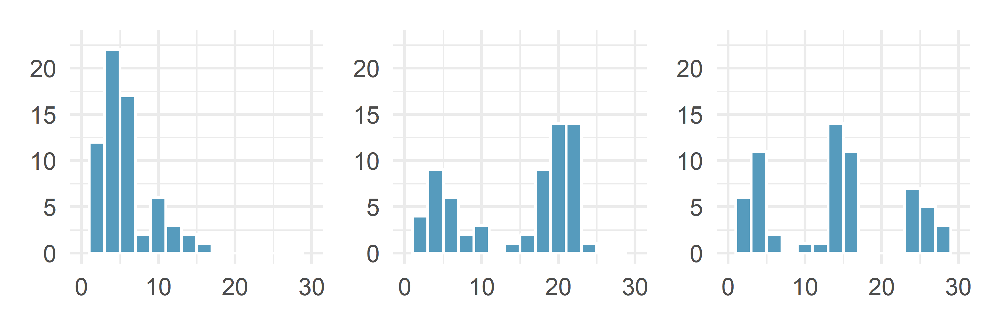
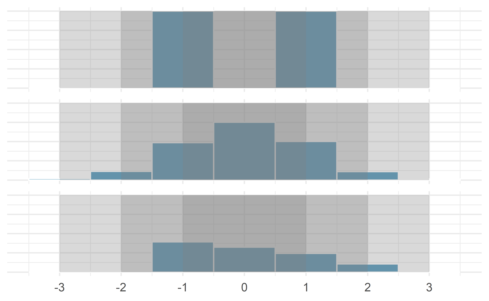
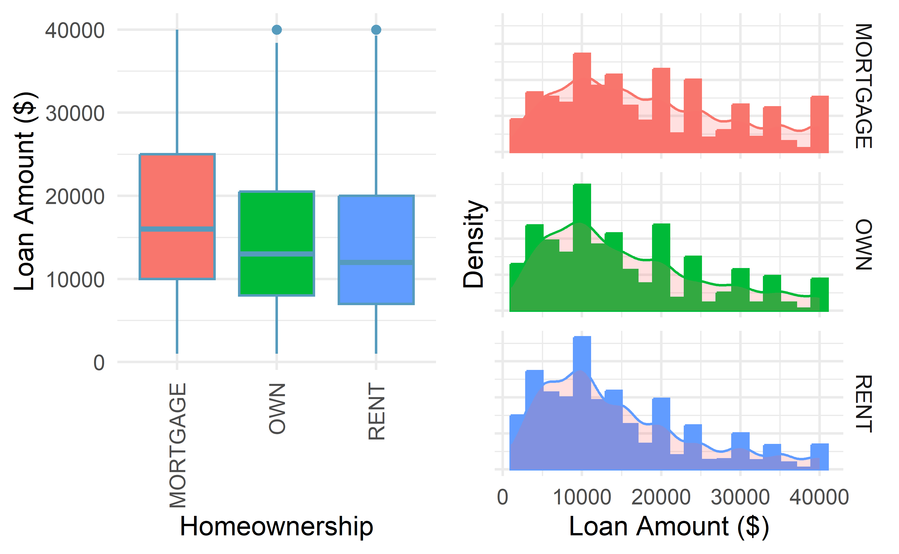
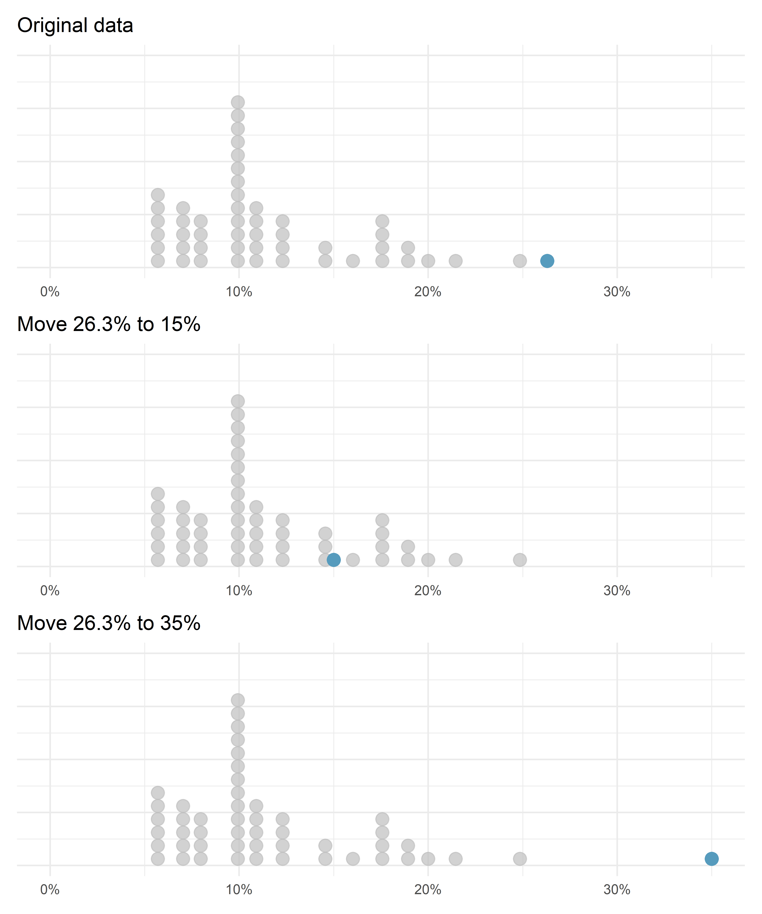
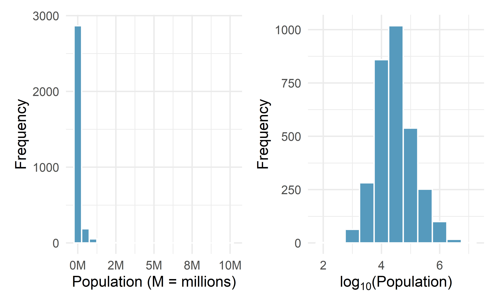
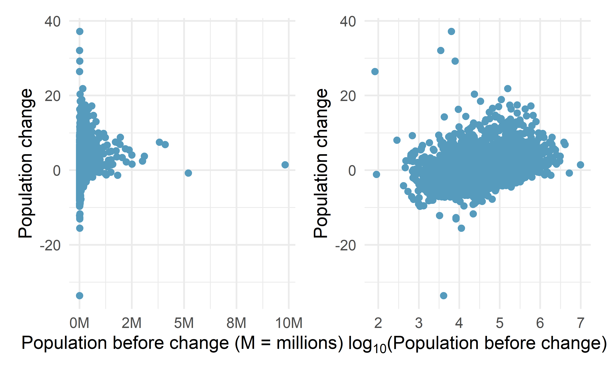
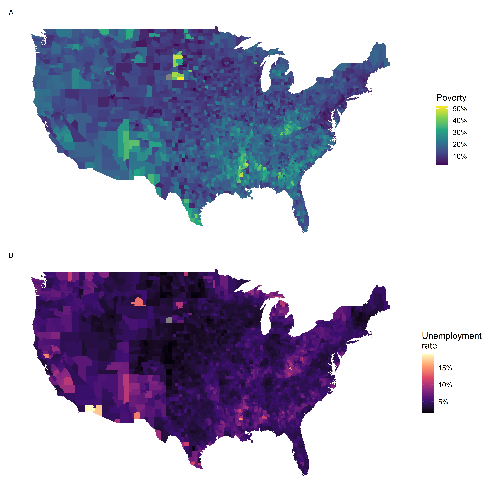
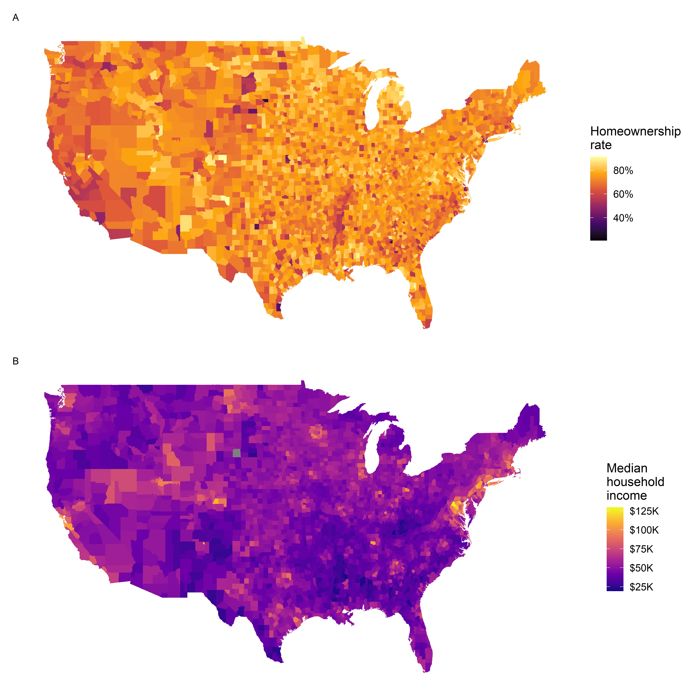

# Exploring quantitative data {#explore-numerical}
<!-- Old reference: #quantitative-data -->

::: {.chapterintro}
This chapter focuses on exploring **quantitative** data using summary statistics and visualizations.
The summaries and graphs presented in this chapter are created using statistical software; however, since this might be your first exposure to the concepts, we take our time in this chapter to detail how to create them.
Mastery of the content presented in this chapter will be crucial for understanding the methods and techniques introduced in the rest of the book.
:::

Consider the `loan_amount` variable from the `loan50` data set, which represents the loan size for all 50 loans in the data set.
This variable is quantitative (or numerical) since we can sensibly discuss the numerical difference of the size of two loans.
On the other hand, area codes and zip codes are not quantitative, but rather they are categorical variables.

Throughout this chapter, we will apply these methods using the `loan50`, `county`, and `email50` data sets, which were introduced in Section \@ref(data-basics).
If you'd like to review the variables from either data set, see Tables \@ref(tab:loan50Variables) and \@ref(tab:countyVariables).

::: {.data}
The `loan50` and `email50` data sets can be found in the [openintro](http://openintrostat.github.io/openintro) package.
The `county` data can be found in the [usdata](https://openintrostat.github.io/usdata/) package.
:::

## Scatterplots for paired data {#scatterplots}

\index{data!loan50|(}

A **scatterplot** provides a case-by-case view of data for two quantitative variables.
In Figure \@ref(fig:county-multi-unit-homeownership), a scatterplot was used to examine the homeownership rate against the fraction of housing units that were part of multi-unit properties (e.g. apartments) in the `county` data set.
Another scatterplot is shown in Figure \@ref(fig:loan50-amount-income), comparing the total income of a borrower `total_income` and the amount they borrowed `loan_amount` for the `loan50` data set.
In any scatterplot, each point represents a single case.
Since there are 50 cases in `loan50`, there are 50 points in Figure \@ref(fig:loan50-amount-income).

When examining scatterplots, we describe four features:

1. **Form** - If you were to trace the trend of the points,
   would the trend be _linear_ or _nonlinear_?
2. **Direction** - As values on the _x_-axis increase, do the _y_-values
  tend to  increase (_positive direction_) or do they decrease (_negative direction_)?
3. **Strength** - How closely do the points follow a trend?
4. **Unusual observations** or **outliers**- Are there any unusual observations
   that do not seem to match the overall pattern of the scatterplot?

(\#fig:loan50-amount-income)A scatterplot of `loan_amount` versus `total_income` for the `loan50` data set.

Looking at Figure \@ref(fig:loan50-amount-income), we see that there are many 
borrowers with income below \$100,000 on the left side of the graph, while there 
are a handful of borrowers with income above \$250,000. The loan amounts vary from
below \$10,000 to around \$40,000. The data seem to have a _linear_ form, though
the relationship between the two variables is quite _weak_. The direction is
_positive_---as total income increases, the loan amount also tends to increase---and there may be a few unusual observations in the higher income range,
though since the relationship is weak, it is hard to tell.

(\#fig:median-hh-income-poverty)A scatterplot of the median household income against the poverty rate for the `county` data set. Data are from 2017. A statistical model has also been fit to the data and is shown as a dashed line.

::: {.workedexample}
Figure \@ref(fig:median-hh-income-poverty) shows a plot of median household income against the poverty rate for 3,142 counties.
What can be said about the relationship between these variables?

---

The relationship is evidently **nonlinear**, as highlighted by the dashed line. This is different from previous scatterplots we have seen, which show relationships that do not show much, if any, curvature in the trend.
The relationship is moderate to strong, the direction is negative,
and there does not appear to be any unusual observations.
:::

::: {.guidedpractice}
What do scatterplots reveal about the data, and how are they useful?^[Answers may vary. Scatterplots are helpful in quickly spotting associations relating variables, whether those associations come in the form of simple trends or whether those relationships are more complex.]
:::

::: {.guidedpractice}
Describe two variables that would have a horseshoe-shaped association in a scatterplot ($\cap$ or $\frown$)^[Consider the case where your vertical axis represents something "good" and your horizontal axis represents something that is only good in moderation. Health and water consumption fit this description: we require some water to survive, but consume too much and it become toxic and can kill a person.]
:::

## Dot plots and the mean {#dotplots}

Sometimes we are interested in the distribution of a single variable. 
In these cases, a dot plot provides the most basic of displays.
A **dot plot** is a one-variable scatterplot; an example using the interest rate of 50 loans is shown in Figure \@ref(fig:loan-int-rate-dotplot).

(\#fig:loan-int-rate-dotplot)A dot plot of `interest_rate` for the `loan50` data set. The rates have been rounded to the nearest percent in this plot, and the distribution's mean is shown as a red triangle.

The **distribution** of a variable is a description of the possible values
it takes and how frequently each value occurs. The **mean**, often called the **average**, is a common way to measure the center of a distribution of data. 
To compute the mean interest rate of the 50 loans above, we add up all the interest rates and divide by the number of observations.

The sample mean is often^[Some books use $\bar{y}$ and some use $\bar{x}$, we are choosing $\bar{y}$ to be able to use consistent notation into more complex methods.] labeled $\bar{y}$.
The letter $y$ is being used as a generic placeholder for the variable and the bar over the $y$ communicates we're looking at the average of that variable. In our example $y$ would represent interest rate, and $\bar{y}$ = 11.57%.
It is useful to think of the mean as the balancing point of the distribution^[For
more practice with this concept of the mean as a balancing point, see this [Khan Academy article](https://www.khanacademy.org/math/ap-statistics/summarizing-quantitative-data-ap/mean-median-more/a/mean-as-the-balancing-point).], and it's shown as a triangle in Figure \@ref(fig:loan-int-rate-dotplot).

::: {.onebox}
**Mean.**
  
The sample mean can be calculated as the sum of the observed values divided by the number of observations:

\[ \bar{y} = \frac{y_1 + y_2 + \cdots + y_n}{n} \]
:::

::: {.guidedpractice}
Examine the equation for the mean. What does $y_1$ correspond to? And $y_2$ Can you infer a general meaning to what $y_i$ might represent?^[$y_1$ corresponds to the interest rate for the first loan in the sample, $y_2$ to the second loan's interest rate, and $y_i$ corresponds to the interest rate for the $i^{th}$ loan in the data set. For example, if $i = 4$, then we're examining $y_4$, which refers to the fourth observation in the data set.]
:::

::: {.guidedpractice}
What was $n$ in this sample of loans?^[The sample size was $n = 50$.]
:::

The `loan50` data set represents a sample from a larger population of loans made through Lending Club.
We could compute a mean for this population in the same way as the sample mean.
However, the population mean has a special label: $\mu$.
The symbol $\mu$ is the Greek letter *mu* and represents the average of all observations in the population.
Sometimes a subscript, such as $_y$, is used to represent which variable the population mean refers to, e.g., $\mu_y$.
Often times it is too expensive or time consuming to measure the population mean precisely, so we often estimate $\mu$ using the sample mean, $\bar{y}$.

::: {.pronunciation}
The Greek letter $\mu$ is pronounced *mu*, listen to the pronunciation [here](https://youtu.be/PStgY5AcEIw?t=47).
:::

::: {.workedexample}
The average interest rate across all loans in the population can be estimated using the sample data. Based on the sample of 50 loans, what would be a reasonable estimate of $\mu_x$, the mean interest rate for all loans in the full data set?

---
  
The sample mean, 11.57\%, provides a rough estimate of $\mu_x$. While it is not perfect, this statistic our single best guess **point estimate**\index{point estimate} of the average interest rate of all the loans in the population under study, the parameter. In Chapter \@ref(foundations-randomization) and beyond, we will develop tools to characterize the accuracy of point estimates, like the sample mean. As you might have guessed, point estimates based on larger samples tend to be more accurate than those based on smaller samples.
:::

The mean is useful for making comparisons across different samples that may have different sample sizes because it allows us to rescale or standardize a metric into something more easily interpretable and comparable. 

Suppose we would like to understand if a new drug is more effective at treating asthma attacks than the standard drug. 
A trial of 1500 adults is set up, where 500 receive the new drug, and 1000 receive a standard drug in the control group:

<table>
 <thead>
  <tr>
   <th style="text-align:left;">  </th>
   <th style="text-align:center;"> New drug </th>
   <th style="text-align:center;"> Standard drug </th>
  </tr>
 </thead>
<tbody>
  <tr>
   <td style="text-align:left;"> Number of patients </td>
   <td style="text-align:center;"> 500 </td>
   <td style="text-align:center;"> 1000 </td>
  </tr>
  <tr>
   <td style="text-align:left;"> Total asthma attacks </td>
   <td style="text-align:center;"> 200 </td>
   <td style="text-align:center;"> 300 </td>
  </tr>
</tbody>
</table>

Comparing the raw counts of 200 to 300 asthma attacks would make it appear that the new drug is better, but this is an artifact of the imbalanced group sizes.
Instead, we should look at the average number of asthma attacks per patient in each group:

- New drug: $200 / 500 = 0.4$ asthma attacks per patient
- Standard drug: $300 / 1000 = 0.3$ asthma attacks per patient

The standard drug has a lower average number of asthma attacks per patient than the average in the treatment group.

::: {.workedexample}
Emilio opened a food truck last year where he sells burritos, and his business has stabilized over the last 4 months.
Over that 4 month period, he has made $11,000 while working 625 hours.
Emilio's competition, Francis, has made $13,000 over the last 4 months while working 800 hours. Francis brags to Emilio that her business is more profitable. Is Francis' claim warranted?
  
---

Emilio's average hourly earnings provide a useful statistic for evaluating how much his venture is, at least from a financial perspective, worth:

\[ \frac{\$11000}{625\text{ hours}} = \$17.60\text{ per hour} \]
  
By knowing his average hourly wage,
Emilio now has put his earnings into a standard unit that is easier to compare with many other jobs that he might consider.

In comparison, Francis' average hourly wage was

\[ \frac{\$13000}{800\text{ hours}} = \$16.25\text{ per hour} \]

Thus, while Francis' total earnings were larger than Emilio's, when standardizing by hour, Francis shouldn't brag.
:::

::: {.workedexample}
Suppose we want to compute the average income per person in the US. To do so, we might first think to take the mean of the per capita incomes across the 3,142 counties in the \data{county} data set. What would be a better approach?

---
  
The `county` data set is special in that each county actually represents many individual people.
If we were to simply average across the `income` variable, we would be treating counties with 5,000 and 5,000,000 residents equally in the calculations.
Instead, we should compute the total income for each county, add up all the counties' totals, and then divide by the number of people in all the counties.
If we completed these steps with the \data{county} data, we would find that the per capita income for the US is $30,861.
Had we computed the *simple* mean of per capita income across counties, the result would have been just $26,093!

This example used what is called a **weighted mean**.
For more information on this topic, check out the following online supplement regarding [weighted means](https://www.openintro.org/go/?id=stat_extra_weighted_mean).
:::

## Histograms and shape {#histograms}

Dot plots show the exact value for each observation. This is useful for small data sets, but they can become hard to read with larger samples. Rather than showing the value of each observation, we prefer to think of the value as belonging to a *bin*. For example, in the `loan50` data set, we created a table of counts for the number of loans with interest rates between 5.0% and 7.5%, then the number of loans with rates between 7.5% and 10.0%, and so on. Observations that fall on the boundary of a bin (e.g., 10.00%) are allocated to the lower bin. This tabulation is shown in Table \@ref(tab:binnedIntRateAmountTable). These binned counts are plotted as bars in Figure \@ref(fig:loan50IntRateHist) into what is called a **histogram**, which resembles a more heavily binned version of the stacked dot plot shown in Figure \@ref(fig:loan-int-rate-dotplot).

<table>
<caption>(\#tab:binnedIntRateAmountTable)Counts for the binned `interest_rate` data.</caption>
 <thead>
  <tr>
   <th style="text-align:left;"> Interest rate </th>
   <th style="text-align:center;"> 5% - 7.5% </th>
   <th style="text-align:center;"> 7.5% - 10% </th>
   <th style="text-align:center;"> 10% - 12.5% </th>
   <th style="text-align:center;"> 12.5% - 15% </th>
   <th style="text-align:center;"> 15% - 17.5% </th>
   <th style="text-align:center;"> 17.5% - 20% </th>
   <th style="text-align:center;"> 20% - 22.5% </th>
   <th style="text-align:center;"> 22.5% - 25% </th>
   <th style="text-align:center;"> 25% - 27.5% </th>
  </tr>
 </thead>
<tbody>
  <tr>
   <td style="text-align:left;"> n </td>
   <td style="text-align:center;"> 11 </td>
   <td style="text-align:center;"> 15 </td>
   <td style="text-align:center;"> 8 </td>
   <td style="text-align:center;"> 4 </td>
   <td style="text-align:center;"> 5 </td>
   <td style="text-align:center;"> 4 </td>
   <td style="text-align:center;"> 1 </td>
   <td style="text-align:center;"> 1 </td>
   <td style="text-align:center;"> 1 </td>
  </tr>
</tbody>
</table>

(\#fig:loan50IntRateHist)A histogram of `interest_rate`. This distribution is strongly skewed to the right.

Histograms provide a view of the **data density**. Higher bars represent where the data are relatively more common, or 
"dense." For instance, there are many more loans with rates between 5% and 10% than loans with rates between 20% and 25% in the data set. The bars make it easy to see how the density of the data changes relative to the interest rate.

Histograms are especially convenient for understanding the shape of the data distribution. Figure \@ref(fig:loan50IntRateHist) suggests that most loans have rates under 15%, while only a handful of loans have rates above 20%. When data trail off to the right in this way and has a longer right **tail**, the shape is said to be **right skewed**[^1]

[^1]: Other ways to describe data that are right skewed: skewed to the right, skewed to the high end, or skewed to the positive end.

Data sets with the reverse characteristic---a long, thinner tail to the left---are said to be **left skewed**. We also say that such a distribution has a long left tail. Data sets that show roughly equal trailing off in both directions are called **symmetric**.

::: {.onebox}
When data trail off in one direction, the distribution has a **long tail**.
If a distribution has a long left tail, it is **left skewed** or **negatively skewed**.
If a distribution has a long right tail, it is **right skewed** or **positively skewed**.
:::

::: {.guidedpractice}
Besides the mean (since it was labeled), what can you see in the dot plot in Figure \@ref(fig:loan-int-rate-dotplot) that you cannot see in the histogram in Figure \@ref(fig:loan50IntRateHist)?^[The interest rates for individual loans.]
:::

In addition to looking at whether a distribution is skewed or symmetric, histograms can be used to identify modes. A **mode** is represented by a prominent peak in the distribution. There is only one prominent peak in the histogram of `interest_rate`.

A definition of *mode* sometimes taught in math classes is the value with the most occurrences in the data set. However, for many real-world data sets, it is common to have *no* observations with the same value in a data set, making this definition impractical in data analysis.

Figure \@ref(fig:singleBiMultiModalPlots) shows histograms that have one, two, or three prominent peaks. Such distributions are called **unimodal**, **bimodal**, and **multimodal**, respectively. Any distribution with more than two prominent peaks is called multimodal. Notice that there was one prominent peak in the unimodal distribution with a second less prominent peak that was not counted since it only differs from its neighboring bins by a few observations.

(\#fig:singleBiMultiModalPlots)Counting only prominent peaks, the distributions are (left to right) unimodal, bimodal, and multimodal. Note that the left plot is unimodal because we are counting prominent peaks, not just any peak.

::: {.guidedpractice}
Figure \@ref(fig:loan50IntRateHist) reveals only one prominent mode in the interest rate. Is the distribution unimodal, bimodal, or multimodal?^[Unimodal Remember that *uni* stands for 1 (think *uni*cycles). Similarly, *bi* stands for 2 (think *bi*cycles). We are hoping a *multi*cycle will be invented to complete this analogy.]
:::

::: {.guidedpractice}
Height measurements of young students and adult teachers at a K-3 elementary school were taken.
How many modes would you expect in this height data set?^[There might be two height groups visible in the data set: one of the students and one of the adults. That is, the data are probably bimodal.].
:::

Looking for modes isn't about finding a clear and correct answer about the number of modes in a distribution, which is why *prominent*\index{prominent} is not rigorously defined in this book. The most important part of this examination is to better understand your data.

Another type of plot that is helpful for exploring the shape of a distribution is a smoothed histogram, called a **density plot**. A density plot will scale the $y$-axis so that the total area under the density curve is equal to one. This allows us to get a sense of what _proportion_ of the data lie in a certain interval, rather than the _frequency_ of data in the interval. We can change the scale of a histogram to plot proportions rather than frequencies, then overlay a density curve on this rescaled histogram, as seen in Figure \@ref(fig:loan50IntRateDens).

(\#fig:loan50IntRateDens)A density plot of `interest_rate` overlayed on a histogram using density scale.

## Variance and standard deviation {#variance-sd}

The mean was introduced as a method to describe the center of a data set, and **variability**\index{variability} in the data is also important. Here, we introduce two measures of variability: the variance and the standard deviation. Both of these are very useful in data analysis, even though their formulas are a bit tedious to calculate by hand. The standard deviation is the easier of the two to comprehend, and it roughly describes how far away the typical observation is from the mean.

We call the distance of an observation from its mean its **deviation**. Below are the deviations for the $1^{st}$, $2^{nd}$, $3^{rd}$, and $50^{th}$ observations in the `interest_rate` variable:

$$ y_1 - \bar{y} = 10.9 - 11.57 = -0.67 $$ $$ y_2 - \bar{y} = 9.92 - 11.57 = -1.65 $$ $$ y_3 - \bar{y} = 26.3 - 11.57 = 14.73 $$ $$ \vdots $$ $$ y_{50} - \bar{y} = 6.08 - 11.57 = -5.49 $$

If we square these deviations and then take an average, the result is equal to the sample **variance**, denoted by $s^2$:

\begin{align*}
s^2 &= \frac{(-0.67)^2 + (-1.65)^2 + (14.73)^2 + \cdots + (-5.49)^2}{50 - 1} \\
&= \frac{0.45 + 2.72 + \cdots + 30.14}{49} \\
&= 25.52
\end{align*}

We divide by $n - 1$, rather than dividing by $n$, when computing a sample's variance; there's some mathematical nuance here, but the end result is that doing this makes this statistic slightly more reliable and useful.

Notice that squaring the deviations does two things. First, it makes large values relatively much larger. Second, it gets rid of any negative signs.

The **standard deviation** is defined as the square root of the variance:

$$ s = \sqrt{25.52} = 5.05 $$

While often omitted, a subscript of $_y$ may be added to the variance and standard deviation, i.e., $s_y^2$ and $s_y$, if it is useful as a reminder that these are the variance and standard deviation of the observations represented by $y_1$, $y_2$, ..., $y_n$.

::: {.onebox}
**Variance and standard deviation.**
  
The sample variance is the (near) average squared distance from the mean:
\[
  s^2 = \frac{((y_1 - \bar{y})^2 + (y_2 - \bar{y})^2 + \cdots + (y_n - \bar{y})^2)}{n-1}
\]
The sample standard deviation is the square root of the variance: $s = \sqrt{s^2}$.

The standard deviation is useful when considering how far the data are distributed from the mean.
_The standard deviation represents the typical deviation of observations from the mean._
If the distribution is bell-shaped, about 70% of the data will be within one standard deviation of the mean and about 95% will be within two standard deviations.
However, these percentages do not necessarily hold for other shaped distributions!
:::

Like the mean, the population values for variance and standard deviation have special symbols: $\sigma^2$ for the variance and $\sigma$ for the standard deviation.

::: {.pronunciation}
The Greek letter $\sigma$ is pronounced *sigma*, listen to the pronunciation [here](https://youtu.be/PStgY5AcEIw?t=72).
:::

(\#fig:sdRuleForIntRate)For the `interest_rate` variable, 34 of the 50 loans (68%) had interest rates within 1 standard deviation of the mean, and 48 of the 50 loans (96%) had rates within 2 standard deviations. Usually about 70% of the data are within 1 standard deviation of the mean and 95% within 2 standard deviations, though this is far from a hard rule.

(\#fig:severalDiffDistWithSdOf1)Three very different population distributions with the same mean (0) and standard deviation (1).

::: {.guidedpractice}
A good description of the shape of a distribution should include modality and whether the distribution is symmetric or skewed to one side.
Using Figure \@ref(fig:severalDiffDistWithSdOf1) as an example, explain why such a description is important.^[Figure \@ref(fig:severalDiffDistWithSdOf1) shows three distributions that look quite different, but all have the same mean, variance, and standard deviation. Using modality, we can distinguish between the first plot (bimodal) and the last two (unimodal). Using skewness, we can distinguish between the last plot (right skewed) and the first two. While a picture, like a histogram, tells a more complete story, we can use modality and shape (symmetry/skew) to characterize basic information about a distribution.]
:::

::: {.workedexample}
Describe the distribution of the `interest_rate` variable using the histogram in Figure \@ref(fig:loan50IntRateHist). 
The description should incorporate the center, variability, and shape of the distribution, and it should also be placed in context. 
Also note any especially unusual cases.

---
  
The distribution of interest rates is unimodal and skewed to the high end. Many of the rates fall near the mean at 11.57%, and most fall within one standard deviation (5.05%) of the mean. 
There are a few exceptionally large interest rates in the sample that are above 20%.
:::

In practice, the variance and standard deviation are sometimes used as a means to an end, where the "end" is being able to accurately estimate the uncertainty associated with a sample statistic. For example, in Chapter \@ref(inference-one-mean) the standard deviation is used in calculations that help us understand how much a sample mean varies from one sample to the next.

## Box plots, quartiles, and the median

A **box plot**\index{box plot} (or box-and-whisker plot) summarizes a data set using five statistics while
also identifying unusual observations. The five statistics---minimum, first quartile, 
median, third quartile, maximum---together are called the **five number summary**\index{five number summary}. 
Figure \@ref(fig:loan-int-rate-boxplot-dotplot) provides a dot plot alongside a box plot of the `interest_rate` variable from the `loan50` data set.

(\#fig:loan-int-rate-boxplot-dotplot)Plot A shows a dot plot and Plot B shows a box plot of the distribution of interest rates from the `loan50` dataset.

The dark line inside the box represents the **median**, which splits the data in half: 
50% of the data fall below this value and 50% fall above it. 
Since in the `loan50` dataset there are 50 observations (an even number),
the median is defined as the average of the two observations closest to the
$50^{th}$ percentile. Table \@ref(tab:loan50-int-rate-sorted) shows all
interest rates, arranged in ascending order. 
We can see that the $25^{th}$ and the $26^{th}$ values are both
9.93, which corresponds to the dark line in
the box plot in Figure \@ref(fig:loan-int-rate-boxplot-dotplot).

<table class="table table-striped table-condensed" style="margin-left: auto; margin-right: auto;">
<caption>(\#tab:loan50-int-rate-sorted)Interest rates from the `loan50` dataset, arranged in ascending order.</caption>
 <thead>
  <tr>
   <th style="text-align:left;">   </th>
   <th style="text-align:right;"> 1 </th>
   <th style="text-align:right;"> 2 </th>
   <th style="text-align:right;"> 3 </th>
   <th style="text-align:right;"> 4 </th>
   <th style="text-align:right;"> 5 </th>
   <th style="text-align:right;"> 6 </th>
   <th style="text-align:right;"> 7 </th>
   <th style="text-align:right;"> 8 </th>
   <th style="text-align:right;"> 9 </th>
   <th style="text-align:right;"> 10 </th>
  </tr>
 </thead>
<tbody>
  <tr>
   <td style="text-align:left;"> 1 </td>
   <td style="text-align:right;"> 5.31 </td>
   <td style="text-align:right;"> 5.31 </td>
   <td style="text-align:right;"> 5.32 </td>
   <td style="text-align:right;"> 6.08 </td>
   <td style="text-align:right;"> 6.08 </td>
   <td style="text-align:right;"> 6.08 </td>
   <td style="text-align:right;"> 6.71 </td>
   <td style="text-align:right;"> 6.71 </td>
   <td style="text-align:right;"> 7.34 </td>
   <td style="text-align:right;"> 7.35 </td>
  </tr>
  <tr>
   <td style="text-align:left;"> 10 </td>
   <td style="text-align:right;"> 7.35 </td>
   <td style="text-align:right;"> 7.96 </td>
   <td style="text-align:right;"> 7.96 </td>
   <td style="text-align:right;"> 7.96 </td>
   <td style="text-align:right;"> 7.97 </td>
   <td style="text-align:right;"> 9.43 </td>
   <td style="text-align:right;"> 9.43 </td>
   <td style="text-align:right;"> 9.44 </td>
   <td style="text-align:right;"> 9.44 </td>
   <td style="text-align:right;"> 9.44 </td>
  </tr>
  <tr>
   <td style="text-align:left;"> 20 </td>
   <td style="text-align:right;"> 9.92 </td>
   <td style="text-align:right;"> 9.92 </td>
   <td style="text-align:right;"> 9.92 </td>
   <td style="text-align:right;"> 9.92 </td>
   <td style="text-align:right;"> 9.93 </td>
   <td style="text-align:right;"> 9.93 </td>
   <td style="text-align:right;"> 10.42 </td>
   <td style="text-align:right;"> 10.42 </td>
   <td style="text-align:right;"> 10.90 </td>
   <td style="text-align:right;"> 10.90 </td>
  </tr>
  <tr>
   <td style="text-align:left;"> 30 </td>
   <td style="text-align:right;"> 10.91 </td>
   <td style="text-align:right;"> 10.91 </td>
   <td style="text-align:right;"> 10.91 </td>
   <td style="text-align:right;"> 11.98 </td>
   <td style="text-align:right;"> 12.62 </td>
   <td style="text-align:right;"> 12.62 </td>
   <td style="text-align:right;"> 12.62 </td>
   <td style="text-align:right;"> 14.08 </td>
   <td style="text-align:right;"> 15.04 </td>
   <td style="text-align:right;"> 16.02 </td>
  </tr>
  <tr>
   <td style="text-align:left;"> 40 </td>
   <td style="text-align:right;"> 17.09 </td>
   <td style="text-align:right;"> 17.09 </td>
   <td style="text-align:right;"> 17.09 </td>
   <td style="text-align:right;"> 18.06 </td>
   <td style="text-align:right;"> 18.45 </td>
   <td style="text-align:right;"> 19.42 </td>
   <td style="text-align:right;"> 20.00 </td>
   <td style="text-align:right;"> 21.45 </td>
   <td style="text-align:right;"> 24.85 </td>
   <td style="text-align:right;"> 26.30 </td>
  </tr>
</tbody>
</table>

When there are an odd number of observations, there will be exactly one
observation that splits the data into two halves, and in such a case that
observation is the median (no average needed).

::: {.onebox}
**Median: the number in the middle.**  
  
If the data are ordered from smallest to largest, the **median** is the observation
right in the middle.
If there are an even number of observations, there will be two values in the
middle, and the median is taken as their average.

Mathematically, if we denote the sample size by $n$, then

* if $n$ is odd, the median is the $[(n+1)/2]^{th}$ smallest value in the data set, and
* if $n$ is even, the median is the average of the $(n/2)^{th}$ and $(n/2+1)^{th}$ smallest values in the data set.
:::

The median is an example of a **percentile**. Since 50\% of the data fall _below_
the median, the median is the $50^{th}$ percentile.

::: {.onebox}
**Percentiles.**  

The **$p^{th}$ percentile** is a value such that $p$\% of the data fall _below_
that value. For example, 7.96
is the $25^{th}$ percentile of the interest rates shown in Table \@ref(tab:loan50-int-rate-sorted) since 25\% of the data fall below
7.96 (and 75\% fall above).
:::

The second step in building a box plot is drawing a rectangle to represent the
middle 50% of the data.
The length of the the box is called the **interquartile range**, or **IQR** for short.
It, like the standard deviation, is a measure of \index{variability}variability in data.
The more variable the data, the larger the standard deviation and IQR tend to be.
The two boundaries of the box are called the **first quartile** (the $25^{th}$ percentile) and the **third quartile** (the $75^{th}$ percentile) \index{quartile!first quartile} \index{quartile!third quartile}, and these are often labeled $Q_1$ and $Q_3$, respectively^[The first and third quartiles are called quartiles because, together with the median (the second quartile), these three values break the data into four groups of equal size--the lowest 25%, next lowest 25%, next lowest 25%, and highest 25%.]

::: {.onebox}
**Interquartile range (IQR).**
  
The IQR interquartile range is the length of the box in a box plot.
It is computed as
\[
  IQR = Q_3 - Q_1,
\]
where $Q_1$ and $Q_3$ are the $25^{th}$ and $75^{th}$ percentiles, respectively.
:::

::: {.guidedpractice}
What percent of the data fall between $Q_1$ and the median?
What percent is between the median and $Q_3$?^[Since $Q_1$ and $Q_3$ capture the middle 50% of the data and the median splits the data in the middle, 25% of the data fall between $Q_1$ and the median, and another 25% falls between the median and $Q_3$.]
:::

Extending out from the box, the **whiskers** attempt to capture the data outside of the box.
The whiskers of a box plot reach to the minimum and the maximum values in the data, unless there are points that are considered unusually high or unusually low, which are identified as potential **outliers** by the box plot. 
These are labeled with a dot on the box plot.
The purpose of labeling these points---instead of extending the whiskers to the minimum and maximum observed values---is to help identify any observations that appear to be unusually distant from the rest of the data. 
There are a variety of formulas for determining whether a particular data point is considered an outlier, and different statistical software use different formulas. 
A commonly used formula is that any value that is beyond $1.5\times IQR$^[While the choice of exactly 1.5 is arbitrary, it is the most commonly used value for box plots.] away from the box is considered an outlier. These outlier cutoff values are sometimes called the **fences**.
In a sense, the box is like the body of the box plot and the whiskers are like its arms trying to reach the rest of the data, up to the outliers.

In Figure \@ref(fig:loan-int-rate-boxplot-dotplot), 
the upper whisker does not extend to the last two points, 24.85% and 26.3%, which are above
$Q_3 + 1.5\times IQR$, and so it extends only to the last point below this limit.
The lower whisker stops at the minimum value in the data set, 5.31%, since there are no outliers on the lower end of the distribution. 

::: {.protip}
Boxplots only display observed data values.
The whiskers extend to actual data points---not the limits for outliers. That is,
the fence values $Q_1 - 1.5\times IQR$ and $Q_3 + 1.5\times IQR$
should not be shown on the plot.
:::

::: {.onebox}
**Outliers are extreme.**
  
An **outlier** is an observation that appears extreme relative to the rest of the data. 
Examining data for outliers serves many useful purposes, including

- identifying strong skew \index{skew!strong} in the distribution,
- identifying possible data collection or data entry errors, and 
- providing insight into interesting properties of the data.
:::

::: {.guidedpractice}
Using the box plot in Figure \@ref(fig:loan-int-rate-boxplot-dotplot), estimate the values of the $Q_1$, $Q_3$, and IQR for `interest_rate` in the `loan50` data set.^[These visual estimates will vary a little from one person to the next: $Q_1 \approx$ 8%, $Q_3 \approx$ 14%, IQR $\approx$ 14 - 8 = 6%.]
:::

## Describing and comparing quantitative distributions

As a review, when describing a scatterplot---the association between
two quantitative variables, we look for the four features:

1. Form
2. Direction
3. Strength
4. Outliers

When asked to describe or compare univariate (single variable) quantitative distributions, we look for four features:

1. Center
2. Variability
3. Shape
4. Outliers

We can compare quantitative distributions by using side-by-side box plots,
or stacked histograms or dot plots. Recall that the `loan50` data set represents a sample from a larger loan data set called `loans`.
This larger data set contains information on 10,000 loans made through Lending Club. Figure \@ref(fig:homeownership-interest-boxplots) examines the relationship between `homeownership`, which for the `loans` data can take a value of `rent`, `mortgage` (owns but has a mortgage), or `own`, and `loan_amount`. Note that `homeownership`
is a categorical variable and `loan_amount` is a quantitative variable.

(\#fig:homeownership-interest-boxplots)Side-by-side box plots of loan amounts by homeownership category and corresponding histograms.

We see immediately that some features are easier to discern in box plots, while others in histograms. Shape is shown more clearly in histograms, while center (as measured by the median) is easy to compare across groups in the side-by-side box plots.

::: {.workedexample}
Using Figure \@ref(fig:homeownership-interest-boxplots) write a few sentences comparing the distributions of loan amount
across the different homeownership categories.
  
---
  
The median loan amount is higher for those with a mortgage (around $16,000) than for those who own or rent (around $12,000-$13,000). However, variability in loan amounts is similar across homeownership categories, with an IQR of around $15,000 and loans ranging from a few hundred dollars to $40,000. We see from the histograms that the distribution of loan amounts is skewed right for all three homeownership categories, which means the mean loan amount will be higher than the median loan amount. There are no apparent outliers in the mortgage category, but both the rent and own categories have outliers at $40,000.

Besides center, variability, shape, and outliers, another interesting feature in these distributions is the result of rounding. Loan amounts in the data set are often rounded to the nearest 100, so we see spikes on these values in the histogram---something that is not evident in the box plots.
:::

## Robust statistics

How are the **sample statistics** \index{sample statistic} of the `interest_rate` data set affected by the observation, 26.3%?
What would have happened if this loan had instead been only 15%?
What would happen to these summary statistics \index{summary statistic} if the observation at 26.3% had been even larger, say 35%? 
These scenarios are plotted alongside the original data in Figure \@ref(fig:loan-int-rate-robust-ex), and sample statistics are computed under each scenario in Table \@ref(tab:robustOrNotTable).

(\#fig:loan-int-rate-robust-ex)Dot plots of the original interest rate data and two modified data sets.

<table class="table table-striped" style="margin-left: auto; margin-right: auto;">
<caption>(\#tab:robustOrNotTable)A comparison of how the median, IQR, mean, and standard deviation change as the value of an extereme observation from the original interest data changes.</caption>
 <thead>
<tr>
<th style="empty-cells: hide;border-bottom:hidden;" colspan="1"></th>
<th style="border-bottom:hidden;padding-bottom:0; padding-left:3px;padding-right:3px;text-align: center; " colspan="2">
Robust
</th>
<th style="border-bottom:hidden;padding-bottom:0; padding-left:3px;padding-right:3px;text-align: center; " colspan="2">
Not robust
</th>
</tr>
  <tr>
   <th style="text-align:left;"> Scenario </th>
   <th style="text-align:center;"> Median </th>
   <th style="text-align:center;"> IQR </th>
   <th style="text-align:center;"> Mean </th>
   <th style="text-align:center;"> SD </th>
  </tr>
 </thead>
<tbody>
  <tr>
   <td style="text-align:left;"> Original data </td>
   <td style="text-align:center;"> 9.93 </td>
   <td style="text-align:center;"> 5.75 </td>
   <td style="text-align:center;"> 11.6 </td>
   <td style="text-align:center;"> 5.05 </td>
  </tr>
  <tr>
   <td style="text-align:left;"> Move 26.3% to 15% </td>
   <td style="text-align:center;"> 9.93 </td>
   <td style="text-align:center;"> 5.75 </td>
   <td style="text-align:center;"> 11.3 </td>
   <td style="text-align:center;"> 4.61 </td>
  </tr>
  <tr>
   <td style="text-align:left;"> Move 26.3% to 35% </td>
   <td style="text-align:center;"> 9.93 </td>
   <td style="text-align:center;"> 5.75 </td>
   <td style="text-align:center;"> 11.7 </td>
   <td style="text-align:center;"> 5.68 </td>
  </tr>
</tbody>
</table>

::: {.guidedpractice}
(a) Which is more affected by extreme observations, the mean or median?  
(b) Is the standard deviation or IQR more affected by extreme observations?^[(a) Mean is affected more. (b) Standard deviation is affected more.]
:::

The median and IQR are called **robust statistics** because extreme observations have little effect on their values---moving the most extreme value generally has little influence on these statistics.
On the other hand, the mean and standard deviation are more heavily influenced by changes in extreme observations, which can be important in some situations. Additionally, the mean tends to get pulled in the direction of a distribution's skewness, while the skewness has little affect on the median.

::: {.workedexample}
The median and IQR did not change under the three scenarios in Table \@ref(tab:robustOrNotTable). 
Why might this be the case?
  
---
  
The median and IQR are only sensitive to numbers near $Q_1$, the median, and $Q_3$. 
Since values in these regions are stable in the three data sets, the median and IQR estimates are also stable.
:::

::: {.guidedpractice}
The distribution of loan amounts in the `loan50` data set is right skewed, with a few large loans lingering out into the right tail.
If you were wanting to understand the typical loan size, should you be more interested in the mean or median?^[If we are looking to simply understand what a typical individual loan looks like, the median is probably more useful. However, if the goal is to understand something that scales well, such as the total amount of money we might need to have on hand if we were to offer 1,000 loans, then the mean would be more useful.]
:::

## Transforming data (special topic)

When data are very strongly skewed, we sometimes transform them so they are easier to model. A **transformation** is a rescaling of the data using a function.

(\#fig:county-pop-transform)Plot A: A histogram of the populations of all US counties. Plot B: A histogram of log$_{10}$-transformed county populations. For this plot, the x-value corresponds to the power of 10, e.g. 4 on the x-axis corresponds to $10^4 =$ 10,000. Data are from 2017.

::: {.workedexample}
Consider the histogram of county populations shown in the left of Figure \@ref(fig:county-pop-transform), which shows extreme skew\index{skew!extreme}. What is not so useful about this plot?
  
---
  
Nearly all of the data fall into the left-most bin, and the extreme skew obscures many of the potentially interesting details in the data.
:::

There are some standard transformations that may be useful for strongly right skewed data where much of the data is positive but clustered near zero.
For instance, a plot of the logarithm (base 10) of county populations results in the new histogram in Figure \@ref(fig:county-pop-transform).
These data are symmetric, and any potential outliers appear much less extreme than in the original data set.
By reigning in the outliers and extreme skew, transformations like this often make it easier to build statistical models for the data.

Transformations can also be applied to one or both variables in a scatterplot.
A scatterplot of the population change from 2010 to 2017 against the population in 2010 is shown in Figure \@ref(fig:county-pop-change-transform).
In this first scatterplot, it's hard to decipher any interesting patterns because the population variable is so strongly skewed.
However, if we apply a log$_{10}$ transformation to the population variable, as shown in
Figure \@ref(fig:county-pop-change-transform), a positive association between the variables is revealed.
In fact, we may be interested in fitting a trend line to the data when we explore methods around fitting regression lines in Chapter \@ref(explore-regression).

(\#fig:county-pop-change-transform)Plot A: Scatterplot of population change against the population before the change. Plot B: A~scatterplot of the same data but where the population size has been log-transformed.

Transformations other than the logarithm can be useful, too.
For instance, the square root ($\sqrt{\text{original observation}}$) and inverse ($\frac{1}{\text{original observation}}$) are commonly used by data scientists.
Common goals in transforming data are to see the data structure differently, reduce skew, assist in modeling, or straighten a nonlinear relationship in a scatterplot.

## Mapping data (special topic)

\index{intensity map}

The `county` data set offers many numerical variables that we could plot using dot plots, scatterplots, or box plots, but these miss the true nature of the data.
Rather, when we encounter geographic data, we should create an **intensity map**, where colors are used to show higher and lower values of a variable.
Figures \@ref(fig:county-intensity-map-poverty-unemp) and \@ref(fig:county-intensity-map-homeownership-median-income) show intensity maps for poverty rate in percent (`poverty`), unemployment rate (`unemployment_rate`), homeownership rate in percent (`homeownership`), and median household income (`median_hh_income`).
The color key indicates which colors correspond to which values.
The intensity maps are not generally very helpful for getting precise values in any given county, but they are very helpful for seeing geographic trends and generating interesting research questions or hypotheses.

::: {.workedexample}
What interesting features are evident in the poverty and unemployment rate intensity maps?
  
---
  
Poverty rates are evidently higher in a few locations.
Notably, the deep south shows higher poverty rates, as does much of Arizona and New Mexico.
High poverty rates are evident in the Mississippi flood plains a little north of New Orleans and also in a large section of Kentucky.
The unemployment rate follows similar trends, and we can see correspondence between the two
variables. 
In fact, it makes sense for higher rates of unemployment to be closely related to poverty rates.
One observation that stands out when comparing the two maps: the poverty rate is much higher than the unemployment rate, meaning while many people may be working, they are not making enough to break out of poverty.
:::

::: {.guidedpractice}
What interesting features are evident in the median household income intensity map in Figure \@ref(fig:county-intensity-map-homeownership-median-income)?^[Note: answers will vary. There is some correspondence between high earning and metropolitan areas, where we can see darker spots (higher median household income), though there are several exceptions. You might look for large cities you are familiar with and try to spot them on the map as dark spots.]
:::

(\#fig:county-intensity-map-poverty-unemp)Plot A: Intensity map of poverty rate (percent). Plot B: Intensity map of the unemployment rate (percent).

(\#fig:county-intensity-map-homeownership-median-income)Plot A: Intensity map of homeownership rate (percent). Plot B: Intensity map of median household income ($1000s).

## Chapter review {#chp5-review}

### Summary {-}

Fluently working with quantitaitve variables is an important skill for data analysts.
In this chapter we have introduced different visualizations and numerical summaries applied to quantitative variables.
The graphical visualizations are even more descriptive when two variables are presented simultaneously.
We presented scatterplots, dot plots, histograms, and box plots.
Quantitative variables can be summarized using the mean, median, quartiles, standard deviation, and variance.

### Terms {-}

We introduced the following terms in the chapter. 
If you're not sure what some of these terms mean, we recommend you go back in the text and review their definitions.
We are purposefully presenting them in alphabetical order, instead of in order of appearance, so they will be a little more challenging to locate. 
However you should be able to easily spot them as **bolded text**.

<table class="table table-striped table-condensed" style="margin-left: auto; margin-right: auto;">
<tbody>
  <tr>
   <td style="text-align:left;"> average </td>
   <td style="text-align:left;"> intensity map </td>
   <td style="text-align:left;"> standard deviation </td>
  </tr>
  <tr>
   <td style="text-align:left;"> bimodal </td>
   <td style="text-align:left;"> interquartile range </td>
   <td style="text-align:left;"> strength </td>
  </tr>
  <tr>
   <td style="text-align:left;"> box plot </td>
   <td style="text-align:left;"> IQR </td>
   <td style="text-align:left;"> symmetric </td>
  </tr>
  <tr>
   <td style="text-align:left;"> data density </td>
   <td style="text-align:left;"> left skewed </td>
   <td style="text-align:left;"> tail </td>
  </tr>
  <tr>
   <td style="text-align:left;"> density plot </td>
   <td style="text-align:left;"> mean </td>
   <td style="text-align:left;"> third quartile </td>
  </tr>
  <tr>
   <td style="text-align:left;"> deviation </td>
   <td style="text-align:left;"> median </td>
   <td style="text-align:left;"> transformation </td>
  </tr>
  <tr>
   <td style="text-align:left;"> direction </td>
   <td style="text-align:left;"> multimodal </td>
   <td style="text-align:left;"> unimodal </td>
  </tr>
  <tr>
   <td style="text-align:left;"> distribution </td>
   <td style="text-align:left;"> outlier </td>
   <td style="text-align:left;"> variability </td>
  </tr>
  <tr>
   <td style="text-align:left;"> dot plot </td>
   <td style="text-align:left;"> outliers </td>
   <td style="text-align:left;"> variance </td>
  </tr>
  <tr>
   <td style="text-align:left;"> fences </td>
   <td style="text-align:left;"> percentile </td>
   <td style="text-align:left;"> weighted mean </td>
  </tr>
  <tr>
   <td style="text-align:left;"> first quartile </td>
   <td style="text-align:left;"> right skewed </td>
   <td style="text-align:left;"> whiskers </td>
  </tr>
  <tr>
   <td style="text-align:left;"> form </td>
   <td style="text-align:left;"> robust statistics </td>
   <td style="text-align:left;">  </td>
  </tr>
  <tr>
   <td style="text-align:left;"> histogram </td>
   <td style="text-align:left;"> scatterplot </td>
   <td style="text-align:left;">  </td>
  </tr>
</tbody>
</table>

### Key ideas {-}

* Two variables are **associated** when the behavior of one variable depends on the value of the other variable. Two quantitative variables are associated when a trend is apparent on a scatterplot. Recall from Chapter \@ref(data-hello), *association does not imply causation*!

* When describing the **distribution** of a single quantitative variable on a histogram, dot plot, or box plot, we look for (1) center, (2) variability, (3) shape, and (4) outliers.

* When describing the relationship shown between two quantitative variables in a scatterplot, we look for (1) form, (2) direction, (3) strength, and (4) outliers.
