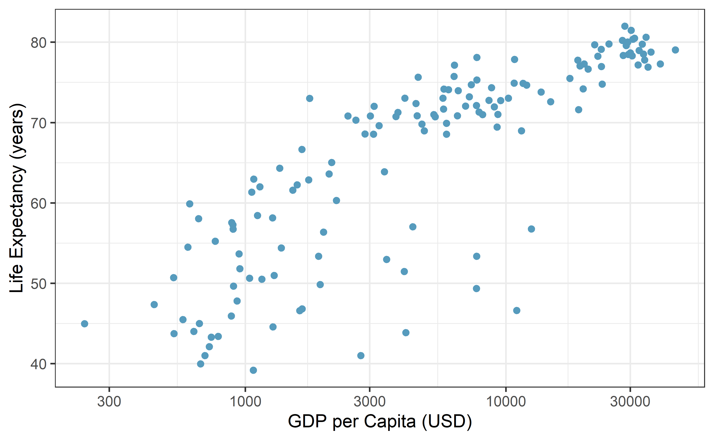
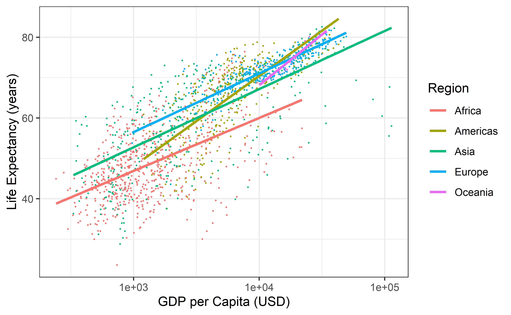
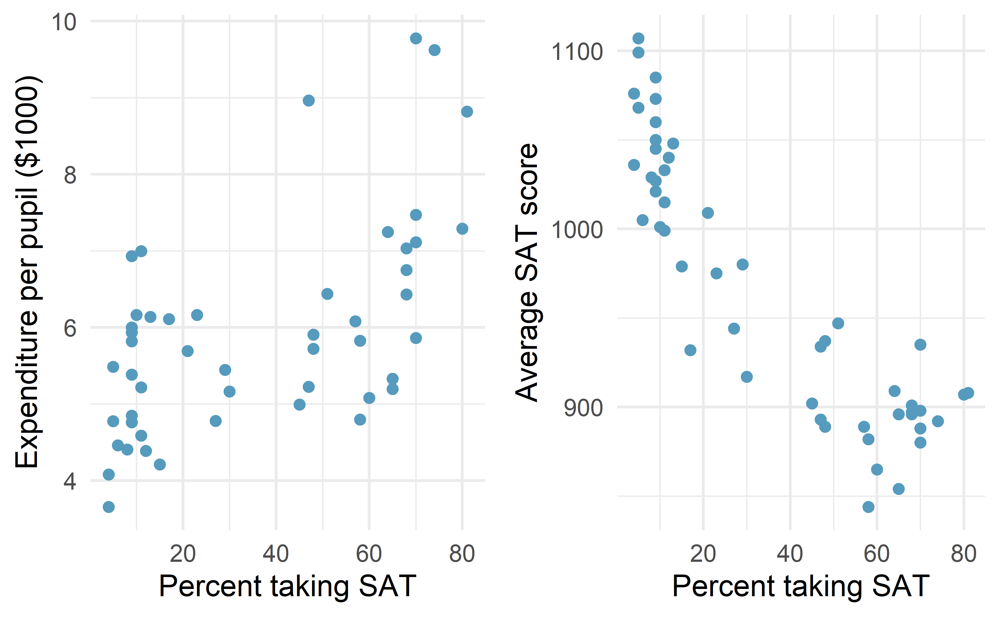
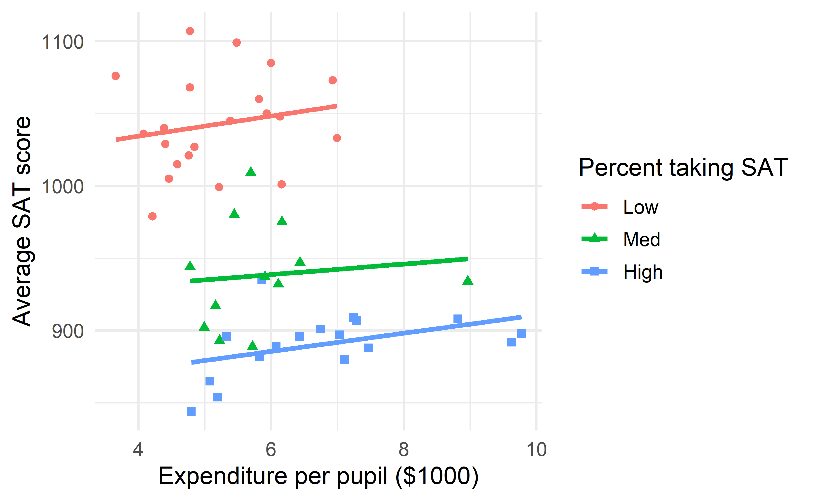

# Multivariable models {#explore-mult-reg}
<!-- Old reference: #mult-reg -->


::: {.chapterintro}
The principles of simple linear regression lay the foundation for more sophisticated regression models used in a wide range of challenging settings. 
In this chapter, we explore the idea of "multivariable thinking" -- investigating how multiple variables interact with a response variable and with each other -- through a few examples. 
Multiple regression, which introduces the possibility of more than one predictor in a linear model, and logistic regression, a technique for predicting categorical outcomes with two levels, are presented as special topics not covered in this course.
:::

## Gapminder world

[Gapminder](https://www.gapminder.org/) is a "fact tank" that uses publicly available world data to produce data visualizations and teaching resources on global development. We will use an excerpt of their data to explore relationships among world health metrics across countries and regions between the years 1952 and 2007. 

::: {.data}
The `gapminder` data can be found in the [gapminder](https://github.com/jennybc/gapminder) package.
:::

First, let's look at the relationship between Gross Domestic Product (GDP) per capita (a measure of the wealth of a country) and Life Expectancy (in years) in the year 2007 in Figure \@ref(fig:gdpPercap-lifeExp).

<div class="figure" style="text-align: center">

<p class="caption">(\#fig:gdpPercap-lifeExp)Scatterplot displaying the relationship Life Expectancy and GDP per capita in the year 2007. Note that GDP per capita is plotted on the log scale. What does each dot represent?^[Each observational unit is a single country.]</p>
</div>

As one might expect, there is a general positive trend between GDP and life expectancy. But does this trend hold across all regions? Let's explore in Figure \@ref(fig:gdpPercap-lifeExp-continent).
<div class="figure" style="text-align: center">

<p class="caption">(\#fig:gdpPercap-lifeExp-continent)Scatterplot displaying the relationship Life Expectancy and GDP per capita by region in the year 2007. Note that GDP per capita is plotted on the log scale. Regression lines for each continent have been added.</p>
</div>


::: {.workedexample}
Does the relationship between GDP per capita and life expectancy differ across regions of the world?

---

Yes. Looking at Figure \@ref(fig:gdpPercap-lifeExp-continent), the five regression lines have differing slopes, telling us that the estimated change in life expectancy for a given increase in GDP per capita differs across countries. In the Americas and Oceania, life expectancy seems to rise faster with GDP per capita than the other three regions. In this case, we say that GDP per capita **interacts** with continent in its relationship with life expectancy.
:::

::: {.onebox}
**Interaction between two explanatory variables.**

If the relationship between an explanatory variable $x$ and response variable $y$ changes for different levels of another variable $z$, then we say that $x$ and $z$ **interact** in their relationship with $y$.

If $x$ and $y$ are quantitative, and $z$ is categorical, as in Figure \@ref(fig:gdpPercap-lifeExp-continent) -- where $x$ = GDP per capita, $y$ = life expectancy, and $z$ = continent -- then if the different regression lines for each level of $z$ have **parallel slopes**, we say that $x$ and $z$ _do not_ interact. If the slopes are not parallel, then interaction exists between $x$ and $z$.
:::


::: {.guidedpractice}
So far, we've explored relationships between three variables, how could we visualize relationships between five variables?^[Each variable can be mapped to some "aesthetic" of the plot. Aesthetics include position on the x-axis, position on the y-axis, size, color, and shape. Since position and size are quantitative, they should be used for quantitative variables. Categorical variables should be mapped to color or shape, though we could also map them to position on the x-axis or y-axis if the axis lists categories rather than a number line.]
:::

Let's add another variable to our plot -- population. An **aesthetic** is a visual property of the objects in your plot. Each variable is mapped to an aesthetic. Some possible aesthetics and whether they should be used for quantitative or categorical variables are listed in Table \@ref(tab:aesthetics).


<table>
<caption>(\#tab:aesthetics)Examples of aesthetics and types of variables mapped to these aesthetics.</caption>
 <thead>
  <tr>
   <th style="text-align:left;"> Aesthetic </th>
   <th style="text-align:left;"> Variable </th>
  </tr>
 </thead>
<tbody>
  <tr>
   <td style="text-align:left;"> Position on the x-axis as a number line </td>
   <td style="text-align:left;"> Quantitative </td>
  </tr>
  <tr>
   <td style="text-align:left;"> Position on the y-axis as a number line </td>
   <td style="text-align:left;"> Quantitative </td>
  </tr>
  <tr>
   <td style="text-align:left;"> Position on the x-axis as categories </td>
   <td style="text-align:left;"> Categorical </td>
  </tr>
  <tr>
   <td style="text-align:left;"> Position on the y-axis as categories </td>
   <td style="text-align:left;"> Categorical </td>
  </tr>
  <tr>
   <td style="text-align:left;"> Size </td>
   <td style="text-align:left;"> Quantitative </td>
  </tr>
  <tr>
   <td style="text-align:left;"> Color </td>
   <td style="text-align:left;"> Categorical </td>
  </tr>
  <tr>
   <td style="text-align:left;"> Shape </td>
   <td style="text-align:left;"> Categorical </td>
  </tr>
</tbody>
</table>


In Figure \@ref(fig:gapminder-1), quantitative variables GDP per capita, life expectancy, and population are mapped to aesthetics: position on the $x$-axis, position on the $y$-axis, and population, respectively. The categorical variable Region is mapped to color. Explore individual countries by hovering over the points.


<!-- TODO Someday - can't get Population legend to show up when using plotly -->

<!-- Example from: https://holtzy.github.io/Pimp-my-rmd/ - interactive graphic! -->
<div class="figure" style="text-align: center">

```{=html}
<div class="plotly html-widget html-fill-item" id="htmlwidget-86dc17bbd8304768193a" style="width:100%;height:1112.4px;"></div>
<script type="application/json" data-for="htmlwidget-86dc17bbd8304768193a">{"x":{"data":[{"x":[3.7940254450966644,3.6809906556268164,3.1587498285200959,4.0993301562976825,3.0853023521971163,2.6335398473202094,3.3100759930113757,2.8488148736349985,3.2314858313133699,2.9939420450679588,2.443344140046372,3.5602125331291146,3.1888582353745463,3.3185811659560813,3.7467261069384517,4.0847224390037145,2.8071083194109296,2.8393558343569567,4.120787226641542,2.8766506063906259,3.1230701584328973,2.9743524119826992,2.7628523540039867,3.1653183196828425,3.195714676047237,2.6175322269121151,4.0812572446605149,3.0190207459573766,2.8804419458658828,3.0181100381010961,3.2560322165243099,4.0396913096789095,3.5820832842930348,2.9157614843495785,3.6822408118633683,2.7921653017164396,3.3040545722906871,3.884802303432406,2.9360553118387509,3.2036950046605677,3.2336235137236495,2.9357796251727324,2.9666771427490164,3.9670637023386344,3.4153732150271123,3.6545115842375888,3.0443367476975203,2.9459459204926648,3.8508252467512323,3.0238202200422353,3.1042178448294138,2.6718291573166399],"y":[72.301000000000002,42.731000000000002,56.728000000000002,50.728000000000002,52.295000000000002,49.579999999999998,50.43,44.741,50.651000000000003,65.152000000000001,46.462000000000003,55.322000000000003,48.328000000000003,54.790999999999997,71.337999999999994,51.579000000000001,58.039999999999999,52.947000000000003,56.734999999999999,59.448,60.021999999999998,56.006999999999998,46.387999999999998,54.109999999999999,42.591999999999999,45.677999999999997,73.951999999999998,59.442999999999998,48.302999999999997,54.466999999999999,64.164000000000001,72.801000000000002,71.164000000000001,42.082000000000001,52.905999999999999,56.866999999999997,46.859000000000002,76.441999999999993,46.241999999999997,65.528000000000006,63.061999999999998,42.567999999999998,48.158999999999999,49.338999999999999,58.555999999999997,39.613,52.517000000000003,58.420000000000002,73.923000000000002,51.542000000000002,42.384,43.487000000000002],"text":["gdpPercap:  6223<br />lifeExp: 72.3<br />pop:   33333216<br />continent: Africa<br />Algeria","gdpPercap:  4797<br />lifeExp: 42.7<br />pop:   12420476<br />continent: Africa<br />Angola","gdpPercap:  1441<br />lifeExp: 56.7<br />pop:    8078314<br />continent: Africa<br />Benin","gdpPercap: 12570<br />lifeExp: 50.7<br />pop:    1639131<br />continent: Africa<br />Botswana","gdpPercap:  1217<br />lifeExp: 52.3<br />pop:   14326203<br />continent: Africa<br />Burkina Faso","gdpPercap:   430<br />lifeExp: 49.6<br />pop:    8390505<br />continent: Africa<br />Burundi","gdpPercap:  2042<br />lifeExp: 50.4<br />pop:   17696293<br />continent: Africa<br />Cameroon","gdpPercap:   706<br />lifeExp: 44.7<br />pop:    4369038<br />continent: Africa<br />Central African Republic","gdpPercap:  1704<br />lifeExp: 50.7<br />pop:   10238807<br />continent: Africa<br />Chad","gdpPercap:   986<br />lifeExp: 65.2<br />pop:     710960<br />continent: Africa<br />Comoros","gdpPercap:   278<br />lifeExp: 46.5<br />pop:   64606759<br />continent: Africa<br />Congo, Dem. Rep.","gdpPercap:  3633<br />lifeExp: 55.3<br />pop:    3800610<br />continent: Africa<br />Congo, Rep.","gdpPercap:  1545<br />lifeExp: 48.3<br />pop:   18013409<br />continent: Africa<br />Cote d'Ivoire","gdpPercap:  2082<br />lifeExp: 54.8<br />pop:     496374<br />continent: Africa<br />Djibouti","gdpPercap:  5581<br />lifeExp: 71.3<br />pop:   80264543<br />continent: Africa<br />Egypt","gdpPercap: 12154<br />lifeExp: 51.6<br />pop:     551201<br />continent: Africa<br />Equatorial Guinea","gdpPercap:   641<br />lifeExp: 58.0<br />pop:    4906585<br />continent: Africa<br />Eritrea","gdpPercap:   691<br />lifeExp: 52.9<br />pop:   76511887<br />continent: Africa<br />Ethiopia","gdpPercap: 13206<br />lifeExp: 56.7<br />pop:    1454867<br />continent: Africa<br />Gabon","gdpPercap:   753<br />lifeExp: 59.4<br />pop:    1688359<br />continent: Africa<br />Gambia","gdpPercap:  1328<br />lifeExp: 60.0<br />pop:   22873338<br />continent: Africa<br />Ghana","gdpPercap:   943<br />lifeExp: 56.0<br />pop:    9947814<br />continent: Africa<br />Guinea","gdpPercap:   579<br />lifeExp: 46.4<br />pop:    1472041<br />continent: Africa<br />Guinea-Bissau","gdpPercap:  1463<br />lifeExp: 54.1<br />pop:   35610177<br />continent: Africa<br />Kenya","gdpPercap:  1569<br />lifeExp: 42.6<br />pop:    2012649<br />continent: Africa<br />Lesotho","gdpPercap:   415<br />lifeExp: 45.7<br />pop:    3193942<br />continent: Africa<br />Liberia","gdpPercap: 12057<br />lifeExp: 74.0<br />pop:    6036914<br />continent: Africa<br />Libya","gdpPercap:  1045<br />lifeExp: 59.4<br />pop:   19167654<br />continent: Africa<br />Madagascar","gdpPercap:   759<br />lifeExp: 48.3<br />pop:   13327079<br />continent: Africa<br />Malawi","gdpPercap:  1043<br />lifeExp: 54.5<br />pop:   12031795<br />continent: Africa<br />Mali","gdpPercap:  1803<br />lifeExp: 64.2<br />pop:    3270065<br />continent: Africa<br />Mauritania","gdpPercap: 10957<br />lifeExp: 72.8<br />pop:    1250882<br />continent: Africa<br />Mauritius","gdpPercap:  3820<br />lifeExp: 71.2<br />pop:   33757175<br />continent: Africa<br />Morocco","gdpPercap:   824<br />lifeExp: 42.1<br />pop:   19951656<br />continent: Africa<br />Mozambique","gdpPercap:  4811<br />lifeExp: 52.9<br />pop:    2055080<br />continent: Africa<br />Namibia","gdpPercap:   620<br />lifeExp: 56.9<br />pop:   12894865<br />continent: Africa<br />Niger","gdpPercap:  2014<br />lifeExp: 46.9<br />pop:  135031164<br />continent: Africa<br />Nigeria","gdpPercap:  7670<br />lifeExp: 76.4<br />pop:     798094<br />continent: Africa<br />Reunion","gdpPercap:   863<br />lifeExp: 46.2<br />pop:    8860588<br />continent: Africa<br />Rwanda","gdpPercap:  1598<br />lifeExp: 65.5<br />pop:     199579<br />continent: Africa<br />Sao Tome and Principe","gdpPercap:  1712<br />lifeExp: 63.1<br />pop:   12267493<br />continent: Africa<br />Senegal","gdpPercap:   863<br />lifeExp: 42.6<br />pop:    6144562<br />continent: Africa<br />Sierra Leone","gdpPercap:   926<br />lifeExp: 48.2<br />pop:    9118773<br />continent: Africa<br />Somalia","gdpPercap:  9270<br />lifeExp: 49.3<br />pop:   43997828<br />continent: Africa<br />South Africa","gdpPercap:  2602<br />lifeExp: 58.6<br />pop:   42292929<br />continent: Africa<br />Sudan","gdpPercap:  4513<br />lifeExp: 39.6<br />pop:    1133066<br />continent: Africa<br />Swaziland","gdpPercap:  1107<br />lifeExp: 52.5<br />pop:   38139640<br />continent: Africa<br />Tanzania","gdpPercap:   883<br />lifeExp: 58.4<br />pop:    5701579<br />continent: Africa<br />Togo","gdpPercap:  7093<br />lifeExp: 73.9<br />pop:   10276158<br />continent: Africa<br />Tunisia","gdpPercap:  1056<br />lifeExp: 51.5<br />pop:   29170398<br />continent: Africa<br />Uganda","gdpPercap:  1271<br />lifeExp: 42.4<br />pop:   11746035<br />continent: Africa<br />Zambia","gdpPercap:   470<br />lifeExp: 43.5<br />pop:   12311143<br />continent: Africa<br />Zimbabwe"],"type":"scatter","mode":"markers","marker":{"autocolorscale":false,"color":"rgba(248,118,109,1)","opacity":1,"size":[6.7752717325492302,5.5989004118630001,5.2403533070783466,4.4039576839973833,5.7356199392207996,5.2690143958143745,5.9564773609874049,4.8422259478740974,5.4285263116604412,4.1516985016395616,7.9562662998770968,4.7671332830722601,5.9761166381701099,4.0630571938388131,8.4363687173296391,4.0881362755000454,4.9086539137274148,8.32592567062337,4.3626259687113649,4.4145446751277628,6.2577023306009796,5.4044519713261234,4.366601197011196,6.8764961358924266,4.4803007102230001,4.6801077545067349,5.0369392016926247,6.0461636385333,5.6651779774839266,5.5697344023561026,4.6914832316617332,4.3131500431206629,6.7943767241052386,6.0925324617448933,4.4884533308975465,5.6338762963755968,9.8227139332733113,4.1821590023924538,5.3111594952501031,3.7795275590551185,5.5874769596414557,5.0484803839022625,5.3338208539114369,7.2238082937782924,7.156106546896897,4.282361176813005,6.9852002740989851,5.0002880392083817,5.4315910179617095,6.5807690784340016,5.5479846257867891,5.5907437114111733],"symbol":"circle","line":{"width":1.8897637795275593,"color":"rgba(248,118,109,1)"}},"hoveron":"points","name":"Africa","legendgroup":"Africa","showlegend":true,"xaxis":"x","yaxis":"y","hoverinfo":"text","frame":null},{"x":[4.1065097720176862,3.5823062593168782,3.957406173408569,4.5601366924251883,4.1196398143870931,3.8455061110473117,3.9843049975871763,3.9517309708016475,3.7799840633073747,3.8371629195761865,3.7580298117512663,3.7148366998460376,3.0797733480287044,3.550024106620056,3.8645633037284566,4.0783688975107708,3.4392254438054342,3.991632953509189,3.6204315729333021,3.8697540590018766,4.2862028478952521,4.2554777630339444,4.6329798832790043,4.0257752637018411,4.0575065679833457],"y":[75.319999999999993,65.554000000000002,72.390000000000001,80.653000000000006,78.552999999999997,72.888999999999996,78.781999999999996,78.272999999999996,72.234999999999999,74.994,71.878,70.259,60.915999999999997,70.197999999999993,72.566999999999993,76.194999999999993,72.899000000000001,75.537000000000006,71.751999999999995,71.421000000000006,78.745999999999995,69.819000000000003,78.242000000000004,76.384,73.747],"text":["gdpPercap: 12779<br />lifeExp: 75.3<br />pop:   40301927<br />continent: Americas<br />Argentina","gdpPercap:  3822<br />lifeExp: 65.6<br />pop:    9119152<br />continent: Americas<br />Bolivia","gdpPercap:  9066<br />lifeExp: 72.4<br />pop:  190010647<br />continent: Americas<br />Brazil","gdpPercap: 36319<br />lifeExp: 80.7<br />pop:   33390141<br />continent: Americas<br />Canada","gdpPercap: 13172<br />lifeExp: 78.6<br />pop:   16284741<br />continent: Americas<br />Chile","gdpPercap:  7007<br />lifeExp: 72.9<br />pop:   44227550<br />continent: Americas<br />Colombia","gdpPercap:  9645<br />lifeExp: 78.8<br />pop:    4133884<br />continent: Americas<br />Costa Rica","gdpPercap:  8948<br />lifeExp: 78.3<br />pop:   11416987<br />continent: Americas<br />Cuba","gdpPercap:  6025<br />lifeExp: 72.2<br />pop:    9319622<br />continent: Americas<br />Dominican Republic","gdpPercap:  6873<br />lifeExp: 75.0<br />pop:   13755680<br />continent: Americas<br />Ecuador","gdpPercap:  5728<br />lifeExp: 71.9<br />pop:    6939688<br />continent: Americas<br />El Salvador","gdpPercap:  5186<br />lifeExp: 70.3<br />pop:   12572928<br />continent: Americas<br />Guatemala","gdpPercap:  1202<br />lifeExp: 60.9<br />pop:    8502814<br />continent: Americas<br />Haiti","gdpPercap:  3548<br />lifeExp: 70.2<br />pop:    7483763<br />continent: Americas<br />Honduras","gdpPercap:  7321<br />lifeExp: 72.6<br />pop:    2780132<br />continent: Americas<br />Jamaica","gdpPercap: 11978<br />lifeExp: 76.2<br />pop:  108700891<br />continent: Americas<br />Mexico","gdpPercap:  2749<br />lifeExp: 72.9<br />pop:    5675356<br />continent: Americas<br />Nicaragua","gdpPercap:  9809<br />lifeExp: 75.5<br />pop:    3242173<br />continent: Americas<br />Panama","gdpPercap:  4173<br />lifeExp: 71.8<br />pop:    6667147<br />continent: Americas<br />Paraguay","gdpPercap:  7409<br />lifeExp: 71.4<br />pop:   28674757<br />continent: Americas<br />Peru","gdpPercap: 19329<br />lifeExp: 78.7<br />pop:    3942491<br />continent: Americas<br />Puerto Rico","gdpPercap: 18009<br />lifeExp: 69.8<br />pop:    1056608<br />continent: Americas<br />Trinidad and Tobago","gdpPercap: 42952<br />lifeExp: 78.2<br />pop:  301139947<br />continent: Americas<br />United States","gdpPercap: 10611<br />lifeExp: 76.4<br />pop:    3447496<br />continent: Americas<br />Uruguay","gdpPercap: 11416<br />lifeExp: 73.7<br />pop:   26084662<br />continent: Americas<br />Venezuela"],"type":"scatter","mode":"markers","marker":{"autocolorscale":false,"color":"rgba(163,165,0,1)","opacity":1,"size":[7.0752836928954501,5.333853876564663,10.949722028706249,6.7778440362522812,5.8668180179899734,7.2328291141492445,4.8118234074533222,5.5226039735491259,5.3512237886724172,5.69571313317988,5.1306777542305024,5.6102133034773436,5.2791910995855069,5.1841532973733377,4.6155666029278022,9.2006306129298405,4.9973754404969783,4.687331723294788,5.1030785274449162,6.5567034863678497,4.7864012116365817,4.2613288143832744,12.807919245623044,4.7174623155002786,6.4273871341173354],"symbol":"circle","line":{"width":1.8897637795275593,"color":"rgba(163,165,0,1)"}},"hoveron":"points","name":"Americas","legendgroup":"Americas","showlegend":true,"xaxis":"x","yaxis":"y","hoverinfo":"text","frame":null},{"x":[2.9888176454912858,4.4741586701859664,3.1434063610570009,3.2339547372751722,3.6954041667466049,4.5990636726886356,3.3895577312128795,3.5490831898821575,4.0646718823630357,3.6504106831196688,4.406936435530084,4.5004569709846161,3.6550866594992835,3.2022336270366805,4.3682522837381041,4.6749253140699576,4.0195756382230385,4.095227107013149,3.4907690059237622,2.9749719942980688,3.0379679438446519,4.3486201061894318,3.4159656754035375,3.5038561648270914,4.3355548175826542,4.6734188707962172,3.5988009435983197,3.6216485631534296,4.4581583777244909,3.8726454573379581,3.3876703191654678,3.4807755960325997,3.3580814739680283],"y":[43.828000000000003,75.635000000000005,64.061999999999998,59.722999999999999,72.960999999999999,82.207999999999998,64.697999999999993,70.650000000000006,70.963999999999999,59.545000000000002,80.745000000000005,82.602999999999994,72.534999999999997,67.296999999999997,78.623000000000005,77.587999999999994,71.992999999999995,74.241,66.802999999999997,62.069000000000003,63.784999999999997,75.640000000000001,65.483000000000004,71.688000000000002,72.777000000000001,79.971999999999994,72.396000000000001,74.143000000000001,78.400000000000006,70.616,74.248999999999995,73.421999999999997,62.698],"text":["gdpPercap:   975<br />lifeExp: 43.8<br />pop:   31889923<br />continent: Asia<br />Afghanistan","gdpPercap: 29796<br />lifeExp: 75.6<br />pop:     708573<br />continent: Asia<br />Bahrain","gdpPercap:  1391<br />lifeExp: 64.1<br />pop:  150448339<br />continent: Asia<br />Bangladesh","gdpPercap:  1714<br />lifeExp: 59.7<br />pop:   14131858<br />continent: Asia<br />Cambodia","gdpPercap:  4959<br />lifeExp: 73.0<br />pop: 1318683096<br />continent: Asia<br />China","gdpPercap: 39725<br />lifeExp: 82.2<br />pop:    6980412<br />continent: Asia<br />Hong Kong, China","gdpPercap:  2452<br />lifeExp: 64.7<br />pop: 1110396331<br />continent: Asia<br />India","gdpPercap:  3541<br />lifeExp: 70.7<br />pop:  223547000<br />continent: Asia<br />Indonesia","gdpPercap: 11606<br />lifeExp: 71.0<br />pop:   69453570<br />continent: Asia<br />Iran","gdpPercap:  4471<br />lifeExp: 59.5<br />pop:   27499638<br />continent: Asia<br />Iraq","gdpPercap: 25523<br />lifeExp: 80.7<br />pop:    6426679<br />continent: Asia<br />Israel","gdpPercap: 31656<br />lifeExp: 82.6<br />pop:  127467972<br />continent: Asia<br />Japan","gdpPercap:  4519<br />lifeExp: 72.5<br />pop:    6053193<br />continent: Asia<br />Jordan","gdpPercap:  1593<br />lifeExp: 67.3<br />pop:   23301725<br />continent: Asia<br />Korea, Dem. Rep.","gdpPercap: 23348<br />lifeExp: 78.6<br />pop:   49044790<br />continent: Asia<br />Korea, Rep.","gdpPercap: 47307<br />lifeExp: 77.6<br />pop:    2505559<br />continent: Asia<br />Kuwait","gdpPercap: 10461<br />lifeExp: 72.0<br />pop:    3921278<br />continent: Asia<br />Lebanon","gdpPercap: 12452<br />lifeExp: 74.2<br />pop:   24821286<br />continent: Asia<br />Malaysia","gdpPercap:  3096<br />lifeExp: 66.8<br />pop:    2874127<br />continent: Asia<br />Mongolia","gdpPercap:   944<br />lifeExp: 62.1<br />pop:   47761980<br />continent: Asia<br />Myanmar","gdpPercap:  1091<br />lifeExp: 63.8<br />pop:   28901790<br />continent: Asia<br />Nepal","gdpPercap: 22316<br />lifeExp: 75.6<br />pop:    3204897<br />continent: Asia<br />Oman","gdpPercap:  2606<br />lifeExp: 65.5<br />pop:  169270617<br />continent: Asia<br />Pakistan","gdpPercap:  3190<br />lifeExp: 71.7<br />pop:   91077287<br />continent: Asia<br />Philippines","gdpPercap: 21655<br />lifeExp: 72.8<br />pop:   27601038<br />continent: Asia<br />Saudi Arabia","gdpPercap: 47143<br />lifeExp: 80.0<br />pop:    4553009<br />continent: Asia<br />Singapore","gdpPercap:  3970<br />lifeExp: 72.4<br />pop:   20378239<br />continent: Asia<br />Sri Lanka","gdpPercap:  4185<br />lifeExp: 74.1<br />pop:   19314747<br />continent: Asia<br />Syria","gdpPercap: 28718<br />lifeExp: 78.4<br />pop:   23174294<br />continent: Asia<br />Taiwan","gdpPercap:  7458<br />lifeExp: 70.6<br />pop:   65068149<br />continent: Asia<br />Thailand","gdpPercap:  2442<br />lifeExp: 74.2<br />pop:   85262356<br />continent: Asia<br />Vietnam","gdpPercap:  3025<br />lifeExp: 73.4<br />pop:    4018332<br />continent: Asia<br />West Bank and Gaza","gdpPercap:  2281<br />lifeExp: 62.7<br />pop:   22211743<br />continent: Asia<br />Yemen, Rep."],"type":"scatter","mode":"markers","marker":{"autocolorscale":false,"color":"rgba(0,191,125,1)","opacity":1,"size":[6.7092983513552849,4.1508288847181953,10.158865608179935,5.7221180107506537,22.677165354330711,5.1347534580541501,21.120368095307143,11.557396830375804,8.1105713155374861,6.4987952406877376,5.0782402616746616,9.6507758736364799,5.0386912985713304,6.2810035011451255,7.4168446506103951,4.569838394810894,4.7835439230220365,6.3619616591074761,4.6306565167244802,7.368763875897594,6.5677527377566554,4.6817536552960464,10.5466615830696,8.7408659686259185,6.5038406176847667,4.8654178527954128,6.1173758740791646,6.0549352830716545,6.2740949140912097,7.9711999339905422,8.5795132943757064,4.7965509761407246,6.2212794811128056],"symbol":"circle","line":{"width":1.8897637795275593,"color":"rgba(0,191,125,1)"}},"hoveron":"points","name":"Asia","legendgroup":"Asia","showlegend":true,"xaxis":"x","yaxis":"y","hoverinfo":"text","frame":null},{"x":[3.7735692087621691,4.5578258006221848,4.5275345915133105,3.8719404594797928,4.0286034909483179,4.1649242825131747,4.3585688446278343,4.5475091108168488,4.5212307459814749,4.4838726922507623,4.5074561155365247,4.4399388911990529,4.2554882582210949,4.5584780356339154,4.6093381996914395,4.4559059795027833,3.9663246195778949,4.5658234281049346,4.6933504280025318,4.1872364943512697,4.3119582019159575,4.0337644468812863,3.9906289409349966,4.271337680163577,4.4110850532178922,4.4597100052953031,4.5296837260525233,4.574105601810623,3.927281872119107,4.5211807429313629],"y":[76.423000000000002,79.828999999999994,79.441000000000003,74.852000000000004,73.004999999999995,75.748000000000005,76.486000000000004,78.331999999999994,79.313000000000002,80.656999999999996,79.406000000000006,79.483000000000004,73.337999999999994,81.757000000000005,78.885000000000005,80.546000000000006,74.543000000000006,79.762,80.195999999999998,75.563000000000002,78.097999999999999,72.475999999999999,74.001999999999995,74.662999999999997,77.926000000000002,80.941000000000003,80.884,81.700999999999993,71.777000000000001,79.424999999999997],"text":["gdpPercap:  5937<br />lifeExp: 76.4<br />pop:    3600523<br />continent: Europe<br />Albania","gdpPercap: 36126<br />lifeExp: 79.8<br />pop:    8199783<br />continent: Europe<br />Austria","gdpPercap: 33693<br />lifeExp: 79.4<br />pop:   10392226<br />continent: Europe<br />Belgium","gdpPercap:  7446<br />lifeExp: 74.9<br />pop:    4552198<br />continent: Europe<br />Bosnia and Herzegovina","gdpPercap: 10681<br />lifeExp: 73.0<br />pop:    7322858<br />continent: Europe<br />Bulgaria","gdpPercap: 14619<br />lifeExp: 75.7<br />pop:    4493312<br />continent: Europe<br />Croatia","gdpPercap: 22833<br />lifeExp: 76.5<br />pop:   10228744<br />continent: Europe<br />Czech Republic","gdpPercap: 35278<br />lifeExp: 78.3<br />pop:    5468120<br />continent: Europe<br />Denmark","gdpPercap: 33207<br />lifeExp: 79.3<br />pop:    5238460<br />continent: Europe<br />Finland","gdpPercap: 30470<br />lifeExp: 80.7<br />pop:   61083916<br />continent: Europe<br />France","gdpPercap: 32170<br />lifeExp: 79.4<br />pop:   82400996<br />continent: Europe<br />Germany","gdpPercap: 27538<br />lifeExp: 79.5<br />pop:   10706290<br />continent: Europe<br />Greece","gdpPercap: 18009<br />lifeExp: 73.3<br />pop:    9956108<br />continent: Europe<br />Hungary","gdpPercap: 36181<br />lifeExp: 81.8<br />pop:     301931<br />continent: Europe<br />Iceland","gdpPercap: 40676<br />lifeExp: 78.9<br />pop:    4109086<br />continent: Europe<br />Ireland","gdpPercap: 28570<br />lifeExp: 80.5<br />pop:   58147733<br />continent: Europe<br />Italy","gdpPercap:  9254<br />lifeExp: 74.5<br />pop:     684736<br />continent: Europe<br />Montenegro","gdpPercap: 36798<br />lifeExp: 79.8<br />pop:   16570613<br />continent: Europe<br />Netherlands","gdpPercap: 49357<br />lifeExp: 80.2<br />pop:    4627926<br />continent: Europe<br />Norway","gdpPercap: 15390<br />lifeExp: 75.6<br />pop:   38518241<br />continent: Europe<br />Poland","gdpPercap: 20510<br />lifeExp: 78.1<br />pop:   10642836<br />continent: Europe<br />Portugal","gdpPercap: 10808<br />lifeExp: 72.5<br />pop:   22276056<br />continent: Europe<br />Romania","gdpPercap:  9787<br />lifeExp: 74.0<br />pop:   10150265<br />continent: Europe<br />Serbia","gdpPercap: 18678<br />lifeExp: 74.7<br />pop:    5447502<br />continent: Europe<br />Slovak Republic","gdpPercap: 25768<br />lifeExp: 77.9<br />pop:    2009245<br />continent: Europe<br />Slovenia","gdpPercap: 28821<br />lifeExp: 80.9<br />pop:   40448191<br />continent: Europe<br />Spain","gdpPercap: 33860<br />lifeExp: 80.9<br />pop:    9031088<br />continent: Europe<br />Sweden","gdpPercap: 37506<br />lifeExp: 81.7<br />pop:    7554661<br />continent: Europe<br />Switzerland","gdpPercap:  8458<br />lifeExp: 71.8<br />pop:   71158647<br />continent: Europe<br />Turkey","gdpPercap: 33203<br />lifeExp: 79.4<br />pop:   60776238<br />continent: Europe<br />United Kingdom"],"type":"scatter","mode":"markers","marker":{"autocolorscale":false,"color":"rgba(0,176,246,1)","opacity":1,"size":[4.7393036097654502,5.2515712457990968,5.4410784978691735,4.8653167028921844,5.1685528258485842,4.8579469438752234,5.4276996527368331,4.9741078643628294,4.9477814048195228,7.8404337662196868,8.498091237446733,5.4664828069929365,5.4051430840065446,3.9460291298414996,4.8085649745634003,7.7413040551619607,4.1420303205279438,5.8852844160763711,4.8747213942514058,7.0011551525914504,5.4613810121458615,6.2248439161044908,5.421238450332476,4.9717681273532666,4.4796425578879777,7.0812884751230953,5.3261618194654057,5.1909724557450065,8.1635636391520627,7.8301599085784517],"symbol":"circle","line":{"width":1.8897637795275593,"color":"rgba(0,176,246,1)"}},"hoveron":"points","name":"Europe","legendgroup":"Europe","showlegend":true,"xaxis":"x","yaxis":"y","hoverinfo":"text","frame":null},{"x":[4.5370047214526892,4.4011421122881123],"y":[81.234999999999999,80.203999999999994],"text":["gdpPercap: 34435<br />lifeExp: 81.2<br />pop:   20434176<br />continent: Oceania<br />Australia","gdpPercap: 25185<br />lifeExp: 80.2<br />pop:    4115771<br />continent: Oceania<br />New Zealand"],"type":"scatter","mode":"markers","marker":{"autocolorscale":false,"color":"rgba(231,107,243,1)","opacity":1,"size":[6.1206139909462598,4.8094443919586789],"symbol":"circle","line":{"width":1.8897637795275593,"color":"rgba(231,107,243,1)"}},"hoveron":"points","name":"Oceania","legendgroup":"Oceania","showlegend":true,"xaxis":"x","yaxis":"y","hoverinfo":"text","frame":null}],"layout":{"margin":{"t":40.840182648401829,"r":7.3059360730593621,"b":37.260273972602747,"l":37.260273972602747},"plot_bgcolor":"rgba(255,255,255,1)","paper_bgcolor":"rgba(255,255,255,1)","font":{"color":"rgba(0,0,0,1)","family":"","size":14.611872146118724},"title":{"text":"Year 2007","font":{"color":"rgba(0,0,0,1)","family":"","size":17.534246575342465},"x":0,"xref":"paper"},"xaxis":{"domain":[0,1],"automargin":true,"type":"linear","autorange":false,"range":[2.330843825648564,4.8058507424003398],"tickmode":"array","ticktext":["300","1000","3000","10000","30000"],"tickvals":[2.4771212547196626,3,3.4771212547196626,4,4.4771212547196626],"categoryorder":"array","categoryarray":["300","1000","3000","10000","30000"],"nticks":null,"ticks":"outside","tickcolor":"rgba(51,51,51,1)","ticklen":3.6529680365296811,"tickwidth":0.66417600664176002,"showticklabels":true,"tickfont":{"color":"rgba(77,77,77,1)","family":"","size":11.689497716894984},"tickangle":-0,"showline":false,"linecolor":null,"linewidth":0,"showgrid":true,"gridcolor":"rgba(235,235,235,1)","gridwidth":0.66417600664176002,"zeroline":false,"anchor":"y","title":{"text":"GDP per Capita (USD)","font":{"color":"rgba(0,0,0,1)","family":"","size":14.611872146118724}},"hoverformat":".2f"},"yaxis":{"domain":[0,1],"automargin":true,"type":"linear","autorange":false,"range":[37.463499999999996,84.752499999999998],"tickmode":"array","ticktext":["40","50","60","70","80"],"tickvals":[40,50,60,70,80],"categoryorder":"array","categoryarray":["40","50","60","70","80"],"nticks":null,"ticks":"outside","tickcolor":"rgba(51,51,51,1)","ticklen":3.6529680365296811,"tickwidth":0.66417600664176002,"showticklabels":true,"tickfont":{"color":"rgba(77,77,77,1)","family":"","size":11.68949771689498},"tickangle":-0,"showline":false,"linecolor":null,"linewidth":0,"showgrid":true,"gridcolor":"rgba(235,235,235,1)","gridwidth":0.66417600664176002,"zeroline":false,"anchor":"x","title":{"text":"Life Expectancy (years)","font":{"color":"rgba(0,0,0,1)","family":"","size":14.611872146118724}},"hoverformat":".2f"},"shapes":[{"type":"rect","fillcolor":"rgba(255,255,255,1)","line":{"color":"rgba(51,51,51,1)","width":0.66417600664176002,"linetype":"solid"},"yref":"paper","xref":"paper","layer":"below","x0":0,"x1":1,"y0":0,"y1":1}],"showlegend":true,"legend":{"bgcolor":"rgba(255,255,255,1)","bordercolor":"transparent","borderwidth":1.8897637795275593,"font":{"color":"rgba(0,0,0,1)","family":"","size":11.689497716894984},"title":{"text":"Population<br />Region","font":{"color":"rgba(0,0,0,1)","family":"","size":14.611872146118724}}},"hovermode":"closest","barmode":"relative"},"config":{"doubleClick":"reset","modeBarButtonsToAdd":["hoverclosest","hovercompare"],"showSendToCloud":false},"source":"A","attrs":{"5fec517a2198":{"x":{},"y":{},"size":{},"colour":{},"text":{},"type":"scatter"}},"cur_data":"5fec517a2198","visdat":{"5fec517a2198":["function (y) ","x"]},"highlight":{"on":"plotly_click","persistent":false,"dynamic":false,"selectize":false,"opacityDim":0.20000000000000001,"selected":{"opacity":1},"debounce":0},"shinyEvents":["plotly_hover","plotly_click","plotly_selected","plotly_relayout","plotly_brushed","plotly_brushing","plotly_clickannotation","plotly_doubleclick","plotly_deselect","plotly_afterplot","plotly_sunburstclick"],"base_url":"https://plot.ly"},"evals":[],"jsHooks":[]}</script>
```

<p class="caption">(\#fig:gapminder-1)Scatterplot displaying the relationship between four variables in the year 2007: GDP per capita (x-axis), Life Expectancy (y-axis), Population (size), and Region (color).]</p>
</div>

How does this pattern compare to what was happening in 1952 (see Figure \@ref(fig:gapminder-2))?

<div class="figure" style="text-align: center">

```{=html}
<div class="plotly html-widget html-fill-item" id="htmlwidget-f50f63c007c2286b17b9" style="width:100%;height:1112.4px;"></div>
<script type="application/json" data-for="htmlwidget-f50f63c007c2286b17b9">{"x":{"data":[{"x":[3.3889902366128295,3.546617951893976,3.0264320126717377,2.9300526050205478,2.7350039250646971,2.5305793268568042,3.0691749464286691,3.029915447835549,3.0713907290818487,3.042571943572232,2.8923964580961394,3.3274859174242151,3.1425755133131092,3.4264347203837331,3.1519280501569278,2.5747754426179159,2.5171174236159328,2.5588840279669709,3.6328090876363524,2.6859482337800413,2.9596608637313313,2.7077374684251021,2.4769045152043669,2.9312243461536549,2.4754477554867704,2.7601004101431883,3.3779521224475015,3.1592698569002877,2.56722061382276,2.6554620948372682,2.8710565594093267,3.2940153194906676,3.2274248143258331,2.6707337315928892,3.3844932769166256,2.8818862174230904,3.0323293453507603,3.4343908858518062,2.6931321343486228,2.9442771161033847,3.1614749102802429,2.9443779036382201,3.0552826850697294,3.6744289754841963,3.2084389723810651,3.0600843443064192,2.8553071488998873,2.9344018133538139,3.1668667439061169,2.8661416540551472,3.0597106180244795,2.609470734853601],"y":[43.076999999999998,30.015000000000001,38.222999999999999,47.622,31.975000000000001,39.030999999999999,38.523000000000003,35.463000000000001,38.091999999999999,40.715000000000003,39.143000000000001,42.110999999999997,40.476999999999997,34.811999999999998,41.893000000000001,34.481999999999999,35.927999999999997,34.078000000000003,37.003,30,43.149000000000001,33.609000000000002,32.5,42.270000000000003,42.137999999999998,38.479999999999997,42.722999999999999,36.680999999999997,36.256,33.685000000000002,40.542999999999999,50.985999999999997,42.872999999999998,31.286000000000001,41.725000000000001,37.444000000000003,36.323999999999998,52.723999999999997,40,46.470999999999997,37.277999999999999,30.331,32.978000000000002,45.009,38.634999999999998,41.406999999999996,41.215000000000003,38.595999999999997,44.600000000000001,39.978000000000002,42.037999999999997,48.451000000000001],"text":["gdpPercap:   2449<br />lifeExp: 43.1<br />pop:   9279525<br />continent: Africa<br />Algeria","gdpPercap:   3521<br />lifeExp: 30.0<br />pop:   4232095<br />continent: Africa<br />Angola","gdpPercap:   1063<br />lifeExp: 38.2<br />pop:   1738315<br />continent: Africa<br />Benin","gdpPercap:    851<br />lifeExp: 47.6<br />pop:    442308<br />continent: Africa<br />Botswana","gdpPercap:    543<br />lifeExp: 32.0<br />pop:   4469979<br />continent: Africa<br />Burkina Faso","gdpPercap:    339<br />lifeExp: 39.0<br />pop:   2445618<br />continent: Africa<br />Burundi","gdpPercap:   1173<br />lifeExp: 38.5<br />pop:   5009067<br />continent: Africa<br />Cameroon","gdpPercap:   1071<br />lifeExp: 35.5<br />pop:   1291695<br />continent: Africa<br />Central African Republic","gdpPercap:   1179<br />lifeExp: 38.1<br />pop:   2682462<br />continent: Africa<br />Chad","gdpPercap:   1103<br />lifeExp: 40.7<br />pop:    153936<br />continent: Africa<br />Comoros","gdpPercap:    781<br />lifeExp: 39.1<br />pop:  14100005<br />continent: Africa<br />Congo, Dem. Rep.","gdpPercap:   2126<br />lifeExp: 42.1<br />pop:    854885<br />continent: Africa<br />Congo, Rep.","gdpPercap:   1389<br />lifeExp: 40.5<br />pop:   2977019<br />continent: Africa<br />Cote d'Ivoire","gdpPercap:   2670<br />lifeExp: 34.8<br />pop:     63149<br />continent: Africa<br />Djibouti","gdpPercap:   1419<br />lifeExp: 41.9<br />pop:  22223309<br />continent: Africa<br />Egypt","gdpPercap:    376<br />lifeExp: 34.5<br />pop:    216964<br />continent: Africa<br />Equatorial Guinea","gdpPercap:    329<br />lifeExp: 35.9<br />pop:   1438760<br />continent: Africa<br />Eritrea","gdpPercap:    362<br />lifeExp: 34.1<br />pop:  20860941<br />continent: Africa<br />Ethiopia","gdpPercap:   4293<br />lifeExp: 37.0<br />pop:    420702<br />continent: Africa<br />Gabon","gdpPercap:    485<br />lifeExp: 30.0<br />pop:    284320<br />continent: Africa<br />Gambia","gdpPercap:    911<br />lifeExp: 43.1<br />pop:   5581001<br />continent: Africa<br />Ghana","gdpPercap:    510<br />lifeExp: 33.6<br />pop:   2664249<br />continent: Africa<br />Guinea","gdpPercap:    300<br />lifeExp: 32.5<br />pop:    580653<br />continent: Africa<br />Guinea-Bissau","gdpPercap:    854<br />lifeExp: 42.3<br />pop:   6464046<br />continent: Africa<br />Kenya","gdpPercap:    299<br />lifeExp: 42.1<br />pop:    748747<br />continent: Africa<br />Lesotho","gdpPercap:    576<br />lifeExp: 38.5<br />pop:    863308<br />continent: Africa<br />Liberia","gdpPercap:   2388<br />lifeExp: 42.7<br />pop:   1019729<br />continent: Africa<br />Libya","gdpPercap:   1443<br />lifeExp: 36.7<br />pop:   4762912<br />continent: Africa<br />Madagascar","gdpPercap:    369<br />lifeExp: 36.3<br />pop:   2917802<br />continent: Africa<br />Malawi","gdpPercap:    452<br />lifeExp: 33.7<br />pop:   3838168<br />continent: Africa<br />Mali","gdpPercap:    743<br />lifeExp: 40.5<br />pop:   1022556<br />continent: Africa<br />Mauritania","gdpPercap:   1968<br />lifeExp: 51.0<br />pop:    516556<br />continent: Africa<br />Mauritius","gdpPercap:   1688<br />lifeExp: 42.9<br />pop:   9939217<br />continent: Africa<br />Morocco","gdpPercap:    469<br />lifeExp: 31.3<br />pop:   6446316<br />continent: Africa<br />Mozambique","gdpPercap:   2424<br />lifeExp: 41.7<br />pop:    485831<br />continent: Africa<br />Namibia","gdpPercap:    762<br />lifeExp: 37.4<br />pop:   3379468<br />continent: Africa<br />Niger","gdpPercap:   1077<br />lifeExp: 36.3<br />pop:  33119096<br />continent: Africa<br />Nigeria","gdpPercap:   2719<br />lifeExp: 52.7<br />pop:    257700<br />continent: Africa<br />Reunion","gdpPercap:    493<br />lifeExp: 40.0<br />pop:   2534927<br />continent: Africa<br />Rwanda","gdpPercap:    880<br />lifeExp: 46.5<br />pop:     60011<br />continent: Africa<br />Sao Tome and Principe","gdpPercap:   1450<br />lifeExp: 37.3<br />pop:   2755589<br />continent: Africa<br />Senegal","gdpPercap:    880<br />lifeExp: 30.3<br />pop:   2143249<br />continent: Africa<br />Sierra Leone","gdpPercap:   1136<br />lifeExp: 33.0<br />pop:   2526994<br />continent: Africa<br />Somalia","gdpPercap:   4725<br />lifeExp: 45.0<br />pop:  14264935<br />continent: Africa<br />South Africa","gdpPercap:   1616<br />lifeExp: 38.6<br />pop:   8504667<br />continent: Africa<br />Sudan","gdpPercap:   1148<br />lifeExp: 41.4<br />pop:    290243<br />continent: Africa<br />Swaziland","gdpPercap:    717<br />lifeExp: 41.2<br />pop:   8322925<br />continent: Africa<br />Tanzania","gdpPercap:    860<br />lifeExp: 38.6<br />pop:   1219113<br />continent: Africa<br />Togo","gdpPercap:   1468<br />lifeExp: 44.6<br />pop:   3647735<br />continent: Africa<br />Tunisia","gdpPercap:    735<br />lifeExp: 40.0<br />pop:   5824797<br />continent: Africa<br />Uganda","gdpPercap:   1147<br />lifeExp: 42.0<br />pop:   2672000<br />continent: Africa<br />Zambia","gdpPercap:    407<br />lifeExp: 48.5<br />pop:   3080907<br />continent: Africa<br />Zimbabwe"],"type":"scatter","mode":"markers","marker":{"autocolorscale":false,"color":"rgba(248,118,109,1)","opacity":1,"size":[6.2125419059967273,5.4162203810059228,4.8175959586130883,4.2749675976156176,5.4622340688484154,5.01715550143975,5.5621190938660634,4.6688112051411199,5.0771380465616804,4.0251009220365308,6.7819660351743085,4.4939248543035486,5.1480737678783735,3.8244142019521203,7.5518416750336792,4.0969776577392354,4.720405444748315,7.434061772420419,4.2607637811613461,4.159029503499065,5.6623056504062763,5.0726242240819941,4.3577038191635822,5.8072920058367776,4.4445205193226158,4.4976999880601767,4.5645145796718172,5.5172226495067473,5.1341113917856793,5.3370368867510951,4.5656698807550589,4.3209452610750505,6.2980839341158248,5.8044830594295149,4.3024095493472005,5.239431158731624,8.3867170020050263,4.1357997365028609,5.0401089378394657,3.7795275590551185,5.0951055745436875,4.9360660741315838,5.0380870068923009,6.7995496033196448,6.1080564849040178,4.1640073336917487,6.082863435393854,4.6422110426900982,5.2972773045375643,5.7034264790773248,5.0745471177677652,5.1722306609351563],"symbol":"circle","line":{"width":1.8897637795275593,"color":"rgba(248,118,109,1)"}},"hoveron":"points","name":"Africa","legendgroup":"Africa","showlegend":true,"xaxis":"x","yaxis":"y","hoverinfo":"text","frame":null},{"x":[3.7716841063854578,3.4277013118156043,3.3240651209271301,4.055652015799267,3.5954938837938353,3.3312480945543395,3.4194616385247927,3.7471428178485775,3.1454192899578319,3.5468030038250093,3.4840581192497848,3.3852912098780523,3.2649044228437729,3.3414199233324244,3.4621779317126391,3.5413452520681394,3.4930903760317378,3.3945182793314443,3.2905484898372737,3.5750172627178163,3.4888269675210974,3.4804772115240326,4.1458326795437701,3.7571504724556046,3.8859150311115758],"y":[62.484999999999999,40.414000000000001,50.917000000000002,68.75,54.744999999999997,50.643000000000001,57.206000000000003,59.420999999999999,45.927999999999997,48.356999999999999,45.262,42.023000000000003,37.579000000000001,41.911999999999999,58.530000000000001,50.789000000000001,42.314,55.191000000000003,62.649000000000001,43.902000000000001,64.280000000000001,59.100000000000001,68.439999999999998,66.070999999999998,55.088000000000001],"text":["gdpPercap:   5911<br />lifeExp: 62.5<br />pop:  17876956<br />continent: Americas<br />Argentina","gdpPercap:   2677<br />lifeExp: 40.4<br />pop:   2883315<br />continent: Americas<br />Bolivia","gdpPercap:   2109<br />lifeExp: 50.9<br />pop:  56602560<br />continent: Americas<br />Brazil","gdpPercap:  11367<br />lifeExp: 68.8<br />pop:  14785584<br />continent: Americas<br />Canada","gdpPercap:   3940<br />lifeExp: 54.7<br />pop:   6377619<br />continent: Americas<br />Chile","gdpPercap:   2144<br />lifeExp: 50.6<br />pop:  12350771<br />continent: Americas<br />Colombia","gdpPercap:   2627<br />lifeExp: 57.2<br />pop:    926317<br />continent: Americas<br />Costa Rica","gdpPercap:   5587<br />lifeExp: 59.4<br />pop:   6007797<br />continent: Americas<br />Cuba","gdpPercap:   1398<br />lifeExp: 45.9<br />pop:   2491346<br />continent: Americas<br />Dominican Republic","gdpPercap:   3522<br />lifeExp: 48.4<br />pop:   3548753<br />continent: Americas<br />Ecuador","gdpPercap:   3048<br />lifeExp: 45.3<br />pop:   2042865<br />continent: Americas<br />El Salvador","gdpPercap:   2428<br />lifeExp: 42.0<br />pop:   3146381<br />continent: Americas<br />Guatemala","gdpPercap:   1840<br />lifeExp: 37.6<br />pop:   3201488<br />continent: Americas<br />Haiti","gdpPercap:   2195<br />lifeExp: 41.9<br />pop:   1517453<br />continent: Americas<br />Honduras","gdpPercap:   2899<br />lifeExp: 58.5<br />pop:   1426095<br />continent: Americas<br />Jamaica","gdpPercap:   3478<br />lifeExp: 50.8<br />pop:  30144317<br />continent: Americas<br />Mexico","gdpPercap:   3112<br />lifeExp: 42.3<br />pop:   1165790<br />continent: Americas<br />Nicaragua","gdpPercap:   2480<br />lifeExp: 55.2<br />pop:    940080<br />continent: Americas<br />Panama","gdpPercap:   1952<br />lifeExp: 62.6<br />pop:   1555876<br />continent: Americas<br />Paraguay","gdpPercap:   3759<br />lifeExp: 43.9<br />pop:   8025700<br />continent: Americas<br />Peru","gdpPercap:   3082<br />lifeExp: 64.3<br />pop:   2227000<br />continent: Americas<br />Puerto Rico","gdpPercap:   3023<br />lifeExp: 59.1<br />pop:    662850<br />continent: Americas<br />Trinidad and Tobago","gdpPercap:  13990<br />lifeExp: 68.4<br />pop: 157553000<br />continent: Americas<br />United States","gdpPercap:   5717<br />lifeExp: 66.1<br />pop:   2252965<br />continent: Americas<br />Uruguay","gdpPercap:   7690<br />lifeExp: 55.1<br />pop:   5439568<br />continent: Americas<br />Venezuela"],"type":"scatter","mode":"markers","marker":{"autocolorscale":false,"color":"rgba(163,165,0,1)","opacity":1,"size":[7.1617897863555209,5.1259132193322658,9.80482300859261,6.8543975449367425,5.7935624654208056,6.5887105163391446,4.5253343215824815,5.7337244723226419,5.0289608020122376,5.2761942130874129,4.9078572716421744,5.1872422737245572,5.199754013698489,4.7468834843366565,4.7160740871104396,8.174545522919928,4.6221340973817178,4.5312352913113054,4.7595518858880288,6.0410574333392884,4.9590847680654759,4.4016721450615366,13.835435028800621,4.9661304900833487,5.6380333239206193],"symbol":"circle","line":{"width":1.8897637795275593,"color":"rgba(163,165,0,1)"}},"hoveron":"points","name":"Americas","legendgroup":"Americas","showlegend":true,"xaxis":"x","yaxis":"y","hoverinfo":"text","frame":null},{"x":[2.8917856507063857,3.9941888591046819,2.8352111067723493,2.5664012923297479,2.6025467916035643,3.4849289266728523,2.7376424130206169,2.8748768833905021,3.4822053422865116,3.6159254503329223,3.6113538549108273,3.5074451677140162,3.1894644312790241,3.0367397532404041,3.0130868621518014,5.0349585749878187,3.6843788787613345,3.2627198642560913,2.8957356431821641,2.5198279937757189,2.7370858240682567,3.2620309040668611,2.8354350828905424,3.104787802215522,3.8102025884940609,3.3645769259938039,3.0348417539083994,3.2157658381984016,3.08168852810498,2.8795531210227017,2.7818031025725949,3.1805823984758761,2.8930498767229236],"y":[28.800999999999998,50.939,37.484000000000002,39.417000000000002,44,60.960000000000001,37.372999999999998,37.468000000000004,44.869,45.32,65.390000000000001,63.030000000000001,43.158000000000001,50.055999999999997,47.453000000000003,55.564999999999998,55.927999999999997,48.463000000000001,42.244,36.319000000000003,36.156999999999996,37.578000000000003,43.436,47.752000000000002,39.875,60.396000000000001,57.593000000000004,45.883000000000003,58.5,50.847999999999999,40.411999999999999,43.159999999999997,32.548000000000002],"text":["gdpPercap:    779<br />lifeExp: 28.8<br />pop:   8425333<br />continent: Asia<br />Afghanistan","gdpPercap:   9867<br />lifeExp: 50.9<br />pop:    120447<br />continent: Asia<br />Bahrain","gdpPercap:    684<br />lifeExp: 37.5<br />pop:  46886859<br />continent: Asia<br />Bangladesh","gdpPercap:    368<br />lifeExp: 39.4<br />pop:   4693836<br />continent: Asia<br />Cambodia","gdpPercap:    400<br />lifeExp: 44.0<br />pop: 556263527<br />continent: Asia<br />China","gdpPercap:   3054<br />lifeExp: 61.0<br />pop:   2125900<br />continent: Asia<br />Hong Kong, China","gdpPercap:    547<br />lifeExp: 37.4<br />pop: 372000000<br />continent: Asia<br />India","gdpPercap:    750<br />lifeExp: 37.5<br />pop:  82052000<br />continent: Asia<br />Indonesia","gdpPercap:   3035<br />lifeExp: 44.9<br />pop:  17272000<br />continent: Asia<br />Iran","gdpPercap:   4130<br />lifeExp: 45.3<br />pop:   5441766<br />continent: Asia<br />Iraq","gdpPercap:   4087<br />lifeExp: 65.4<br />pop:   1620914<br />continent: Asia<br />Israel","gdpPercap:   3217<br />lifeExp: 63.0<br />pop:  86459025<br />continent: Asia<br />Japan","gdpPercap:   1547<br />lifeExp: 43.2<br />pop:    607914<br />continent: Asia<br />Jordan","gdpPercap:   1088<br />lifeExp: 50.1<br />pop:   8865488<br />continent: Asia<br />Korea, Dem. Rep.","gdpPercap:   1031<br />lifeExp: 47.5<br />pop:  20947571<br />continent: Asia<br />Korea, Rep.","gdpPercap: 108382<br />lifeExp: 55.6<br />pop:    160000<br />continent: Asia<br />Kuwait","gdpPercap:   4835<br />lifeExp: 55.9<br />pop:   1439529<br />continent: Asia<br />Lebanon","gdpPercap:   1831<br />lifeExp: 48.5<br />pop:   6748378<br />continent: Asia<br />Malaysia","gdpPercap:    787<br />lifeExp: 42.2<br />pop:    800663<br />continent: Asia<br />Mongolia","gdpPercap:    331<br />lifeExp: 36.3<br />pop:  20092996<br />continent: Asia<br />Myanmar","gdpPercap:    546<br />lifeExp: 36.2<br />pop:   9182536<br />continent: Asia<br />Nepal","gdpPercap:   1828<br />lifeExp: 37.6<br />pop:    507833<br />continent: Asia<br />Oman","gdpPercap:    685<br />lifeExp: 43.4<br />pop:  41346560<br />continent: Asia<br />Pakistan","gdpPercap:   1273<br />lifeExp: 47.8<br />pop:  22438691<br />continent: Asia<br />Philippines","gdpPercap:   6460<br />lifeExp: 39.9<br />pop:   4005677<br />continent: Asia<br />Saudi Arabia","gdpPercap:   2315<br />lifeExp: 60.4<br />pop:   1127000<br />continent: Asia<br />Singapore","gdpPercap:   1084<br />lifeExp: 57.6<br />pop:   7982342<br />continent: Asia<br />Sri Lanka","gdpPercap:   1643<br />lifeExp: 45.9<br />pop:   3661549<br />continent: Asia<br />Syria","gdpPercap:   1207<br />lifeExp: 58.5<br />pop:   8550362<br />continent: Asia<br />Taiwan","gdpPercap:    758<br />lifeExp: 50.8<br />pop:  21289402<br />continent: Asia<br />Thailand","gdpPercap:    605<br />lifeExp: 40.4<br />pop:  26246839<br />continent: Asia<br />Vietnam","gdpPercap:   1516<br />lifeExp: 43.2<br />pop:   1030585<br />continent: Asia<br />West Bank and Gaza","gdpPercap:    782<br />lifeExp: 32.5<br />pop:   4963829<br />continent: Asia<br />Yemen, Rep."],"type":"scatter","mode":"markers","marker":{"autocolorscale":false,"color":"rgba(0,191,125,1)","opacity":1,"size":[6.0970928984285848,3.9765149880875539,9.2627784595081195,5.5044138477740008,22.677165354330711,4.9312402366744683,19.233035966266154,11.03517825728151,7.1038733036302881,5.6384129628472639,4.7806302147615973,11.227619841338262,4.3726474584223265,6.1572825356826639,7.4416639169915122,4.0329043131615387,4.7206677964286925,5.8518183809251285,4.4691283576628207,7.3659668910047449,6.1997104525923872,4.3157480036569353,8.928196260464448,7.5701269536941815,5.3711894406383234,4.6072231216338908,6.0348941743987394,5.3001964326445599,6.1143479536662761,7.471508273405318,7.8799830643087052,4.568941846570846,5.5539532939540628],"symbol":"circle","line":{"width":1.8897637795275593,"color":"rgba(0,191,125,1)"}},"hoveron":"points","name":"Asia","legendgroup":"Asia","showlegend":true,"xaxis":"x","yaxis":"y","hoverinfo":"text","frame":null},{"x":[3.2044065593569231,3.7879615363271912,3.9213277159305022,2.9883507643539309,3.3881521354267963,3.4940483069265413,3.8373447262436224,3.9864306677903336,3.8078406226448371,3.846943545595249,3.8539483999469684,3.5478595957564281,3.7212889686947199,3.8613963004603242,3.716861090214755,3.6929705967500874,3.422850010494709,3.951413871061022,4.0041244656118469,3.6052328048910161,3.4869006320800371,3.4975672311747799,3.5540600381109928,3.7054068733390868,3.6248018797427801,3.5836560439073355,3.930839280912017,4.1683275259262418,3.2942679883231207,3.9991091518444533],"y":[55.229999999999997,66.799999999999997,68,53.82,59.600000000000001,61.210000000000001,66.870000000000005,70.780000000000001,66.549999999999997,67.409999999999997,67.5,65.859999999999999,64.030000000000001,72.489999999999995,66.909999999999997,65.939999999999998,59.164000000000001,72.129999999999995,72.670000000000002,61.310000000000002,59.82,61.049999999999997,57.996000000000002,64.359999999999999,65.569999999999993,64.939999999999998,71.859999999999999,69.620000000000005,43.585000000000001,69.180000000000007],"text":["gdpPercap:   1601<br />lifeExp: 55.2<br />pop:   1282697<br />continent: Europe<br />Albania","gdpPercap:   6137<br />lifeExp: 66.8<br />pop:   6927772<br />continent: Europe<br />Austria","gdpPercap:   8343<br />lifeExp: 68.0<br />pop:   8730405<br />continent: Europe<br />Belgium","gdpPercap:    974<br />lifeExp: 53.8<br />pop:   2791000<br />continent: Europe<br />Bosnia and Herzegovina","gdpPercap:   2444<br />lifeExp: 59.6<br />pop:   7274900<br />continent: Europe<br />Bulgaria","gdpPercap:   3119<br />lifeExp: 61.2<br />pop:   3882229<br />continent: Europe<br />Croatia","gdpPercap:   6876<br />lifeExp: 66.9<br />pop:   9125183<br />continent: Europe<br />Czech Republic","gdpPercap:   9692<br />lifeExp: 70.8<br />pop:   4334000<br />continent: Europe<br />Denmark","gdpPercap:   6425<br />lifeExp: 66.5<br />pop:   4090500<br />continent: Europe<br />Finland","gdpPercap:   7030<br />lifeExp: 67.4<br />pop:  42459667<br />continent: Europe<br />France","gdpPercap:   7144<br />lifeExp: 67.5<br />pop:  69145952<br />continent: Europe<br />Germany","gdpPercap:   3531<br />lifeExp: 65.9<br />pop:   7733250<br />continent: Europe<br />Greece","gdpPercap:   5264<br />lifeExp: 64.0<br />pop:   9504000<br />continent: Europe<br />Hungary","gdpPercap:   7268<br />lifeExp: 72.5<br />pop:    147962<br />continent: Europe<br />Iceland","gdpPercap:   5210<br />lifeExp: 66.9<br />pop:   2952156<br />continent: Europe<br />Ireland","gdpPercap:   4931<br />lifeExp: 65.9<br />pop:  47666000<br />continent: Europe<br />Italy","gdpPercap:   2648<br />lifeExp: 59.2<br />pop:    413834<br />continent: Europe<br />Montenegro","gdpPercap:   8942<br />lifeExp: 72.1<br />pop:  10381988<br />continent: Europe<br />Netherlands","gdpPercap:  10095<br />lifeExp: 72.7<br />pop:   3327728<br />continent: Europe<br />Norway","gdpPercap:   4029<br />lifeExp: 61.3<br />pop:  25730551<br />continent: Europe<br />Poland","gdpPercap:   3068<br />lifeExp: 59.8<br />pop:   8526050<br />continent: Europe<br />Portugal","gdpPercap:   3145<br />lifeExp: 61.0<br />pop:  16630000<br />continent: Europe<br />Romania","gdpPercap:   3581<br />lifeExp: 58.0<br />pop:   6860147<br />continent: Europe<br />Serbia","gdpPercap:   5075<br />lifeExp: 64.4<br />pop:   3558137<br />continent: Europe<br />Slovak Republic","gdpPercap:   4215<br />lifeExp: 65.6<br />pop:   1489518<br />continent: Europe<br />Slovenia","gdpPercap:   3834<br />lifeExp: 64.9<br />pop:  28549870<br />continent: Europe<br />Spain","gdpPercap:   8528<br />lifeExp: 71.9<br />pop:   7124673<br />continent: Europe<br />Sweden","gdpPercap:  14734<br />lifeExp: 69.6<br />pop:   4815000<br />continent: Europe<br />Switzerland","gdpPercap:   1969<br />lifeExp: 43.6<br />pop:  22235677<br />continent: Europe<br />Turkey","gdpPercap:   9980<br />lifeExp: 69.2<br />pop:  50430000<br />continent: Europe<br />United Kingdom"],"type":"scatter","mode":"markers","marker":{"autocolorscale":false,"color":"rgba(0,176,246,1)","opacity":1,"size":[4.6655569443060729,5.8794257644536509,6.1389737229096486,5.1037185572704606,5.9318408263295206,5.3460924260920342,6.1920906541722029,5.436088266075771,5.3882070532699222,8.9971400640907877,10.439700317436563,5.9991546588286377,6.2419830655807926,4.0171629096419839,5.1422289124300535,9.3082075344454402,4.2561600962781725,6.3539042781785318,5.2280087982003733,7.839360453242274,6.1110026945859506,7.0412857815595018,5.8690616209809061,5.2782057244299372,4.7375679051721358,8.0564936370430384,5.9093154328919031,5.5268192597689563,7.5528940787379826,9.4664405521243449],"symbol":"circle","line":{"width":1.8897637795275593,"color":"rgba(0,176,246,1)"}},"hoveron":"points","name":"Europe","legendgroup":"Europe","showlegend":true,"xaxis":"x","yaxis":"y","hoverinfo":"text","frame":null},{"x":[4.0017162212897617,4.0235230646803348],"y":[69.120000000000005,69.390000000000001],"text":["gdpPercap:  10040<br />lifeExp: 69.1<br />pop:   8691212<br />continent: Oceania<br />Australia","gdpPercap:  10557<br />lifeExp: 69.4<br />pop:   1994794<br />continent: Oceania<br />New Zealand"],"type":"scatter","mode":"markers","marker":{"autocolorscale":false,"color":"rgba(231,107,243,1)","opacity":1,"size":[6.1336349509205252,4.894096116460708],"symbol":"circle","line":{"width":1.8897637795275593,"color":"rgba(231,107,243,1)"}},"hoveron":"points","name":"Oceania","legendgroup":"Oceania","showlegend":true,"xaxis":"x","yaxis":"y","hoverinfo":"text","frame":null}],"layout":{"margin":{"t":40.840182648401829,"r":7.3059360730593621,"b":37.260273972602747,"l":37.260273972602747},"plot_bgcolor":"rgba(255,255,255,1)","paper_bgcolor":"rgba(255,255,255,1)","font":{"color":"rgba(0,0,0,1)","family":"","size":14.611872146118724},"title":{"text":"Year 1952","font":{"color":"rgba(0,0,0,1)","family":"","size":17.534246575342465},"x":0,"xref":"paper"},"xaxis":{"domain":[0,1],"automargin":true,"type":"linear","autorange":false,"range":[2.3474722145117179,5.1629341159628712],"tickmode":"array","ticktext":["1e+03","1e+04","1e+05"],"tickvals":[3,4,5],"categoryorder":"array","categoryarray":["1e+03","1e+04","1e+05"],"nticks":null,"ticks":"outside","tickcolor":"rgba(51,51,51,1)","ticklen":3.6529680365296811,"tickwidth":0.66417600664176002,"showticklabels":true,"tickfont":{"color":"rgba(77,77,77,1)","family":"","size":11.689497716894984},"tickangle":-0,"showline":false,"linecolor":null,"linewidth":0,"showgrid":true,"gridcolor":"rgba(235,235,235,1)","gridwidth":0.66417600664176002,"zeroline":false,"anchor":"y","title":{"text":"GDP per Capita (USD)","font":{"color":"rgba(0,0,0,1)","family":"","size":14.611872146118724}},"hoverformat":".2f"},"yaxis":{"domain":[0,1],"automargin":true,"type":"linear","autorange":false,"range":[26.60755,74.86345],"tickmode":"array","ticktext":["30","40","50","60","70"],"tickvals":[30,40,50,60,70],"categoryorder":"array","categoryarray":["30","40","50","60","70"],"nticks":null,"ticks":"outside","tickcolor":"rgba(51,51,51,1)","ticklen":3.6529680365296811,"tickwidth":0.66417600664176002,"showticklabels":true,"tickfont":{"color":"rgba(77,77,77,1)","family":"","size":11.68949771689498},"tickangle":-0,"showline":false,"linecolor":null,"linewidth":0,"showgrid":true,"gridcolor":"rgba(235,235,235,1)","gridwidth":0.66417600664176002,"zeroline":false,"anchor":"x","title":{"text":"Life Expectancy (years)","font":{"color":"rgba(0,0,0,1)","family":"","size":14.611872146118724}},"hoverformat":".2f"},"shapes":[{"type":"rect","fillcolor":"rgba(255,255,255,1)","line":{"color":"rgba(51,51,51,1)","width":0.66417600664176002,"linetype":"solid"},"yref":"paper","xref":"paper","layer":"below","x0":0,"x1":1,"y0":0,"y1":1}],"showlegend":true,"legend":{"bgcolor":"rgba(255,255,255,1)","bordercolor":"transparent","borderwidth":1.8897637795275593,"font":{"color":"rgba(0,0,0,1)","family":"","size":11.689497716894984},"title":{"text":"Population<br />Region","font":{"color":"rgba(0,0,0,1)","family":"","size":14.611872146118724}}},"hovermode":"closest","barmode":"relative"},"config":{"doubleClick":"reset","modeBarButtonsToAdd":["hoverclosest","hovercompare"],"showSendToCloud":false},"source":"A","attrs":{"5fec1d173598":{"x":{},"y":{},"size":{},"colour":{},"text":{},"type":"scatter"}},"cur_data":"5fec1d173598","visdat":{"5fec1d173598":["function (y) ","x"]},"highlight":{"on":"plotly_click","persistent":false,"dynamic":false,"selectize":false,"opacityDim":0.20000000000000001,"selected":{"opacity":1},"debounce":0},"shinyEvents":["plotly_hover","plotly_click","plotly_selected","plotly_relayout","plotly_brushed","plotly_brushing","plotly_clickannotation","plotly_doubleclick","plotly_deselect","plotly_afterplot","plotly_sunburstclick"],"base_url":"https://plot.ly"},"evals":[],"jsHooks":[]}</script>
```

<p class="caption">(\#fig:gapminder-2)Scatterplot displaying the relationship between four variables in the year 1952: GDP per capita (x-axis), Life Expectancy (y-axis), Population (size), and Region (color).</p>
</div>

We can visualize relationships among four variables in the plots above (the three quantitative variables on the x- and y-axes and size, and the categorical variable as color).  We could even add a fifth variable using another aesthetic, like using shape to represent the most popular religion in each country.  How could we visualize what happens across time? Hans Rosling has the answer with dynamic visualization. Click on the image below to watch.

<a href="http://www.youtube.com/watch?feature=player_embedded&v=Z8t4k0Q8e8Y
" target="_blank"></a>

## Simpson's paradox revisited

Simpson's Paradox was introduced in Section \@ref(simpson) through an example on race and capital punishment. In that example, all three variables of interest were categorical. In this section, we present another example of this paradox using three quantitative variables.

In 1993, respected political essayist George Will, wrote the following criticism of spending on public education in the United States.

> "The 10 states with the lowest per pupil spending included four -- North Dakota, South Dakota, Tennessee, Utah -- among the 10 states with the top SAT scores. Only one of the 10 states with the highest per pupil expenditures -- Wisconsin -- was among the 10 states with the highest SAT scores. New Jersey has the highest per pupil expenditures, an astonishing $10,561, which teachers' unions elsewhere try to use as a negotiating benchmark. New Jersey's rank regarding SAT scores? Thirty-ninth... The fact that the quality of schools... [fails to correlate] with education appropriations will have no effect on the teacher unions' insistence that money is the crucial variable."
>
> --- George F. Will, September 12, 1993, "Meaningless Money Factor," _The Washington Post_, C7.

George Will based his claim state expenditures, average SAT scores, and other education-based variables. These data are in the data set `SAT`^[These data can be downloaded from (https://math.montana.edu/courses/s216/data/sat.csv)[https://math.montana.edu/courses/s216/data/sat.csv].], the first six rows of which are displayed in Table \@ref(tab:SATDF). Variables for this data set are described in Table \@ref(tab:SATVariables)


<table>
<caption>(\#tab:SATDF)Six rows from the `SAT` data set.</caption>
 <thead>
  <tr>
   <th style="text-align:left;">   </th>
   <th style="text-align:left;"> State </th>
   <th style="text-align:right;"> expend </th>
   <th style="text-align:right;"> ratio </th>
   <th style="text-align:right;"> salary </th>
   <th style="text-align:right;"> frac </th>
   <th style="text-align:right;"> verbal </th>
   <th style="text-align:right;"> math </th>
   <th style="text-align:right;"> sat </th>
  </tr>
 </thead>
<tbody>
  <tr>
   <td style="text-align:left;"> 1 </td>
   <td style="text-align:left;"> Alabama </td>
   <td style="text-align:right;"> 4.41 </td>
   <td style="text-align:right;"> 17.2 </td>
   <td style="text-align:right;"> 31.1 </td>
   <td style="text-align:right;"> 8 </td>
   <td style="text-align:right;"> 491 </td>
   <td style="text-align:right;"> 538 </td>
   <td style="text-align:right;"> 1029 </td>
  </tr>
  <tr>
   <td style="text-align:left;"> 2 </td>
   <td style="text-align:left;"> Alaska </td>
   <td style="text-align:right;"> 8.96 </td>
   <td style="text-align:right;"> 17.6 </td>
   <td style="text-align:right;"> 48.0 </td>
   <td style="text-align:right;"> 47 </td>
   <td style="text-align:right;"> 445 </td>
   <td style="text-align:right;"> 489 </td>
   <td style="text-align:right;"> 934 </td>
  </tr>
  <tr>
   <td style="text-align:left;"> 3 </td>
   <td style="text-align:left;"> Arizona </td>
   <td style="text-align:right;"> 4.78 </td>
   <td style="text-align:right;"> 19.3 </td>
   <td style="text-align:right;"> 32.2 </td>
   <td style="text-align:right;"> 27 </td>
   <td style="text-align:right;"> 448 </td>
   <td style="text-align:right;"> 496 </td>
   <td style="text-align:right;"> 944 </td>
  </tr>
  <tr>
   <td style="text-align:left;"> 4 </td>
   <td style="text-align:left;"> Arkansas </td>
   <td style="text-align:right;"> 4.46 </td>
   <td style="text-align:right;"> 17.1 </td>
   <td style="text-align:right;"> 28.9 </td>
   <td style="text-align:right;"> 6 </td>
   <td style="text-align:right;"> 482 </td>
   <td style="text-align:right;"> 523 </td>
   <td style="text-align:right;"> 1005 </td>
  </tr>
  <tr>
   <td style="text-align:left;"> 5 </td>
   <td style="text-align:left;"> California </td>
   <td style="text-align:right;"> 4.99 </td>
   <td style="text-align:right;"> 24.0 </td>
   <td style="text-align:right;"> 41.1 </td>
   <td style="text-align:right;"> 45 </td>
   <td style="text-align:right;"> 417 </td>
   <td style="text-align:right;"> 485 </td>
   <td style="text-align:right;"> 902 </td>
  </tr>
  <tr>
   <td style="text-align:left;"> 6 </td>
   <td style="text-align:left;"> Colorado </td>
   <td style="text-align:right;"> 5.44 </td>
   <td style="text-align:right;"> 18.4 </td>
   <td style="text-align:right;"> 34.6 </td>
   <td style="text-align:right;"> 29 </td>
   <td style="text-align:right;"> 462 </td>
   <td style="text-align:right;"> 518 </td>
   <td style="text-align:right;"> 980 </td>
  </tr>
</tbody>
</table>


<table>
<caption>(\#tab:SATVariables)Variables and their descriptions for the `SAT` data set.</caption>
 <thead>
  <tr>
   <th style="text-align:left;"> Variable </th>
   <th style="text-align:left;"> Description </th>
  </tr>
 </thead>
<tbody>
  <tr>
   <td style="text-align:left;"> State </td>
   <td style="text-align:left;"> Name of state </td>
  </tr>
  <tr>
   <td style="text-align:left;"> expend </td>
   <td style="text-align:left;"> Expenditure per pupil in average daily attendance in public elementary and secondary schools, 1994-95 (in thousands of dollars) </td>
  </tr>
  <tr>
   <td style="text-align:left;"> ratio </td>
   <td style="text-align:left;"> Average pupil/teacher ratio in public elementary and secondary schools, Fall 1994 </td>
  </tr>
  <tr>
   <td style="text-align:left;"> salary </td>
   <td style="text-align:left;"> Estimated average annual salary of teachers in public elementary and secondary schools, 1994-95 (in thousands of dollars) </td>
  </tr>
  <tr>
   <td style="text-align:left;"> frac </td>
   <td style="text-align:left;"> Percentage of all eligible students taking the SAT, 1994-95 </td>
  </tr>
  <tr>
   <td style="text-align:left;"> verbal </td>
   <td style="text-align:left;"> Average verbal SAT score, 1994-95 </td>
  </tr>
  <tr>
   <td style="text-align:left;"> math </td>
   <td style="text-align:left;"> Average math SAT score, 1994-95 </td>
  </tr>
  <tr>
   <td style="text-align:left;"> sat </td>
   <td style="text-align:left;"> Average total score on the SAT, 1994-95 </td>
  </tr>
</tbody>
</table>


Mr. Will claims that expenditure per pupil has a _negative_ correlation with average SAT scores across states. Is this true? Indeed, the correlation between `expend` and `sat` is equal to $r$ = -0.381, and the relationship between the two variables is shown in Figure \@ref(fig:expend-sat). Hover over each point to view data on a particular State.

<div class="figure" style="text-align: center">

```{=html}
<div class="plotly html-widget html-fill-item" id="htmlwidget-6a6eb478b7e198ca6fef" style="width:75%;height:1112.4px;"></div>
<script type="application/json" data-for="htmlwidget-6a6eb478b7e198ca6fef">{"x":{"data":[{"x":[4.4050000000000002,8.9629999999999992,4.7779999999999996,4.4589999999999996,4.992,5.4429999999999996,8.8170000000000002,7.0300000000000002,5.718,5.1929999999999996,6.0780000000000003,4.21,6.1360000000000001,5.8259999999999996,5.4829999999999997,5.8170000000000002,5.2169999999999996,4.7610000000000001,6.4279999999999999,7.2450000000000001,7.2869999999999999,6.9939999999999998,6,4.0800000000000001,5.383,5.6920000000000002,5.9349999999999996,5.1600000000000001,5.859,9.7739999999999991,4.5860000000000003,9.6229999999999993,5.077,4.7750000000000004,6.1619999999999999,4.8449999999999998,6.4359999999999999,7.109,7.4690000000000003,4.7969999999999997,4.7750000000000004,4.3879999999999999,5.2220000000000004,3.6560000000000001,6.75,5.327,5.9059999999999997,6.1070000000000002,6.9299999999999997,6.1600000000000001],"y":[1029,934,944,1005,902,980,908,897,889,854,889,979,1048,882,1099,1060,999,1021,896,909,907,1033,1085,1036,1045,1009,1050,917,935,898,1015,892,865,1107,975,1027,947,880,888,844,1068,1040,893,1076,901,896,937,932,1073,1001],"text":["expend: 4.41<br />sat: 1029<br />Alabama","expend: 8.96<br />sat:  934<br />Alaska","expend: 4.78<br />sat:  944<br />Arizona","expend: 4.46<br />sat: 1005<br />Arkansas","expend: 4.99<br />sat:  902<br />California","expend: 5.44<br />sat:  980<br />Colorado","expend: 8.82<br />sat:  908<br />Connecticut","expend: 7.03<br />sat:  897<br />Delaware","expend: 5.72<br />sat:  889<br />Florida","expend: 5.19<br />sat:  854<br />Georgia","expend: 6.08<br />sat:  889<br />Hawaii","expend: 4.21<br />sat:  979<br />Idaho","expend: 6.14<br />sat: 1048<br />Illinois","expend: 5.83<br />sat:  882<br />Indiana","expend: 5.48<br />sat: 1099<br />Iowa","expend: 5.82<br />sat: 1060<br />Kansas","expend: 5.22<br />sat:  999<br />Kentucky","expend: 4.76<br />sat: 1021<br />Louisiana","expend: 6.43<br />sat:  896<br />Maine","expend: 7.25<br />sat:  909<br />Maryland","expend: 7.29<br />sat:  907<br />Massachusetts","expend: 6.99<br />sat: 1033<br />Michigan","expend: 6.00<br />sat: 1085<br />Minnesota","expend: 4.08<br />sat: 1036<br />Mississippi","expend: 5.38<br />sat: 1045<br />Missouri","expend: 5.69<br />sat: 1009<br />Montana","expend: 5.93<br />sat: 1050<br />Nebraska","expend: 5.16<br />sat:  917<br />Nevada","expend: 5.86<br />sat:  935<br />New,Hampshire","expend: 9.77<br />sat:  898<br />New,Jersey","expend: 4.59<br />sat: 1015<br />New,Mexico","expend: 9.62<br />sat:  892<br />New,York","expend: 5.08<br />sat:  865<br />North,Carolina","expend: 4.78<br />sat: 1107<br />North,Dakota","expend: 6.16<br />sat:  975<br />Ohio","expend: 4.84<br />sat: 1027<br />Oklahoma","expend: 6.44<br />sat:  947<br />Oregon","expend: 7.11<br />sat:  880<br />Pennsylvania","expend: 7.47<br />sat:  888<br />Rhode,Island","expend: 4.80<br />sat:  844<br />South,Carolina","expend: 4.78<br />sat: 1068<br />South,Dakota","expend: 4.39<br />sat: 1040<br />Tennessee","expend: 5.22<br />sat:  893<br />Texas","expend: 3.66<br />sat: 1076<br />Utah","expend: 6.75<br />sat:  901<br />Vermont","expend: 5.33<br />sat:  896<br />Virginia","expend: 5.91<br />sat:  937<br />Washington","expend: 6.11<br />sat:  932<br />West,Virginia","expend: 6.93<br />sat: 1073<br />Wisconsin","expend: 6.16<br />sat: 1001<br />Wyoming"],"type":"scatter","mode":"markers","marker":{"autocolorscale":false,"color":"rgba(86,155,189,1)","opacity":1,"size":5.6692913385826778,"symbol":"circle","line":{"width":1.8897637795275593,"color":"rgba(86,155,189,1)"}},"hoveron":"points","showlegend":false,"xaxis":"x","yaxis":"y","hoverinfo":"text","frame":null},{"x":[3.6560000000000001,3.7334430379746837,3.8108860759493672,3.8883291139240508,3.9657721518987343,4.0432151898734174,4.120658227848101,4.1981012658227845,4.2755443037974681,4.3529873417721516,4.4304303797468352,4.5078734177215187,4.5853164556962023,4.6627594936708858,4.7402025316455694,4.8176455696202529,4.8950886075949365,4.97253164556962,5.0499746835443036,5.1274177215189871,5.2048607594936707,5.2823037974683542,5.3597468354430378,5.4371898734177213,5.5146329113924049,5.5920759493670884,5.6695189873417711,5.7469620253164546,5.8244050632911382,5.9018481012658217,5.9792911392405053,6.0567341772151888,6.1341772151898724,6.2116202531645559,6.2890632911392395,6.366506329113923,6.4439493670886066,6.5213924050632901,6.5988354430379736,6.6762784810126572,6.7537215189873407,6.8311645569620243,6.9086075949367078,6.9860506329113914,7.0634936708860749,7.1409367088607585,7.218379746835442,7.2958227848101256,7.3732658227848091,7.4507088607594927,7.5281518987341762,7.6055949367088598,7.6830379746835433,7.7604810126582269,7.8379240506329104,7.915367088607594,7.9928101265822775,8.0702531645569611,8.1476962025316446,8.2251392405063282,8.3025822784810117,8.3800253164556953,8.4574683544303788,8.5349113924050624,8.6123544303797459,8.6897974683544295,8.767240506329113,8.8446835443037966,8.9221265822784801,8.9995696202531636,9.0770126582278472,9.1544556962025307,9.2318987341772143,9.3093417721518978,9.3867848101265814,9.4642278481012649,9.5416708860759485,9.619113924050632,9.6965569620253156,9.7739999999999991],"y":[1012.9119306494327,1011.2939772470747,1009.6760238447168,1008.0580704423588,1006.4401170400009,1004.8221636376429,1003.2042102352849,1001.586256832927,999.96830343056899,998.3503500282111,996.73239662585308,995.11444322349507,993.49648982113717,991.87853641877916,990.26058301642115,988.64262961406325,987.02467621170524,985.40672280934723,983.78876940698933,982.17081600463132,980.55286260227342,978.93490919991541,977.3169557975574,975.6990023951995,974.08104899284149,972.46309559048359,970.84514218812558,969.22718878576757,967.60923538340967,965.99128198105166,964.37332857869376,962.75537517633575,961.13742177397774,959.51946837161984,957.90151496926183,956.28356156690393,954.66560816454592,953.0476547621879,951.42970135983001,949.81174795747199,948.19379455511398,946.57584115275608,944.95788775039807,943.33993434804006,941.72198094568216,940.10402754332415,938.48607414096614,936.86812073860824,935.25016733625023,933.63221393389233,932.01426053153432,930.39630712917642,928.77835372681841,927.1604003244604,925.5424469221025,923.92449351974449,922.30654011738648,920.68858671502858,919.07063331267057,917.45267991031255,915.83472650795466,914.21677310559664,912.59881970323863,910.98086630088073,909.36291289852272,907.74495949616482,906.12700609380681,904.50905269144891,902.8910992890909,901.27314588673289,899.65519248437499,898.03723908201698,896.41928567965897,894.80133227730107,893.18337887494306,891.56542547258505,889.94747207022715,888.32951866786914,886.71156526551113,885.09361186315323],"text":["expend: 3.66<br />sat: 1013","expend: 3.73<br />sat: 1011","expend: 3.81<br />sat: 1010","expend: 3.89<br />sat: 1008","expend: 3.97<br />sat: 1006","expend: 4.04<br />sat: 1005","expend: 4.12<br />sat: 1003","expend: 4.20<br />sat: 1002","expend: 4.28<br />sat: 1000","expend: 4.35<br />sat:  998","expend: 4.43<br />sat:  997","expend: 4.51<br />sat:  995","expend: 4.59<br />sat:  993","expend: 4.66<br />sat:  992","expend: 4.74<br />sat:  990","expend: 4.82<br />sat:  989","expend: 4.90<br />sat:  987","expend: 4.97<br />sat:  985","expend: 5.05<br />sat:  984","expend: 5.13<br />sat:  982","expend: 5.20<br />sat:  981","expend: 5.28<br />sat:  979","expend: 5.36<br />sat:  977","expend: 5.44<br />sat:  976","expend: 5.51<br />sat:  974","expend: 5.59<br />sat:  972","expend: 5.67<br />sat:  971","expend: 5.75<br />sat:  969","expend: 5.82<br />sat:  968","expend: 5.90<br />sat:  966","expend: 5.98<br />sat:  964","expend: 6.06<br />sat:  963","expend: 6.13<br />sat:  961","expend: 6.21<br />sat:  960","expend: 6.29<br />sat:  958","expend: 6.37<br />sat:  956","expend: 6.44<br />sat:  955","expend: 6.52<br />sat:  953","expend: 6.60<br />sat:  951","expend: 6.68<br />sat:  950","expend: 6.75<br />sat:  948","expend: 6.83<br />sat:  947","expend: 6.91<br />sat:  945","expend: 6.99<br />sat:  943","expend: 7.06<br />sat:  942","expend: 7.14<br />sat:  940","expend: 7.22<br />sat:  938","expend: 7.30<br />sat:  937","expend: 7.37<br />sat:  935","expend: 7.45<br />sat:  934","expend: 7.53<br />sat:  932","expend: 7.61<br />sat:  930","expend: 7.68<br />sat:  929","expend: 7.76<br />sat:  927","expend: 7.84<br />sat:  926","expend: 7.92<br />sat:  924","expend: 7.99<br />sat:  922","expend: 8.07<br />sat:  921","expend: 8.15<br />sat:  919","expend: 8.23<br />sat:  917","expend: 8.30<br />sat:  916","expend: 8.38<br />sat:  914","expend: 8.46<br />sat:  913","expend: 8.53<br />sat:  911","expend: 8.61<br />sat:  909","expend: 8.69<br />sat:  908","expend: 8.77<br />sat:  906","expend: 8.84<br />sat:  905","expend: 8.92<br />sat:  903","expend: 9.00<br />sat:  901","expend: 9.08<br />sat:  900","expend: 9.15<br />sat:  898","expend: 9.23<br />sat:  896","expend: 9.31<br />sat:  895","expend: 9.39<br />sat:  893","expend: 9.46<br />sat:  892","expend: 9.54<br />sat:  890","expend: 9.62<br />sat:  888","expend: 9.70<br />sat:  887","expend: 9.77<br />sat:  885"],"type":"scatter","mode":"lines","name":"fitted values","line":{"width":3.7795275590551185,"color":"rgba(128,128,128,1)","dash":"solid"},"hoveron":"points","showlegend":false,"xaxis":"x","yaxis":"y","hoverinfo":"text","frame":null}],"layout":{"margin":{"t":45.356579493565803,"r":8.6342880863428828,"b":44.034869240348698,"l":57.84973017849731},"paper_bgcolor":"rgba(255,255,255,1)","font":{"color":"rgba(0,0,0,1)","family":"","size":17.268576172685766},"title":{"text":"Average SAT versus school expenditures","font":{"color":"rgba(0,0,0,1)","family":"","size":20.722291407222919},"x":0,"xref":"paper"},"xaxis":{"domain":[0,1],"automargin":true,"type":"linear","autorange":false,"range":[3.3501000000000003,10.079899999999999],"tickmode":"array","ticktext":["4","6","8","10"],"tickvals":[4,6,8,10],"categoryorder":"array","categoryarray":["4","6","8","10"],"nticks":null,"ticks":"","tickcolor":null,"ticklen":4.3171440431714414,"tickwidth":0,"showticklabels":true,"tickfont":{"color":"rgba(77,77,77,1)","family":"","size":13.814860938148612},"tickangle":-0,"showline":false,"linecolor":null,"linewidth":0,"showgrid":true,"gridcolor":"rgba(235,235,235,1)","gridwidth":0.78493528057662587,"zeroline":false,"anchor":"y","title":{"text":"Expenditure per pupil ($1000)","font":{"color":"rgba(0,0,0,1)","family":"","size":17.268576172685766}},"hoverformat":".2f"},"yaxis":{"domain":[0,1],"automargin":true,"type":"linear","autorange":false,"range":[830.85000000000002,1120.1500000000001],"tickmode":"array","ticktext":["900","1000","1100"],"tickvals":[900,1000,1100],"categoryorder":"array","categoryarray":["900","1000","1100"],"nticks":null,"ticks":"","tickcolor":null,"ticklen":4.3171440431714414,"tickwidth":0,"showticklabels":true,"tickfont":{"color":"rgba(77,77,77,1)","family":"","size":13.814860938148611},"tickangle":-0,"showline":false,"linecolor":null,"linewidth":0,"showgrid":true,"gridcolor":"rgba(235,235,235,1)","gridwidth":0.78493528057662576,"zeroline":false,"anchor":"x","title":{"text":"Average SAT score","font":{"color":"rgba(0,0,0,1)","family":"","size":17.268576172685766}},"hoverformat":".2f"},"shapes":[],"showlegend":false,"legend":{"bgcolor":null,"bordercolor":null,"borderwidth":0,"font":{"color":"rgba(0,0,0,1)","family":"","size":13.814860938148612}},"hovermode":"closest","barmode":"relative"},"config":{"doubleClick":"reset","modeBarButtonsToAdd":["hoverclosest","hovercompare"],"showSendToCloud":false},"source":"A","attrs":{"5fec75b519b":{"x":{},"y":{},"text":{},"type":"scatter"},"5fec13221826":{"x":{},"y":{}}},"cur_data":"5fec75b519b","visdat":{"5fec75b519b":["function (y) ","x"],"5fec13221826":["function (y) ","x"]},"highlight":{"on":"plotly_click","persistent":false,"dynamic":false,"selectize":false,"opacityDim":0.20000000000000001,"selected":{"opacity":1},"debounce":0},"shinyEvents":["plotly_hover","plotly_click","plotly_selected","plotly_relayout","plotly_brushed","plotly_brushing","plotly_clickannotation","plotly_doubleclick","plotly_deselect","plotly_afterplot","plotly_sunburstclick"],"base_url":"https://plot.ly"},"evals":[],"jsHooks":[]}</script>
```

<p class="caption">(\#fig:expend-sat)Expenditure per pupil in average daily attendance in public elementary and secondary schools ($1000) verses average SAT score for the 50 states plus the District of Columbia over school year 1994-1995.</p>
</div>

This may seem surprising, but remember -- these are observational data. We cannot conclude, as George Will does, that decreasing expenditures will increase SAT scores. In fact, there is one clear confounding variable in these data: percentage of all eligible students taking the SAT.

::: {.workedexample}
What **confounding variables** may be present in this study? How could we determine whether a variable is confounding the relationship between school expenditures and SAT scores?

---

In some states at the time these data were collected, it was more common to take the ACT than the SAT. For students in these states, if they wanted to go to a state school, they need only take the ACT. However, if they wanted to attend college in another state, they might take the SAT. Thus, the percent of students taking the SAT in a state, `frac`, could be a confounding variable.

In order for `frac` to be confounding, it needs to be associated with our explanatory variable, `expend`, as well as with the response variable, `sat`. One could look at scatterplots and correlation between `frac` and `expend`, and between `frac` and `sat`, to determine if `frac` is confounding the relationship between `expend` and `sat`.
:::


Scatterplots of `expend` versus `frac` and `sat` versus `frac` are displayed in Figure \@ref(fig:expend-sat-frac). The correlation between `expend` and `frac` is 0.593, and the correlation between `sat` and `frac` is -0.887.

<div class="figure" style="text-align: center">

<p class="caption">(\#fig:expend-sat-frac)Expenditure per pupil in average daily attendance in public elementary and secondary schools ($1000) and average SAT score plotted against percent of students taking the SAT for the 50 states plus the District of Columbia over school year 1994-1995.</p>
</div>

Now that we've determined that `frac` is a confounding variable, let's examine if and how it modifies the relationship between `expend` and `sat`. Since it is hard to visualize three quantitative variables -- 3-D scatterplots are difficult to visualize -- let's bin the variable `frac` into three groups.  States with fewer than 15% of eligible students taking the SAT will be classified as a low percentage.  States with between 15% - 55% of eligible students taking the SAT will be classified as medium  Those states with more than 55% of eligible students taking the SAT will be called high.  Next, we fit separate regression lines for each group. This model is shown in Figure \@ref(fig:expend-sat-frac-group).

<div class="figure" style="text-align: center">

<p class="caption">(\#fig:expend-sat-frac-group)Average SAT score plotted against school expenditures per pupil, categorized by a Low ($<$ 15%), Medium (15-55%), or High ($>$ 55%) percent of students taking the SAT.</p>
</div>

Figure \@ref(fig:expend-sat-frac-group) demonstrates that the overall negative correlation between SAT scores and expenditures disappears, and even turns slightly positive, when we examine this relationship within states with similar fractions of students taking the SAT.

::: {.guidedpractice}
Why do these data exhibit Simpson's Paradox?^[The direction of a relationship of interest (SAT scores versus expenditures) was _reversed_ when accounting for a third variable (percent taking the SAT).]
:::

## Multiple regression (special topic) {#regression-multiple-predictors}

The principles of simple linear regression lay the foundation for more sophisticated regression models used in a wide range of challenging settings. 
In this section, we explore multiple regression, which introduces the possibility of more than one predictor in a linear model.

Multiple regression extends simple two-variable regression to the case that still has one response but many predictors (denoted $x_1$, $x_2$, $x_3$, \...). The method is motivated by scenarios where many variables may be simultaneously connected to an output.

We will consider data about loans from the peer-to-peer lender, Lending Club, which is a data set we first encountered in Chapter \@ref(data-hello). 
The loan data includes terms of the loan as well as information about the borrower. 
The outcome variable we would like to better understand is the interest rate assigned to the loan. 
For instance, all other characteristics held constant, does it matter how much debt someone already has? Does it matter if their income has been verified? 
Multiple regression will help us answer these and other questions.

The data set includes results from 10,000 loans, and we'll be looking at a subset of the available variables, some of which will be new from those we saw in earlier chapters. 
The first six observations in the data set are shown in Table \@ref(tab:loansDataMatrix), and descriptions for each variable are shown in Table \@ref(tab:loansVariables). 
Notice that the past bankruptcy variable (`bankruptcy`) is an indicator variable, where it takes the value 1 if the borrower had a past bankruptcy in their record and 0 if not. 
Using an indicator variable in place of a category name allows for these variables to be
directly used in regression. 
Two of the other variables are categorical (`verified_income` and `issue_month`), each of which can take one of a few different non-numerical values; we'll discuss how these are handled in the model in Section \@ref(ind-and-cat-predictors). 

::: {.data}
The data can be found in the [openintro](http://openintrostat.github.io/openintro) package: [`loans_full_schema`](http://openintrostat.github.io/openintro/reference/loans_full_schema.html). Based on the data in this dataset we have created to new variables: `credit_util` which is calculated as the total credit utilized divided by the total credit limit and `bankruptcy` which turns the number of bankruptcies to an indicator variable (0 for no bankrupties and 1 for at least 1 bankruptcies). We will refer to this modified dataset as `loans`.
:::

<table class="table table-striped" style="width: auto !important; margin-left: auto; margin-right: auto;">
<caption>(\#tab:loansDataMatrix)First six rows from the `loans_full_schema` data set.</caption>
 <thead>
  <tr>
   <th style="text-align:right;"> interest_rate </th>
   <th style="text-align:left;"> verified_income </th>
   <th style="text-align:right;"> debt_to_income </th>
   <th style="text-align:right;"> credit_util </th>
   <th style="text-align:right;"> bankruptcy </th>
   <th style="text-align:right;"> term </th>
   <th style="text-align:left;"> issue_month </th>
   <th style="text-align:right;"> credit_checks </th>
  </tr>
 </thead>
<tbody>
  <tr>
   <td style="text-align:right;"> 14.07 </td>
   <td style="text-align:left;"> Verified </td>
   <td style="text-align:right;"> 18.01 </td>
   <td style="text-align:right;"> 0.548 </td>
   <td style="text-align:right;"> 0 </td>
   <td style="text-align:right;"> 60 </td>
   <td style="text-align:left;"> Mar-2018 </td>
   <td style="text-align:right;"> 6 </td>
  </tr>
  <tr>
   <td style="text-align:right;"> 12.61 </td>
   <td style="text-align:left;"> Not Verified </td>
   <td style="text-align:right;"> 5.04 </td>
   <td style="text-align:right;"> 0.150 </td>
   <td style="text-align:right;"> 1 </td>
   <td style="text-align:right;"> 36 </td>
   <td style="text-align:left;"> Feb-2018 </td>
   <td style="text-align:right;"> 1 </td>
  </tr>
  <tr>
   <td style="text-align:right;"> 17.09 </td>
   <td style="text-align:left;"> Source Verified </td>
   <td style="text-align:right;"> 21.15 </td>
   <td style="text-align:right;"> 0.661 </td>
   <td style="text-align:right;"> 0 </td>
   <td style="text-align:right;"> 36 </td>
   <td style="text-align:left;"> Feb-2018 </td>
   <td style="text-align:right;"> 4 </td>
  </tr>
  <tr>
   <td style="text-align:right;"> 6.72 </td>
   <td style="text-align:left;"> Not Verified </td>
   <td style="text-align:right;"> 10.16 </td>
   <td style="text-align:right;"> 0.197 </td>
   <td style="text-align:right;"> 0 </td>
   <td style="text-align:right;"> 36 </td>
   <td style="text-align:left;"> Jan-2018 </td>
   <td style="text-align:right;"> 0 </td>
  </tr>
  <tr>
   <td style="text-align:right;"> 14.07 </td>
   <td style="text-align:left;"> Verified </td>
   <td style="text-align:right;"> 57.96 </td>
   <td style="text-align:right;"> 0.755 </td>
   <td style="text-align:right;"> 0 </td>
   <td style="text-align:right;"> 36 </td>
   <td style="text-align:left;"> Mar-2018 </td>
   <td style="text-align:right;"> 7 </td>
  </tr>
  <tr>
   <td style="text-align:right;"> 6.72 </td>
   <td style="text-align:left;"> Not Verified </td>
   <td style="text-align:right;"> 6.46 </td>
   <td style="text-align:right;"> 0.093 </td>
   <td style="text-align:right;"> 0 </td>
   <td style="text-align:right;"> 36 </td>
   <td style="text-align:left;"> Jan-2018 </td>
   <td style="text-align:right;"> 6 </td>
  </tr>
</tbody>
</table>


<table class="table table-striped table-condensed" style="margin-left: auto; margin-right: auto;">
<caption>(\#tab:loansVariables)Variables and their descriptions for the `loans` data set.</caption>
 <thead>
  <tr>
   <th style="text-align:left;"> variable </th>
   <th style="text-align:left;"> description </th>
  </tr>
 </thead>
<tbody>
  <tr>
   <td style="text-align:left;"> <span style="font-family: monospace;">interest_rate</span> </td>
   <td style="text-align:left;"> Interest rate on the loan, in an annual percentage. </td>
  </tr>
  <tr>
   <td style="text-align:left;"> <span style="font-family: monospace;">verified_income</span> </td>
   <td style="text-align:left;"> Categorical variable describing whether the borrower's income source and amount have been verified, with levels `Verified`, `Source Verified`, and `Not Verified`. </td>
  </tr>
  <tr>
   <td style="text-align:left;"> <span style="font-family: monospace;">debt_to_income</span> </td>
   <td style="text-align:left;"> Debt-to-income ratio, which is the percentage of total debt of the borrower divided by their total income. </td>
  </tr>
  <tr>
   <td style="text-align:left;"> <span style="font-family: monospace;">credit_util</span> </td>
   <td style="text-align:left;"> Of all the credit available to the borrower, what fraction are they utilizing. For example, the credit utilization on a credit card would be the card's balance divided by the card's credit limit. </td>
  </tr>
  <tr>
   <td style="text-align:left;"> <span style="font-family: monospace;">bankruptcy</span> </td>
   <td style="text-align:left;"> An indicator variable for whether the borrower has a past bankruptcy in their record. This variable takes a value of `1` if the answer is *yes* and `0` if the answer is *no*. </td>
  </tr>
  <tr>
   <td style="text-align:left;"> <span style="font-family: monospace;">term</span> </td>
   <td style="text-align:left;"> The length of the loan, in months. </td>
  </tr>
  <tr>
   <td style="text-align:left;"> <span style="font-family: monospace;">issue_month</span> </td>
   <td style="text-align:left;"> The month and year the loan was issued, which for these loans is always during the first quarter of 2018. </td>
  </tr>
  <tr>
   <td style="text-align:left;"> <span style="font-family: monospace;">credit_checks</span> </td>
   <td style="text-align:left;"> Number of credit checks in the last 12 months. For example, when filing an application for a credit card, it is common for the company receiving the application to run a credit check. </td>
  </tr>
</tbody>
</table>


### Indicator and categorical predictors {#ind-and-cat-predictors}

Let's start by fitting a linear regression model for interest rate with a single predictor indicating whether or not a person has a bankruptcy in their record: 

$$\widehat{\texttt{interest_rate}} = 12.33 + 0.74 \times bankruptcy$$

Results of this model are shown in Table \@ref(tab:intRateVsPastBankrModel).

<table class="table" style="width: auto !important; margin-left: auto; margin-right: auto;">
<caption>(\#tab:intRateVsPastBankrModel)Summary of a linear model for predicting interest rate based on whether the borrower has a bankruptcy in their record. Degrees of freedom for this model is 9998.</caption>
 <thead>
  <tr>
   <th style="text-align:left;"> term </th>
   <th style="text-align:right;"> estimate </th>
   <th style="text-align:right;"> std.error </th>
   <th style="text-align:right;"> statistic </th>
   <th style="text-align:left;"> p.value </th>
  </tr>
 </thead>
<tbody>
  <tr>
   <td style="text-align:left;"> (Intercept) </td>
   <td style="text-align:right;"> 12.338 </td>
   <td style="text-align:right;"> 0.053 </td>
   <td style="text-align:right;"> 231.49 </td>
   <td style="text-align:left;"> &lt;0.0001 </td>
  </tr>
  <tr>
   <td style="text-align:left;"> bankruptcy </td>
   <td style="text-align:right;"> 0.737 </td>
   <td style="text-align:right;"> 0.153 </td>
   <td style="text-align:right;"> 4.82 </td>
   <td style="text-align:left;"> &lt;0.0001 </td>
  </tr>
</tbody>
</table>


::: {.workedexample}
Interpret the coefficient for the past bankruptcy variable in the model. Is this coefficient significantly different from 0? 

---

The variable takes one of two values: 1 when the borrower has a bankruptcy in their history and 0 otherwise. A slope of 0.74 means that the model predicts a 0.74%
higher interest rate for those borrowers with a bankruptcy in their
record. 
(See Section \@ref(categorical-predictor-two-levels) for a review of the interpretation for two-level categorical predictor variables.) 
Examining the regression output in Table \@ref(tab:intRateVsPastBankrModel), we can see that the p-value for is very close to zero, indicating there is strong evidence the coefficient is different from zero when using this simple one-predictor model.
:::

Suppose we had fit a model using a 3-level categorical variable, such as `verified_income`. 
The output from software is shown in Table \@ref(tab:intRateVsVerIncomeModel). 
This regression output provides multiple rows for the variable. 
Each row represents the relative difference for each level of `verified_income`. 
However, we are missing one of the levels: `Not Verified`. 
The missing level is called the **reference level** and it represents the default level that other levels are measured against.


<table class="table" style="width: auto !important; margin-left: auto; margin-right: auto;">
<caption>(\#tab:intRateVsVerIncomeModel)Summary of a linear model for predicting interest rate based on whether the borrower’s income source and amount has been verified. This predictor has three levels, which results in 2 rows in the regression output.</caption>
 <thead>
  <tr>
   <th style="text-align:left;"> term </th>
   <th style="text-align:right;"> estimate </th>
   <th style="text-align:right;"> std.error </th>
   <th style="text-align:right;"> statistic </th>
   <th style="text-align:left;"> p.value </th>
  </tr>
 </thead>
<tbody>
  <tr>
   <td style="text-align:left;"> (Intercept) </td>
   <td style="text-align:right;"> 11.10 </td>
   <td style="text-align:right;"> 0.081 </td>
   <td style="text-align:right;"> 137.2 </td>
   <td style="text-align:left;"> &lt;0.0001 </td>
  </tr>
  <tr>
   <td style="text-align:left;"> verified_incomeSource Verified </td>
   <td style="text-align:right;"> 1.42 </td>
   <td style="text-align:right;"> 0.111 </td>
   <td style="text-align:right;"> 12.8 </td>
   <td style="text-align:left;"> &lt;0.0001 </td>
  </tr>
  <tr>
   <td style="text-align:left;"> verified_incomeVerified </td>
   <td style="text-align:right;"> 3.25 </td>
   <td style="text-align:right;"> 0.130 </td>
   <td style="text-align:right;"> 25.1 </td>
   <td style="text-align:left;"> &lt;0.0001 </td>
  </tr>
</tbody>
</table>


::: {.workedexample}
How would we write an equation for this regression model?

---

The equation for the regression model may be written as a model with two predictors: 

$$
\begin{align*}
\widehat{\texttt{interest_rate}} &= 11.10 + 1.42 \times \text{verified_income}_{\text{Source Verified}}\\
&\qquad\ + 3.25 \times \text{verified_income}_{\text{Verified}}
\end{align*}
$$ 

We use the notation $\text{variable}_{\text{level}}$ to represent indicator variables for when the categorical variable takes a particular value. 
For example, $\text{verified_income}_{\text{Source Verified}}$ would take a value of 1 if
was for a loan, and it would take a value of 0 otherwise. 
Likewise, $\text{verified_income}_{\text{Verified}}$ would take a value of 1 if took a
value of `verified` and 0 if it took any other value.
:::

The notation $\text{variable}_{\text{level}}$ may feel a bit confusing. 
Let's figure out how to use the equation for each level of the `verified_income` variable.

::: {.workedexample}
Using the model for predicting interest rate from income verification type, compute the average interest rate for borrowers whose income source and amount are both unverified. 

---

When `verified_income` takes a value of `Not Verified`, then both indicator functions in the equation for the linear model are set to 0:

$$\begin{align*}
\widehat{\texttt{interest_rate}} &= 1.10 + 1.42 \times 0 \\
&\qquad\ + 3.25 \times 0 \\
&= 11.10
\end{align*}$$

The average interest rate for these borrowers is 11.1%. 
Because the level does not have its own coefficient and it is the reference value, the indicators for the other levels for this variable all drop out.
:::


::: {.workedexample}
Using the model for predicting interest rate from income verification type, compute the average interest rate for borrowers whose income source and amount are both unverified. 

---

When `verified_income` takes a value of `Source Verified`, then the corresponding variable takes a value of 1 while the other ($\text{verified_income}_{\text{Verified}}$) is 0:

$$\widehat{\texttt{interest_rate}} = 11.10 + 1.42 \times 1 + 3.25 \times 0 = 12.52$$

The average interest rate for these borrowers is 12.52%.
:::


::: {.guidedpractice}
Compute the average interest rate for borrowers whose income source and amount are both verified.^[When `verified_income` takes a value of `Verified`, then the corresponding variable takes a value of 1 while the other is 0: $$11.10 + 1.42 \times 0 + 3.25 \times 1 = 14.35$$ The average interest rate for these borrowers is 14.35%.]
:::


::: {.importantbox}
**Predictors with several categories.**

When fitting a regression model with a categorical variable that has $k$ levels where $k > 2$, software will provide a coefficient for $k - 1$ of those levels. 
For the last level that does not receive a coefficient, this is the , and the coefficients listed for the other levels are all considered relative to this reference level.
:::


::: {.guidedpractice}
Interpret the coefficients in the model.^[Each of the coefficients gives the incremental interest rate for the corresponding level relative to the `Not Verified` level, which is the reference level. For example, for a borrower whose income source and amount have been verified, the model predicts that they will have a 3.25% higher interest rate than a borrower who has not had their income source or amount verified.]
:::

The higher interest rate for borrowers who have verified their income source or amount is surprising. 
Intuitively, we'd think that a loan would look *less* risky if the borrower's income has been verified. 
However, note that the situation may be more complex, and there may be confounding variables that we didn't account for. 
For example, perhaps lender require borrowers with poor credit to verify their income. 
That is, verifying income in our data set might be a signal of some concerns about the borrower rather than a reassurance that the borrower will pay back the loan. 
For this reason, the borrower could be deemed higher risk, resulting in a higher interest rate. 
(What other confounding variables might explain this counter-intuitive relationship suggested by the model?)


::: {.guidedpractice}
How much larger of an interest rate would we expect for a borrower who has verified their income source and amount vs a borrower whose income source has only been verified?^[Relative to the `Not Verified` category, the `Verified` category has an interest rate of 3.25% higher, while the `Source Verified` category is only 1.42% higher. Thus, `Verified` borrowers will tend to get an interest rate about $3.25% - 1.42% = 1.83%$ higher than `Source Verified` borrowers.]
:::


### Many predictors in a model

The world is complex, and it can be helpful to consider many factors at once in statistical modeling. 
For example, we might like to use the full context of borrower to predict the interest rate they receive rather than using a single variable. 
This is the strategy used in **multiple regression**. 
While we remain cautious about making any causal interpretations using multiple regression on observational data, such models are a common first step in gaining insights or providing some evidence of a causal connection.


We want to fit a model that accounts for not only for any past bankruptcy or whether the borrower had their income source or amount verified, but simultaneously accounts for all the variables in the `loans` data set: `verified_income`, `debt_to_income`, `credit_util`, `bankruptcy`, `term`, `issue_month`, and `credit_checks`.

$$\begin{align*}
\widehat{\texttt{interest_rate}}
    &= b_0 +
        b_1\times \texttt{verified_income}_{\texttt{Source Verified}} \\
    &\qquad\  +
        b_2\times \texttt{verified_income}_{\texttt{Verified}} \\
    &\qquad\  +
        b_3\times \texttt{debt_to_income} \\
    &\qquad\  +
        b_4 \times \texttt{credit_util} \\
    &\qquad\  +
        b_5 \times \texttt{bankruptcy} \\
    &\qquad\  +
        b_6 \times \texttt{term} \\
    &\qquad\  +
        b_7 \times \texttt{issue_month}_{\texttt{Jan-2018}} \\
    &\qquad\ +
        b_8 \times \texttt{issue_month}_{\texttt{Mar-2018}} \\
    &\qquad\  +
        b_9 \times \texttt{credit_checks}
\end{align*}$$ 

This equation represents a holistic approach for modeling all of the variables simultaneously. 
Notice that there are two coefficients for `verified_income` and also two coefficients for `issue_month`, since both are 3-level categorical variables.

We estimate the coefficients in the same way as we did in the case of a single predictor---we select $b_0$, $b_1$, $b_2$, $\cdots$, $b_9$ that minimize the sum of the squared residuals: 

$$SSE = e_1^2 + e_2^2 + \dots + e_{10000}^2 = \sum_{i=1}^{10000} e_i^2 = \sum_{i=1}^{10000} \left(y_i - \hat{y}_i\right)^2$$

where $y_i$ and $\hat{y}_i$ represent the observed interest rates and their estimated values according to the model, respectively. 
10,000 residuals are calculated, one for each observation. 
We typically use a computer to minimize the sum of squares and compute point estimates, as shown in the sample output in
Table \@ref(tab:loansFullModelOutput). 
Using this output, we identify the point estimates $b_i$ just as we did in the one-predictor case.

<table class="table" style="width: auto !important; margin-left: auto; margin-right: auto;">
<caption>(\#tab:loansFullModelOutput)Output for the regression model, where interest rate is the outcome and the variables listed are the predictors. Degrees of freedom for this model is 9990.</caption>
 <thead>
  <tr>
   <th style="text-align:left;"> term </th>
   <th style="text-align:right;"> estimate </th>
   <th style="text-align:right;"> std.error </th>
   <th style="text-align:right;"> statistic </th>
   <th style="text-align:left;"> p.value </th>
  </tr>
 </thead>
<tbody>
  <tr>
   <td style="text-align:left;"> (Intercept) </td>
   <td style="text-align:right;"> 1.894 </td>
   <td style="text-align:right;"> 0.210 </td>
   <td style="text-align:right;"> 9.008 </td>
   <td style="text-align:left;"> &lt;0.0001 </td>
  </tr>
  <tr>
   <td style="text-align:left;"> verified_incomeSource Verified </td>
   <td style="text-align:right;"> 0.997 </td>
   <td style="text-align:right;"> 0.099 </td>
   <td style="text-align:right;"> 10.056 </td>
   <td style="text-align:left;"> &lt;0.0001 </td>
  </tr>
  <tr>
   <td style="text-align:left;"> verified_incomeVerified </td>
   <td style="text-align:right;"> 2.563 </td>
   <td style="text-align:right;"> 0.117 </td>
   <td style="text-align:right;"> 21.873 </td>
   <td style="text-align:left;"> &lt;0.0001 </td>
  </tr>
  <tr>
   <td style="text-align:left;"> debt_to_income </td>
   <td style="text-align:right;"> 0.022 </td>
   <td style="text-align:right;"> 0.003 </td>
   <td style="text-align:right;"> 7.434 </td>
   <td style="text-align:left;"> &lt;0.0001 </td>
  </tr>
  <tr>
   <td style="text-align:left;"> credit_util </td>
   <td style="text-align:right;"> 4.897 </td>
   <td style="text-align:right;"> 0.162 </td>
   <td style="text-align:right;"> 30.249 </td>
   <td style="text-align:left;"> &lt;0.0001 </td>
  </tr>
  <tr>
   <td style="text-align:left;"> bankruptcy </td>
   <td style="text-align:right;"> 0.391 </td>
   <td style="text-align:right;"> 0.132 </td>
   <td style="text-align:right;"> 2.957 </td>
   <td style="text-align:left;"> 0.0031 </td>
  </tr>
  <tr>
   <td style="text-align:left;"> term </td>
   <td style="text-align:right;"> 0.153 </td>
   <td style="text-align:right;"> 0.004 </td>
   <td style="text-align:right;"> 38.889 </td>
   <td style="text-align:left;"> &lt;0.0001 </td>
  </tr>
  <tr>
   <td style="text-align:left;"> issue_monthJan-2018 </td>
   <td style="text-align:right;"> 0.046 </td>
   <td style="text-align:right;"> 0.108 </td>
   <td style="text-align:right;"> 0.421 </td>
   <td style="text-align:left;"> 0.6736 </td>
  </tr>
  <tr>
   <td style="text-align:left;"> issue_monthMar-2018 </td>
   <td style="text-align:right;"> -0.042 </td>
   <td style="text-align:right;"> 0.107 </td>
   <td style="text-align:right;"> -0.391 </td>
   <td style="text-align:left;"> 0.696 </td>
  </tr>
  <tr>
   <td style="text-align:left;"> credit_checks </td>
   <td style="text-align:right;"> 0.228 </td>
   <td style="text-align:right;"> 0.018 </td>
   <td style="text-align:right;"> 12.516 </td>
   <td style="text-align:left;"> &lt;0.0001 </td>
  </tr>
</tbody>
</table>


::: {.onebox}
**Multiple regression model.** 

A multiple regression model is a linear model with many predictors. In general,
we write the fitted model as

$$\hat{y} = b_0 + b_1 x_1 + b_2 x_2 + \cdots + b_k x_k$$

when there are $k$ predictor variables. The coefficient estimates, $b_0,\ldots, b_k$,
are easily found using statistical software.
:::


::: {.workedexample}
Write out the regression model using the point estimates from Table \@ref(tab:loansFullModelOutput). 
How many predictors are there in this model?

---

The fitted model for the interest rate is given by: 

$$\begin{align*}
\widehat{\texttt{interest_rate}}
    &= 1.925 +
        0.975 \times \texttt{verified_income}_{\texttt{Source Verified}} \\
    &\qquad\  +
        2.537 \times \texttt{verified_income}_{\texttt{Verified}} \\
    &\qquad\  +
        0.021 \times \texttt{debt_to_income} \\
    &\qquad\  +
        4.896 \times \texttt{credit_util} \\
    &\qquad\  +
        0.386 \times \texttt{bankruptcy} \\
    &\qquad\  +
        0.154 \times \texttt{term} \\
    &\qquad\  +
        0.028 \times \texttt{issue_month}_{\texttt{Jan-2018}} \\
    &\qquad\  -
        0.040 \times \texttt{issue_month}_{\texttt{Mar-2018}} \\
    &\qquad\  +
        0.228 \times \texttt{credit_checks}
\end{align*}$$ 
  
If we count up the number of predictor coefficients, we get the *effective* number of predictors in the model: $k = 9$.
Notice that the categorical predictor counts as two, once for the two levels shown in the model. 
In general, a categorical predictor with $p$ different levels will be represented by $p - 1$ terms in a multiple regression model.
:::


::: {.guidedpractice}
What does $b_4$, the estimated coefficient of variable `credit_util`, represent?
What is its value?^[$b_4$ represents the estimated change in interest rate we
would expect if someone's credit utilization was 0 and went to 1,
all other factors held even. The point estimate is $b_4 = 4.90%$.]
:::


::: {.guidedpractice}
Compute the residual of the first observation in Table \@ref(tab:loansDataMatrix) on page using the full model.^[To compute the residual, we first need the predicted value, which we compute by plugging values into the equation from earlier. For example,
$\texttt{verified_income}_{\texttt{Source Verified}}$ takes a value of 0, $\texttt{verified_income}_{\texttt{Verified}}$ takes a value of 1 (since the borrower's income source and amount were verified), was 18.01, and so on. 
This leads to a prediction of $\widehat{\texttt{interest_rate}}_1 = 18.09$. 
The observed interest rate was 14.07%, which leads to a residual of $e_1 = 14.07 - 18.09 = -4.02$.]
:::


::: {.workedexample}
We estimated a coefficient for in Section \@ref(ind-and-cat-predictors) of $b_4 = 0.74$ with a standard error of $SE_{b_1} = 0.15$ when using simple linear regression. 
Why is there a difference between that estimate and the estimated coefficient of 0.39 in the multiple regression setting?

---

If we examined the data carefully, we would see that some predictors are correlated. 
For instance, when we estimated the connection of the outcome `interest_rate` and predictor `bankruptcy` using simple linear regression, we were unable to control for other variables like whether the borrower had her income verified, the borrower's debt-to-income ratio, and other variables. 
That original model was constructed in a vacuum and did not consider the full context. 
When we include all of the variables, underlying and unintentional bias that was missed by these other variables is reduced or eliminated. 
Of course, bias can still exist from other confounding variables.
:::

The previous example describes a common issue in multiple regression: correlation among predictor variables. 
We say the two predictor variables are (pronounced as *co-linear*) when they are correlated, and this collinearity complicates model estimation. 
While it is impossible to prevent collinearity from arising in observational data, experiments are usually designed to prevent predictors from being collinear.


::: {.guidedpractice}
The estimated value of the intercept is 1.925, and one might be tempted to make some interpretation of this coefficient, such as, it is the model's predicted price when each of the variables take value zero: income source is not verified, the borrower has no debt (debt-to-income and credit utilization are zero), and so on. 
Is this reasonable? 
Is there any value gained by making this interpretation?^[Many of the variables do take a value 0 for at least one data point, and for those variables, it is reasonable. However, one variable never takes a value of zero: \texttt{term}, which describes the length of the loan, in months. If \texttt{term} is set to zero, then the loan must be paid back immediately; the borrower must give the money back as soon as she receives it, which means it is not a real loan. Ultimately, the interpretation of the intercept in this setting is not insightful.]
:::

## Chapter review {#chp7-review}

### Summary {-}

With real data, there is often a need to describe and visualize how multiple variables can be modeled together.
In this chapter, we have presented one approach using multiple linear regression.
Each coefficient represents a one unit increase of that predictor variable on the response variable *given* the rest of the predictor variables in the model.
Working with and interpreting multivariable models can be tricky, since the relationship between two variables may appear different overall than if we look at that relationship within a particular group. 

### Terms {-}

We introduced the following terms in the chapter.
If you're not sure what some of these terms mean, we recommend you go back in the text and review their definitions.
We are purposefully presenting them in alphabetical order, instead of in order of appearance, so they will be a little more challenging to locate.
However you should be able to easily spot them as **bolded text**.

<table class="table table-striped table-condensed" style="margin-left: auto; margin-right: auto;">
<tbody>
  <tr>
   <td style="text-align:left;"> aesthetic </td>
   <td style="text-align:left;"> interaction </td>
   <td style="text-align:left;"> parallel slopes </td>
  </tr>
  <tr>
   <td style="text-align:left;"> confounding variable </td>
   <td style="text-align:left;"> multiple regression </td>
   <td style="text-align:left;"> reference level </td>
  </tr>
</tbody>
</table>


### Key ideas {-}

* When building data visualizations, we map different variables to different **aesthetics**. For example, a quantitative explanatory variable is mapped to position on the $x$-axis, a quantitative response variable is mapped to position on the $y$-axis, and a categorical variable may be mapped to color or shape of the plotting character.

* A common three-variable situation is one in which we add a categorical variable to a scatterplot, by using colors and/or different point symbols. If the slope of the regression line differs across categories, we say that the _relationship_ or _association_ between the two quantitative variables differs across levels of the categorical variable. This is called **interaction** --- the two explanatory variables _interact_ in their relationship with the response variable.

* **Simpson's Paradox** can occur between three variables of any type (categorical or quantitative). Simpson's Paradox occurs when the overall association between two of the variables of interest _reverses_ when we account for a third variable. For example, overall, the slope between two quantitative variables $x$ and $y$ may be positive, but when we look at the slope fitted to a subset of the data in a certain category of a third variable, the slope is negative. 
