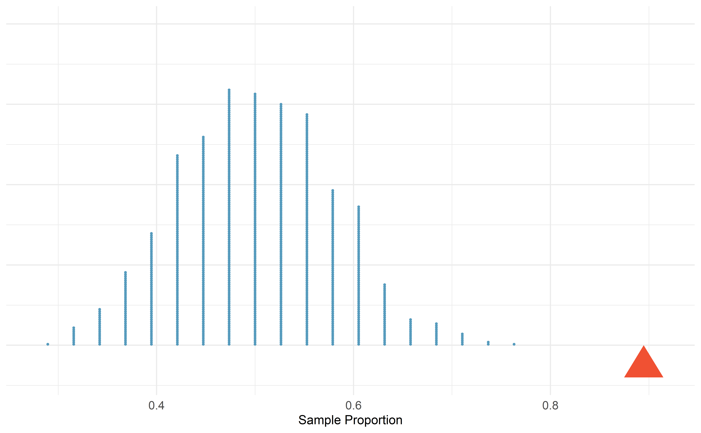
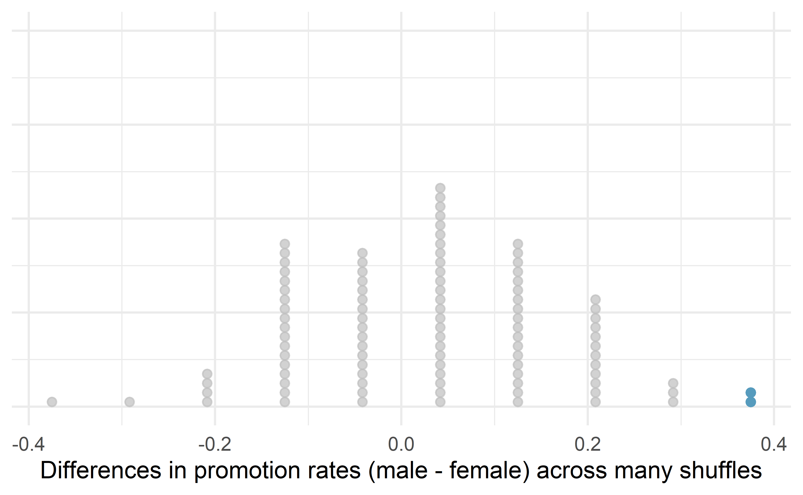

# (PART) Foundations of inference {.unnumbered}


# Hypothesis testing with randomization {#foundations-randomization}

::: {.chapterintro}
Statistical inference is primarily concerned with understanding and quantifying the *uncertainty* of parameter estimates---that is, how variable is a sample statistic from sample to sample? While the equations and details change depending on the setting, the foundations for inference are the same throughout all of statistics. 

We start with two case studies designed to motivate the process of making decisions about research claims.
We formalize the process through the introduction of the **hypothesis testing framework**\index{hypothesis test}, which allows us to formally evaluate claims about the population.
:::


<!-- # Inference for categorical data {#inference-cat} -->

Throughout the book so far, you have worked with data in a variety of contexts. You have learned how to summarize and visualize the data as well as how to visualize multiple variables at the same time. Sometimes the data set at hand represents the entire research question. But more often than not, the data have been collected to answer a research question about a larger group of which the data are a (hopefully) representative subset.

You may agree that there is almost always variability in data (one data set will not be identical to a second data set even if they are both collected from the same population using the same methods). 
However, quantifying the variability in the data is neither obvious nor easy to do, i.e., answering the question "*how* different is one data set from another?" is not trivial.

First, a reminder on notation.
We generally use $\pi$ to denote a population proportion and $\hat{p}$ to a sample proportion.
Similarly, we generally use $\mu$ to denote a population mean and $\bar{y}$ to denote a sample mean.

::: workedexample
Suppose your professor splits the students in your class into two groups: students who sit on the left side of the classroom and students who sit on the right side of the classroom.
If $\hat{p}_{L}$ represents the proportion of students who prefer to read books on screen who sit on the left side of the classroom and $\hat{p}_{R}$ represents the proportion of students who prefer to read books on screen who sit on the right side of the classroom, would you be surprised if $\hat{p}_{L}$ did not *exactly* equal $\hat{p}_{R}$?

------------------------------------------------------------------------

While the proportions $\hat{p}_{L}$ and $\hat{p}_{R}$ would probably be close to each other, it would be unusual for them to be exactly the same.
We would probably observe a small difference due to *chance*.
:::

::: {.guidedpractice data-latex=""}
If we do not think the side of the room a person sits on in class is related to whether they prefer to read books on screen, what assumption are we making about the relationship between these two variables?[^foundations-randomization-1]
:::

[^foundations-randomization-1]: We would be assuming that these two variables are **independent**\index{independent}.


Studying randomness of this form is a key focus of statistics. Throughout this chapter, and those that follow, we provide two different approaches for quantifying the variability inherent in data: simulation-based methods and theory-based methods (mathematical models). Using the methods provided in this and future chapters, we will be able to draw conclusions beyond the data set at hand to research questions about larger populations that the samples come from.

<!-- ## Foundations of inference {#inf-foundations} -->

Given results seen in a sample, the process of determining what we can *infer* to the population based on sample results is called **statistical inference**\index{statistical inference}. Statistical inferential methods enable us to understand and quantify the *uncertainty* of our sample results. Statistical inference helps us answer two questions about the population:

1.  How strong is the *evidence* of an effect?
2.  How *large* is the effect?

The first question is answered through a **hypothesis test**\index{hypothesis test}, while the second is addressed with a **confidence interval**\index{confidence interval}. This chapter will introduce you to the foundations of hypothesis testing, while the ideas behind confidence intervals will be presented in the next chapter.

Statistical inference is the practice of making decisions and conclusions from data in the context of uncertainty. Errors do occur, just like rare events, and the data set at hand might lead us to the wrong conclusion. While a given data set may not always lead us to a correct conclusion, statistical inference gives us tools to control and evaluate how often these errors occur.


## Motivating example: Martian alphabet {#Martian}

How well can humans distinguish one "Martian" letter from another? The Figure \@ref(fig:kiki-bumba) displays two Martian letters---one is Kiki and the another is Bumba. Which do you think is Kiki and which do you think is Bumba? Take a moment to write down your guess.

<div class="figure" style="text-align: center">

<p class="caption">(\#fig:kiki-bumba)Two Martian letters: Bumba and Kiki. Do you think the letter Bumba is on the left or the right?^[Bumba is the Martian letter on the left!]</p>
</div>

### Observed data

This same image and question from Figure \@ref(fig:kiki-bumba) were presented to an introductory statistics class of 38 students. In that class, 34 students correctly identified Bumba as the Martian letter on the left. That is, a sample proportion of $\hat{p} = 34/38 = 0.895$. Assuming we can't read Martian, is this result surprising?

One of two possibilities occurred:

1.  *We can't read Martian, and these results just occurred by chance.*
2.  *We can read Martian, and these results reflect this ability.*

To decide between these two possibilities, we could calculate the probability of observing such results in a randomly selected sample of 38 students, under the assumption that students were just guessing. If this probability is *very low*, we'd have reason to reject the first possibility in favor of the second. We can calculate this probability using one of two methods:

-   **Simulation-based method**: simulate lots of samples (classes) of 38 students under the assumption that students are just guessing, then calculate the proportion of these simulated samples where we saw 34 or more students guessing correctly, or
-   **Theory-based method**: develop a mathematical model for the sample proportion in this scenario and use the model to calculate the probability.


### Variability in a statistic

::: guidedpractice
How could you use a coin or cards to simulate the guesses of one sample of 38 students who cannot read Martian?[^05-inference-cat-3]
:::

[^05-inference-cat-3]: A fair coin has a 50% chance of landing on heads, which is the chance a student would guess Bumba correctly if they were just guessing. Thus, toss a coin 38 times with heads representing "guess correctly"; then calculate the proportion of tosses that landed on heads. Another option would be to 10 black cards and 10 red cards, letting red represent "guess correctly". Shuffle the cards and draw one card, record if it is red or black, then replace the card and shuffle again. Do this 38 times and calculate the proportion of red cards observed.

The observed data showed 34 students correctly identifying Bumba in a class of 38 students, or 90\%. Now, suppose students were truly "just guessing", meaning each student had a 50\% chance of guessing correctly. Then, if we conducted the study again with a different sample of 38 students, we would expect about half (or 19 students) to guess correctly, and the other half to guess incorrectly. Any variation from 19 would be based only on random fluctuation in our sample selection process. We could actually perform this **simulation** of what would happen if we randomly chose another 38 students that were "just guessing" by flipping a coin 38 times and counting the number of times it lands on heads. Try it out---how many correctly guessed Bumba in your simulated class of 38 students? What proportion guessed correctly?

### Observed statistic vs. null statistics

By flipping a coin 38 times, we computed one possible sample proportion of students guessing correctly under the assumption that they were "just guessing". 
While in this first simulation, we physically flipped a coin, it is much more efficient to perform this simulation using a computer.
Using a computer to repeat this process 1,000 times, we create the dot plot of simulated sample proportions shown in Figure \@ref(fig:MartianDotPlot).

<div class="figure" style="text-align: center">

<p class="caption">(\#fig:MartianDotPlot)A dot plot of 1,000 sample proportions; each calculated by flipping a coin 38 times and calculating the proportion of times the coin landed on heads. None of the 1,000 simulations had sample proportion of at least 89%, which was the proportion observed in the study.</p>
</div>

Our **observed statistic**, $\hat{p} = 0.90$, is represented in Figure \@ref(fig:MartianDotPlot) by the
red triangle. 
The simulated sample proportions plotted in blue represent **null statistics**, since they were simulated under the assumption of "just guessing" or "nothing" or "null".
None of the simulated null statistics got even close to our observed statistic!
That is, if students were just guessing, it is nearly impossible to observe 34 or more students guessing correctly in a sample of 38 students.
Given this low probability, the more plausible possibility is 2. *We can read Martian, and these results reflect this ability.* We've just completed our first hypothesis test!

Now, obviously no one can read Martian, so a more realistic possibility is that humans tend to choose Bumba on the left more often than the right---there is a greater than 50% chance of choosing Bumba as the letter on the left. Even though we may think we're guessing just by chance, we have a preference for Bumba on the left. It turns out that the explanation for this preference is called *synesthesia*, a tendency for humans to correlate sharp sounding noises (e.g., Kiki) with sharp looking images.[^05-inference-cat-4]

[^05-inference-cat-4]: To explore this further, watch this [TED Talk](https://www.ted.com/talks/vs_ramachandran_3_clues_to_understanding_your_brain) by neurologist Vilayanur Ramachandran (The synesthesia part begins at roughly 17:40 minutes).


## Case study: Sex discrimination {#caseStudySexDiscrimination}

Before getting into the nuances of hypothesis testing, let’s work through another case study.
We consider a study investigating sex discrimination in the 1970s, which is set in the context of personnel decisions within a bank.
The research question we hope to answer is, "Are individuals who identify as female discriminated against in promotion decisions made by their managers who identify as male?" [@Rosen:1974]

::: {.data data-latex=""}
The [`sex_discrimination`](http://openintrostat.github.io/openintro/reference/sex_discrimination.html) data can be found in the [**openintro**](http://openintrostat.github.io/openintro) R package.
:::

This study considered sex roles, and only allowed for options of "male" and "female".
We should note that the identities being considered are not gender identities and that the study allowed only for a binary classification of sex.

### Observed data

The participants in this study were 48 bank supervisors who identified as male, attending a management institute at the University of North Carolina in 1972.
They were asked to assume the role of the personnel director of a bank and were given a personnel file to judge whether the person should be promoted to a branch manager position.
The files given to the participants were identical, except that half of them indicated the candidate identified as male and the other half indicated the candidate identified as female.
These files were randomly assigned to the subjects.

::: {.guidedpractice data-latex=""}
Is this an observational study or an experiment?
How does the type of study impact what can be inferred from the results?[^foundations-randomization-2]
:::

[^foundations-randomization-2]: The study is an experiment, as subjects were randomly assigned a "male" file or a "female" file (remember, all the files were actually identical in content).
    Since this is an experiment, the results can be used to evaluate a causal relationship between the sex of a candidate and the promotion decision.


For each supervisor both the sex associated with the assigned file and the promotion decision were recorded.
Using the results of the study summarized in Table \@ref(tab:sex-discrimination-obs), we would like to evaluate if individuals who identify as female are unfairly discriminated against in promotion decisions.
In this study, a smaller proportion of female identifying applications were promoted than males (0.583 versus 0.875), but it is unclear whether the difference provides *convincing evidence* that individuals who identify as female are unfairly discriminated against.

<table class="table table-striped table-condensed" style="width: auto !important; margin-left: auto; margin-right: auto;">
<caption>(\#tab:sex-discrimination-obs)Summary results for the sex discrimination study.</caption>
 <thead>
<tr>
<th style="empty-cells: hide;border-bottom:hidden;" colspan="1"></th>
<th style="border-bottom:hidden;padding-bottom:0; padding-left:3px;padding-right:3px;text-align: center; " colspan="2"><div style="border-bottom: 1px solid #ddd; padding-bottom: 5px; ">decision</div></th>
<th style="empty-cells: hide;border-bottom:hidden;" colspan="1"></th>
</tr>
  <tr>
   <th style="text-align:left;"> sex </th>
   <th style="text-align:right;"> promoted </th>
   <th style="text-align:right;"> not promoted </th>
   <th style="text-align:right;"> Total </th>
  </tr>
 </thead>
<tbody>
  <tr>
   <td style="text-align:left;width: 7em; "> male </td>
   <td style="text-align:right;width: 7em; "> 21 </td>
   <td style="text-align:right;width: 7em; "> 3 </td>
   <td style="text-align:right;width: 7em; "> 24 </td>
  </tr>
  <tr>
   <td style="text-align:left;width: 7em; "> female </td>
   <td style="text-align:right;width: 7em; "> 14 </td>
   <td style="text-align:right;width: 7em; "> 10 </td>
   <td style="text-align:right;width: 7em; "> 24 </td>
  </tr>
  <tr>
   <td style="text-align:left;width: 7em; "> Total </td>
   <td style="text-align:right;width: 7em; "> 35 </td>
   <td style="text-align:right;width: 7em; "> 13 </td>
   <td style="text-align:right;width: 7em; "> 48 </td>
  </tr>
</tbody>
</table>


The data are visualized in Figure \@ref(fig:sex-rand-obs) as a set of cards.
Note that each card denotes a personnel file (an observation from our data set) and the colors indicate the decision: red for promoted and white for not promoted.
Additionally, the observations are broken up into groups of male and female identifying groups.

<div class="figure" style="text-align: center">

<p class="caption">(\#fig:sex-rand-obs)The sex discrimination study can be thought of as 48 red and white cards.</p>
</div>

::: {.workedexample data-latex=""}
Statisticians are sometimes called upon to evaluate the strength of evidence.
When looking at the rates of promotion in this study, why might we be tempted to immediately conclude that individuals identifying as female are being discriminated against?

------------------------------------------------------------------------

The large difference in promotion rates (58.3% for female personnel versus 87.5% for male personnel) suggest there might be discrimination against women in promotion decisions.
However, we cannot yet be sure if the observed difference represents discrimination or is just due to random chance when there is no discrimination occurring.
Since we wouldn't expect the sample proportions to be *exactly* equal, even if the truth was that the promotion decisions were independent of sex, we can't rule out random chance as a possible explanation when simply comparing the sample proportions.
:::

The previous example is a reminder that the observed outcomes in the sample may not perfectly reflect the true relationships between variables in the underlying population.
Table \@ref(tab:sex-discrimination-obs) shows there were 7 fewer promotions for female identifying personnel than for the male personnel, a difference in promotion rates of 29.2% $\left( \frac{21}{24} - \frac{14}{24} = 0.292 \right).$ This observed difference is what we call a **point estimate**\index{point estimate} of the true difference.
The point estimate of the difference in promotion rate is large, but the sample size for the study is small, making it unclear if this observed difference represents discrimination or whether it is simply due to chance when there is no discrimination occurring.
Chance can be thought of as the claim due to natural variability; discrimination can be thought of as the claim the researchers set out to demonstrate.
We label these two competing claims, $H_0$ and $H_A:$


\vspace{-2mm}

-   $H_0:$ **Null hypothesis**\index{null hypothesis}.
    The variables `sex` and `decision` are independent.
    They have no relationship, and the observed difference between the proportion of males and females who were promoted, 29.2%, was due to the natural variability inherent in the population.
-   $H_A:$ **Alternative hypothesis**\index{alternative hypothesis}.
    The variables `sex` and `decision` are *not* independent.
    The difference in promotion rates of 29.2% was not due to natural variability, and equally qualified female personnel are less likely to be promoted than male personnel.


::: {.onebox data-latex=""}
**Hypothesis testing.**

These hypotheses are part of what is called a **hypothesis test**\index{hypothesis test}.
A hypothesis test is a statistical technique used to evaluate competing claims using data.
Often times, the null hypothesis takes a stance of *no difference* or *no effect*.
This hypothesis assumes that any differences seen are due to the variability inherent in the population and could have occurred by random chance.

If the null hypothesis and the data notably disagree, then we will reject the null hypothesis in favor of the alternative hypothesis.

There are many nuances to hypothesis testing, so do not worry if you aren't a master of hypothesis testing at the end of this chapter.
We'll discuss these ideas and details many times in this chapter as well as in the chapters that follow.
:::


What would it mean if the null hypothesis, which says the variables `sex` and `decision` are unrelated, was true?
It would mean each banker would decide whether to promote the candidate without regard to the sex indicated on the personnel file.
That is, the difference in the promotion percentages would be due to the natural variability in how the files were randomly allocated to different bankers, and this randomization just happened to give rise to a relatively large difference of 29.2%.

Consider the alternative hypothesis: bankers were influenced by which sex was listed on the personnel file.
If this was true, and especially if this influence was substantial, we would expect to see some difference in the promotion rates of male and female candidates.
If this sex bias was against female candidates, we would expect a smaller fraction of promotion recommendations for female personnel relative to the male personnel.

We will choose between the two competing claims by assessing if the data conflict so much with $H_0$ that the null hypothesis cannot be deemed reasonable.
If data and the null claim seem to be at odds with one another, and the data seem to support $H_A,$ then we will reject the notion of independence and conclude that the data provide evidence of discrimination.

\vspace{-2mm}

### Variability of the statistic

Table \@ref(tab:sex-discrimination-obs) shows that 35 bank supervisors recommended promotion and 13 did not.
Now, suppose the bankers' decisions were independent of the sex of the candidate.
Then, if we conducted the experiment again with a different random assignment of sex to the files, differences in promotion rates would be based only on random fluctuation in promotion decisions.
We can actually perform this **randomization**, which simulates what would have happened if the bankers' decisions had been independent of `sex` but we had distributed the file sexes differently.[^foundations-randomization-3]

[^foundations-randomization-3]: The test procedure we employ in this section is sometimes referred to as a **randomization test**. If the explanatory variable had not been randomly assigned, as in an observational study, the procedure would be referred to as a **permutation test**.\index{permutation test}.


In the **simulation**\index{simulation}, we thoroughly shuffle the 48 personnel files, 35 labelled `promoted` and 13 labelled `not promoted`, together and we deal files into two new stacks.
Note that by keeping 35 promoted and 13 not promoted, we are assuming that 35 of the bank managers would have promoted the individual whose content is contained in the file **independent** of the sex indicated on their file.
We will deal 24 files into the first stack, which will represent the 24 "female" files.
The second stack will also have 24 files, and it will represent the 24 "male" files.
Figure \@ref(fig:sex-rand-shuffle-1) highlights both the shuffle and the reallocation to the sham sex groups.

<div class="figure" style="text-align: center">

<p class="caption">(\#fig:sex-rand-shuffle-1)The sex discrimination data are shuffled and reallocated to new groups of male and female files.</p>
</div>

Then, as we did with the original data, we tabulate the results and determine the fraction of personnel files designated as "male" and "female" who were promoted.


Since the randomization of files in this simulation is independent of the promotion decisions, any difference in promotion rates is due to chance.
Table \@ref(tab:sex-discrimination-rand-1) show the results of one such simulation.

<table class="table table-striped table-condensed" style="width: auto !important; margin-left: auto; margin-right: auto;">
<caption>(\#tab:sex-discrimination-rand-1)Simulation results, where the difference in promotion rates between male and female is purely due to random chance.</caption>
 <thead>
<tr>
<th style="empty-cells: hide;border-bottom:hidden;" colspan="1"></th>
<th style="border-bottom:hidden;padding-bottom:0; padding-left:3px;padding-right:3px;text-align: center; " colspan="2"><div style="border-bottom: 1px solid #ddd; padding-bottom: 5px; ">decision</div></th>
<th style="empty-cells: hide;border-bottom:hidden;" colspan="1"></th>
</tr>
  <tr>
   <th style="text-align:left;"> sex </th>
   <th style="text-align:right;"> promoted </th>
   <th style="text-align:right;"> not promoted </th>
   <th style="text-align:right;"> Total </th>
  </tr>
 </thead>
<tbody>
  <tr>
   <td style="text-align:left;width: 7em; "> male </td>
   <td style="text-align:right;width: 7em; "> 18 </td>
   <td style="text-align:right;width: 7em; "> 6 </td>
   <td style="text-align:right;width: 7em; "> 24 </td>
  </tr>
  <tr>
   <td style="text-align:left;width: 7em; "> female </td>
   <td style="text-align:right;width: 7em; "> 17 </td>
   <td style="text-align:right;width: 7em; "> 7 </td>
   <td style="text-align:right;width: 7em; "> 24 </td>
  </tr>
  <tr>
   <td style="text-align:left;width: 7em; "> Total </td>
   <td style="text-align:right;width: 7em; "> 35 </td>
   <td style="text-align:right;width: 7em; "> 13 </td>
   <td style="text-align:right;width: 7em; "> 48 </td>
  </tr>
</tbody>
</table>


::: {.guidedpractice data-latex=""}
What is the difference in promotion rates between the two simulated groups in Table \@ref(tab:sex-discrimination-rand-1) ?
How does this compare to the observed difference 29.2% from the actual study?[^foundations-randomization-4]
:::

[^foundations-randomization-4]: $18/24 - 17/24=0.042$ or about 4.2% in favor of the male personnel.
    This difference due to chance is much smaller than the difference observed in the actual groups.

Figure \@ref(fig:sex-rand-shuffle-1-sort) shows that the difference in promotion rates is much larger in the original data than it is in the simulated groups (0.292 > 0.042).
The quantity of interest throughout this case study has been the difference in promotion rates.
We call the summary value the **observed statistic** of interest (or often the **test statistic**).
When we encounter different data structures, the type of statistic is likely to change (e.g., we might calculate an average instead of a proportion), but we will always want to understand how the statistic varies from sample to sample.


<div class="figure" style="text-align: center">

<p class="caption">(\#fig:sex-rand-shuffle-1-sort)We summarize the randomized data to produce one estimate of the difference in proportions given no sex discrimination. Note that the sort step is only used to make it easier to visually calculate the simulated sample proportions.</p>
</div>

### Observed statistic vs. null statistics

We computed one possible difference under the null hypothesis in Guided Practice, which represents one difference due to chance when the null hypothesis is assumed to be true.
While in this first simulation, we physically dealt out files, it is much more efficient to perform this simulation using a computer.
Repeating the simulation on a computer, we get another difference due to chance under the same assumption: -0.042.
And another: 0.208.
And so on until we repeat the simulation enough times that we have a good idea of the shape of the *distribution of differences* under the null hypothesis.
Figure \@ref(fig:sex-rand-dot-plot) shows a plot of the differences found from 100 simulations, where each dot represents a simulated difference between the proportions of male and female files recommended for promotion.

<div class="figure" style="text-align: center">

<p class="caption">(\#fig:sex-rand-dot-plot)(ref:sex-rand-dot-plot-cap)</p>
</div>

(ref:sex-rand-dot-plot-cap) A stacked dot plot of differences from 100 simulations produced under the null hypothesis, $H_0,$ where the simulated sex and decision are independent. Two of the 100 simulations had a difference of at least 29.2%, the difference observed in the study, and are shown as solid blue dots.

Note that the distribution of these simulated differences in proportions is centered around 0.
Under the null hypothesis our simulations made no distinction between male and female personnel files.
Thus, a center of 0 makes sense: we should expect differences from chance alone to fall around zero with some random fluctuation for each simulation.

::: {.workedexample data-latex=""}
How often would you observe a difference of at least 29.2% (0.292) according to Figure \@ref(fig:sex-rand-dot-plot)?
Often, sometimes, rarely, or never?

------------------------------------------------------------------------

It appears that a difference of at least 29.2% under the null hypothesis would only happen about 2% of the time according to Figure \@ref(fig:sex-rand-dot-plot).
Such a low probability indicates that observing such a large difference from chance alone is rare.
:::

The difference of 29.2% is a rare event if there really is no impact from listing sex in the candidates' files, which provides us with two possible interpretations of the study results:

-   If $H_0,$ the **Null hypothesis** is true: Sex has no effect on promotion decision, and we observed a difference that is so large that it would only happen rarely.

-   If $H_A,$ the **Alternative hypothesis** is true: Sex has an effect on promotion decision, and what we observed was actually due to equally qualified female candidates being discriminated against in promotion decisions, which explains the large difference of 29.2%.

When we conduct formal studies, we reject a null position (the idea that the data are a result of chance only) if the data strongly conflict with that null position.[^foundations-randomization-5]
In our analysis, we determined that there was only a $\approx$ 2% probability of obtaining a sample where $\geq$ 29.2% more male candidates than female candidates get promoted under the null hypothesis, so we conclude that the data provide strong evidence of sex discrimination against female candidates by the male supervisors.
In this case, we reject the null hypothesis in favor of the alternative.

[^foundations-randomization-5]: This reasoning does not generally extend to anecdotal observations.
    Each of us observes incredibly rare events every day, events we could not possibly hope to predict.
    However, in the non-rigorous setting of anecdotal evidence, almost anything may appear to be a rare event, so the idea of looking for rare events in day-to-day activities is treacherous.
    For example, we might look at the lottery: there was only a 1 in 176 million chance that the Mega Millions numbers for the largest jackpot in history (October 23, 2018) would be (5, 28, 62, 65, 70) with a Mega ball of (5), but nonetheless those numbers came up!
    However, no matter what numbers had turned up, they would have had the same incredibly rare odds.
    That is, *any set of numbers we could have observed would ultimately be incredibly rare*.
    This type of situation is typical of our daily lives: each possible event in itself seems incredibly rare, but if we consider every alternative, those outcomes are also incredibly rare.
    We should be cautious not to misinterpret such anecdotal evidence.


## Hypothesis testing {#HypothesisTesting}

In the last two sections, we utilized a **hypothesis test**\index{hypothesis test}, which is a formal technique for evaluating two competing possibilities.
In each scenario, we described a **null hypothesis**\index{null hypothesis}, which represented either a skeptical perspective or a perspective of no difference.
We also laid out an **alternative hypothesis**\index{alternative hypothesis}, which represented a new perspective such as the possibility of a relationship between two variables or a treatment effect in an experiment.
The alternative hypothesis is usually the reason the scientists set out to do the research in the first place.


::: onebox
**Null and alternative hypotheses.**

When we observe an effect in a sample, we would like to determine if this observed effect represents an actual effect in the population, or whether it was simply due to chance. We label these two competing claims, $H_0$ and $H_A$, which are spoken as "H-naught" and "H_A".

The **null hypothesis** ($H_0$) often represents either a skeptical perspective or a claim to be tested.

The **alternative hypothesis** ($H_A$) represents an alternative claim under consideration and is often represented by a range of possible values for the parameter of interest.
:::

::: guidedpractice
In the Martian alphabet example, which of the two competing possibilities was the null hypothesis? the alternative hypothesis?[^05-inference-cat-7]
:::

[^05-inference-cat-7]: The first possibility (*We can't read Martian, and these results just occurred by chance.*) was the null hypothesis; the second possibility (*We can read Martian, and these results reflect this ability.*) was the alternative hypothesis.

The hypothesis testing framework is a very general tool, and we often use it without a second thought. If a person makes a somewhat unbelievable claim, we are initially skeptical. However, if there is sufficient evidence that supports the claim, we set aside our skepticism. The hallmarks of hypothesis testing are also found in the US court system.

### The US court system

In the US course system, jurors evaluate the evidence to see whether it convincingly shows a defendant is guilty.
Defendants are considered to be innocent until proven otherwise.

::: {.workedexample data-latex=""}
The US court considers two possible claims about a defendant: they are either innocent or guilty.

If we set these claims up in a hypothesis framework, which would be the null hypothesis and which the alternative?

------------------------------------------------------------------------

The jury considers whether the evidence is so convincing (strong) that there is no reasonable doubt regarding the person's guilt.
That is, the skeptical perspective (null hypothesis) is that the person is innocent until evidence is presented that convinces the jury that the person is guilty (alternative hypothesis).
:::

Jurors examine the evidence to see whether it convincingly shows a defendant is guilty.
Notice that if a jury finds a defendant *not guilty*, this does not necessarily mean the jury is confident in the person's innocence.
They are simply not convinced of the alternative, that the person is guilty.
This is also the case with hypothesis testing: *even if we fail to reject the null hypothesis, we do not accept the null hypothesis as truth*.

Failing to find evidence in favor of the alternative hypothesis is not equivalent to finding evidence that the null hypothesis is true^[This idea is succinctly expressed by the saying, "the absence of evidence is not evidence of absence."].
We will see this idea in greater detail in Section \@ref(ConfidenceIntervals).

### p-value and statistical significance {#p-value-stat-signif}

In the [Martian alphabet example](#Martian), the research question---can humans read Martian?---was framed in the context of hypotheses:

-   $H_0$: The chance a human chooses Bumba on the left is 50%.

-   $H_A$: Humans have a preference for choosing Bumba on the left.

The null hypothesis ($H_0$) was a perspective of no effect (no ability to read Martian). The student data provided a point estimate of 89.5% ($34/38 \times 100$%) for the true probability of choosing Bumba on the left. We determined that observing such a sample proportion from chance alone (assuming $H_0$) would be rare---it would only happen in less than 1 out of 1000 samples. When results like these are inconsistent with $H_0$, we reject $H_0$ in favor of $H_A$. Here, we concluded that humans have a preference for choosing Bumba on the left.

The less than 1-in-1000 chance is what we call a **p-value**, which is a probability quantifying the strength of the evidence against the null hypothesis and in favor of the alternative.

::: onebox
**p-value.**

The **p-value**\index{hypothesis testing!p-value|textbf} is the probability of observing data at least as favorable to the alternative hypothesis as our current data set, if the null hypothesis were true. We typically use a summary statistic of the data, such as a proportion or difference in proportions, to help compute the p-value and evaluate the hypotheses. This summary value that is used to compute the p-value is often called the **test statistic**\index{test statistic}.
:::


::: protip
When interpreting a p-value, remember that the definition of a p-value has three components. It is a (1) probability. What it is the probability of? It is the probability of (2) our observed sample statistic or one more extreme. Assuming what? It is the probability of our observed sample statistic or one more extreme, (3) assuming the null hypothesis is true:

(1) probability
(2) data[^05-inference-cat-8]
(3) null hypothesis
:::

[^05-inference-cat-8]: Technically, the observed sample statistic or one more extreme in the direction of our alternative. But it is helpful to just remember this as "the data".

::: workedexample
What was the test statistic in the [Martian alphabet example](#Martian)?

------------------------------------------------------------------------

The test statistic in the the Martian alphabet example was the sample proportion, $\frac{34}{38} = 0.895$ (or 89.5%). This is also the **point estimate** of the true probability that humans would choose Bumba on the left.
:::

Since the p-value is a probability, its value will always be between 0 and 1. The closer the p-value is to 0, the stronger the evidence we have *against the null hypothesis*. Why? A small p-value means that our data are *unlikely* to occur, *if* the null hypothesis is true. We take that to mean that the null hypothesis isn't a plausible assumption, and we reject it. This process mimics the scientific method---it is easier to disprove a theory than prove it. If scientists want to find evidence that a new drug reduces the risk of stroke, then they assume it *doesn't* reduce the risk of stroke and then show that the observed data are so unlikely to occur that the more plausible explanation is that the drug works.

Think of p-values as a continuum of strength of evidence against the null, from 0 (extremely strong evidence) to 1 (no evidence). Beyond around 10%, the data provide little to no evidence against the null hypothesis. Be careful not to equate this with evidence for the null hypothesis, which is incorrect.

<div class="figure" style="text-align: center">

<p class="caption">(\#fig:pval-continuum)Strength of evidence against the null for a continuum of p-values. Once the p-value is beyond around 0.10, the data provide little to no evidence against the null hypothesis.</p>
</div>

<!-- You may use Table @ref(tab:pvalue-continuum) as a general guide, but remember that there are no hard and fast cutoffs on this scale---the strength of evidence against the null with a p-value of 0.049 is the same as with a p-value of 0.051.  -->

<!-- ```{r pvalue-continuum} -->

<!-- pval_table <- tribble( -->

<!--   ~variable,    ~col1,  -->

<!-- "p-value < 0.01",  "very strong", -->

<!-- "0.01 < p-value < 0.05", "strong", -->

<!-- "0.05 < p-value < 0.10", "moderate", -->

<!-- "p-value > 0.10", "little to no evidence", -->

<!-- ) -->

<!-- pval_table %>% -->

<!--  kable(caption = "The p-value as a continuum of strength of evidence against the null--a general guide.",  -->

<!--     col.names = c("p-value range", "Strength of evidence against $H_0$")) %>% -->

<!--  kable_styling() -->

<!-- ``` -->

When the p-value is small, i.e., less than a previously set threshold, we say the results are **statistically significant**\index{statistically significant}.
This means the data provide such strong evidence against $H_0$ that we reject the null hypothesis in favor of the alternative hypothesis.
The threshold is called the **significance level**\index{hypothesis testing!significance level}\index{significance level} and often represented by $\alpha$ (the Greek letter *alpha*).
The value of $\alpha$ represents how rare an event needs to be in order for the null hypothesis to be rejected.
Historically, many fields have set $\alpha = 0.05,$ meaning that the results need to occur less than 5% of the time, if the null hypothesis is to be rejected.
The value of $\alpha$ can vary depending on the the field or the application.


Although in everyday language "significant" would indicate that a difference is large or meaningful, that is not necessarily the case here.
The term "statistically significant" only indicates that the p-value from a study fell below the chosen significance level.
For example, in the sex discrimination study, the p-value was found to be approximately 0.02.
Using a significance level of $\alpha = 0.05,$ we would say that the data provided statistically significant evidence against the null hypothesis.
However, this conclusion gives us no information regarding the size of the difference in promotion rates!

::: {.onebox data-latex=""}
**Statistical significance.**

We say that the data provide **statistically significant**\index{hypothesis testing!statistically significant} evidence against the null hypothesis if the p-value is less than some predetermined threshold (e.g., 0.01, 0.05, 0.1).
:::

::: onebox
**What's so special about 0.05?**

We often use a threshold of 0.05 to determine whether a result is statistically significant. But why 0.05? Maybe we should use a bigger number, or maybe a smaller number. If you're a little puzzled, that probably means you're reading with a critical eye---good job! The *OpenIntro* authors have a video to help clarify *why 0.05*:

<center><https://www.openintro.org/book/stat/why05/></center>

<br> Sometimes it's also a good idea to deviate from the standard. We'll discuss when to choose a threshold different than 0.05 in Section \@ref(foundations-errors).
:::

Statistical significance has been a hot topic in the news, related to the "reproducibility crisis" in some scientific fields. We encourage you to read more about the debate on the use of p-values and statistical significance. A good place to start would be the *Nature* article, "[Scientists rise up against statistical significance](https://www.nature.com/articles/d41586-019-00857-9)," from March 20, 2019.


## Chapter review {#chp9-review}

### Summary {-}

Regardless of the data structure or analysis method, the hypothesis testing framework always follows the same steps---only the details for how we model randomness in the data change.

::: onebox
**General steps of a hypothesis test.** Every hypothesis test follows these same general steps:

1.  Frame the research question in terms of hypotheses.
2.  Collect and summarize data using a test statistic.
3.  Assume the null hypothesis is true, and simulate or mathematically model a null distribution for the test statistic.
4.  Compare the observed test statistic to the null distribution to calculate a p-value.
5.  Make a conclusion based on the p-value, and write a conclusion in context, in plain language, and in terms of the alternative hypothesis.
:::


<!-- ::: {.underconstruction} -->
<!-- Add more to this summary -->
<!-- ::: -->

### Terms {-}

We introduced the following terms in the chapter. If you're not sure what some of these terms mean, we recommend you go back in the text and review their definitions. We are purposefully presenting them in alphabetical order, instead of in order of appearance, so they will be a little more challenging to locate. However you should be able to easily spot them as **bolded text**.

<table class="table table-striped table-condensed" style="margin-left: auto; margin-right: auto;">
<tbody>
  <tr>
   <td style="text-align:left;"> alternative hypothesis </td>
   <td style="text-align:left;"> permutation test </td>
   <td style="text-align:left;"> simulation-based method </td>
  </tr>
  <tr>
   <td style="text-align:left;"> null hypothesis </td>
   <td style="text-align:left;"> point estimate </td>
   <td style="text-align:left;"> statistically significant </td>
  </tr>
  <tr>
   <td style="text-align:left;"> null statistic </td>
   <td style="text-align:left;"> randomization test </td>
   <td style="text-align:left;"> test statistic </td>
  </tr>
  <tr>
   <td style="text-align:left;"> observed statistic </td>
   <td style="text-align:left;"> significance level </td>
   <td style="text-align:left;"> theory-based method </td>
  </tr>
  <tr>
   <td style="text-align:left;"> p-value </td>
   <td style="text-align:left;"> simulation </td>
   <td style="text-align:left;">  </td>
  </tr>
</tbody>
</table>


### Key ideas {-}

<!-- ::: {.underconstruction} -->
<!-- Need to update this list and distribute across chapters -->
<!-- ::: -->

In this chapter, we introduced statistical inference methods --- both simulation-based and theory-based --- for scenarios involving one or two categorical variables. These are explored further in Chapters \ref(inference-one-prop) and \ref(inference-two-prop).

-   All of statistical inference revolves around the idea of **sampling variability**: as we take different samples from the population, the value of the sample statistic will vary. In this chapter, we explored sampling variability of a single proportion and a difference in two proportions. If we see some sort of effect in our sample, was it just due to chance? or was it indicative of an actual effect in the population? **Statistical inference** is how we answer this question.

-   A **hypothesis test** answers the question "how strong is the *evidence* of an effect?" A **confidence interval** answers the question "how *large* is the effect?"

-   The general steps of a **hypothesis test** are:

    1.  Frame the research question in terms of hypotheses.
    2.  Collect and summarize data using a test statistic.
    3.  Assume the null hypothesis is true, and simulate or mathematically model a null distribution for the test statistic.
    4.  Compare the observed test statistic to the null distribution to calculate a p-value.
    5.  Make a conclusion based on the p-value, and write a conclusion in context, in plain language, and in terms of the alternative hypothesis.

-   A **p-value** is the probability of observing data like ours, or data with a more extreme effect, under the assumption of the null hypothesis. How we define "more extreme" depends on the direction of the alternative hypothesis. The p-value is the answer to the question "*if the null hypothesis were true*, what are the chances of observing data like mine?"

    -   A small p-value indicates that the observed data would have been unusual if the null hypothesis were true, and thus we have evidence against the null hypothesis.
    -   A p-value that is not small indicates that the observed data are plausible under the assumption of the null hypothesis, and thus we do not have evidence against the null hypothesis.


-  All statistical inference methods require that certain **validity conditions** are met; otherwise, the methods are not valid. Almost all methods in this textbook require that the observations in our data set are **independent**.[^9-independence-clarification] Additionally, theory-based methods require that we have a large enough sample size so that the Central Limit Theorem can apply. For proportions, this condition is known as the **success-failure condition**.


[^9-independence-clarification]: *Independence* is used and assessed in four ways in this course. (1) The independence assumption *for observations* means that each row in the data set is not obviously related to another, such as having multiple observations for the same subject. This assumption is relaxed in the matched pairs procedure where two observations from each subject are directly analyzed. Look for violations of independence due to clustered or repeated measures from groups that are part of the data collection process. Random sampling does not protect from violations of independence, as even randomly selected observations could vary based on underlying groups. (2) Independence is used to describe the groups in the two-sample proportion and two-sample mean settings, in order to convey the idea that there are not connections between observations in the two groups, now both across and within groups. (3) Independence is used to frame the null hypothesis in the two-sample proportion setting, where the results for the response variable are assumed to be independent of the group. (4) Independence is tested between two quantitative variables in the correlation material.
