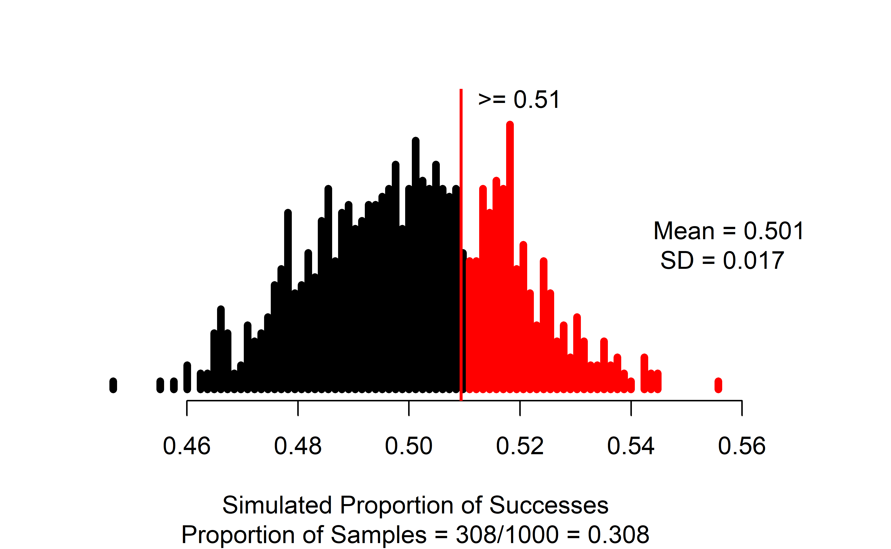
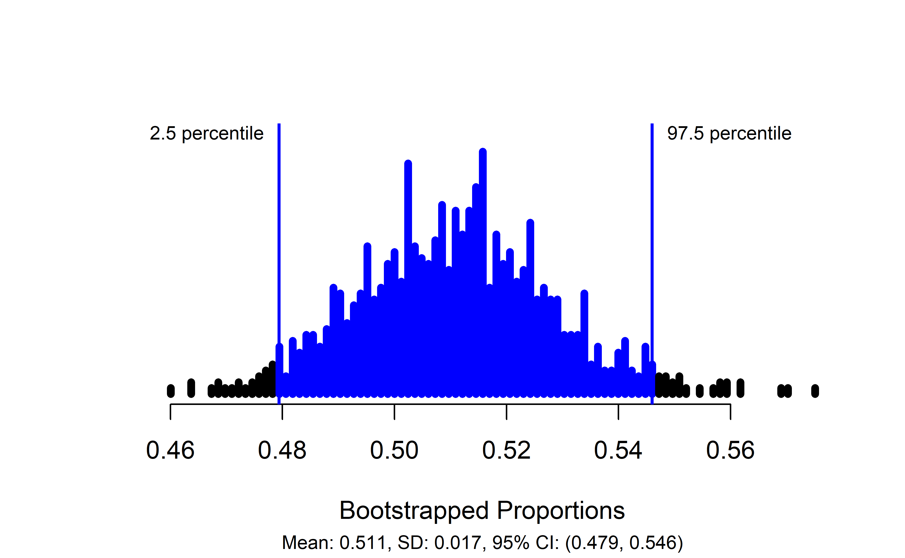
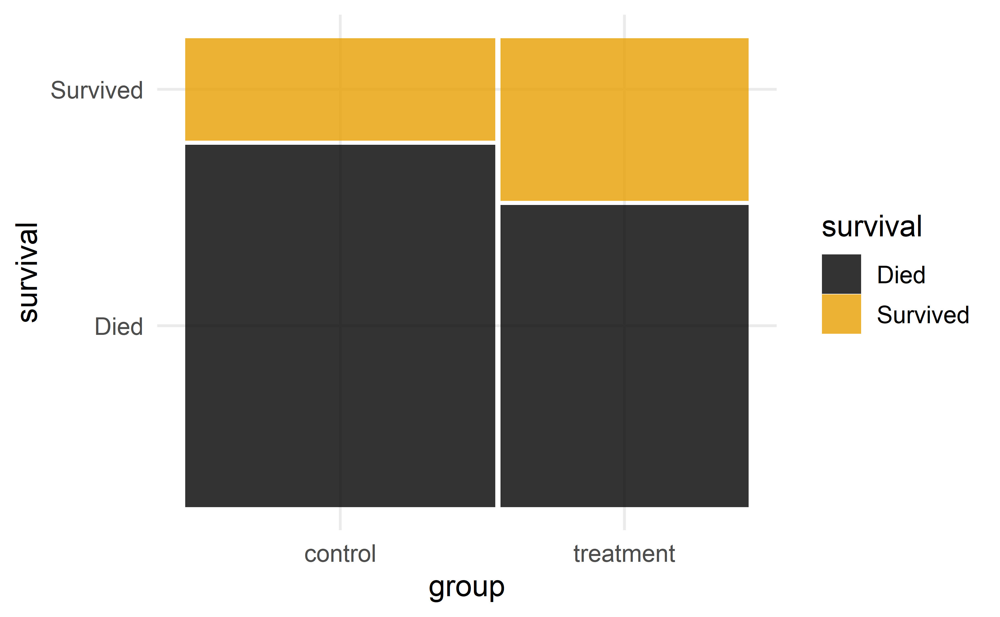
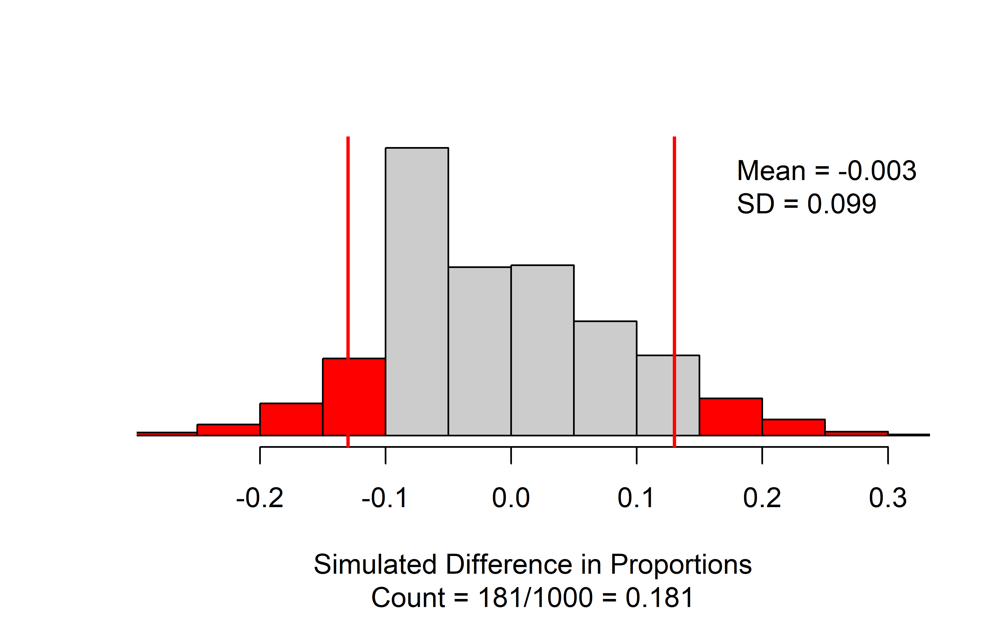
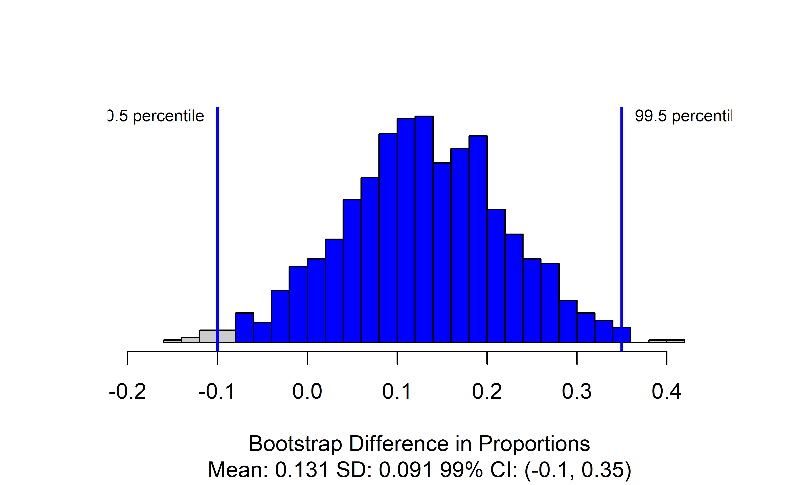
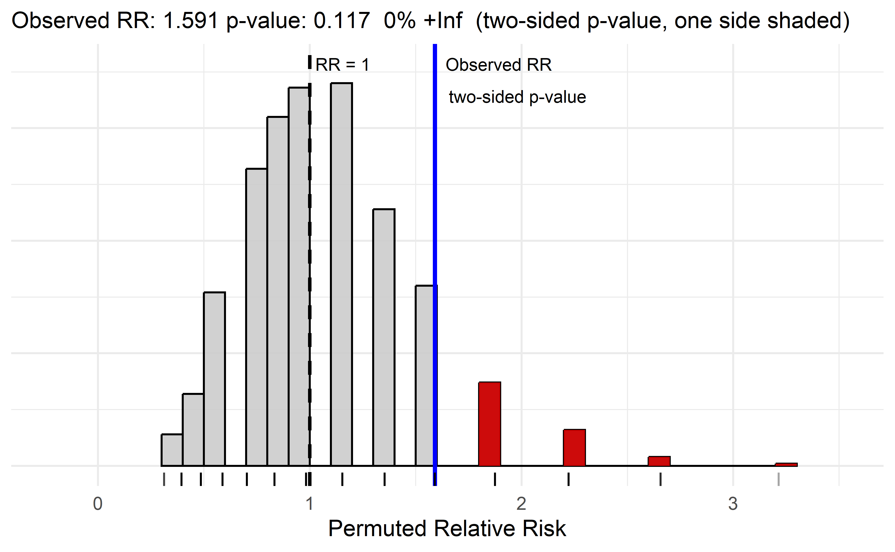
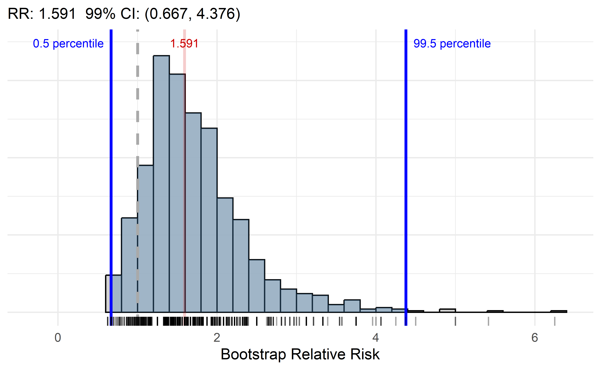

# Applications: Infer categorical {#inference-categ-applications}


::: chapterintro
In this chapter, we will explore how to conduct statistical inference for categorical variables using the `catstats` package in RStudio. Review the [Preliminaries](rstudio) Chapter for instructions for installing `catstats`.
We encourage you to work through the code in this chapter in 
your own RStudio session.
:::

Much of the R code we use below is from the `tidyverse` R package. Load this package and the `catstats` package prior to running the code in this chapter.


## Making tables from raw data {.unnumbered}

If you are collecting your own data, then your analysis starts with the raw data frame, with one observational unit per row and one variable per column. In this case, you first need to find counts (frequencies) of observations in each category prior to inference. We can use the `table()` function in R on the raw data to create a contingency table of the counts for each categorical variable.

In the one-proportion case, suppose we have a data frame called `loans` with a variable `regulate` that contains the Yes/No response of the 826 payday loan borrowers from Section \@ref(payday-lenders) regarding their support for a regulation to require lenders to pull their credit report and evaluate their debt payments. Run the following line of code to create this data set in RStudio.


``` r
loans <- data.frame(regulate = sample(c(rep("Yes", 422), rep("No", 404))))
```

We can obtain counts of borrowers for each response using the `count()` function in R:


``` r
table(loans$regulate)
```

```
#> 
#>  No Yes 
#> 404 422
```

In the R code above, `loans` is the name of the data set in R, and `regulate` is the name of the variable. The `$` tells R to select the `regulate` variable from the `loans` data set. We could have also used the pipe command to generate the table:


``` r
loans %>% select(regulate) %>% table()
```

```
#> regulate
#>  No Yes 
#> 404 422
```

We can also use `table()` to compute the proportions in each group by dividing by the number of observations:


``` r
#If we know the number of observations:
table(loans$regulate)/826
```

```
#> 
#>    No   Yes 
#> 0.489 0.511
```

``` r
#If we don't know the number of observations:
table(loans$regulate)/length(loans$regulate)
```

```
#> 
#>    No   Yes 
#> 0.489 0.511
```


For comparisons of two proportions, we get a two-way table. Consider the case study of the effect of blood thinners on survival after receiving CPR from Section \@ref(cpr). Data from this study are stored in a data frame called `cpr`, with variables `survival` -- giving each patient's outcome decision -- and `group` -- indicating whether they were in the treatment (blood thinner) or control (no blood thinner) group. Run the following lines of code to create this data set in RStudio.


``` r
survival <- factor(c(rep("Survived", 25), rep("Died", 65)))
group <- factor(rep.int(c("control", "treatment", "control", "treatment"), times = c(11, 14, 39, 26)))

cpr <- data.frame(survival, group)
```

The `glimpse()` and `summary()` functions can help us see what variables are in our data set and the values they take on:


``` r
glimpse(cpr)
```

```
#> Rows: 90
#> Columns: 2
#> $ survival <fct> Survived, Survived, Survived, Survived, Survived, Survived, S…
#> $ group    <fct> control, control, control, control, control, control, control…
```

``` r
summary(cpr)
```

```
#>      survival        group   
#>  Died    :65   control  :50  
#>  Survived:25   treatment:40
```

To obtain the two-way table of the choices by group, we again use the `table()` function in R. The key thing to remember here is to put the response variable (outcome) as the first argument and the explanatory variable (grouping) as the second. In our example, `survival` is the response variable, and `group` is the explanatory variable.


``` r
table(cpr$survival, cpr$group)
```

```
#>           
#>            control treatment
#>   Died          39        26
#>   Survived      11        14
```

This will set up the table to be useful for making segmented bar plots and using column percentages to compute test statistics. In order to do either of these things, we need to store the table in an R object so we can manipulate it further:


``` r
data_tbl <- table(cpr$survival, cpr$group)
```

To get column percentages, we use the `prop.table()` function:


``` r
prop.table(data_tbl,  #Feed in your two-way table
           margin = 2)  #Tell it to compute percentages for columns
```

```
#>           
#>            control treatment
#>   Died        0.78      0.65
#>   Survived    0.22      0.35
```

<!-- #### Making tables from counts {-} -->

<!-- If you don't have access to the raw data, and only have access to the two-way table itself, you can create this table in R with the `as.table` function. -->

### Simulation-based inference for one proportion {.unnumbered}

For simulation-based inference, we will use functions included in the `catstats` package, created for MSU Statistics courses. See the [Statistical computing](#stat-computing) section at the beginning of this textbook for instructions on how to install `catstats` if you haven't already. If the package is installed, you can load it into an R session to make the functions available using the `library()` function:


``` r
library(catstats)
```

Once you have loaded the package, you will be able to use the functions for simulation-based inference. For one-proportion inference, this is the `one_proportion_test()` function and `one_proportion_bootstrap_CI()` function. Returning to the payday loan regulation example, we can obtain a simulation distribution and p-value using the following function call:


``` r
one_proportion_test(
  probability_success = 0.5, #null hypothesis probability of success
  sample_size = 826,  #number of observations
  number_repetitions = 1000,  #number of simulations to create
  as_extreme_as = 0.51,  #observed statistic
  direction = "greater",  #alternative hypothesis direction
  summary_measure = "proportion"  #Report number or proportion of successes?
)
```



::: importantbox
Note that the observed statistic (`as_extreme_as`) and the `summary_measure` input need to match; since we put in the observed statistic as a proportion, we need to tell the function to report the proportion of successes. If they don't match, you will almost certainly get a p-value of 0 or 1 -- this can happen when there is very strong evidence against the null, but it is always good to check your function inputs when you get an extreme outcome to make sure that is what you should be seeing.
:::

In the resulting graph, we see the null distribution of simulated proportions, with those greater than the observed value of 0.51 highlighted in blue. In the figure caption, we see that 308 of our 1000 simulations resulted in a proportion of successes at least as large as the observed value, yielding an approximate p-value of 0.308.

To find a confidence interval for the true proportion of payday loan borrowers who support the regulation, we use the `one_proportion_bootstrap_CI()` function:


``` r
one_proportion_bootstrap_CI(
  sample_size = 826,  #Number of observations
  number_successes = 422,  #Number of observed successes 
  number_repetitions = 1000,  #Number of bootstrap draws
  confidence_level = 0.95  #Confidence level, as a proportion
)
```



This produces a plot of the bootstrapped proportions with the upper and lower bounds of the confidence interval marked, and gives the interval itself in the figure caption: in this case, we are 95% confident that the true proportion of payday loan borrowers who support the proposed regulation is between 0.479 and 0.546.

### Simulation-based inference for difference in two proportions {.unnumbered}

For inference about the difference between two proportions, we use the `two_proportion_test()` and `two_proportion_bootstrap_CI()` functions. Before doing doing inference to compare two proportions, you should create a mosaic plot to visualize the sample proportions being compared and to verify the names of the two groups. The response variable should be on the $y$-axis and the predictor (grouping) variable should be on the $x$-axis in the mosaic plot, which is accomplished with `x = product(group)` (for the predictor variable called `group`) and `fill = survival` (for the $y$-axis variable to fill the bars based on the `survival` of the subjects) here.


``` r
cpr %>% ggplot() +
  geom_mosaic(aes(x = product(group), fill = survival)) +
  scale_fill_colorblind()
```


In using the `two_proportion_test()` formula, it requires `response` $\sim$ `explanatory`. You can check that your formula is correct by using the explanatory (grouping) variable from the $x$-axis and the response variable from the $y$-axis in the mosaic plot. The function requires that you declare the order of subtraction between the predictor variable groups using `first_in_subtraction` to select a level of the grouping variable ("treatment" is selected here) to be first in the comparison on the proportions. The level of the response to use as the "success" ("Survived" is selected here) must also be specified.  Additional required options are the `number_repetitions` (use 10000 unless that is computationally problematic), the value of the observed statistic (difference in proportions here) in `as_extreme_as`, and the direction of the alternative in `direction`(choices of `two-sided`, `greater`, or `less`) based on your desired alternative hypothesis. Note that the order of subtraction and success choices impact the direction used for one-sided tests.

Using the CPR and blood thinner study for a two-sided test with an observed difference in proportions of 0.13, a call to `two_proportion_test()` would look like this:


``` r
two_proportion_test(
  formula = survival ~ group,  #Always do response ~ explanatory
  data = cpr,   #Name of the data set
  first_in_subtraction = "treatment", #Value of the explanatory variable that is first in order of subtraction
  response_value_numerator = "Survived",  #Value of response that is a "success"
  number_repetitions = 1000,
  as_extreme_as = 0.13,  #Observed statistic
  direction = "two-sided"  #Direction of the alternative hypothesis
)
```



The `two_proportion_test()` function generates a null distribution of simulated differences in proportions, with the observed statistic marked with a vertical line and all values as or more extreme than the observed statistic colored red. The figure caption gives the approximate p-value: in this case 181/1000 = 0.181.

::: importantbox
There are a couple of things to note when using the `two_proportion_test` function:

-   You need to identify which variable is your outcome and which your group using the `formula` argument.
-   Specify order of subtraction using `first_in_subtraction` by putting in EXACTLY the category of the explanatory variable that you want to be first, in quotes --- must match capitalization, spaces, etc. for text values!
-   Specify what is a success using `response_value_numerator` but putting in EXACTLY the category of the response that you consider a success, in quotes. Again, capitalization, spaces, etc. matter here!
:::

To produce a confidence interval for the true difference in the proportion of patients that survive after receiving CPR, we use `two_proportion_bootstrap_CI()`, which uses most of the same arguments as the `two_proportion_test()` function:


``` r
two_proportion_bootstrap_CI(
  formula = survival ~ group,  #Always do response ~ explanatory
  data = cpr,   #Name of the data set
  first_in_subtraction = "treatment", #Value of the explanatory variable that is first in order of subtraction
  response_value_numerator = "Survived",  #Value of response that is a "success"
  number_repetitions = 1000, #Number of bootstrap samples
  confidence_level = 0.99  #Confidence level, as a proportion
)
```



The main changes for this function are that the `as_extreme_as` and `direction` are not needed but a `confidence_level` choice is required. The provided code produces the distribution of bootstrapped statistics with the bounds of the confidence interval marked, and the value included in the caption. Here, we are 99% confident that the true proportion of patients who survive after receiving CPR is between 0.1 lower and 0.35 higher when patients are given blood thinners compared to when they are not.

### Simulation-based inference for relative risk {.unnumbered}

For inference about the ratio of two proportions, we either use the `relative_risk_bootstrap_CI()` or the `relative_risk_test()` functions. These functions assume you have a data frame with the group and outcome included as variables and have similar options as the functions for the difference in two proportions inferences. The data visualization for the relative risk is the same as for the two-sample proportion since it uses the same information (two sample proportions) to calculate the summary measure. The primary modification from `two_proportion_test()` is to switch from specifying the order of subtraction for the two proportions to defining the group to use in the numerator of the relative risk with the `group_numerator` option. 

Using the CPR and blood thinner study, a call to `relative_risk_test()` would look like this to have the "treatment" group in the numerator of the relative risk and "survival" as the success for the two proportions being calculated for the two-sided test: 


``` r
relative_risk_test(
  formula = survival ~ group,  #Always do response ~ explanatory
  data = cpr,   #Name of the data set
  group_numerator = "treatment", #Value of the explanatory variable that is in the numerator of RR
  response_value_numerator = "Survived",  #Value of response that is a "success"
  number_repetitions = 1000,
  as_extreme_as = 1.591,  #Observed statistic
  direction = "two-sided"  #Direction of the alternative hypothesis
)
```



The resulting plot provides a caption with estimated relative risk (1.591), the two-sided p-value of 0.0989. Because the relative risk is a ratio, the two-sided p-value can be found by doubling the area in one tail, so only side is shaded in the plot.


::: importantbox
There are a couple of additional things to note when using the `relative_risk_test()` function:

-   It is possible to encounter relative risks of either 0 or infinity if the proportion in the numerator or denominator is estimated to be 0. The percentage of infinite RRs in the permuted data are reported in the caption (`X% Inf`) and used in the p-value calculation, but we can not plot infinity. If this is occurring in your data set, we suggest using the `adjust = T` option to add 0.5 to all the counts to avoid any RRs that are not possible to display. If you are using the adjusted relative risk, you should omit the `as_extreme_as` option and allow the function to calculate the (adjusted) observed RR for you.
-   The value of the relative risk under the null hypothesis is displayed at 1 to help with understanding the size of the estimated relative risk.
-   Two-sided p-values are found by doubling the area in the tail of the distribution where the observed relative risk is found relative to the value of 1 for the relative risk.
-   If the relative risk is very small (close to 0), the results can be hard to see in the plot -- consider changing the group in the numerator to more readily visualize the results.
:::
To produce a confidence interval for the true ratio of the proportion of patients that survive after receiving CPR, we use `relative_risk_bootstrap_CI()`, which uses most of the same arguments as the `relative_risk_test()` function:


``` r
relative_risk_bootstrap_CI(
  formula = survival ~ group,  #Always do response ~ explanatory
  data = cpr,   #Name of the data set
  group_numerator = "treatment", #Value of the explanatory variable that is in the numerator of RR
  response_value_numerator = "Survived",  #Value of response that is a "success"
  number_repetitions = 1000, #Number of bootstrap samples
  confidence_level = 0.99  #Confidence level, as a proportion
)
```



This produces the distribution of bootstrapped statistics with the bounds of the confidence interval marked, and the value included in the caption. Here, we are 99% confident that the true proportion of patients who survive after receiving CPR is between 0.667 and 4.376 $times$ higher when patients are given blood thinners compared to when they are not.


### Theory-based inference for one proportion {.unnumbered}

For theory-based inference, we can use the built-in R function `prop.test()`.[^05-inference-cat-75] For a one-proportion test, we need to tell it the number of successes, the number of trials (sample size), and the null value. Using the payday loan regulation example, a call would look like this:

[^05-inference-cat-75]: By "built-in", we mean that it is in the R "base" library, so no packages need to be loaded.


``` r
prop.test(x = 422,  #Number of successes
          n = 826, #Number of trials
          p = .5, #Null hypothesis value
          alternative = "greater", #Direction of alternative,
          conf.level = 0.95) #Confidence level as a proportion
```

```
#> 
#> 	1-sample proportions test with continuity correction
#> 
#> data:  422 out of 826
#> X-squared = 0.3, df = 1, p-value = 0.3
#> alternative hypothesis: true p is greater than 0.5
#> 95 percent confidence interval:
#>  0.482 1.000
#> sample estimates:
#>     p 
#> 0.511
```

In this output, we can get our observed statistic $\hat{p} = 0.51$ in the last line of the output (under `sample estimates: p`), and the p-value of 0.2656 from the second line of the output. You should always check that the null value and the alternative hypothesis in the output matches the problem.

::: importantbox
You might have noticed that the test statistic reported in the output is `X-squared` rather than our Z-statistic. This test statistic is equal to our Z-statistic squared, and the p-value is found from what is called a $\chi^2$ distribution (pronounced "kai squared"). To get the Z-statistic from the `X-squared` statistic, take the positive square root if $\hat{p} > \pi_0$, and the negative square root if $\hat{p} < \pi_0$.
:::

::: guidedpractice
Use the R output to find the value of the Z-statistic.[^05-inference-cat-76]
:::

[^05-inference-cat-76]: Since our sample proportion $\hat{p} = 0.511$ is larger than the null value $\pi_0 = 0.5$, we know our Z-statistic will be positive. Thus, $Z = +\sqrt{0.34988} = 0.592$. Check these values using the formula for the Z-statistic presented in Section \@ref(theory-prop).

The `prop.test()` function will also produce the theory-based confidence interval, but to get the correct confidence interval, **we need to run the function with a two-sided alternative**:[^05-inference-cat-77]

[^05-inference-cat-77]: If you run `prop.test` with a one-sided alternative (`"greater"` or `"less"`), then R will report what is called a "one-sided confidence interval", where one of the endpoints is either 0 (for a "less" alternative) or 1 (for a "greater" alternative). This is equivalent to only producing an upper bound or a lower bound, respectively, for the parameter of interest.


``` r
prop.test(x = 422,  #Number of successes
          n = 826, #Number of trials
          p = .5, #Null hypothesis value
          alternative = "two.sided", #Direction of alternative,
          conf.level = 0.95, #Confidence level as a proportion
          correct = FALSE) #We will not use  a continuity correction
```

```
#> 
#> 	1-sample proportions test without continuity correction
#> 
#> data:  422 out of 826
#> X-squared = 0.4, df = 1, p-value = 0.5
#> alternative hypothesis: true p is not equal to 0.5
#> 95 percent confidence interval:
#>  0.477 0.545
#> sample estimates:
#>     p 
#> 0.511
```

From this output, we obtain a 95% confidence interval for the true proportion of payday loan borrowers who support the new regulation of (0.477, 0.545).

### Theory-based inference for a difference in two proportions {.unnumbered}

When comparing two proportions, we use the same function, `prop.test`, but the inputs are now "vectors" rather than "scalars". As an example, we will again use the CPR and blood thinner study from Section \@ref(two-sided-tests).

First, use the `table()` function to determine the number of successes and the sample size in each category of the explanatory variable:


``` r
table(cpr$survival, cpr$group)
```

```
#>           
#>            control treatment
#>   Died          39        26
#>   Survived      11        14
```

From these results (and the example in Section \@ref(two-sided-tests)), we see that the Treatment group (call this group 1) had 14 survive (successes) out of 40 patients (sample size); the Control group (call this group 2) had 11 survive out of 50 patients. These counts are input into the `prop.test` function as follows:

-   `x` = vector of number of successes = `c(num successes in group 1, num successes in group 2)`
-   `n` = vector of sample sizes = `c(sample size for group 1, sample size for group 2)`

R creates a vector using the `c()` (or "combine") function. R will take the order of subtraction to be group 1 $-$ group 2.


``` r
prop.test(x = c(14, 11), #Number successes in group 1 and group 2
          n = c(40, 50), #Sample size of group 1 and group 2
          alternative = "two.sided", #Match sign of alternative
                                     #for order of subtraction 
                                     #group 1 - group 2
          conf.level = 0.99, #Confidence level as a proportion
          correct = FALSE)  #No continuity correction
```

```
#> 
#> 	2-sample test for equality of proportions without continuity correction
#> 
#> data:  c out of c14 out of 4011 out of 50
#> X-squared = 2, df = 1, p-value = 0.2
#> alternative hypothesis: two.sided
#> 99 percent confidence interval:
#>  -0.116  0.376
#> sample estimates:
#> prop 1 prop 2 
#>   0.35   0.22
```

The observed proportions in each group are given under `sample estimates: prop 1 prop 2`. R will always take (prop 1 - prop 2) as the order of subtraction. If the observed proportions don't match your calculations of the proportion of successes or are in the wrong order of subtraction, go back and check your inputs to the `x` and `n` arguments.

Here, we obtain a p-value of 0.1712 --- little to no evidence against the null hypothesis of no difference between the two groups.

Since we used a two-sided alternative in `prop.test`c, this call also produces the correct confidence interval. Our 99% confidence interval for the true difference in the proportion of patients who survive is $(-0.116, 0.376)$. We are 99% confident that the true proportion of patients who survive under the treatment is between 0.116 lower and 0.376 higher than the true proportion of patients who survive under the control condition. The fact that this confidence interval contains zero also shows us that we have little to no evidence of a difference in probability of survival between the two groups.

The function `prop.test` will also take a table created by the `table` function. First, we need to create our table of counts from the raw data, which then becomes our primary input to `prop.test()`. There is one important step to take before creating our table: R will always put the categories of a categorical variable in alphabetical order when building tables, unless told otherwise.


``` r
data_tbl <- table(cpr$survival, cpr$group)
data_tbl
```

```
#>           
#>            control treatment
#>   Died          39        26
#>   Survived      11        14
```

However, `prop.test()` will assume that the top row is a "success" and the order of subtraction is (column 1 - column 2). Without re-arranging our table, we would get the wrong order of subtraction and/or the wrong proportion of successes in each group. To fix this, we need to `relevel()` our inputs to tell R to put them in the order we want:


``` r
#Switch order of subtraction:
cpr$group <- relevel(cpr$group, ref = "treatment")
table(cpr$survival, cpr$group)
```

```
#>           
#>            treatment control
#>   Died            26      39
#>   Survived        14      11
```

``` r
#Switch "success":
cpr$survival <- relevel(cpr$survival, ref = "Survived")
table(cpr$survival, cpr$group)
```

```
#>           
#>            treatment control
#>   Survived        14      11
#>   Died            26      39
```

After re-arranging our table, we can use this `data_tbl` as the first argument in the `prop.test()` function:


``` r
data_tbl <- table(cpr$survival, cpr$group)

stats::prop.test(x = data_tbl,
          alternative = "two.sided",
          conf.level = 0.99, #Confidence level as a proportion
          correct = FALSE)  #No continuity correction
```

```
#> 
#> 	2-sample test for equality of proportions without continuity correction
#> 
#> data:  data_tbl
#> X-squared = 2, df = 1, p-value = 0.2
#> alternative hypothesis: two.sided
#> 99 percent confidence interval:
#>  -0.14  0.46
#> sample estimates:
#> prop 1 prop 2 
#>   0.56   0.40
```

## `catstats` function summary

In the previous section, you were introduced to four new R functions in the `catstats` library. Here we provide a summary of these functions. You can also access the help files for these functions using the `?` command. For example, type `?one_proportion_test` into your R console to bring up the help file for the `one_proportion_test` function. <br>

1.  `one_proportion_test`: Simulation-based hypothesis test for a single proportion.

    -   `probability_success` = null value
    -   `sample_size` = sample size ($n$)
    -   `summary_measure` = one of `"number"` or `"proportion"` (quotations are important here!) to simulate either sample counts or sample proportions (needs to match the form of the observed statistic)\
    -   `direction` = one of `"greater"`, `"less"`, or `"two-sided"` (quotations are important here!) to match the sign in $H_A$
    -   `as_extreme_as` = value of observed statistic
    -   `number_repetitions` = number of simulated samples to generate (should be at least 1000!) <br>

2.  `one_proportion_bootstrap_CI`: Bootstrap confidence interval for one proportion.

    -   `sample_size` = sample size ($n$)
    -   `number_successes` = number of successes (note that $\hat{p}$ = `number_successes`/`sample_size`)
    -   `confidence_level` = confidence level as a decimal (e.g., 0.90, 0.95, etc)
    -   `number_repetitions` = number of simulated samples to generate (should be at least 1000!) <br>

3.  `two_proportion_test`: Simulation-based hypothesis test for difference in  proportions.

    -   `formula` = `y ~ x` where `y` is the name of the response variable in the data set and `x` is the name of the explanatory variable
    -   `data` = name of data set
    -   `first_in_subtraction` = category of the explanatory variable which should be first in subtraction, written in quotations
    -   `response_value_numerator` = category of the response variable which we are counting as a "success", written in quotations
    -   `direction` = one of `"greater"`, `"less"`, or `"two-sided"` (quotations are important here!) to match the sign in $H_A$
    -   `as_extreme_as` = value of observed difference in proportions
    -   `number_repetitions` = number of simulated samples to generate (should be at least 1000!) <br>

4.  `two_proportion_bootstrap_CI`: Bootstrap confidence interval for difference in proportions.

    -   `formula` = `y ~ x` where `y` is the name of the response variable in the data set and `x` is the name of the explanatory variable
    -   `data` = name of data set
    -   `first_in_subtraction` = category of the explanatory variable which should be first in subtraction, written in quotations
    -   `response_value_numerator` = category of the response variable which we are counting as a "success", written in quotations
    -   `confidence_level` = confidence level as a decimal (e.g., 0.90, 0.95, etc)
    -   `number_repetitions` = number of simulated samples to generate (should be at least 1000!)


5.  `relative_risk_test`: Simulation-based hypothesis test for relative risk.

    -   `formula` = `y ~ x` where `y` is the name of the response variable in the data set and `x` is the name of the explanatory variable
    -   `data` = name of data set
    -   `group_numerator` = category of the explanatory variable which should in numerator , written in quotations
    -   `response_value_numerator` = category of the response variable which we are counting as a "success", written in quotations
    -   `direction` = one of `"greater"`, `"less"`, or `"two-sided"` (quotations are important here!) to match the sign in $H_A$
    -   `as_extreme_as` = value of observed relative risk
    -   `adjust` = one of `T` or `F`, use `T` if infinite relative risks are encountered
    -   `number_repetitions` = number of simulated samples to generate (should be at least 1000!) <br>

6.  `relative_risk_bootstrap_CI`: Bootstrap confidence interval for relative risk.

    -   `formula` = `y ~ x` where `y` is the name of the response variable in the data set and `x` is the name of the explanatory variable
    -   `data` = name of data set
    -   `group_numerator` = category of the explanatory variable which should in numerator , written in quotations
    -   `response_value_numerator` = category of the response variable which we are counting as a "success", written in quotations
    -   `adjust` = one of `T` or `F`, use `T` if infinite relative risks are encountered
    -   `confidence_level` = confidence level as a decimal (e.g., 0.90, 0.95, etc)
    -   `number_repetitions` = number of simulated samples to generate (should be at least 1000!)


<!-- to make pretty someday.... -->

<!-- ```{r catstats-sum-prop} -->

<!-- catstats_prop_table <- tribble( -->

<!--   ~name,    ~description, ~arguments, -->

<!-- "one_proportion_test",  "Simulation-based hypothesis test for a single proportion", "probability_success = null value", -->

<!-- "",  "", "sample_size = sample size ($n$)", -->

<!-- "",  "", "number_repetitions = number of simulated samples to generate", -->

<!-- "",  "", "as_extreme_as = observed statistic", -->

<!-- "",  "", "direction = one of: `greater`, `less`, or `two-sided` to match sign in $H_A$", -->

<!-- "",  "", "number_repetitions = number of simulated samples to generate", -->

<!-- ) -->

<!-- catstats_prop_table %>% -->

<!--  kable(caption = "Summary of `catstats` functions for simulation-based inference for proportions.",  -->

<!--     col.names = c("Function Name", "Description", "Inputs")) %>% -->

<!--  kable_styling() -->

<!-- ``` -->

