# (PART) Inference for quantitative data {.unnumbered}


<!-- TODO: Add vocab words to this chapter. -->

<!-- ::: {.underconstruction} -->
<!-- Divide up the content in this chapter and move across Chapters 17-19 -->
<!-- ::: -->

<!-- ::: {.underconstruction} -->
<!-- Old content - revise as needed -->
<!-- ::: -->

# Inference for a single mean {#inference-one-mean}
<!-- Old reference: #one-mean -->

::: {.chapterintro}
Focusing now on statistical inference for **quantitative data**, again, we will revisit and expand upon the foundational aspects of hypothesis testing from Chapters \@ref(foundations-randomization) and \@ref(foundations-mathematical).

The important data structure for this chapter is a single quantitative response variable (that is, the outcome is numerical). In this and the next two chapters, the three data structures and their summary measures that we detail are: 
  
* one quantitative response variable, summarized by a **single mean**,
* one quantitative response variable which is a difference across a pair of observations, summarized by a **paired mean difference**, and 
* a quantitative response variable broken down by a binary explanatory variable, summarized by a **difference in means**.

When appropriate, each of the data structures will be analyzed using  simulation-based inferential methods similar to those described in Chapters \@ref(foundations-randomization) and \@ref(foundations-bootstrapping), and the theory-based methods introduced in Chapter \@ref(foundations-mathematical). 

As we build on the inferential ideas, we will visit new foundational concepts in statistical inference.  One key new idea rests in estimating how the sample mean (as opposed to the sample proportion) varies from sample to sample; the resulting value is referred to as the **standard error of the mean**.  We will also introduce a new important mathematical model, the $t$-distribution (as the foundation for the $t$-test).
:::


To summarize a quantitative response variable, we focus on the sample mean (instead of, for example, the sample median or the range of the observations) because of the well-studied mathematical model which describes the behavior of the sample mean.
The sample mean will be calculated in one group, two paired groups, and two independent groups. We will not cover mathematical models which describe other statistics, but the bootstrap and randomization techniques described below are immediately extendable to any summary measure of the observed data. 
The techniques described for each setting will vary slightly, but you will be well served to find the structural similarities across the different settings.

Similar to how we can model the behavior of the sample proportion $\hat{p}$ using a normal distribution, the sample mean $\bar{y}$ can also be modeled using a normal distribution when certain conditions are met.
\index{point estimate!single mean} However, we'll soon learn that a new distribution, called the $t$-distribution, tends to be more useful when working with the sample mean.
We'll first learn about this new distribution, then we'll use it to construct confidence intervals and conduct hypothesis tests for the mean.

Below we summarize the notation used throughout this chapter.

::: {.onebox}
**Notation for a single quantitative variable.**

* $n$ = sample size
* $\bar{y}$ = sample mean
* $s$ = sample standard deviation
* $\mu$ = population mean
* $\sigma$ = population standard deviation
:::

A single mean is used to summarize data when we measured a single quantitative variable on each observational unit, e.g., GPA, age, salary. Aside from slight differences in notation, the inferential methods presented in this section will be identical to those for a paired mean difference, as we will see in Chapter \@ref(inference-paired-means).


## Bootstrap confidence interval for $\mu$

In this section, we will use **bootstrapping**\index{bootstrap}, first introduced in Chapter \@ref(foundations-bootstrapping), to construct a confidence interval for a population mean. Recall that bootstrapping is best suited for modeling studies where the data have been generated through random sampling from a population. Our bootstrapped distribution of sample means will mimic the process of randomly sampling from a population to give us a sense of how sample means will vary from sample to sample.

### Observed data

As an employer who subsidizes housing for your employees, you need to know the average monthly rental price for a three bedroom flat in Edinburgh.
In order to walk through the example more clearly, let's say that you are only able to randomly sample five Edinburgh flats (if this were a real example, you would surely be able to take a much larger sample size, possibly even being able to measure the entire population!).

Figure \@ref(fig:5flats) presents the details of the random sample of observations where the monthly rent of five flats has been recorded.

<div class="figure" style="text-align: center">

<p class="caption">(\#fig:5flats)Five randomly sampled flats in Edinburgh.</p>
</div>


The sample average monthly rent of £1648 is a first guess at the price of three bedroom flats.  However, as a student of statistics, you understand that one sample mean based on a sample of five observations will not necessarily equal the true population average rent for all three bedroom flats in Edinburgh.
Indeed, you can see that the observed rent prices vary with a standard deviation of £340.232, and surely the average monthly rent would be different if a different sample of size five had been taken from the population.
Fortunately, we can use bootstrapping to approximate the variability of the sample mean from sample to sample.

### Variability of the statistic

As with the inferential ideas covered in previous chapters, the inferential analysis methods in this chapter are grounded in quantifying how one data set differs from another when they are both taken from the same population.

Figure \@ref(fig:bootstrapping) shows how the unknown original population of all three bedroom flats in Edinburgh can be estimated by using many duplicates of the sample. This estimated population---consisting of infinitely many copies of the original sample---can then be used to generate bootstrapped resamples.

<div class="figure" style="text-align: center">

<p class="caption">(\#fig:bootstrapping)Using the original sample of five Edinburgh flats to generate an estimated population, which is then used to generate bootstrapped resamples. This process of generating a bootstrapped sample is equivalent to sampling five flats from the original sample, with replacement.</p>
</div>

In Figure \@ref(fig:bootstrapping), the repeated bootstrap resamples are obviously different both from each other and from the original sample.
Since the bootstrap resamples are taken from the same (estimated) population, these differences are due entirely to natural variability in the sampling procedure.
By summarizing each of the bootstrap resamples (here, using the sample mean), we see, directly, the variability of the sample mean from sample to sample.
The distribution of $\bar{y}_{boot}$, the bootstrapped sample means, for the Edinburgh flats is shown in Figure \@ref(fig:flatsbsmean).

<div class="figure" style="text-align: center">
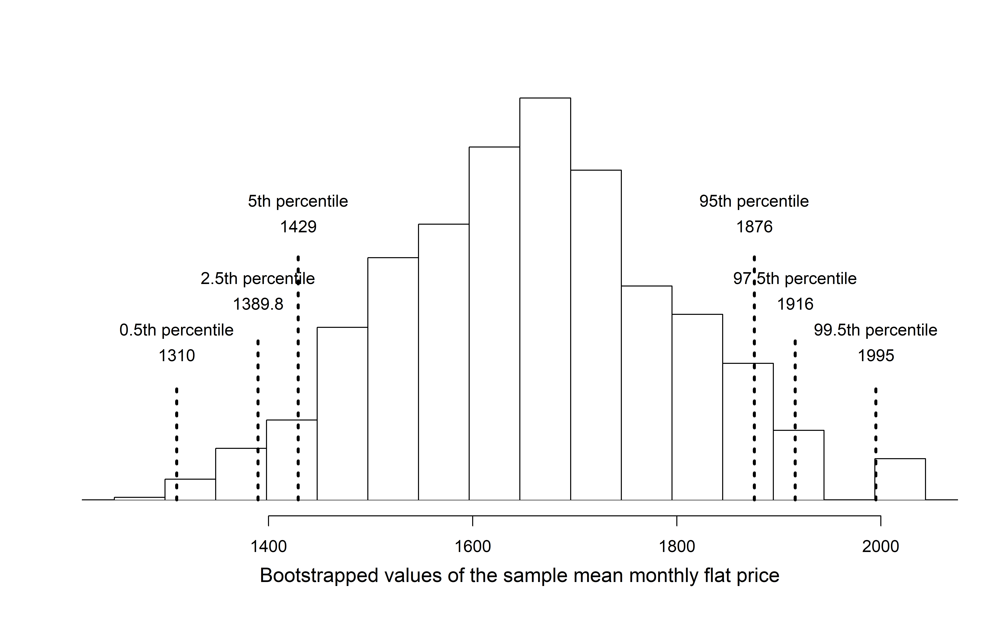
<p class="caption">(\#fig:flatsbsmean)Distribution of bootstrapped means from 1,000 simulated bootstrapped samples generated by sampling with replacement from our original sample of five Edinburgh flats. The histogram provides a sense for the variability of the average rent values from sample to sample for samples of size 5.</p>
</div>

The bootstrapped average rent prices vary from £1250 to £1995 (with a small observed sample of size 5, a bootstrap resample can sometimes, although rarely, include only repeated measurements of the same observation).

::: {.onebox}
**Bootstrapping from one sample.**

1. Take a random sample of size $n$ from the original sample, _with replacement_. This is called a **bootstrapped resample**.
2. Record the sample mean (or statistic of interest) from the bootstrapped resample. This is called a **bootstrapped statistic**.
3. Repeat steps (1) and (2) 1000s of times.
:::

Due to theory that is beyond this text, we know that the bootstrap means $\bar{y}_{boot}$ vary around the original sample mean, $\bar{y}$, in a similar way to how different sample (i.e., different data sets which would produce different $\bar{y}$ values) means vary around the true parameter $\mu$. 
Therefore, an interval estimate for $\mu$ can be produced using the $\bar{y}_{boot}$ values themselves. A 95% **bootstrap confidence interval** for $\mu$, the population mean rent price for three bedroom flats in Edinburgh, is found by locating the middle 95% of the bootstrapped sample means in Figure \@ref(fig:flatsbsmean).


::: {.onebox}
**95% Bootstrap confidence interval for a population mean $\mu$.**

The 95% bootstrap confidence interval for the parameter $\mu$ can be obtained directly using the ordered values $\bar{y}_{boot}$ values --- the bootstrapped sample means. Consider the sorted $\bar{y}_{boot}$ values, and let $\bar{y}_{boot, 0.025}$ be the 2.5^th^ percentile and $\bar{y}_{boot, 0.025}$ be the 97.5^th^ percentile. The 95% confidence interval is given by:
<center>
($\bar{y}_{boot, 0.025}$, $\bar{y}_{boot, 0.975}$)
</center>
:::

You can find confidence intervals of difference confidence levels by changing the percent of the distribution you take, e.g., locate the middle 90% of the bootstrapped statistics for a 90% confidence interval.


::: {.workedexample}
Using Figure \@ref(fig:flatsbsmean), find the 90% and 95% confidence intervals for the true mean monthly rental price of a three bedroom flat in Edinburgh.

---

A 90% confidence interval is given by (£1429, £1876).  The conclusion is that we are 90% confident that the true average rental price for three bedroom flats in Edinburgh lies somewhere between £1429 and £1876.


A 95% confidence interval is given by (£1389.75, £1916).  The conclusion is that we are 95% confident that the true average rental price for three bedroom flats in Edinburgh lies somewhere between £1389.75 and £1916.
:::


### Bootstrap percentile confidence interval for $\sigma$ (special topic)

Suppose that the research question at hand seeks to understand how variable the rental price of the three bedroom flats are in Edinburgh.
That is, your interest is no longer in the average rental price of the flats but in the *standard deviation* of the rental prices of all three bedroom flats in Edinburgh, $\sigma$.
You may have already realized that the sample standard deviation, $s$, will work as a good **point estimate** for the parameter of interest: the population standard deviation, $\sigma$.
The point estimate of the five observations is calculated to be $s =$ £340.23.
While $s =$ £340.23 might be a good guess for $\sigma$, we prefer to have an interval. 
Although there is a mathematical model which describes how $s$ varies from sample to sample, the mathematical model will not be presented in this text.
But even without the mathematical model, bootstrapping can be used to find a confidence interval for the parameter $\sigma$.


::: {.workedexample}
Describe the bootstrap distribution for the standard deviation shown in Figure \@ref(fig:flatsbssd).

---
  
The distribution is skewed left and centered near £340.23, which is the point estimate from the original data. Most observations in this distribution lie between £0 and £408.1.
:::

::: {.guidedpractice}
Using Figure \@ref(fig:flatsbssd), find *and interpret* a 90% confidence interval for the population standard deviation for three bedroom flat prices in Edinburgh.^[By looking at the percentile values in Figure \@ref(fig:flatsbssd), the middle 90% of the bootstrap standard deviations are given by the 5^th^ percentile (£153.9) and 95^th^ percentile (£385.6).  That is, we are 90% confident that the true standard deviation of rent prices is between £153.9 and £385.6; or that, on average, rent prices tend to be somewhere between £153.9 and £385.6 away from the mean rent price. Note, the problem was set up as 90% to indicate that there was not a need for a high level of confidence (such a 95% or 99%).  A lower degree of confidence increases potential for error, but it also produces a more narrow interval.]
:::

<div class="figure" style="text-align: center">
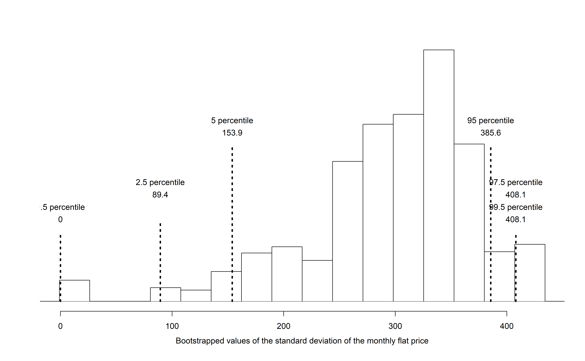
<p class="caption">(\#fig:flatsbssd)The original Edinburgh data is bootstrapped 1,000 times. The histogram provides a sense for the variability of the standard deviation of the rent values from sample to sample.</p>
</div>


### Bootstrapping is not a solution to small sample sizes!

The example presented above is done for a sample with only five observations. 
As with analysis techniques that build on mathematical models, bootstrapping works best when a large random sample has been taken from the population.
Bootstrapping is a method for capturing the variability of a statistic when the mathematical model is unknown --- it is not a method for navigating small samples.
As you might guess, the larger the random sample, the more accurately that sample will represent the target population.


## Shifted bootstrap test for $H_0: \mu = \mu_0$ {#one-mean-null-boot}

We can also use bootstrapping to conduct a simulation-based test of the null hypothesis that the population mean is equal to a specified value, $\mu_0$, called the null value. In this case, we first **shift** each value in the data set so that the sample distribution is centered at $\mu_0$. Then, we bootstrap from the **shifted data** in order to generate a null distribution of sample means. Consider the following example.

In 1851, Carl Wunderlich, a German physician, measured body temperatures of around 25,000 adults and found that the average body temperature was 98.6$^{\circ}$F, which we've believed ever since. However, a recent study conducted at Stanford University suggests that the average body temperature may actually be lower than 98.6$^{\circ}$F.^[Protsiv, Ley,Lankester, Hastie, Parsonnet (2020). Decreasing human body temperature in the United States since the Industrial Revolution. eLife 2020;9:e49555, DOI: 10.7554/eLife.49555. [https://elifesciences.org/articles/49555](https://elifesciences.org/articles/49555)]

### Observed data


Curious if average body temperature has decreased since 1851, you decided to collect data on a random sample of twenty Montana State University students. The mean body temperature in your sample is $\bar{y}$ = 97.47$^{\circ}$F, and the standard deviation is $s$ = 0.35$^{\circ}$F. A dot plot of the data is shown in Figure \@ref(fig:body-temp-hist), with summary statistics displayed below.


``` r
favstats(temperatures)
```

```
#>   min   Q1 median   Q3  max mean    sd  n missing
#>  96.7 97.3   97.5 97.7 98.1 97.5 0.353 20       0
```

<div class="figure" style="text-align: center">
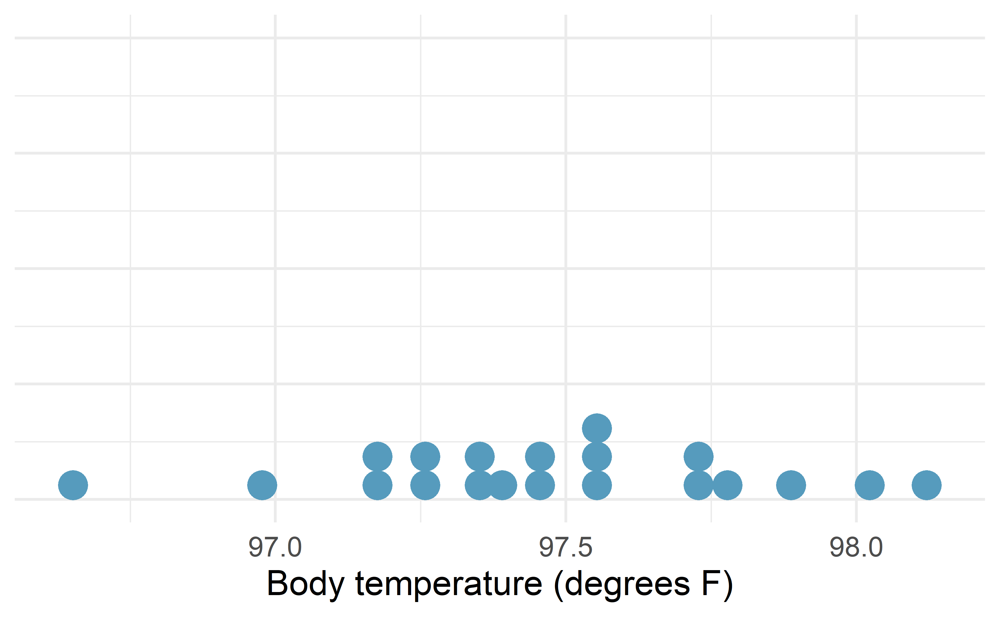
<p class="caption">(\#fig:body-temp-hist)Distribution of body temperatures in a random sample of twenty Montana State University students.</p>
</div>

### Shifted bootstrapped null distribution

We would like to test the set of hypotheses $H_0: \mu = 98.6$ versus $H_A: \mu < 98.6$, where $\mu$ is the true mean body temperature among all adults (in degrees F). If we were to simulate sample mean body temperatures under $H_0$, we would expect the null distribution to be centered at $\mu_0$ = 98.6$^\circ$F. However, if we bootstrap sample means from our observed sample, the bootstrap distribution will be centered at the sample mean body temperature $\bar{y}$ = 97.5$^\circ$F.

To use bootstrapping to generate a null distribution of sample means, we first have to **shift the data** to be centered at the null value. We do this by adding $\mu_0 - \bar{y} = 98.6 - 97.5 = 1.1^\circ$F to each body temperature in the sample. This process is displayed in Figure \@ref(fig:shift-boot-dat).

<div class="figure" style="text-align: center">
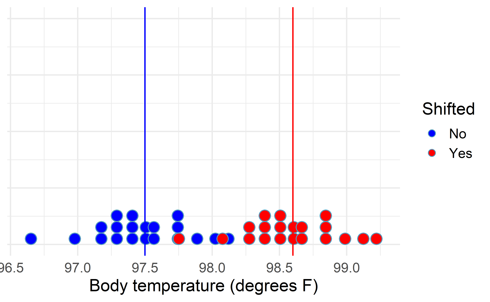
<p class="caption">(\#fig:shift-boot-dat)Distribution of body temperatures in a random sample of twenty Montana State University students (blue) and the shifted body temperatures (red), found by adding 1.1 degree F to each original body temperature.</p>
</div>

A bootstrapped null distribution generated from sampling 20 shifted temperatures, with replacement, from the shifted data 1,000 times is shown in Figure \@ref(fig:shifted-boot-null).

<div class="figure" style="text-align: center">
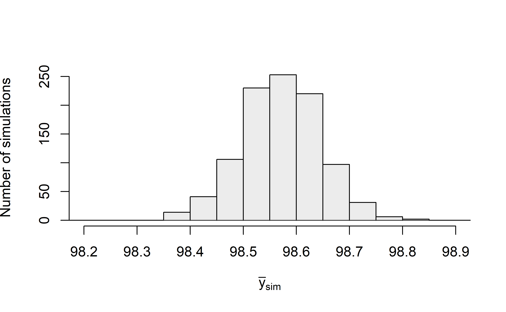
<p class="caption">(\#fig:shifted-boot-null)Bootstrapped null distribution of sample mean temperatures assuming the true mean temperature is 98.6 degrees F.</p>
</div>

::: {.onebox}
**Shifted bootstrap null distribution for a sample mean.**

To simulate a null distribution of sample means under the null hypothesis $H_0: \mu = \mu_0$:

1. Add $\mu_0 - \bar{y}$ to each value in the original sample: 
  \[
    y_1 + \mu_0 - \bar{y}, \hspace{2.5mm} y_2 + \mu_0 - \bar{y}, \hspace{2.5mm}  y_3 + \mu_0 - \bar{y}, \hspace{2.5mm}  \ldots, \hspace{2.5mm}  y_n + \mu_0 - \bar{y}.
  \]
  Note that if $\bar{y}$ is larger than $\mu$, then the quantity $\mu_0 - \bar{y}$ will be negative, and you will be _subtracting_ the distance between $\mu$ and $\bar{y}$ from each value.
2. Generate 1000s of bootstrap resamples from this shifted distribution, plotting the shifted bootstrap sample mean each time.
:::

To calculate the p-value, since $H_A: \mu < 98.6$, we find the proportion of simulated sample means that were less than or equal to our original sample mean, $\bar{y}$ = 97.47. As shown in Figure \@ref(fig:shifted-boot-null), none of our simulated sample means were 97.5$^\circ$F or lower, giving us very strong evidence that the true mean body temperature among all Montana State University students is less than the commonly accepted 98.6$^\circ$F average temperature.

## Theory-based inferential methods for $\mu$ {#one-mean-math}

As with the sample proportion, the variability of the sample mean is well described by the mathematical theory given by the Central Limit Theorem.  Similar to how we can model the behavior of the sample proportion $\hat{p}$ using a normal distribution, the sample mean $\bar{y}$ can also be modeled using
a normal distribution when certain conditions are met.
However, because of missing information about the inherent variability in the population, a $t$-distribution is used in place of the standard normal when performing hypothesis test or confidence interval analyses.

::: {.onebox}
**Central Limit Theorem for the sample mean.**  
  When we collect a sufficiently large sample of
  $n$ independent observations from a population with
  mean $\mu$ and standard deviation $\sigma$,
  the sampling distribution of $\bar{y}$ will be nearly
  normal with
  \begin{align*}
  &\text{Mean}=\mu
  &&\text{Standard Deviation }(SD) = \frac{\sigma}{\sqrt{n}}
  \end{align*}
:::


Before diving into confidence intervals and hypothesis
tests using $\bar{y}$, we first need to cover two topics:

* When we modeled $\hat{p}$ using the normal distribution,
    certain conditions had to be satisfied.
    The conditions for working with $\bar{y}$
    are a little more complex, and below, we will discuss
    how to check conditions for inference using a mathematical model.
* The standard deviation of the sample mean is dependent on the population
    standard deviation, $\sigma$.
    However, we rarely know $\sigma$, and instead
    we must estimate it.
    Because this estimation is itself imperfect,
    we use a new distribution called the
    **$t$-distribution**\index{t-distribution@$t$-distribution}
    to fix this problem.


### Evaluating the two conditions required for modeling $\bar{y}$ using theory-based methods

There are two conditions required to apply the
Central Limit Theorem\index{Central Limit Theorem}
for a sample mean $\bar{y}$.
When the sample observations
are independent and the sample size is sufficiently
large, the normal model will describe the variability in sample means quite well; when the observations violate the conditions, the normal model can be inaccurate.

::: {.onebox}
**Conditions for the modeling
    $\bar{y}$  using theory-based methods.**  

  The sampling distribution for $\bar{y}$ based on
  a sample of size $n$ from a population with a true
  mean $\mu$ and true standard deviation $\sigma$ can be modeled
  using a normal distribution when:

1. **Independence.** The sample observations must be independent,
    The most common way to satisfy this condition is
    when the sample is a simple random sample from the
    population and to not have any suggestions of groups or clusters that systematically vary in the responses.
    If the data come from a random process,
    analogous to rolling a die,
    this would also satisfy the independence condition.  
    
2. **Normality.** When a sample is small,
    we also require that the sample observations
    come from a normally distributed population.
    We can relax this condition more and more
    for larger and larger sample sizes.
    This condition is obviously vague,
    making it difficult to evaluate,
    so next we introduce a couple rules of thumb
    to make checking this condition easier.
    
      When these conditions are satisfied, then the sampling
  distribution of $\bar{y}$ is approximately normal with mean
  $\mu$ and standard deviation $\frac{\sigma}{\sqrt{n}}$.
:::

::: {.importantbox}
**General rule: how to perform the normality check.**
  
  There is no perfect way to check the normality condition,
  so instead we use the following general rules: 

* $\mathbf{n < 30}$: If the sample size $n$ is less than 30
      and there are no clear outliers in the data,
      then we typically assume the data come from
      a nearly normal distribution to satisfy the
      condition.  
* $\mathbf{n \geq 30}$: If the sample size $n$ is at least 30
      and there are no *particularly extreme* outliers,
      then we typically assume the sampling distribution
      of $\bar{y}$ is nearly normal, even if the underlying
      distribution of individual observations is not.
* $\mathbf{n > 100}$: If the sample size $n$ is at least 100
      (regardless of the presence of skew or outliers), 
      we typically assume the sampling distribution
      of $\bar{y}$ is nearly normal, even if the underlying
      distribution of individual observations is not.
:::


In this first course in statistics, you aren't expected
to develop perfect judgement on the normality condition.
However, you are expected to be able to handle
clear cut cases based on the rules of thumb above.


::: {.example}
Consider the following two plots
    that come from simple random samples from
    different populations.
    Their sample sizes are $n_1 = 15$ and $n_2 = 50$.

Are the independence and normality conditions met
    in each case?

---
      
Each sample is from a simple random sample of its
  respective population and no further information suggests a violation, so the independence condition
  is satisfied.
  Let's next check the normality condition for
  each using the rule of thumb.
  
  The first sample has fewer than 30 observations,
  so we are watching for any clear outliers.
  None are present; while there is a small gap in the
  histogram on the right, this gap is small and
  20% of the observations in this small sample
  are represented in that far right bar of the histogram,
  so we can hardly call these clear outliers.
  With no clear outliers, the normality condition
  is reasonably met.

  The second sample has a sample size greater than 30 and
  includes an outlier that appears to be roughly 5 times
  further from the center of the distribution than the
  next furthest observation.
  This is an example of a particularly extreme outlier,
  so the normality condition would not be satisfied.
:::

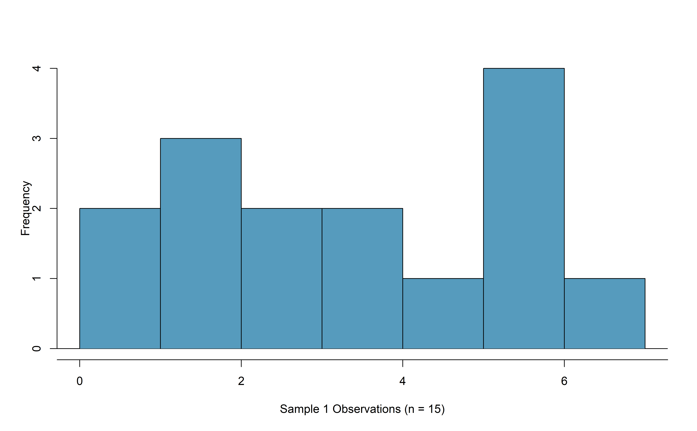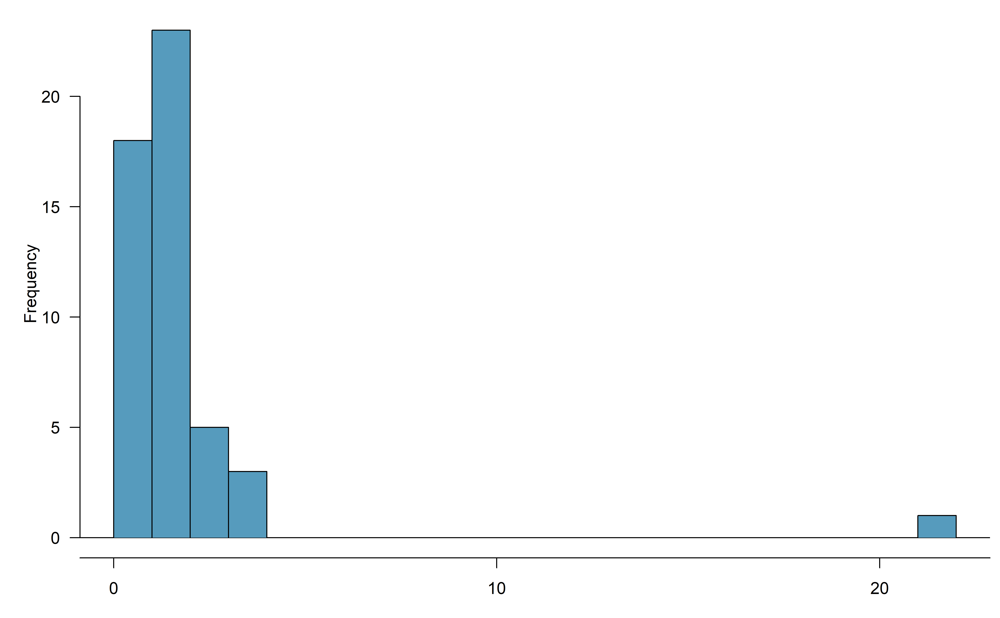


In practice, it's typical to also do a mental check to evaluate
whether we have reason to believe the underlying population
would have moderate skew (if $n < 30$)
or have particularly extreme outliers $(n \geq 30)$
beyond what we observe in the data.
For example, consider the number of followers
for each individual account on Twitter,
and then imagine this distribution.
The large majority of accounts have built up
a couple thousand followers or fewer,
while a relatively tiny fraction have amassed
tens of millions of followers,
meaning the distribution is extremely skewed.
When we know the data come from such an extremely
skewed distribution,
it takes some effort to understand what sample
size is large enough for the normality condition
to be satisfied.


\index{Central Limit Theorem!normal data|)}


### Introducing the $t$-distribution

\index{t-distribution@$t$-distribution|(}
\index{distribution!t@$t$|(}

In practice, we cannot directly calculate the standard deviation
for $\bar{y}$ since we do not know the population standard
deviation, $\sigma$.
We encountered a similar issue when computing the standard
error for a sample proportion, which relied on the population
proportion, $\pi$.
Our solution in the proportion context was to use sample
value in place
of the population value to calculate a standard error.
We'll employ a similar strategy to compute the standard
error of $\bar{y}$, using the sample
standard deviation $s$ in place of $\sigma$:
\begin{align*}
SE(\bar{y}) = \frac{s}{\sqrt{n}} \approx SD(\bar{y}) = \frac{\sigma}{\sqrt{n}}.
\end{align*}
The standard error of $\bar{y}$ provides an estimate of the standard deviation of $\bar{y}$. This strategy tends to work well when we have
a lot of data and can estimate $\sigma$ using $s$ accurately.
However, the estimate is less precise with smaller samples,
and this leads to problems when using the normal
distribution to model $\bar{y}$ if we do not know $\sigma$.

We'll find it useful to use a new distribution for
inference calculations called the **$t$-distribution**.
A $t$-distribution, shown as a solid line in
Figure \@ref(fig:tDistCompareToNormalDist), has a bell shape.
However, its tails are thicker than the normal distribution's,
meaning observations are more likely to fall beyond two
standard deviations from the mean than under the normal
distribution. 

The extra thick tails of the $t$-distribution are exactly
the correction needed to resolve the problem (due to extra variability of the test statistic) of using $s$
in place of $\sigma$ in the $SE(\bar{y})$ calculation.


<div class="figure" style="text-align: center">
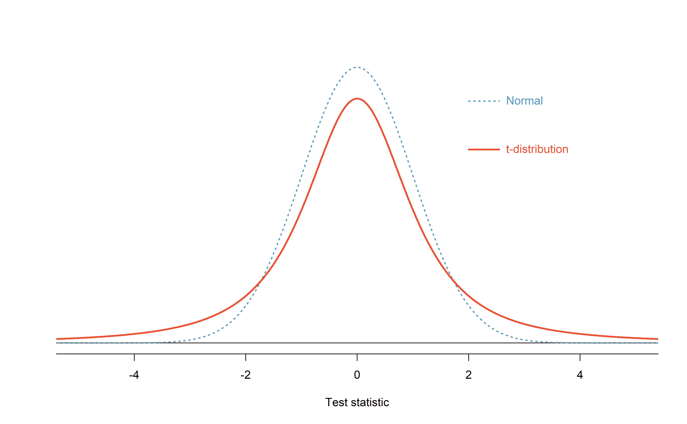
<p class="caption">(\#fig:tDistCompareToNormalDist)Comparison of a $t$-distribution and a normal distribution.</p>
</div>


The $t$-distribution is always centered at zero and
has a single parameter: degrees of freedom ($df$).
The **degrees of freedom** 
describes the precise form of the bell-shaped $t$-distribution.
Several $t$-distributions are shown in
Figure \@ref(fig:tDistConvergeToNormalDist)
in comparison to the normal distribution.

\termsub{degrees of freedom ($\pmb{df}$)}{degrees of freedom ($df$)!$t$-distribution}
    
For inference with a single mean, we'll use a $t$-distribution
with $df = n - 1$ to model the sample mean
when the sample size is $n$.
That is, when we have more observations,
the degrees of freedom will be larger and
the $t$-distribution will look more like the
standard normal distribution;
when the degrees of freedom is about 30 or more,
the $t$-distribution is nearly indistinguishable
from the normal distribution.


<div class="figure" style="text-align: center">
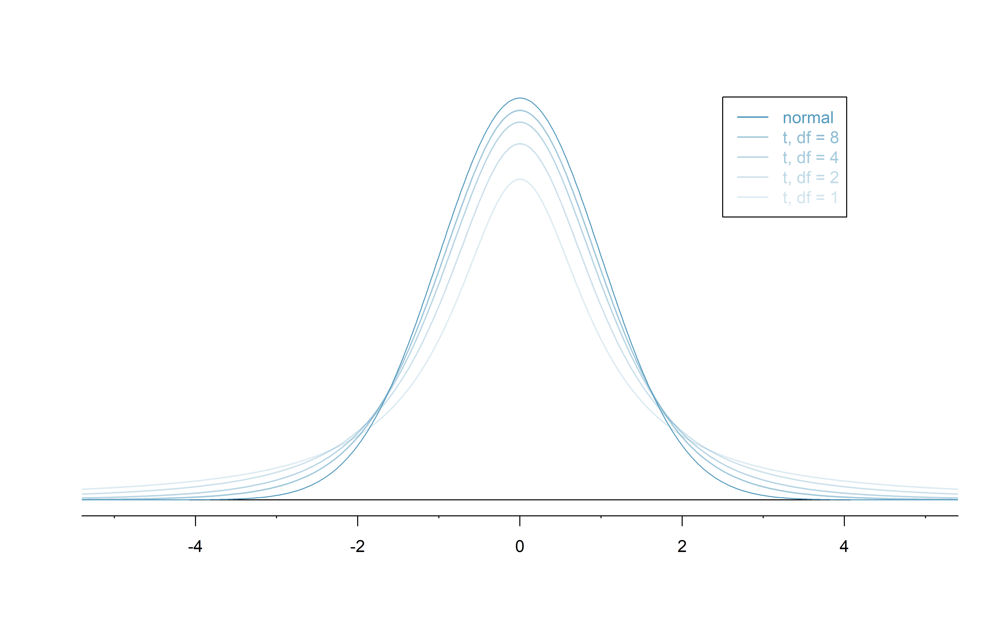
<p class="caption">(\#fig:tDistConvergeToNormalDist)The larger the degrees of freedom, the more closely the $t$-distribution resembles the standard normal distribution.</p>
</div>


::: {.onebox}
**Degrees of freedom: $df$.**
  
  The degrees of freedom describes the shape of the
  $t$-distribution.
  The larger the degrees of freedom, the more closely
  the distribution approximates the normal model. 
  
  When modeling $\bar{y}$ using the $t$-distribution,
  use $df = n - 1$.
::: 


The $t$-distribution allows us greater flexibility than
the normal distribution when analyzing numerical data.
In practice, it's common to use statistical software,
such as R, Python, or SAS for these analyses.
In R, the function used for calculating probabilities under a $t$-distribution is `pt()` (which should seem similar to the previous R function `pnorm()`).
Don't forget that with the $t$-distribution, the degrees of freedom must always be specified!

<!--
Alternatively, a graphing calculator or a
\termsub{$\pmb{t}$-table}{t-table@$t$-table} may be used;
the $t$-table is similar to the normal distribution table,
and it may be found in Appendix \ref{tDistributionTable},
which includes usage instructions and examples
for those who wish to use this option.
-->
For the examples and guided practices below, use R to find the answers.  We recommend trying the problems so as to get a sense for how the $t$-distribution can vary in width depending on the degrees of freedom, and to confirm your working
understanding of the $t$-distribution.

::: {.example}
What proportion of the $t$-distribution
    with 18 degrees of freedom falls below -2.10?
      
---
      
Just like a normal probability problem, we first draw
  the picture in Figure \@ref(fig:tDistDF18LeftTail2Point10)
  and shade the area below -2.10.


  Using statistical software, we can obtain a precise
  value: 0.0250.
:::


``` r
# using pt() to find probability under the $t$-distribution
pt(-2.10, df = 18)
#> [1] 0.025
```

<div class="figure" style="text-align: center">
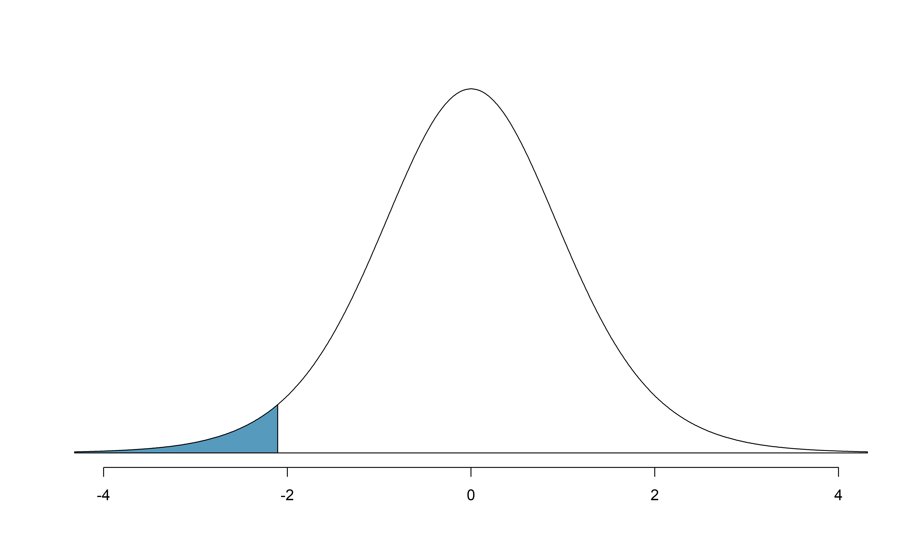
<p class="caption">(\#fig:tDistDF18LeftTail2Point10)The $t$-distribution with 18 degrees of freedom. The area below -2.10 has been shaded.</p>
</div>


::: {.example}
A $t$-distribution with 20 degrees of freedom
    is shown in the top panel of
    Figure \@ref(fig:tDistDF20RightTail1Point65).
    Estimate the proportion of the distribution falling
    above 1.65.
    
---

  Note that with 20 degrees of freedom, the $t$-distribution is relatively close to the normal distribution.
    With a normal distribution, this would correspond to
  about 0.05, so we should expect the $t$-distribution
  to give us a value in this neighborhood.
  Using statistical software: 0.0573.
:::


``` r
# using pt() to find probability under the $t$-distribution
pt(1.65, df = 20, lower.tail=FALSE)
#> [1] 0.0573
# or
1 - pt(1.65, df = 20)
#> [1] 0.0573
```

<div class="figure" style="text-align: center">
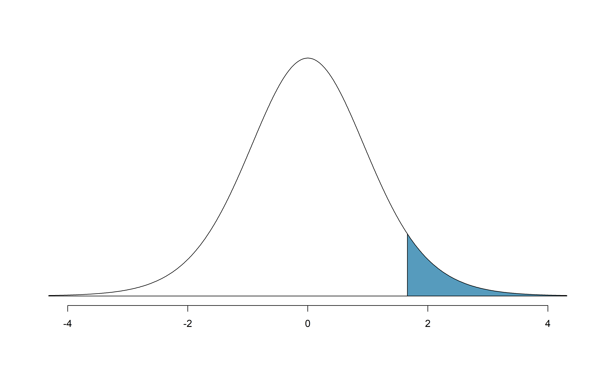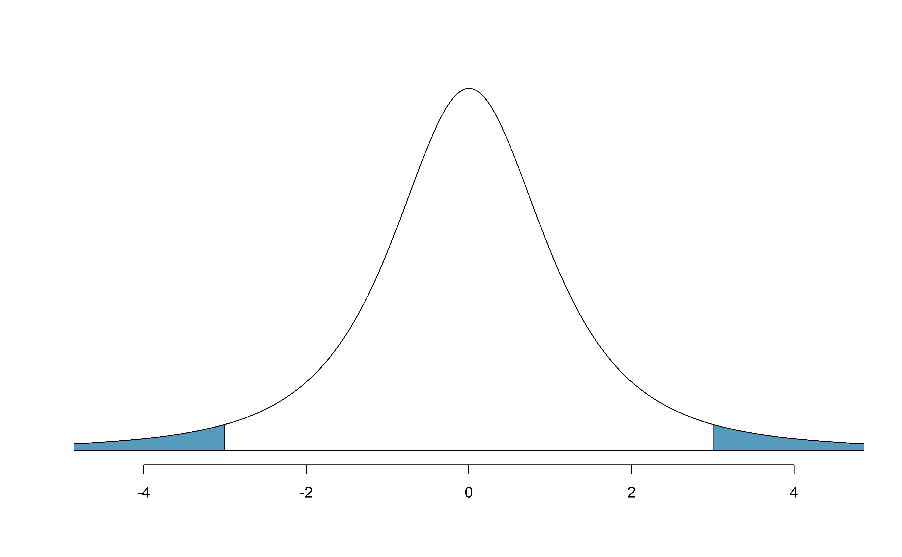
<p class="caption">(\#fig:tDistDF20RightTail1Point65)Top: The $t$-distribution with 20 degrees of freedom, with the area above 1.65 shaded. Bottom: The $t$-distribution with 2 degrees of freedom, with the area further than 3 units from 0 shaded.</p>
</div>

::: {.example}
A $t$-distribution with 2 degrees of freedom
    is shown in the bottom panel of
    Figure \@ref(fig:tDistDF20RightTail1Point65).
    Estimate the proportion of the distribution falling more
    than 3 units from the mean (above or below).
    
---

With so few degrees of freedom, the $t$-distribution will
  give a more notably different value than the normal
  distribution.
  Under a normal distribution, the area would be about
  0.003 using the 68-95-99.7 rule.
  For a $t$-distribution with $df = 2$, the area in both
  tails beyond 3 units totals 0.0955.
  This area is dramatically different than what
  we obtain from the normal distribution.
:::


``` r
# using pt() to find probability under the $t$-distribution
2 * pt(-3, df = 2)
#> [1] 0.0955
```

::: {.guidedpractice}
What proportion of the $t$-distribution with 19 degrees
of freedom falls above -1.79 units?^[We want to find the shaded area *above* -1.79 (we leave the picture to you). The lower tail area has an area of 0.0447, so the upper area would have an area of $1 - 0.0447 = 0.9553$.]
::: 

\index{distribution!t@$t$|)}
\index{t-distribution@$t$-distribution|)}


### One sample $t$-confidence intervals

\index{data!dolphins and mercury|(}

Let's get our first taste of applying the $t$-distribution
in the context of an example about the mercury content
of dolphin muscle.
Elevated mercury concentrations are an important problem
for both dolphins
and other animals, like humans, who occasionally eat them.


<div class="figure" style="text-align: center">

<p class="caption">(\#fig:rissosDolphin)A Risso's dolphin. Photo by Mike Baird, www.bairdphotos.com.</p>
</div>

#### Observed data {-}

We will identify a confidence interval for the average mercury content in dolphin muscle using a sample of 19 Risso's dolphins from the Taiji area in Japan. The data are summarized in Table \@ref(tab:summaryStatsOfHgInMuscleOfRissosDolphins). The minimum and maximum observed values can be used to evaluate whether or not there are clear outliers.


<table class="table" style="margin-left: auto; margin-right: auto;">
<caption>(\#tab:summaryStatsOfHgInMuscleOfRissosDolphins)Summary of mercury content in the muscle of 19 Risso's dolphins from the Taiji area. Measurements are in micrograms of mercury per wet gram
    of muscle ($\mu$g/wet g).</caption>
 <thead>
  <tr>
   <th style="text-align:right;"> $n$ </th>
   <th style="text-align:right;"> $\bar{y}$ </th>
   <th style="text-align:right;"> $s$ </th>
   <th style="text-align:right;"> minimum </th>
   <th style="text-align:right;"> maximum </th>
  </tr>
 </thead>
<tbody>
  <tr>
   <td style="text-align:right;"> 19 </td>
   <td style="text-align:right;"> 4.4 </td>
   <td style="text-align:right;"> 2.3 </td>
   <td style="text-align:right;"> 1.7 </td>
   <td style="text-align:right;"> 9.2 </td>
  </tr>
</tbody>
</table>


::: {.example}
Are the independence and
    normality conditions satisfied for this data set?
      
---
      
The observations are assumed to be a simple random sample and we do not have information dependencies that suggest a violation (such as sibling dolphins or different groups of sampling locations or dates that might relate to non-independent responses),
  therefore independence is reasonable.
  The summary statistics in
  Table \@ref(tab:summaryStatsOfHgInMuscleOfRissosDolphins)
  do not suggest any clear outliers, with
  all observations within 2.5 standard deviations
  of the mean.
  Based on this evidence, the normality condition
  seems reasonable.
:::

In the normal model, we used $z^{\star}$ and the standard error to determine the width of a confidence interval. We revise the confidence interval formula slightly when using the $t$-distribution:
\begin{align*}
&\text{point estimate} \ \pm\  t^{\star}_{df} \times SE(\text{point estimate})
&&\to
&&\bar{y} \ \pm\  t^{\star}_{df} \times \frac{s}{\sqrt{n}},
\end{align*}
where $df = n - 1$ when computing a one-sample $t$-interval.

::: {.example}
Using the summary statistics in
    Table \@ref(tab:summaryStatsOfHgInMuscleOfRissosDolphins),
    compute the standard error for the average
    mercury content in the $n = 19$ dolphins.
    
---
      
We plug in $s$ and $n$ into the formula:
  $SE(\bar{y})
    = s / \sqrt{n}
    = 2.3 / \sqrt{19}
    = 0.528$.
:::

The value $t^{\star}_{df}$ is a cutoff we obtain based on the
confidence level and the $t$-distribution with $df$ degrees
of freedom.
That cutoff is found in the same way as with a normal
distribution: we find $t^{\star}_{df}$ such that
the fraction of the $t$-distribution with $df$ degrees
of freedom within a distance $t^{\star}_{df}$
of 0 matches the confidence level of interest.

::: {.example}

When $n = 19$, what is the appropriate
    degrees of freedom?
    Find $t^{\star}_{df}$ for this degrees of freedom
    and the confidence level of 95%.
    
---
  
The degrees of freedom is easy to calculate:
  $df = n - 1 = 18$.
  
  Using statistical software, we find the cutoff where
  the upper tail is equal to 2.5%:
  $t^{\star}_{18} =$ 2.10.
  The area below -2.10 will also be equal to 2.5%.
  That is, 95% of the $t$-distribution with $df = 18$
  lies within 2.10 units of 0.
:::


``` r
# use qt() to find the t-cutoff (with 95% in the middle)
qt(0.025, df = 18)
#> [1] -2.1
qt(0.975, df = 18)
#> [1] 2.1
```


::: {.example}
Compute and interpret the 95% confidence interval
    for the average mercury content in Risso's dolphins.
    
---

We can construct the confidence interval as
  \begin{align*}
  \bar{y} \ \pm\  t^{\star}_{18} \times SE(\bar{y})
    \quad \to \quad 4.4 \ \pm\  2.10 \times 0.528
    \quad \to \quad (3.29, 5.51)
  \end{align*}
  We are 95% confident the average mercury content of muscles
  in the population of Risso's dolphins is between 3.29 and 5.51 $\mu$g/wet gram,
  which is considered extremely high.
:::

\index{data!dolphins and mercury|)}

::: {.onebox}
**Finding a $t$-confidence interval for a population mean, $\mu$.**
  
  Based on a sample of $n$ independent and nearly normal
  observations, a confidence interval for the population
  mean is
  \begin{align*}
  \text{point estimate} \ &\pm\&  t^{\star}_{df} \times SE(\text{point estimate})\\
  \bar{y} \ &\pm\&  t^{\star}_{df} \times \frac{s}{\sqrt{n}}
  \end{align*}
  where $\bar{y}$ is the sample mean, $t^{\star}_{df}$
  corresponds to the confidence level and degrees of freedom
  $df$, and $SE$ is the standard error as estimated by
  the sample.
::: 

::: {.guidedpractice}
The FDA's webpage provides some data on mercury content of fish. 
Based on a sample of 15 croaker white fish (Pacific), a sample mean and standard deviation were computed as 0.287 and 0.069 ppm (parts per million), respectively. 
The 15 observations ranged from 0.18 to 0.41 ppm. We will assume these observations are independent. 
Based on the summary statistics of the data, do you have any objections to the normality condition of the individual observations?^[The sample size is under 30, so we check for obvious outliers: since all observations are within 2 standard deviations of the mean, there are no such clear outliers.]
::: 


\index{data!white fish and mercury|(}


::: {.example}
Calculate the standard error of
    $\bar{y}$ using the data summaries in the previous Guided Practice. If we are to use the $t$-distribution to create a
    90% confidence interval for the actual mean of the
    mercury content, identify the degrees of freedom
    and $t^{\star}_{df}$.
  
---
      
The standard error: $SE(\bar{y}) = \frac{0.069}{\sqrt{15}} = 0.0178$.

  Degrees of freedom: $df = n - 1 = 14$.

  Since the goal is a 90% confidence interval,
  we choose $t_{14}^{\star}$ so that the two-tail area
  is 0.1:
  $t^{\star}_{14} = 1.76$.
:::


``` r
# use qt() to find the t-cutoff (with 90% in the middle)
qt(0.05, df = 14)
#> [1] -1.76
qt(0.95, df = 14)
#> [1] 1.76
```

<!--
\begin{important}{Confidence interval for a single mean}
  Once you've determined a one-mean confidence interval
  would be helpful for an application,
  there are four steps to constructing the interval:
  \begin{description}
  \item[Prepare.]
      Identify $\bar{y}$, $s$, $n$, and determine what
      confidence level you wish to use.
  \item[Check.]
      Verify the conditions to ensure $\bar{y}$
      is nearly normal.
  \item[Calculate.]
      If the conditions hold, compute $SE$,
      find $t_{df}^{\star}$, and construct the interval.
  \item[Conclude.]
      Interpret the confidence interval in the context
      of the problem.
  \end{description}
\end{important}
-->


::: {.guidedpractice}
Using the information and results of the previous Guided Practice and Example, compute a 90% confidence interval for the average mercury content of croaker white fish (Pacific).^[$\bar{y} \ \pm\ t^{\star}_{14} \times SE(\bar{y})
      \ \to\  0.287 \ \pm\  1.76 \times 0.0178
      \ \to\ (0.256, 0.318)$.
  We are 90% confident that the average mercury content
  of croaker white fish (Pacific) is between 0.256 and 0.318 ppm.]
::: 


::: {.guidedpractice}
The 90% confidence interval from the previous
Guided Practice is 0.256 ppm to 0.318 ppm.
Can we say that 90% of croaker white fish (Pacific)
have mercury levels between 0.256 and 0.318 ppm?^[No, a confidence interval only provides a range
  of plausible values for a population parameter,
  in this case the population _mean_.
  It does not describe what we might observe
  for _individual_ observations.]
::: 

\index{data!white fish and mercury|)}

### One sample $t$-tests

Now that we've used the $t$-distribution for making a confidence
intervals for a mean, let's speed on through to
hypothesis tests for the mean.


::: {.onebox}
**The test statistic for assessing a single mean is a T.**
  
The **T score** is a ratio of how the sample mean differs from the hypothesized mean as compared to how the observations vary.
  
\begin{align*}
T = \frac{\bar{y} - \mbox{null value}}{s/\sqrt{n}}
\end{align*}

When the null hypothesis is true and the conditions are met, T has a $t$-distribution with $df = n - 1$.

Conditions:   
  
  * independently observed data    
  * large enough sample to satisfy normality   
::: 

<!--
\newcommand{\cherryblossomn}{100}
\newcommand{\cherryblossommean}{97.32}
\newcommand{\cherryblossomnull}{93.29}
\newcommand{\cherryblossomsd}{16.98}
\newcommand{\cherryblossomse}{1.70}
\newcommand{\cherryblossomz}{2.37}
-->
::: {.guidedpractice}
Compare the T score --- the standardized sample mean --- to the Z score --- the standardized sample proportion --- presented in Section \@ref(theory-prop). Why do we use a "Z" when standardizing proportions, but a "T" when standardizing means?^[The letter "Z" is typically used when its distribution follows a standard normal distribution. We use "T" when the test statistic follows a $t$-distribution.]
::: 

Is the typical US runner getting faster or slower over time? We consider this question in the context of the Cherry Blossom Race, which is a 10-mile race in Washington, DC each spring.

The average time for all runners who finished the Cherry Blossom Race in 2006 was 93.29 minutes (93 minutes and about 17 seconds). We want to determine using data from 100 participants in the 2017 Cherry Blossom Race whether runners in this race are getting faster or slower, versus the other possibility that there has been no change.

::: {.guidedpractice}
What are appropriate hypotheses for this context?^[$H_0$: The average 10-mile run time was the same for 2006 and 2017. $\mu = 93.29$ minutes. $H_A$: The average 10-mile run time for 2017 was *different* than that of 2006. $\mu \neq 93.29$ minutes.]
::: 

::: {.guidedpractice}
The data come from a simple random sample of all participants and we would not expect results for one subject to be related to others, so the observations can be assumed to be independent.
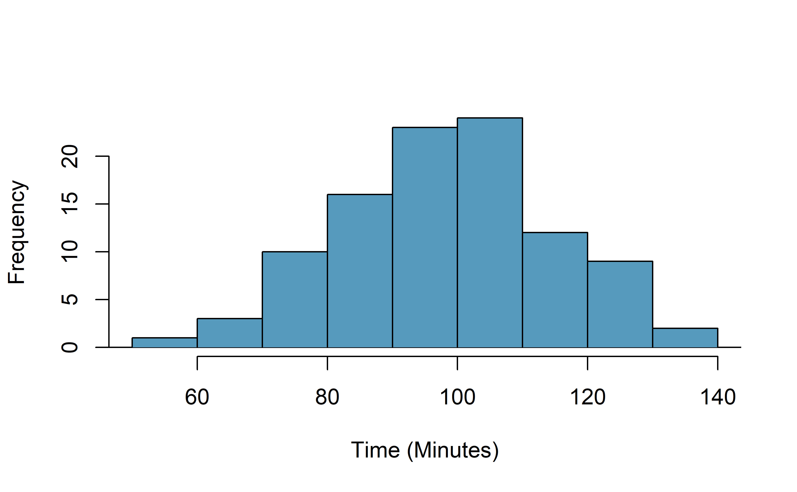
A histogram of the race times is given to evaluate if we can move forward with a t-test. Should we be worried about the normality condition?^[With a sample of 100, we should only be concerned if there is are particularly extreme outliers. The histogram of the data doesn't show any outliers of concern (and arguably, no outliers at all).]
::: 


When completing a hypothesis test for the one-sample mean,
the process is nearly identical to completing a hypothesis
test for a single proportion.
First, we find the Z score using the observed value,
null value, and standard error;
however, we call it a **T score** since we use
a $t$-distribution for calculating the tail area.
Then we find the p-value using the same ideas we used
previously: find the area under the $t$-distribution as or more extreme than our T score.


::: {.example}
With both the independence
    and normality conditions satisfied,
    we can proceed with a hypothesis test using
    the $t$-distribution.
    The sample mean and sample standard deviation
    of the sample
    of 100 runners from the
    2017 Cherry Blossom Race
    are 97.32 and 16.98 minutes,
    respectively.
    Recall that the sample size is 100
    and the average run time in 2006 was 93.29 minutes.
    Find the test statistic and p-value.
    What is your conclusion?

---
  
The hypotheses, found in a previous Guided Practice, are:

$H_0: \mu = 93.29$ minutes

$H_A: \mu \neq 93.29$ minutes

To find the test statistic (T score),
  we first must determine the standard error:
  \begin{align*}
  SE(\bar{y})
    = 16.98 / \sqrt{100}
    = 1.70
  \end{align*}
  Now we can compute the T score
  using the sample mean (97.32),
  null value (98.29), and $SE$:
  \begin{align*}
  T
    = \frac{97.32 - 93.29}{1.70}
    = 2.37
  \end{align*}
  For $df = 100 - 1 = 99$,
  we can determine using statistical software
  that the area under a $t$-distribution with 99 $df$ that is above
  our observed T score of 2.37 is 0.01  (see below),
  which we double to get the p-value: 0.02.

  Because the p-value is small,
  the data provide strong evidence that the average
  run time for the Cherry Blossom Run in 2017 is different
  than the 2006 average.
:::


``` r
# using pt() to find the p-value
1 - pt(2.37, df = 99)
#> [1] 0.00986
```


::: {.protip}
**When using a $t$-distribution, we use a T score (similar to a Z score).**

To help us remember to use the $t$-distribution,
we use a $T$ to represent the test statistic,
and we often call this a T score.
The Z score and T score are computed in the exact same way
and are conceptually identical:
each represents how many standard errors the observed value
is from the null value.
::: 


## Chapter review {#chp17-review}

<!-- ### Summary {-} -->

<!-- ::: {.underconstruction} -->
<!-- TODO -->
<!-- ::: -->

### Terms {-}

We introduced the following terms in the chapter. If you're not sure what some of these terms mean, we recommend you go back in the text and review their definitions. We are purposefully presenting them in alphabetical order, instead of in order of appearance, so they will be a little more challenging to locate. However you should be able to easily spot them as **bolded text**.

<table class="table table-striped table-condensed" style="margin-left: auto; margin-right: auto;">
<tbody>
  <tr>
   <td style="text-align:left;"> bootstrapping </td>
   <td style="text-align:left;"> degrees of freedom </td>
   <td style="text-align:left;"> t-distribution </td>
  </tr>
  <tr>
   <td style="text-align:left;"> Central Limit Theorem </td>
   <td style="text-align:left;"> point estimate </td>
   <td style="text-align:left;"> T score </td>
  </tr>
</tbody>
</table>


<!-- ### Key ideas {-} -->

<!-- ::: {.underconstruction} -->
<!-- TODO -->
<!-- ::: -->


