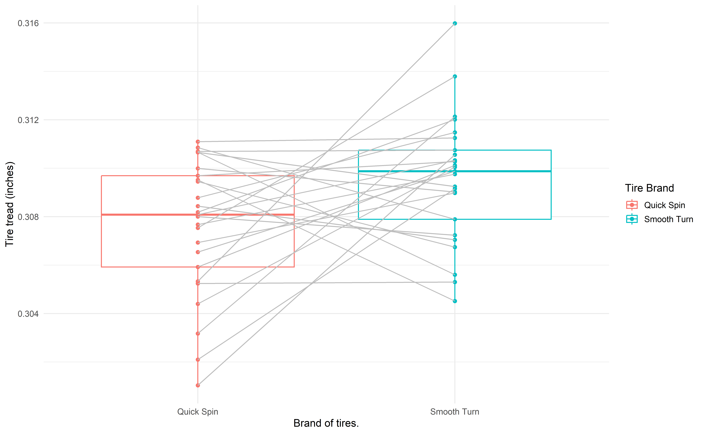
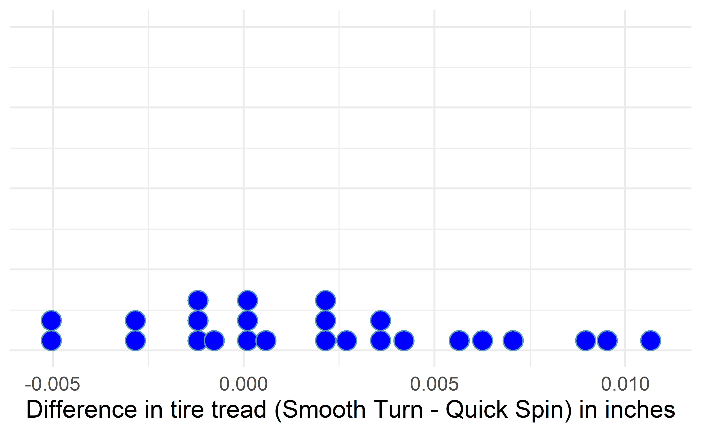
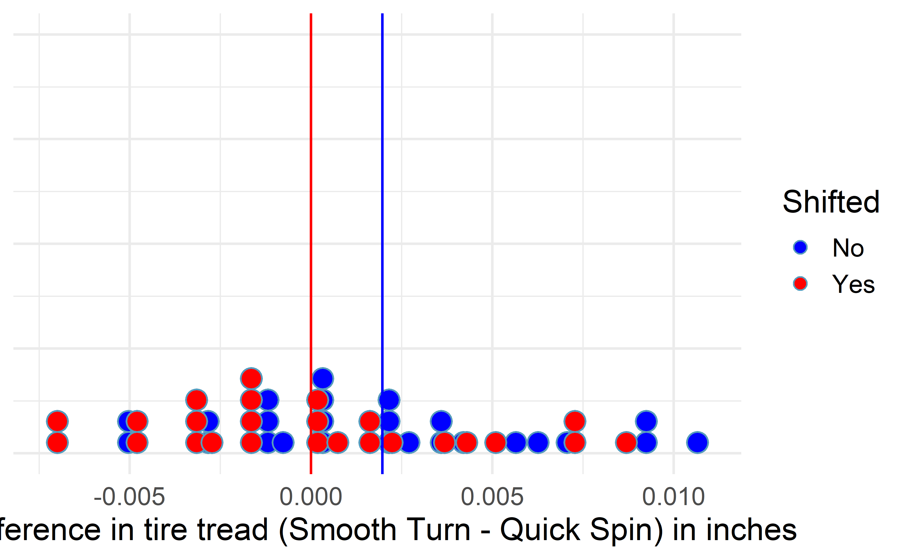
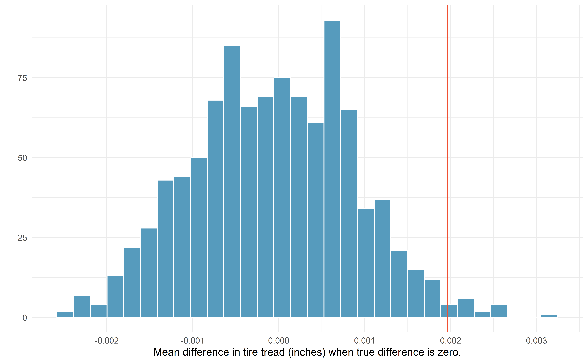
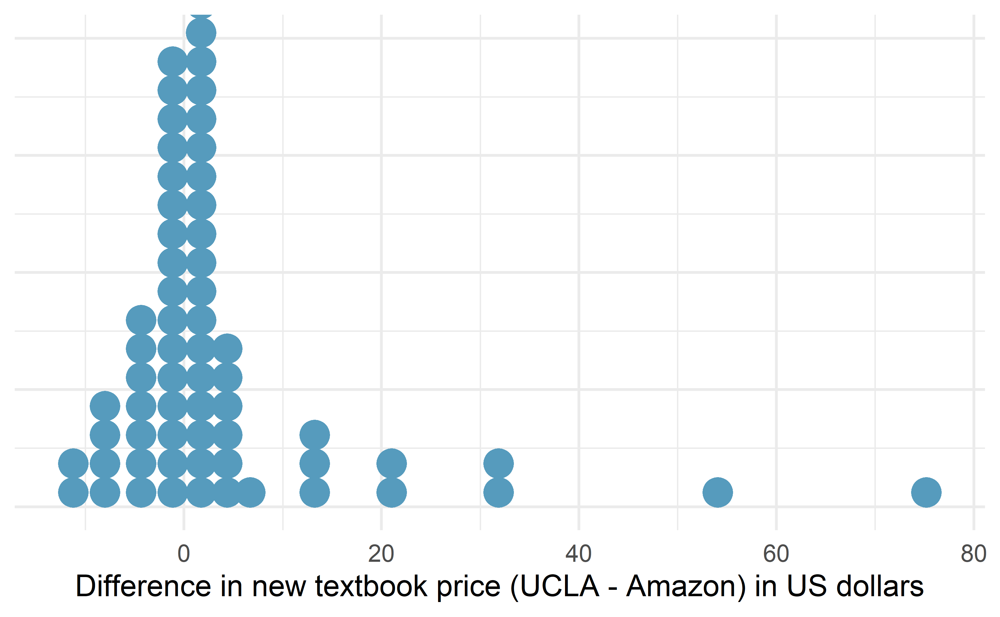
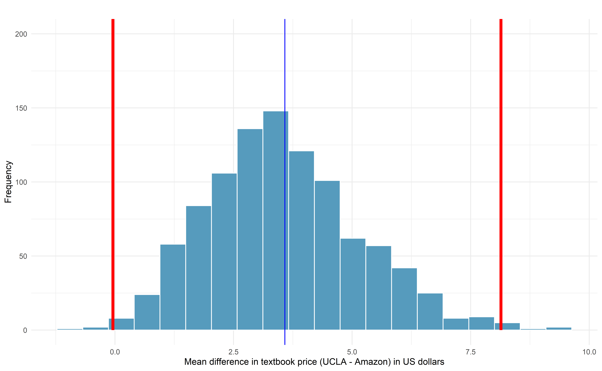
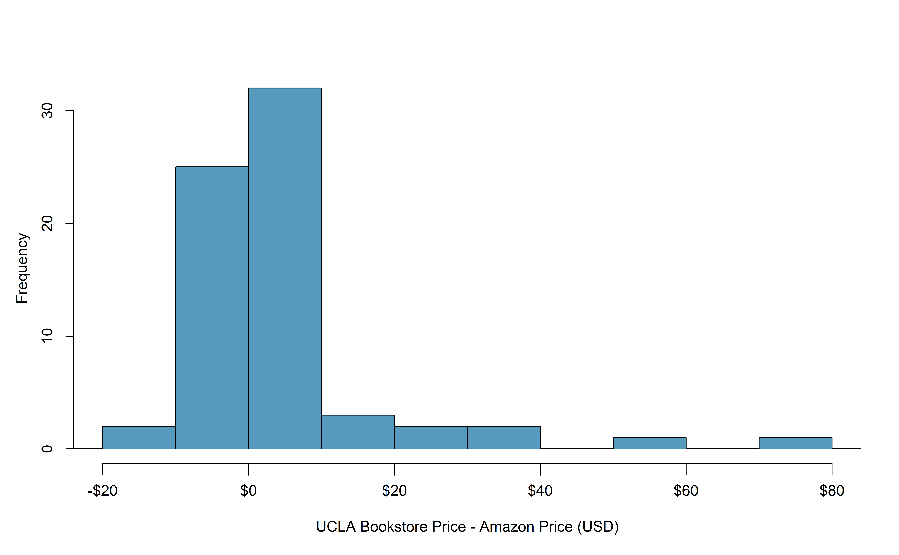
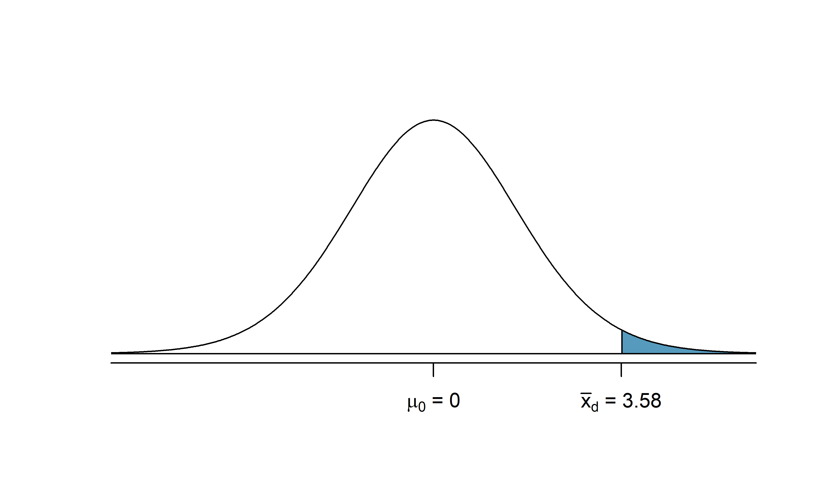

# Inference for comparing paired means {#inference-paired-means}


::: chapterintro
In Chapter \@ref(inference-one-mean), analysis was done to summarize a quantitative variable measured on a single population.
What if we were to measure that variable twice on the same observational unit? 
In this case, the two measurements are **dependent**---knowledge of the observations in one group gives us information about what we would expect to happen in the other group.
Sometimes dependency is not something that can be addressed through a statistical method.
However, this particular dependency, **pairing**, can be modeled quite effectively by using the same tools for a single quantitative variable from Chapter \@ref(inference-one-mean) applied to the differences between two measurements on each pair.
:::

Paired data represent a particular type of experimental structure where the analysis is somewhat akin to a one-sample analysis (see Chapter \@ref(inference-one-mean)) but has other features that resemble a two-sample analysis (which we will see in Chapter \@ref(inference-two-means)).  Quantitative measurements are made on each of two different levels of an explanatory variable, but those measurements are **paired** --- each observational unit consists of two measurements, and the two measurements are subtracted such that only the difference is retained.  Table \@ref(tab:pairedexamples) presents some examples of studies where paired designs were implemented.

<table class="table" style="margin-left: auto; margin-right: auto;">
<caption>(\#tab:pairedexamples)(\#tab:pairedexamples)Examples of studies where a paired design is used to measure the difference in the measurement over two conditions.</caption>
 <thead>
  <tr>
   <th style="text-align:left;"> Observational unit </th>
   <th style="text-align:left;"> Comparison groups </th>
   <th style="text-align:left;"> Measurement </th>
   <th style="text-align:left;"> Value of interest </th>
  </tr>
 </thead>
<tbody>
  <tr>
   <td style="text-align:left;"> Car </td>
   <td style="text-align:left;"> Smooth Turn vs Quick Spin </td>
   <td style="text-align:left;"> amount of tire tread after 1,000 miles </td>
   <td style="text-align:left;"> difference in tread </td>
  </tr>
  <tr>
   <td style="text-align:left;"> Married heterosexual couple </td>
   <td style="text-align:left;"> Husband vs Wife </td>
   <td style="text-align:left;"> age </td>
   <td style="text-align:left;"> difference in age </td>
  </tr>
  <tr>
   <td style="text-align:left;"> Textbook </td>
   <td style="text-align:left;"> UCLA vs Amazon </td>
   <td style="text-align:left;"> price of new text </td>
   <td style="text-align:left;"> difference in price </td>
  </tr>
  <tr>
   <td style="text-align:left;"> Individual person </td>
   <td style="text-align:left;"> Pre-course vs Post-course </td>
   <td style="text-align:left;"> exam score </td>
   <td style="text-align:left;"> difference in score </td>
  </tr>
</tbody>
</table>


::: {.onebox}
**Paired data.**

  Two sets of observations are *paired* if each
  observation in one set has a special correspondence
  or connection with exactly one observation in the other
  data set.
:::


<!-- Paired data can arise from two different situations: -->

<!-- * **Repeated measures**.  Paired data using repeated measures occurs when we measure the same person or unit twice and take the difference between those measurements. -->

<!-- * **Matching**. Paired data using matching occurs when we first match people or units into similar pairs, and then take the difference between the two measurements taken on each person/unit. -->

<!-- ::: {.guidedpractice} -->
<!-- Which of the examples in Table \@ref(tab:pairedexamples) are paired using repeated measures? paired using matching?^[The examples with cars and people are paired using repeated measures --- each car or person was measured twice (Smooth Turn tire and Quick Spin tire, or pre-score and post-score). Textbooks would need to be matched since they are not physically in the same location; married couples are matched since we measure the age on each member of the couple separately.] -->
<!-- :::  -->

For inferential methods applied to paired data, the analysis is virtually identical to the one-sample approach given in Chapter \@ref(inference-one-mean).
The key to working with paired data is to consider the measurement of interest to be the _difference_ in measured values across the pair of observations.
Thinking about the differences as a single observation on an observational unit changes the paired setting into the one-sample setting. 

A comparison of the notation used in Chapter \@ref(inference-one-mean) and the notation used in this chapter is shown below. The subscript "d" stands for "difference" since our variable is now a paired difference.

::: {.onebox}
**Notation for a single quantitative variable (left) and paired differences (right).**

|  | **One Mean** | **Paired Mean Difference** |
|-|-|-|
| Population mean | $\mu$ | $\mu_d$ |
| Population standard deviation | $\sigma$ | $\sigma_d$ |
| Sample mean | $\bar{y}$ | $\bar{y}_d$ |
| Sample standard deviation | $s$ | $s_d$ |
| Sample size | $n$ | $n$ |
:::

Instead of $n$ representing the number of observational units, with paired data, $n$ represents the number of *pairs* in paired samples.
Similarly, $\mu_d$, $\sigma_d$, $\bar{y}_d$ and $s_d$ are all calculated
using the differences in measured values within pairs.

## Shifted bootstrap test for $H_0: \mu_d = 0$

Consider an experiment done to measure whether tire brand Smooth Turn or tire brand Quick Spin has longer tread wear.  That is, after 1,000 miles on a car, which brand of tires has more tread, on average?  

### Observed data

The observed data represent 25 tread measurements (in inches) taken on 25 Smooth Turn tires and 25 Quick Spin tires.
The study used a total of 25 cars, so on each car, one brand was randomly assigned to the front driver's side tire and the other to the front passenger's side tire. 
Figure \@ref(fig:tiredata) presents the observed data.
The Smooth Turn manufacturer looks at the box plot below and says:

> clearly the tread on Smooth Turn tires is higher, on average, than the tread on Quick Spin tires after 1,000 miles of driving.

The Quick Spin manufacturer is skeptical and retorts:  

> but with only 25 cars, it seems that the variability in road conditions (sometimes one tire hits a pothole, etc.) could be what leads to the small difference in average tread amount.

We'd like to be able to systematically distinguish between what the Smooth Turn manufacturer sees in the plot and what the Quick Spin manufacturer sees in the plot.  Fortunately for us, we have an excellent way to simulate the natural variability (from road conditions, etc.) that can lead to tires being worn at different rates:  bootstrapping.


<div class="figure" style="text-align: center">

<p class="caption">(\#fig:tiredata)Boxplots of the tire tread remaining after 1,000 miles by the brand of tire from which the original measurements came. Gray lines connect the same cars.</p>
</div>

Since these are paired data, we are only interested in the _differences_ in tire tread between the two brands on each car. The dotplot in Figure \@ref(fig:tiredata-diff) displays these differences, with summary statistics displayed below.


``` r
favstats(differences)
#>       min        Q1  median     Q3    max    mean      sd  n missing
#>  -0.00506 -0.000972 0.00205 0.0042 0.0107 0.00196 0.00431 25       0
```

<div class="figure" style="text-align: center">

<p class="caption">(\#fig:tiredata-diff)Difference in tire tread (in inches) remaining after 1,000 miles between the two brands (Smooth Turn -- Quick Spin).</p>
</div>


### Variability of the statistic


A simulation-based test will identify whether the differences seen in the box plot below could plausibly have happened just by chance variability.
As before, we will simulate the variability in sample statistics under the assumption that the null hypothesis is true.
In this study, the null hypothesis is that average difference in tire tread wear between Smooth Turn and Quick Spin tires is zero. The experiment was conducted to determine whether Smooth Turn or Quick Spin has longer tread wear. Taking the order of differences to be Smooth Turn $-$ Quick Spin, we express the hypotheses as follows.

* $H_0: \mu_d = 0$, the true mean difference in tire tread remaining after 1,000 miles between Smooth Turn and Quick Spin (Smooth Turn $-$ Quick Spin) tires is equal to zero.  
* $H_A: \mu_d \neq 0$, the true mean difference in tire tread remaining after 1,000 miles between Smooth Turn and Quick Spin (Smooth Turn $-$ Quick Spin) tires is not equal to zero.

To simulate the null distribution of mean differences in tread, we will implement the same method used in Section \@ref(one-mean-null-boot) using a shifted bootstrap distribution.

::: {.onebox}
**Shifted bootstrap null distribution for a sample mean difference.**

To simulate a null distribution of sample mean differences under the null hypothesis $H_0: \mu_d = 0$,

1. Subtract $\bar{y}_d$ from each difference in the original sample:^[Subtracting the sample mean is equivalent to adding $\mu_0 - \bar{y}_d$ when the null value is $\mu_d = 0$. Thus, we are using the same process as that described in Section \@ref(one-mean-null-boot).]  
  \[
    y_1 - \bar{y}_d , \hspace{2.5mm} y_2 - \bar{y}_d, \hspace{2.5mm}  y_3 - \bar{y}_d, \hspace{2.5mm}  \ldots, \hspace{2.5mm}  y_n - \bar{y}_d.
  \]
  Note that if $\bar{y}_d$ is a negative number, then you will be _adding_ the distance between $0$ and $\bar{y}_d$ to each value.
2. Generate 1000s of bootstrap resamples from this shifted distribution, plotting the shifted bootstrap sample mean difference each time.
:::


To use bootstrapping to generate a null distribution of sample mean differences in tire tread, we first have to **shift the data** to be centered at the null value of zero. We shift the data by subtracting $\bar{y}_d$ = 0.00196 from each tire tread difference in the sample. This process is displayed in Figure \@ref(fig:tiredata-diff-shift).

<div class="figure" style="text-align: center">

<p class="caption">(\#fig:tiredata-diff-shift)Mean difference in tire tread (in inches) remaining after 1,000 miles between the two brands (Smooth Turn -- Quick Spin) (blue), and the shifted mean differences in tire tread (red), found by subtracting 0.00196 to each original difference.</p>
</div>

### Observed statistic vs. null value


By repeatedly sampling 25 cars with replacement from the shifted bootstrap null distribution, we can create a distribution of the sample mean difference in tire tread, as seen in Figure \@ref(fig:pairRandomiz).
As expected (because the differences were generated under the null hypothesis), the histogram is centered at zero.
A line has been drawn at the observed mean difference, $\bar{y}_d$ = 0.00196, which is nowhere near the differences simulated from natural variability when we assume there is no difference in tire tread wear between brands.
Because the observed mean difference in tire tread is so far away from the natural variability of the randomized mean differences in tire tread, we believe that there is a significant difference in tire tread wear between Smooth Turn and Quick Spin brand tires, on average. 

To be precise, the proportion of simulated $\bar{y}_d$'s that are 0.00196 inches or further away from zero is 0.023. This p-value gives us strong evidence in favor of our alternative $H_A: \mu_d \neq 0$.
Our conclusion is that the extra amount of tire tread remaining in Smooth Turn brand tires after 1,000 miles, on average, is due to more than just natural variability. Data from this experiment suggest that, on average, Smooth Turn tires differ in tread wear compared to Quick Spin tires.

<div class="figure" style="text-align: center">

<p class="caption">(\#fig:pairRandomiz)Histogram of 1000 simulated mean differences in tire tread, assuming that the two brands perform equally, on average.</p>
</div>


## Bootstrap confidence interval for $\mu_d$

In an earlier edition of this textbook,
we found that Amazon prices were, on average,
lower than those of the UCLA Bookstore for UCLA courses
in 2010.
It's been several years, and many stores have adapted
to the online market, so we wondered,
how is the UCLA Bookstore doing today?

### Observed data

We sampled 201 UCLA courses.
Of those, 68
required books could be found on Amazon.

::: {.data}
The `ucla_textbooks_f18` data can be found in the [openintro](http://openintrostat.github.io/openintro/reference/index.html) package.
:::

A portion of the data set from these courses
is shown in Table \@ref(tab:textbooksDF),
where prices are in US dollars. Here the differences are taken as
\begin{align*}
\text{UCLA Bookstore price} - \text{Amazon price}
\end{align*}

It is important that we always subtract using
a consistent order;
here Amazon prices are always subtracted from UCLA prices.
The first difference shown in Table \@ref(tab:textbooksDF)
is computed as $47.97 - 47.45 = 0.52$.
Similarly, the second difference is computed as
$14.26 - 13.55 = 0.71$,
 and the third is $13.50 - 12.53 = 0.97$.

<table class="table" style="margin-left: auto; margin-right: auto;">
<caption>(\#tab:textbooksDF)(\#tab:textbooksDF)Four cases of the `ucla_textbooks_f18` dataset.</caption>
 <thead>
  <tr>
   <th style="text-align:left;"> subject </th>
   <th style="text-align:left;"> course_num </th>
   <th style="text-align:right;"> bookstore_new </th>
   <th style="text-align:right;"> amazon_new </th>
   <th style="text-align:right;"> price_diff </th>
  </tr>
 </thead>
<tbody>
  <tr>
   <td style="text-align:left;"> American Indian Studies </td>
   <td style="text-align:left;"> M10 </td>
   <td style="text-align:right;"> 48.0 </td>
   <td style="text-align:right;"> 47.5 </td>
   <td style="text-align:right;"> 0.52 </td>
  </tr>
  <tr>
   <td style="text-align:left;"> Anthropology </td>
   <td style="text-align:left;"> 2 </td>
   <td style="text-align:right;"> 14.3 </td>
   <td style="text-align:right;"> 13.6 </td>
   <td style="text-align:right;"> 0.71 </td>
  </tr>
  <tr>
   <td style="text-align:left;"> Arts and Architecture </td>
   <td style="text-align:left;"> 10 </td>
   <td style="text-align:right;"> 13.5 </td>
   <td style="text-align:right;"> 12.5 </td>
   <td style="text-align:right;"> 0.97 </td>
  </tr>
  <tr>
   <td style="text-align:left;"> Asian </td>
   <td style="text-align:left;"> M60W </td>
   <td style="text-align:right;"> 49.3 </td>
   <td style="text-align:right;"> 55.0 </td>
   <td style="text-align:right;"> -5.69 </td>
  </tr>
</tbody>
</table>


A dot plot of the data is shown in Figure \@ref(fig:text-price-hist), with summary statistics displayed below.


``` r
favstats(ucla_textbooks_f18$price_diff)
```

```
#>    min     Q1 median   Q3  max mean   sd  n missing
#>  -12.2 -0.992  0.625 2.99 75.2 3.58 13.4 68       0
```

<div class="figure" style="text-align: center">

<p class="caption">(\#fig:text-price-hist)Distribution of differences in new textbook price (UCLA Bookstore -- Amazon) in US dollars for 68 required textbooks at UCLA.</p>
</div>

<!--
\newcommand{\uclabookN}{68}
\newcommand{\uclabookDF}{67}
\newcommand{\uclabookM}{3.58}
\newcommand{\uclabookSD}{13.42}
\newcommand{\uclabookSE}{1.63}
-->

\index{paired|(}
\index{data!textbooks|(}


Each textbook has two corresponding prices in the data set:
one for the UCLA Bookstore and one for Amazon.
Thus, the two prices for the same textbook are **paired**,
and our analysis need only focus on the _differences_
in textbook price between the two suppliers. 


### Variability of the statistic

Following the example of bootstrapping a single mean, the observed mean differences can be bootstrapped in order to understand the variability of the average difference from sample to sample. We can then use the bootstrap distribution of mean differences to calculate bootstrap percentile confidence intervals for the true mean difference in the population.


In Figure \@ref(fig:pairboot), a 99% confidence interval for the mean difference in the cost of a new book at the UCLA Bookstore compared with Amazon has been calculated.
The bootstrap percentile interval is computing using the 0.5^th^ percentile and 99.5^th^ percentile of the bootstrapped mean differences and is found to be (-0.044, 8.138).
Since this confidence interval contains zero, it does not support the hypothesis that the UCLA Bookstore price is, on average, higher than the Amazon price. That is, since the interval contains both negative and positive values, it is plausible that the prices of UCLA textbooks are lower, on average, than Amazon, and it is also plausible that the prices of UCLA textbooks are higher, on average, than Amazon. We would interpret the interval as follows: We are 99% confident that, on average, new textbook prices at the UCLA Bookstore are between \$0.04 lower to \$8.14 higher than the same textbook on Amazon.


<div class="figure" style="text-align: center">

<p class="caption">(\#fig:pairboot)Bootstrap distribution for the average difference in new book price at the UCLA Bookstore versus Amazon (UCLA -- Amazon). The bounds for a 99% bootstrap percentile confidence interval are superimposed in red, and the observed mean difference in new book price is superimposed in blue.</p>
</div>


## Theory-based inferential methods for $\mu_d$ {#paired-mean-math}

As with the simulation-based inferential methods for a paired mean difference,
theory-based inferential methods for this scenario are identical
to the theory-based inferential methods for a single mean---only the notation differs.

### Observed data

Consider again the paired textbook price data in the previous section. 
A histogram of the differences in new textbook price between the UCLA Bookstore and Amazon is shown in
Figure \@ref(fig:diffInTextbookPricesF18), and summary statistics
are displayed in Table \@ref(tab:textbooksSummaryStats).

<table class="table" style="margin-left: auto; margin-right: auto;">
<caption>(\#tab:textbooksSummaryStats)(\#tab:textbooksSummaryStats)Summary statistics for the 68 new textbook price differences (UCLA -- Amazon).</caption>
 <thead>
  <tr>
   <th style="text-align:left;"> $n$ </th>
   <th style="text-align:left;"> $\bar{y}_{d}$ </th>
   <th style="text-align:left;"> $s_{d}$ </th>
  </tr>
 </thead>
<tbody>
  <tr>
   <td style="text-align:left;"> 68 </td>
   <td style="text-align:left;"> $3.58 </td>
   <td style="text-align:left;"> $13.42 </td>
  </tr>
</tbody>
</table>


<div class="figure" style="text-align: center">

<p class="caption">(\#fig:diffInTextbookPricesF18)Histogram of the difference in price for each book sampled.</p>
</div>

### Variability of the statistic

To analyze a paired data set,
we simply analyze the differences using the same one-sample $t$-distribution techniques
we applied in
Section \@ref(one-mean-math).


::: {.workedexample}
Set up a hypothesis test
    to determine whether, on average, the UCLA Bookstore's price for
    a new textbook is higher than the price of the same
    book on Amazon.
    Also, check the conditions for whether we can move
    forward with the test using the $t$-distribution.
  
---
      
We are considering two scenarios: 

* $H_0$: $\mu_{d} = 0$.
      The true mean difference in new textbook prices (UCLA -- Amazon)
      is equal to zero.
* $H_A$: $\mu_{d} > 0$.
      The true mean difference in new textbook prices (UCLA -- Amazon)
      is greater than zero.

Next, we check the independence and normality conditions:

* The observations (textbooks) are based on a simple random sample and we have no information on any sub-groups in the books,
  so independence is reasonable.

* While there are some outliers,
  $n = 68$ and none of the outliers
  are particularly extreme, so the normality
  of $\bar{y}$ is satisfied.

With these conditions satisfied,
  we can move forward with the $t$-distribution.
:::

### Observed statistic vs. null statistics

As mentioned previously, the methods applied to a difference will be identical to the one-sample techniques.  Therefore, the full hypothesis test framework is given as an example.

::: {.workedexample}

Complete the hypothesis test started
    in the previous Example.

---

To start, compute the standard error associated with
  $\bar{y}_{d}$ using the sample standard
  deviation of the differences
  ($s_{d} = 13.42$)
  and the number of differences
  ($n = 68$):
  \begin{align*}
  SE(\bar{y}_{d})
    = \frac{s_{d}}{\sqrt{n}}
    = \frac{13.42}{\sqrt{68}} = 1.63
  \end{align*}
  The test statistic is the T-score of
  $\bar{y}_{d}$
  under the null condition that the actual mean
  difference is 0:
  \begin{align*}
  T
    = \frac{\bar{y}_{d} - 0}
        { SE(\bar{y}_{d})}
    = \frac{3.58 - 0}{1.63} = 2.20
  \end{align*}
  This value tells us that the sample mean difference in price, \$3.58,
  is 2.20 standard errors above zero (the null value).
  
  To visualize the p-value, the approximate sampling distribution
  of $\bar{y}_{d}$ is drawn as though
  $H_0$ is true,
  and the p-value is represented by the shaded upper tail in Figure \@ref(fig:textbooksF18HTTails). This area is equivalent
  to the area above 2.20 on a $t$-distribution with $df = n - 1$ = 68 $-$ 1 = 67 degrees of freedom.

  Using the `pt` function in R, we find the
  upper tail area of 0.0156.

  In conclusion, we have strong evidence that
  Amazon prices are, on average, lower than the
  UCLA Bookstore prices for UCLA courses.
:::


<div class="figure" style="text-align: center">

<p class="caption">(\#fig:textbooksF18HTTails)Distribution of $\bar{y}_{d}$ under the null hypothesis of no difference.  The observed average difference of 2.98 is marked with the shaded areas more extreme than the observed difference given as the p-value.</p>
</div>

<!-- TODO later - add note to compare to 99% CI in previous section, which contained zero. -->

::: {.workedexample}
Create a theory-based 95% confidence interval for the average price difference between books at the UCLA Bookstore and books on Amazon.

---

Conditions
  for using theory-based methods have already been verified and the standard error
  computed in the previous Example.
  
To find the confidence interval,
  identify $t^{\star}_{67}$ using the R command: `qt(0.975, 67)` = 2.00,
  and plug it, the point estimate,
  and the standard error into the confidence
  interval formula:
  \begin{align*}
  \bar{y}_d \ \pm\ t^{\star} \times SE(\bar{y}_d)
      \quad\to\quad
          3.58 \ \pm\ 2.00 \times 1.63
      \quad\to\quad (0.32, 6.84)
  \end{align*}
  We are 95% confident that Amazon is, on average,
  between $0.32 and $6.84 less expensive
  than the UCLA Bookstore for UCLA course books.
:::

::: {.guidedpractice}
We have strong evidence that Amazon is,
on average, less expensive.
How should this conclusion affect UCLA student
buying habits?
Should UCLA students always buy their books
on Amazon?^[The average price difference
  is only mildly useful for this question.
  Examine the distribution shown in
  Figure \@ref(fig:diffInTextbookPricesF18).
  There are certainly a handful of cases where
  Amazon prices are far below the UCLA Bookstore's,
  which suggests it is worth checking Amazon
  (and probably other online sites) before purchasing.
  However, in many cases the Amazon price is
  above what the UCLA Bookstore charges,
  and most of the time the price isn't that different.
  Ultimately, if getting a book immediately from
  the bookstore is notably more convenient,
  e.g., to get started on reading or homework,
  it's likely a good idea to go with the UCLA
  Bookstore unless the price difference on a
  specific book happens to be quite large.
  For reference, this is a very different result
  from what we (the authors) had seen in a similar
  data set from 2010.
  At that time, Amazon prices were almost uniformly
  lower than those of the UCLA Bookstore's and by
  a large margin, making the case to use Amazon over
  the UCLA Bookstore quite compelling at that time.
  Now we frequently check multiple websites
  to find the best price.]
:::


\index{data!textbooks|)}
\index{paired|)}


## Chapter review {#chp18-review}

<!-- ### Summary {-} -->

<!-- ::: {.underconstruction} -->
<!-- TODO -->
<!-- ::: -->

### Terms {-}

We introduced the following terms in the chapter. If you're not sure what some of these terms mean, we recommend you go back in the text and review their definitions. We are purposefully presenting them in alphabetical order, instead of in order of appearance, so they will be a little more challenging to locate. However you should be able to easily spot them as **bolded text**.

<table class="table table-striped table-condensed" style="margin-left: auto; margin-right: auto;">
<tbody>
  <tr>
   <td style="text-align:left;"> paired data </td>
   <td style="text-align:left;">  </td>
   <td style="text-align:left;">  </td>
  </tr>
</tbody>
</table>


<!-- ### Key ideas {-} -->

<!-- ::: {.underconstruction} -->
<!-- TODO -->
<!-- ::: -->


