# Inference for comparing two independent means {#inference-two-means}
<!-- Old reference: #differenceOfTwoMeans -->


::: chapterintro
We now extend the methods from Chapters \@ref(inference-one-mean) and \@ref(inference-paired-means) to apply confidence intervals and hypothesis tests to differences in population means that come from two independent groups.
Chapter \@ref(inference-paired-means) examined the case of **dependent** samples, where the two samples are paired. With paired data, we take the difference between two measurements on each observational unit, and then calculate the mean of those differences, $\mu_d$.
In this chapter, the two groups of measurements are independent---knowledge of the observations in one group does not change what we would expect to happen in the other group. Our summary measure for independent groups first takes the mean of each group, and then the difference, a **difference in means** between Group 1 and Group 2: $\mu_1 - \mu_2.$ 

In our investigations, we'll identify a reasonable point estimate of $\mu_1 - \mu_2$ based on the sample, and you may have already guessed its form: $\bar{y}_1 - \bar{y}_2.$ \index{point estimate!difference of means} Then we'll look at the inferential analysis in three different ways: using a randomization test, applying bootstrapping for interval estimates, and, if we verify that the point estimate can be modeled using a normal distribution, we compute the estimate's standard error and apply the mathematical framework.
:::

Below we summarize the notation used throughout this chapter.

::: {.onebox}
**Notation for a binary explanatory variable and quantitative response variable.**

* $n_1$, $n_2$ = sample sizes of two independent samples
* $\bar{y}_1$, $\bar{y}_2$ = sample means of two independent samples
* $s_1$, $s_2$ = sample standard deviations of two independent samples
* $\mu_1$, $\mu_2$ = population means of two independent populations
* $\sigma_1$, $\sigma_2$ = population standard deviations of two independent populations
:::

In this section we consider a difference in
two population means, $\mu_1 - \mu_2$, under the condition
that the data are not paired.
Just as with a single sample, we identify conditions to ensure
we can use the $t$-distribution with a point estimate
of the difference, $\bar{y}_1 - \bar{y}_2$,
and a new standard error formula.

The details for working through inferential problems in the two independent means setting are strikingly similar to those applied to the two independent proportions setting.
We first cover a randomization test where the observations are shuffled under the assumption that the null hypothesis is true.
Then we bootstrap the data (with no imposed null hypothesis) to create a confidence interval for the true difference in population means, $\mu_1 - \mu_2$.
The mathematical model, here the $t$-distribution, is able to describe both the randomization test and the boostrapping as long as the conditions are met.

The inferential tools are applied to three different data contexts: determining whether
stem cells can improve heart function,
exploring the relationship between pregnant women's smoking
habits and birth weights of newborns,
and exploring whether there is statistically significant
evidence that one variation of an exam is harder than
another variation.
This section is motivated by questions like
"Is there convincing evidence that newborns from mothers
who smoke have a different average birth weight than newborns
from mothers who don't smoke?"


## Randomization test for $H_0: \mu_1 - \mu_2 = 0$ {#rand2mean}

\index{data!two exam comparison|(}

An instructor decided to run two slight variations of the same exam. Prior to passing out the exams, she shuffled the exams together to ensure each student received a random version. Summary statistics for how students performed on these two exams are shown in Table \@ref(tab:summaryStatsForTwoVersionsOfExams) and plotted in Figure \@ref(fig:boxplotTwoVersionsOfExams). Anticipating complaints from students who took Version B, she would like to evaluate whether the difference observed in the groups is so large that it provides convincing evidence that Version B was more difficult (on average) than Version A.


### Observed data


<table class="table" style="margin-left: auto; margin-right: auto;">
<caption>(\#tab:summaryStatsForTwoVersionsOfExams)Summary statistics of scores for each exam version.</caption>
 <thead>
  <tr>
   <th style="text-align:left;">  </th>
   <th style="text-align:right;"> $n$ </th>
   <th style="text-align:right;"> $\bar{y}$ </th>
   <th style="text-align:right;"> $s$ </th>
   <th style="text-align:right;"> minimum </th>
   <th style="text-align:right;"> maximum </th>
  </tr>
 </thead>
<tbody>
  <tr>
   <td style="text-align:left;"> A </td>
   <td style="text-align:right;"> 58 </td>
   <td style="text-align:right;"> 75.1 </td>
   <td style="text-align:right;"> 13.9 </td>
   <td style="text-align:right;"> 44 </td>
   <td style="text-align:right;"> 100 </td>
  </tr>
  <tr>
   <td style="text-align:left;"> B </td>
   <td style="text-align:right;"> 55 </td>
   <td style="text-align:right;"> 72.0 </td>
   <td style="text-align:right;"> 13.8 </td>
   <td style="text-align:right;"> 38 </td>
   <td style="text-align:right;"> 100 </td>
  </tr>
</tbody>
</table>


<div class="figure" style="text-align: center">
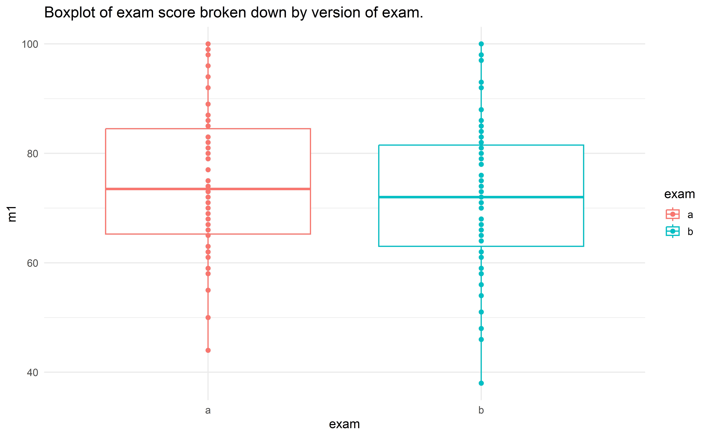
<p class="caption">(\#fig:boxplotTwoVersionsOfExams)Exam scores for students given one of three different exams.</p>
</div>

::: {.guidedpractice}
Construct hypotheses to evaluate whether the observed
difference in sample means, $\bar{y}_A - \bar{y}_B=3.1$,
is due to chance. We will later evaluate these hypotheses
by computing a p-value for the test.^[$H_0$: the exams are equally difficult, on average. $\mu_A - \mu_B = 0$. $H_A$: one exam was more difficult than the other, on average. $\mu_A - \mu_B \neq 0.$]
::: 

::: {.guidedpractice}
Before moving on to evaluate the hypotheses in the previous Guided Practice, let's think carefully about the dataset.  Are the observations across the two groups independent?  Are there any concerns about outliers?^[
(a) Since the exams were shuffled,
  the "treatment" in this case was randomly assigned and we are willing to assume that students did not "help" one another on the exams within or across versions, independence within and between groups is satisfied.
  (b) The summary statistics suggest the data are roughly
  symmetric about the mean, and the min/max values don't
  suggest any outliers of concern.]
::: 


### Variability of the statistic


In Sections \@ref(caseStudySexDiscrimination) and \@ref(two-prop-errors), the variability of the statistic (previously: $\hat{p}_1 - \hat{p}_2$) was visualized after shuffling the observations across the two treatment groups many times.
The shuffling process implements the null hypothesis model (that there is no effect of the treatment).
In the exam example, the null hypothesis is that exam A and exam B are equally difficult, so the average scores across the two tests should be the same.
If the exams were equally difficult, *due to natural variability*, we would sometimes expect students to do slightly better on exam A ($\bar{y}_A > \bar{y}_B$) and sometimes expect students to do slightly better on exam B ($\bar{y}_B > \bar{y}_A$).
The question at hand is: Does $\bar{y}_A - \bar{y}_B=3.1$ indicate that exam A is easier than exam B?.


Figure \@ref(fig:rand2means) shows the process of randomizing the exam to the observed exam scores.
If the null hypothesis is true, then the score on each exam should represent the true student ability on that material.
It shouldn't matter whether they were given exam A or exam B.
By reallocating which student got which exam, we are able to understand how the difference in average exam scores changes due only to natural variability.
There is only one iteration of the randomization process in Figure \@ref(fig:rand2means), leading to one simulated difference in average scores.


<div class="figure" style="text-align: center">
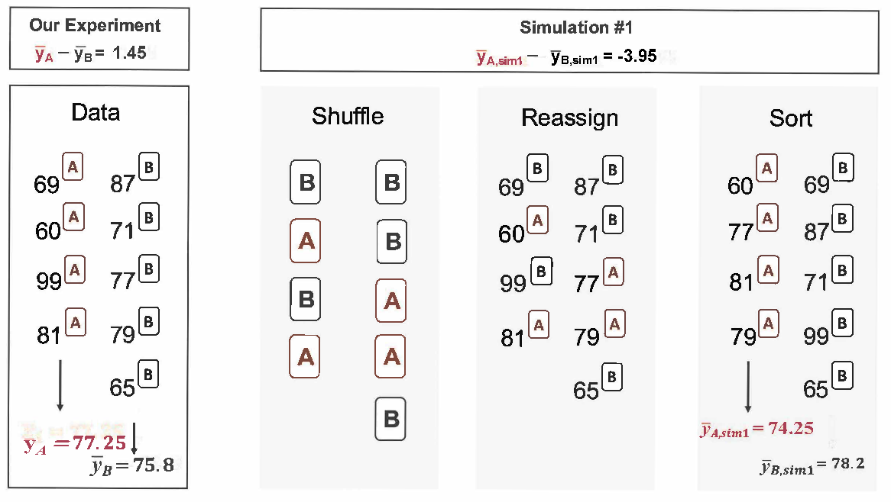
<p class="caption">(\#fig:rand2means)The version of the test (A or B) is randomly allocated to the test scores, under the null assumption that the tests are equally difficult.</p>
</div>

Building on Figure \@ref(fig:rand2means), Figure \@ref(fig:randexams) shows the values of the simulated statistics $\bar{y}_{1, sim} - \bar{y}_{2, sim}$ over 1000 random simulations.
We see that, just by chance, the difference in scores can range anywhere from -10 points to +10 points.

<div class="figure" style="text-align: center">
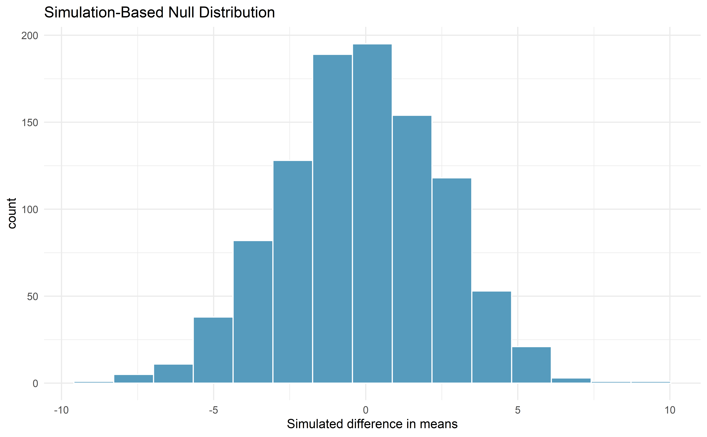
<p class="caption">(\#fig:randexams)Histogram of differences in means, calculated from 1000 different randomizations of the exam types.</p>
</div>


### Observed statistic vs. null value

The goal of the randomization test is to assess the observed data, here the statistic of interest is $\bar{y}_A - \bar{y}_B = 3.1$.
The randomization distribution allows us to identify whether a difference of 3.1 points is more than one would expect by natural variability.
By plotting the value of 3.1 on Figure \@ref(fig:randexamspval), we can measure how different or similar 3.1 is to the randomized differences which were generated under the null hypothesis.

<div class="figure" style="text-align: center">
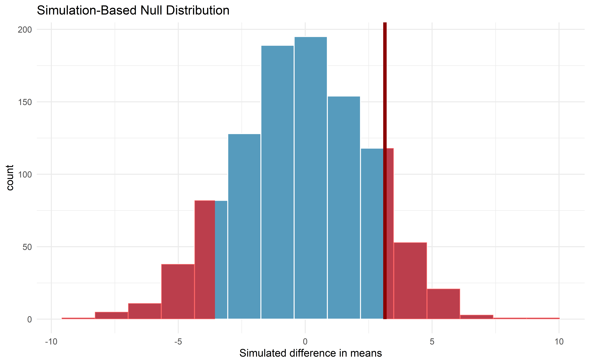
<p class="caption">(\#fig:randexamspval)Histogram of differences in means, calculated from 1000 different randomizations of the exam types.  The observed difference of 3.1 points is plotted as a vertical line, and the area more extreme than 3.1 is shaded to represent the p-value.</p>
</div>


::: {.example}
Approximate the p-value depicted in Figure \@ref(fig:randexamspval), and provide a conclusion in the context of the case study.

---
      
Using software, we find that 231 of the 1000 shuffled differences in means are as or further away from zero as our observed difference of 3.1.  That is, 23.1% of the shuffled statistics lie in the shaded blue area in Figure \@ref(fig:randexamspval). Thus, our p-value is 0.231.


With this large of a p-value, the data do not convincingly show that one exam
  version is more difficult than the other, and the teacher
  should not be convinced that she should add points to the
  Version B exam scores.
:::


The large p-value and consistency of $\bar{y}_A - \bar{y}_B=3.1$ with the randomized differences leads us to *not reject the null hypothesis*.  Said differently, there is little to no evidence to think that one of the tests is easier than the other.

One might be inclined to conclude that the tests have the same level of difficulty, but that conclusion would be wrong. Indeed, our best point estimate of the true average difference in means between the two tests is 3.1!
The hypothesis testing framework is set up only to reject a null claim, it is not set up to validate a null claim.
As we concluded, the data are consistent with exams A and B being equally difficult, but the data are also consistent with exam A being 3.1 points "easier" than exam B. In fact, as we'll see in the next section, since a 95% confidence interval for $\mu_A - \mu_B$ is (-2.0, 8.3), these data are consistent with any difference between exam A being 2.0 points "harder" to exam A being 8.3 points "easier."
The data are not able to adjudicate on whether the exams are equally hard or whether one of them is slightly easier.

Conclusions where the null hypothesis is not rejected often seem unsatisfactory.
However, in this case, the teacher and class are probably all relieved that there is little evidence to demonstrate that one of the exams is more difficult than the other.


<!--
Below is the t-test for the example above using a randomization test.  Doesn't seem like we need both.


After verifying the conditions for each sample and confirming the samples are independent of each other, we are ready to conduct the test using the $t$-distribution. In this case, we are estimating the true difference in average test scores using the sample data, so the point estimate is $\bar{y}_A - \bar{y}_B = 3.1$. The standard error of the estimate can be calculated as
\begin{align*}
SE
  = \sqrt{\frac{s_A^2}{n_A} + \frac{s_B^2}{n_B}}
  = \sqrt{\frac{14^2}{30} + \frac{20^2}{27}}
  = 4.62
\end{align*}
Finally, we construct the test statistic:
\begin{align*}
T
  = \frac{\text{point estimate} - \text{null value}}{SE}
  = \frac{(79.4-74.1) - 0}{4.62}
  = 1.15
\end{align*}
If we have a computer handy, we can identify the degrees
of freedom as 45.97.
Otherwise we use the smaller of $n_1-1$ and $n_2-1$: $df=26$.

\D{\newpage}

\begin{figure}[h]
  \centering
  \Figure{0.63}{pValueOfTwoTailAreaOfExamVersionsWhereDFIs26}
  \caption{The $t$-distribution with 26 degrees of freedom
      and the p-value from exam example represented
      as the shaded areas.}
  \label{pValueOfTwoTailAreaOfExamVersionsWhereDFIs26}
\end{figure}

\begin{examplewrap}
\begin{nexample}{Identify the p-value depicted in
    Figure \ref{pValueOfTwoTailAreaOfExamVersionsWhereDFIs26}
    using $df = 26$, and provide a conclusion in the
    context of the case study.}
  Using software, we can find the one-tail area (0.13)
  and then double this value to get the two-tail area,
  which is the p-value: 0.26.
  (Alternatively, we could use the $t$-table in
  Appendix \ref{tDistributionTable}.)

  In Guided
  Practice \ref{htSetupForEvaluatingTwoExamVersions},
  we specified that we would use $\alpha = 0.01$.
  Since the p-value is larger than $\alpha$,
  we do not reject the null hypothesis.
  That is, the data do not convincingly show that one exam
  version is more difficult than the other, and the teacher
  should not be convinced that she should add points to the
  Version B exam scores.
\end{nexample}
\end{examplewrap}
-->

\index{data!two exam comparison|)}


## Bootstrap confidence interval for $\mu_1 - \mu_2$ {#boot-ci-diff-means}


\index{data!stem cells, heart function|(}
\index{point estimate!difference of means|(}

Before providing a full example working through a bootstrap analysis on actual data, consider a fictional situation where you would like to compare the average price of a car at one Awesome Auto franchise (Group 1) to the average price of a car at a different Awesome Auto franchise (Group 2).  You are only able to randomly sample five cars from each Awesome Auto franchise, and you measure the selling price of each car in the sample. The process of bootstrapping can be applied to *each* Group separately, and the differences of means recalculated each time.  Figure \@ref(fig:bootmeans2means) visually describes the bootstrap process when interest is in a statistic computed on two separate samples.  The analysis proceeds as in the one sample case, but now the (single) statistic of interest is the *difference in sample means*.  That is, a bootstrap resample is done on each of the groups separately, but the results are combined to have a single bootstrapped difference in means.  Repetition will produce 1000s of bootstrapped differences in means, and the histogram will describe the natural sampling variability associated with the difference in means.


<div class="figure" style="text-align: center">
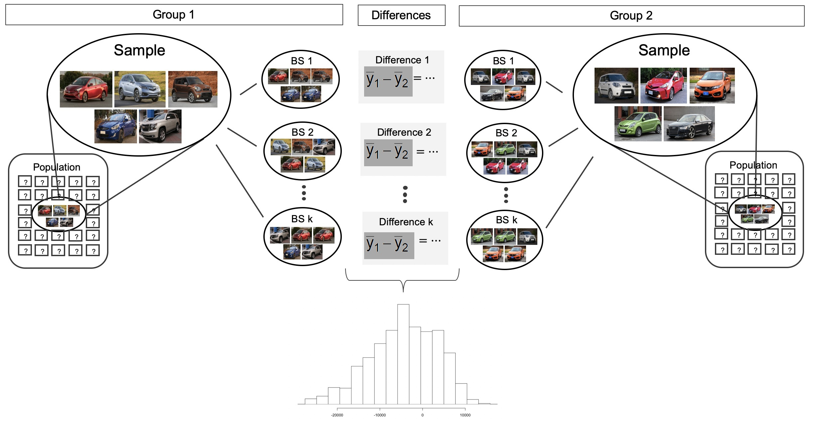
<p class="caption">(\#fig:bootmeans2means)For the two group comparison, 1000 bootstrap resamples are taken  separately on each group, and the difference in sample means is calculated for each pair of bootstrap resamples.  The set of 1000 differences is then analyzed as the distribution of the statistic of interest, with conclusions drawn on the parameter of interest.</p>
</div>

### Observed data

Does treatment using embryonic stem cells (ESCs)
help improve heart function following a heart attack?
Table \@ref(tab:statsSheepEscStudy) contains summary statistics
for an experiment to test ESCs in sheep that had a heart attack.
Each of these sheep was randomly assigned to the ESC
or control group, and the percent change in their hearts' pumping
capacity was measured in the study.
Figure \@ref(fig:stemCellTherapyForHearts) provides
histograms of the two data sets.
A positive value corresponds to increased pumping capacity,
which generally suggests a stronger recovery.
Our goal will be to identify a 90% confidence interval
for the effect of ESCs on the change in heart pumping
capacity relative to the control group.

<table class="table" style="margin-left: auto; margin-right: auto;">
<caption>(\#tab:statsSheepEscStudy)Summary statistics of the embryonic stem cell study.</caption>
 <thead>
  <tr>
   <th style="text-align:left;">  </th>
   <th style="text-align:right;"> $n$ </th>
   <th style="text-align:right;"> $\bar{y}$ </th>
   <th style="text-align:right;"> $s$ </th>
  </tr>
 </thead>
<tbody>
  <tr>
   <td style="text-align:left;"> ESCs </td>
   <td style="text-align:right;"> 9 </td>
   <td style="text-align:right;"> 3.50 </td>
   <td style="text-align:right;"> 5.17 </td>
  </tr>
  <tr>
   <td style="text-align:left;"> control </td>
   <td style="text-align:right;"> 9 </td>
   <td style="text-align:right;"> -4.33 </td>
   <td style="text-align:right;"> 2.76 </td>
  </tr>
</tbody>
</table>


<div class="figure" style="text-align: center">
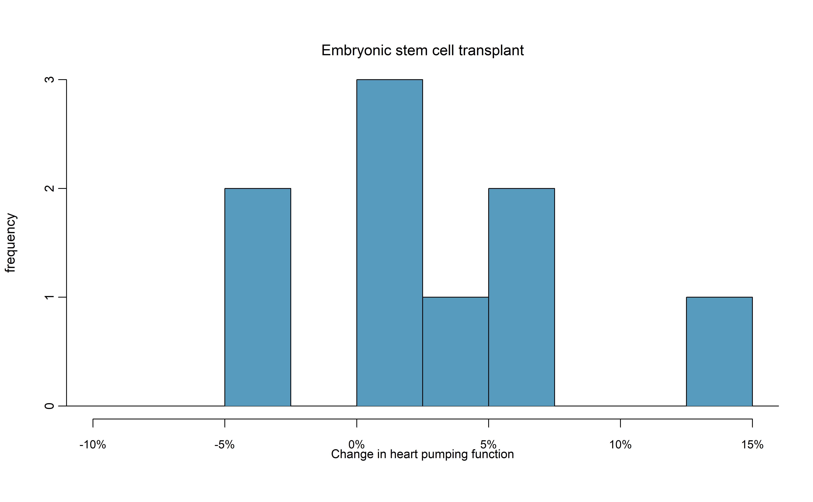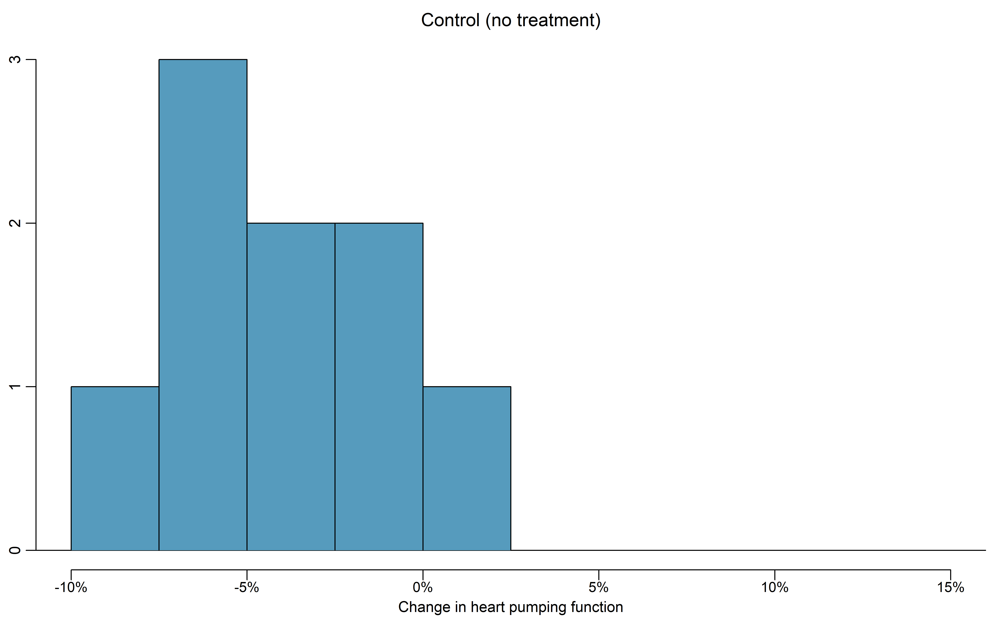
<p class="caption">(\#fig:stemCellTherapyForHearts)Histograms for both the embryonic stem cell and control group.</p>
</div>

The point estimate of the true difference in the mean heart pumping variable
is straightforward to find: it is the difference in the sample means.
$\bar{y}_{esc} - \bar{y}_{control}  = 3.50 - (-4.33) = 7.83$.

::: {.guidedpractice}
Identify the roles of the two variables in this study --- which variable is the explanatory variable and which is the response? What is the scope of inference for this study?^[Since the research question asks if ESCs help improve heart function, the explanatory variable is the treatment (ESC or control), and the response variable is the change in heart pumping capacity. Since sheep were randomly assigned to treatment groups, this study is a randomized experiment, and any changes in the mean response can be attributed to the treatment --- cause-and-effect conclusions can be made. However, since it is not clear if the sheep were a random sample from a larger population of sheep, we can only generalize to sheep similar to those seen in the sample.]
:::

### Variability of the statistic

As we saw in Section \@ref(two-prop-boot-ci), we will use bootstrapping to estimate the variability associated with the difference in sample means when taking repeated samples.  In a method akin to two proportions, a *separate* sample is taken with replacement from each group (here ESCs and control), the sample means are calculated, and their difference is taken.  The entire process is repeated multiple times to produce a bootstrap distribution of the difference in sample means (*without* the null hypothesis assumption).

Figure \@ref(fig:bootexamsci) displays the variability of the differences in sample means with the percentile bootstrap 90% confidence interval super imposed.


<div class="figure" style="text-align: center">
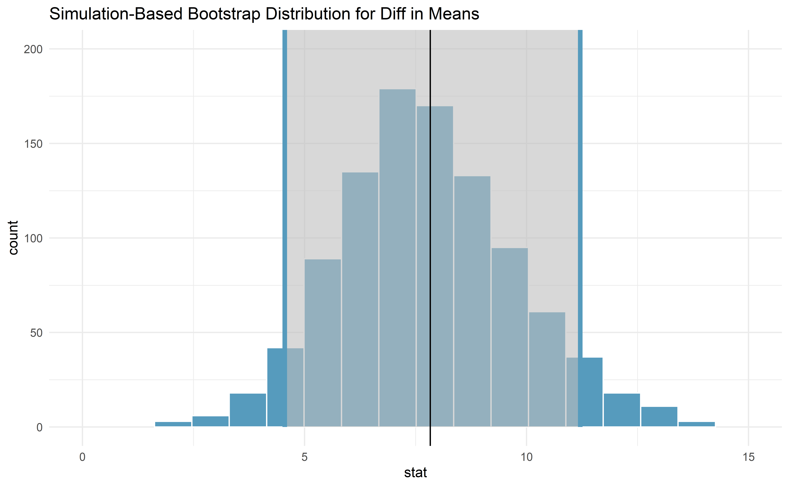
<p class="caption">(\#fig:bootexamsci)Histogram of differences in means after 1000 bootstrap resamples are taken from each of the two groups.  The observed difference in means from the original data is plotted as a black vertical line at 7.83.  The blue lines provide the percentile bootstrap 90% confidence interval for the difference in true population means.</p>
</div>

::: {.example}
Does the bootstrap confidence interval for the true difference in average change in pumping capacity, $\mu_{esc} - \mu_{control}$, show that there is a difference across the two treatments?
  
---
  
Because the 90% interval displayed does not contain zero (note that zero is never one of the bootstrapped differences so 95% and 99% intervals would have given the same conclusion!), we conclude that the ESC treatment is significantly better with respect to heart pumping capacity than the control.

Because the study is a randomized controlled experiment, we can conclude that it is the treatment (ESC) which is causing the change in pumping capacity.
:::


## Theory-based inferential methods for $\mu_1 - \mu_2$ {#math2samp}

As in the one-mean and paired mean difference scenarios, a difference in sample means can be modeled by a $t$-distribution under certain conditions. These conditions are the same as in the one-mean and paired mean difference scenarios, but now the conditions need to be met for *each sample*. Similarly, we will compute a test statistic and a theory-based confidence interval using the standard error formula for a difference in sample means.

\index{point estimate!difference of means|)}

::: {.onebox}
**Using the $t$-distribution for a difference in means.**

The $t$-distribution can be used for inference when working
  with the standardized difference of two means if
  
* *Independence* (extended).
    The data are independent within and between
    the two groups, e.g., the data come from
    independent random samples or from a
    randomized experiment and that there is no suggestion of groups or structure that connect observations across or within the groups.  
* *Normality*.
    We check the outliers for
    each group separately.

The standard error may be computed as
  \[
SE(\bar{y}_1 - \bar{y}_2) = \sqrt{\frac{s_1^2}{n_1} + \frac{s_2^2}{n_2}},
\]

The official formula for the degrees of freedom is quite
  complex and is generally computed using software,
  so instead you may use the smaller of
  $n_1 - 1$ and $n_2 - 1$ for the degrees of freedom
  if software isn't readily available.
::: 
\index{standard error (SE)!difference in means}


### $t$-test for $\mu_1 - \mu_2$

#### Observed data {-}

\index{data!baby\_smoke|(}

A dataset called `ncbirths` represents a random sample of 150 cases of mothers and their newborns in North Carolina over a year. Four cases from this data set are represented in Table \@ref(tab:babySmokeDF). We are particularly interested in two variables: `weight` and `smoke`. The `weight` variable represents the weights of the newborns and the `smoke` variable describes which mothers smoked during pregnancy. We would like to know, is there convincing evidence that newborns from mothers who smoke have a different average birth weight than newborns from mothers who don't smoke? We will use the North Carolina sample to try to answer this question. The smoking group includes 50 cases and the nonsmoking group contains 100 cases.


<table class="table" style="margin-left: auto; margin-right: auto;">
<caption>(\#tab:babySmokeDF)Four cases from the `ncbirths` data set. The value `NA`, shown for the first two entries of the first variable, indicates that piece of data is missing.</caption>
 <thead>
  <tr>
   <th style="text-align:right;"> fage </th>
   <th style="text-align:right;"> mage </th>
   <th style="text-align:right;"> weeks </th>
   <th style="text-align:right;"> visits </th>
   <th style="text-align:left;"> marital </th>
   <th style="text-align:right;"> gained </th>
   <th style="text-align:right;"> weight </th>
   <th style="text-align:left;"> gender </th>
   <th style="text-align:left;"> habit </th>
   <th style="text-align:left;"> whitemom </th>
  </tr>
 </thead>
<tbody>
  <tr>
   <td style="text-align:right;">  </td>
   <td style="text-align:right;"> 13 </td>
   <td style="text-align:right;"> 39 </td>
   <td style="text-align:right;"> 10 </td>
   <td style="text-align:left;"> not married </td>
   <td style="text-align:right;"> 38 </td>
   <td style="text-align:right;"> 7.63 </td>
   <td style="text-align:left;"> male </td>
   <td style="text-align:left;"> nonsmoker </td>
   <td style="text-align:left;"> not white </td>
  </tr>
  <tr>
   <td style="text-align:right;">  </td>
   <td style="text-align:right;"> 14 </td>
   <td style="text-align:right;"> 42 </td>
   <td style="text-align:right;"> 15 </td>
   <td style="text-align:left;"> not married </td>
   <td style="text-align:right;"> 20 </td>
   <td style="text-align:right;"> 7.88 </td>
   <td style="text-align:left;"> male </td>
   <td style="text-align:left;"> nonsmoker </td>
   <td style="text-align:left;"> not white </td>
  </tr>
  <tr>
   <td style="text-align:right;"> 19 </td>
   <td style="text-align:right;"> 15 </td>
   <td style="text-align:right;"> 37 </td>
   <td style="text-align:right;"> 11 </td>
   <td style="text-align:left;"> not married </td>
   <td style="text-align:right;"> 38 </td>
   <td style="text-align:right;"> 6.63 </td>
   <td style="text-align:left;"> female </td>
   <td style="text-align:left;"> nonsmoker </td>
   <td style="text-align:left;"> white </td>
  </tr>
  <tr>
   <td style="text-align:right;"> 21 </td>
   <td style="text-align:right;"> 15 </td>
   <td style="text-align:right;"> 41 </td>
   <td style="text-align:right;"> 6 </td>
   <td style="text-align:left;"> not married </td>
   <td style="text-align:right;"> 34 </td>
   <td style="text-align:right;"> 8.00 </td>
   <td style="text-align:left;"> male </td>
   <td style="text-align:left;"> nonsmoker </td>
   <td style="text-align:left;"> white </td>
  </tr>
</tbody>
</table>


::: {.example}
Set up appropriate hypotheses to evaluate
    whether there is a relationship between a mother smoking
    and average birth weight.

---

The null hypothesis represents the case of no difference
  between the groups.

* $H_0$: There is no difference in average birth weight for
      newborns from mothers who did and did not smoke.  
      In statistical notation: $H_0: \mu_{n} - \mu_{s} = 0$,
      where $\mu_{n}$ represents the true mean birth weight for babies of non-smoking mothers and
      $\mu_s$ represents the true mean birth weight for babies of mothers who smoked.  
      
The alternative hypothesis represents the research question.  

* $H_A$: There is some difference in average newborn weights
      from mothers who did and did not smoke ($\mu_{n} - \mu_{s} \neq 0$).
:::

#### Variability of the statistic {-}

We check the two conditions necessary to model the difference
in sample means using the $t$-distribution: the **independence** and **normality** conditions _for each sample_.

* Because these data come from a simple random sample and there is no reason to assume any connections in the responses across subjects,
    the observations can be assumed to be independent,
    both within and between samples.  
* With both data sets over 30 observations,
    we inspect the data in
    Figure \@ref(fig:babySmokePlotOfTwoGroupsToExamineSkew)
    for any particularly extreme outliers
    and find none.

Since both conditions are satisfied, the difference
in sample means may be modeled using a $t$-distribution.

<div class="figure" style="text-align: center">
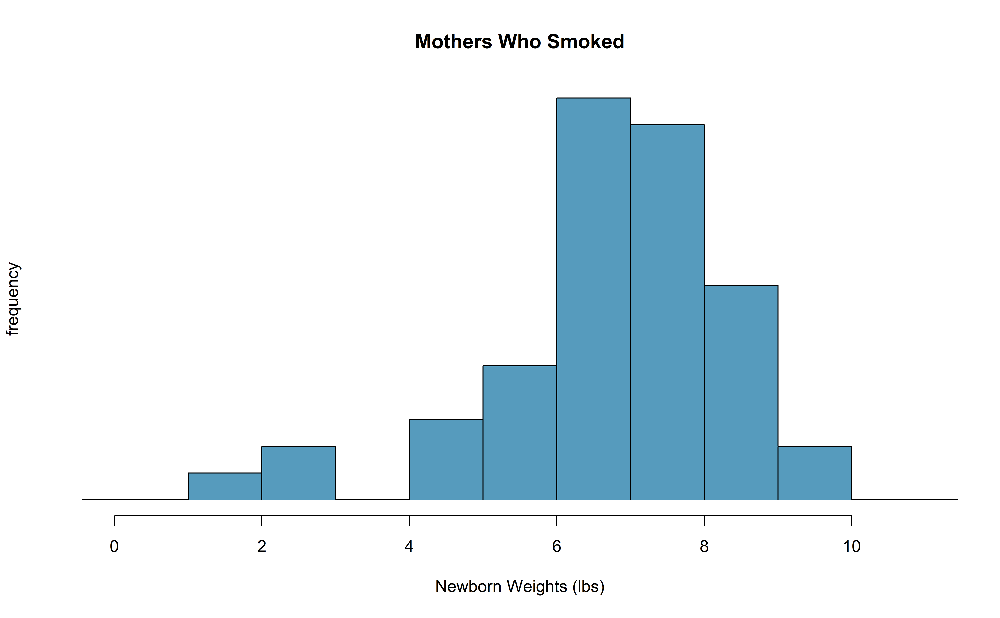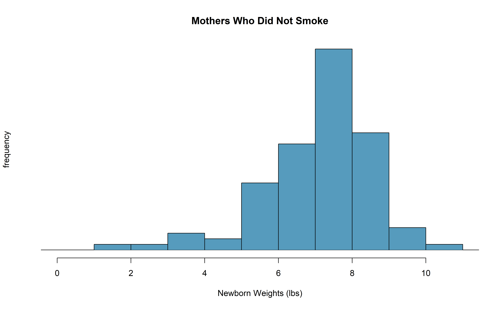
<p class="caption">(\#fig:babySmokePlotOfTwoGroupsToExamineSkew)The top panel represents birth weights for infants whose mothers smoked. The bottom panel represents the birth weights for infants whose mothers who did not smoke.</p>
</div>


::: {.guidedpractice}
The summary statistics in Table \@ref(tab:SumStatsBirthWeightNewbornsSmoke) may be useful
for this Guided Practice.^[(a) The difference in sample means is an
  appropriate point estimate: $\bar{y}_{n} - \bar{y}_{s} = 0.40$.
  (b) The standard error of the estimate can be
  calculated using the standard error formula:
  \begin{align*}
  SE
    = \sqrt{\frac{s_n^2}{n_n} + \frac{s_s^2}{n_s}}
    = \sqrt{\frac{1.60^2}{100} + \frac{1.43^2}{50}}
    = 0.26
  \end{align*}]

(a) What is the point estimate of the population difference,
    $\mu_{n} - \mu_{s}$?
(b) Compute the standard error of the point estimate from
    part a.
::: 


<table class="table" style="margin-left: auto; margin-right: auto;">
<caption>(\#tab:SumStatsBirthWeightNewbornsSmoke)Summary statistics for the `ncbirths` data set.</caption>
 <thead>
  <tr>
   <th style="text-align:left;">  </th>
   <th style="text-align:left;"> smoker </th>
   <th style="text-align:left;"> nonsmoker </th>
  </tr>
 </thead>
<tbody>
  <tr>
   <td style="text-align:left;"> mean </td>
   <td style="text-align:left;"> 6.78 </td>
   <td style="text-align:left;"> 7.18 </td>
  </tr>
  <tr>
   <td style="text-align:left;"> st. dev. </td>
   <td style="text-align:left;"> 1.43 </td>
   <td style="text-align:left;"> 1.60 </td>
  </tr>
  <tr>
   <td style="text-align:left;"> samp. size </td>
   <td style="text-align:left;"> 50 </td>
   <td style="text-align:left;"> 100 </td>
  </tr>
</tbody>
</table>


#### Observed statistic vs. null value {-}


::: {.onebox}
**The test statistic for comparing two means is a T.**
  
The T score is a ratio of how the groups differ as compared to how the observations within a group vary.
  
\begin{align*}
T = \frac{\bar{y}_1 - \bar{y}_2 - 0}{\sqrt{\frac{s_1^2}{n_1} + \frac{s_2^2}{n_2}}}
\end{align*}

When the null hypothesis is true and the conditions are met, T has a $t$-distribution with $df = min(n_1 - 1, n_2 -1)$.

Conditions:  
  
  * independent observations within and across groups  
  * large samples and no extreme outliers  
::: 


::: {.example}
Complete the hypothesis test started in the previous Example and Guided Practice on the `ncbirths` dataset and research question.  
    For reference, $\bar{y}_{n} - \bar{y}_{s} = 0.40$,
    $SE(\bar{y}_{n} - \bar{y}_{s}) = 0.26$, and the sample sizes were $n_n = 100$ and $n_s = 50$.

---
  
We can find the test statistic for this test
  using the previous information:
  \begin{align*}
  T = \frac{\ 0.40 - 0\ }{0.26} = 1.54
  \end{align*}
  The p-value is represented by the two shaded tails
  in Figure \@ref(fig:distOfDiffOfSampleMeansForBWOfBabySmokeData)

  We find the single tail area using software. (See R code below.) We'll use the
  smaller of $n_n - 1 = 99$ and $n_s - 1 = 49$ as the
  degrees of freedom: $df = 49$.
  The one tail area is 0.065;
  doubling this value gives the two-tail area and p-value,
  0.135.

  A p-value of 0.135 provides little to no evidence against the null hypothesis.
  There is insufficient evidence to say there is a difference
  in average birth weight of newborns from North Carolina mothers
  who did smoke during pregnancy and newborns from North Carolina
  mothers who did not smoke during pregnancy.
:::


``` r
pt(1.54, df = 49, lower.tail = FALSE)
#> [1] 0.065
```

<div class="figure" style="text-align: center">
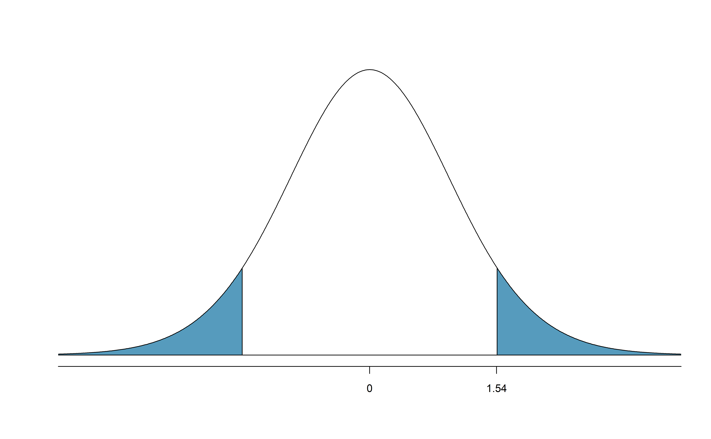
<p class="caption">(\#fig:distOfDiffOfSampleMeansForBWOfBabySmokeData)The mathematical model for the T statistic when the null hypothesis is true: a $t$-distribution with $min(100-1, 50-1) = 49$ degrees of freedom.  As expected, the curve is centered at zero (the null value).  The T score is also plotted with the area more extreme than the observed T score plotted to indicate the p-value.</p>
</div>


::: {.guidedpractice}
We've seen much research suggesting smoking is harmful
during pregnancy, so how could we fail to reject the null
hypothesis in the previous Example?^[It is possible that there is a difference
  but we did not detect it.
  If there is a difference, we made a Type 2 Error.]
::: 

::: {.guidedpractice}
If we made a Type 2 Error and there is a difference,
what could we have done differently in data collection
to be more likely to detect the difference?^[We could have collected more data.
  If the sample sizes are larger, we tend to have
  a better shot at finding a difference if one exists.
  In fact, this is exactly what we would find if we
  examined a larger data set!]
::: 

Public service announcement: while we have used this relatively
small data set as an example, larger data sets show that women
who smoke tend to have smaller newborns.
In fact, some in the tobacco industry actually had the audacity
to tout that as a *benefit* of smoking:

>  *It's true.
  The babies born from women who smoke are smaller,
  but they're just as healthy as the babies born from
  women who do not smoke.
  And some women would prefer having smaller babies.* 
    - Joseph Cullman, Philip Morris' Chairman of the Board on CBS' *Face the Nation*, Jan 3, 1971

Fact check: the babies from women who smoke are not actually
as healthy as the babies from women who do not
smoke.^[You can watch an episode of John Oliver
  on [*Last Week Tonight*](https://youtu.be/6UsHHOCH4q8) to explore the present day
  offenses of the tobacco industry.
  Please be aware that there is some adult language.]

<!--
% Resource on this topic:
% http://archive.tobacco.org/Documents/documentquotes.html
-->

\index{data!baby\_smoke|)}


### $t$ confidence interval for $\mu_1 - \mu_2$

::: {.onebox}
**Finding a $t$-confidence interval for a difference in population means, $\mu_1 - \mu_2$.**
  
  Based on two independent samples of $n_1$ and $n_2$ observational units, respectively, with no clear outliers, a confidence interval for a difference in population
  means is
  \begin{align*}
  \text{point estimate} \ &\pm\  t^{\star}_{df} \times SE(\text{point estimate}) \\
  &\to \\
  \bar{y}_1 - \bar{y}_2 \ &\pm\  t^{\star}_{df} \times \sqrt{\frac{s_1^2}{n_1} + \frac{s_2^2}{n_2}}
  \end{align*}
  where $\bar{y}_1$ and $\bar{y}_2$ are the two sample means, $t^{\star}_{df}$
  corresponds to the confidence level and degrees of freedom
  $df$, and $SE$ is the standard error as estimated by
  the sample.
::: 

::: {.example}
Consider again the data from Section \@ref(boot-ci-diff-means) on the use of embryonic stem cells (ESCs) to improve heart function. Can the $t$-distribution be used to make
    inference on the true difference in average change in heart pumping function using the point estimate,
    $\bar{y}_{esc} - \bar{y}_{control} = 7.83$?
      
---

First, we check for independence.
  Because the sheep were randomized into
  the groups to get the treatments and there is no information on groups or clusters of sheep[^sheep-independence-1], independence within
  and between groups is satisfied.

[^sheep-independence-1]: Violations for the independence assumption could come from having sheep that are from different research facilities, different pens or fields in the same facility, or even different sheep breeds that might systematically differ.

  Figure \@ref(fig:stemCellTherapyForHearts)
  does not reveal any clear outliers
  in either group.
  (The ESC group does have a bit more variability,
  but this is not the same as having clear outliers.)

  With both conditions met, we can use the
  $t$-distribution to model the difference of sample means.
:::


Generally, we use statistical software to find the appropriate
degrees of freedom using the raw data, or if software isn't available,
we can use the smaller
of $n_1 - 1$ and $n_2 - 1$ for the degrees of freedom.
In the case of the ESC example, this means we'll use $df = 8$.

::: {.example}
Calculate a 95% confidence interval for the
    true difference in mean change in heart pumping capacity of
    sheep after they've suffered a heart attack between the ESC treatment and the control treatment.

---

First, compute the point estimate and its standard error:
  \begin{align*}
  \bar{y}_{esc} - \bar{y}_{control} &= 3.50 - (-4.33) = 7.83\\   
  SE(\bar{y}_{esc} - \bar{y}_{control}) &= \sqrt{\frac{5.17^2}{9} + \frac{2.76^2}{9}} = 1.95
  \end{align*}
  Using $df = 8$, we can identify the
  critical value of $t^{\star}_{8} = 2.31$
  for a 95%  confidence interval. (See R code below.)
  Finally, we can enter the values into the confidence
  interval formula:
  \begin{align*}
   7.83 \ \pm\ 2.31\times 1.95
    \quad\rightarrow\quad (3.32, 12.34)
  \end{align*}
  We are 95%  confident that embryonic stem cells improve
  the mean change in heart's pumping function in sheep that have suffered
  a heart attack by 3.32%  to 12.34%.
:::


``` r
qt(0.975, df = 8)
#> [1] 2.31
```

\index{data!stem cells, heart function|)}


## Chapter review {#chp19-review}

<!-- ### Summary {-} -->

<!-- ::: {.underconstruction} -->
<!-- TODO -->
<!-- ::: -->

### Summary of t-procedures {-}

In the past three chapters, we have seen the $t$-distribution applied as the appropriate mathematical model in three distinct settings.  Although the three data structures are different, their similarities and differences are worth pointing out.  We provide Table \@ref(tab:tcompare) partly as a mechanism for understanding $t$-procedures and partly to highlight the extremely common usage of the $t$-distribution in practice. You will often hear the following three $t$-procedures referred to as a **one sample $t$-test** ($t$-interval), **paired $t$-test** ($t$-interval), and **two sample $t$-test** ($t$-interval).


<table class="table" style="margin-left: auto; margin-right: auto;">
<caption>(\#tab:tcompare)Similarities of $t$-methods across one sample, paired sample, and two independent samples analysis of a numeric response variable.</caption>
 <thead>
  <tr>
   <th style="text-align:left;">  </th>
   <th style="text-align:left;">  one sample  </th>
   <th style="text-align:left;"> paired sample </th>
   <th style="text-align:left;"> two indep. samples </th>
  </tr>
 </thead>
<tbody>
  <tr>
   <td style="text-align:left;"> response variable </td>
   <td style="text-align:left;"> numeric </td>
   <td style="text-align:left;"> numeric </td>
   <td style="text-align:left;"> numeric </td>
  </tr>
  <tr>
   <td style="text-align:left;"> explanatory variable </td>
   <td style="text-align:left;"> none </td>
   <td style="text-align:left;"> binary </td>
   <td style="text-align:left;"> binary </td>
  </tr>
  <tr>
   <td style="text-align:left;"> parameter of interest </td>
   <td style="text-align:left;"> mean: $\mu$ </td>
   <td style="text-align:left;"> paired mean diff: $\mu_d$ </td>
   <td style="text-align:left;"> diff in means: $\mu_1 - \mu_2$ </td>
  </tr>
  <tr>
   <td style="text-align:left;"> statistic of interest </td>
   <td style="text-align:left;"> mean: $\bar{y}$ </td>
   <td style="text-align:left;"> paired mean diff: $\bar{y}_d$ </td>
   <td style="text-align:left;"> diff in means: $\bar{y}_1 - \bar{y}_2$ </td>
  </tr>
  <tr>
   <td style="text-align:left;"> standard error </td>
   <td style="text-align:left;"> $\frac{s}{\sqrt{n}}$ </td>
   <td style="text-align:left;"> $\frac{s_d}{\sqrt{n}}$ </td>
   <td style="text-align:left;"> $\sqrt{\frac{s_1^2}{n_1} + \frac{s_2^2}{n_2}}$ </td>
  </tr>
  <tr>
   <td style="text-align:left;"> degrees of freedom </td>
   <td style="text-align:left;"> $n-1$ </td>
   <td style="text-align:left;"> $n -1$ </td>
   <td style="text-align:left;"> $\min(n_1 -1, n_2 - 1)$ </td>
  </tr>
  <tr>
   <td style="text-align:left;"> conditions </td>
   <td style="text-align:left;"> 1. independence, 2. normality or large samples </td>
   <td style="text-align:left;"> 1. independence, 2. normality or large samples </td>
   <td style="text-align:left;"> 1. independence, 2. normality or large samples </td>
  </tr>
  <tr>
   <td style="text-align:left;"> Theory-based R functions </td>
   <td style="text-align:left;"> t.test </td>
   <td style="text-align:left;"> t.test </td>
   <td style="text-align:left;"> t.test </td>
  </tr>
  <tr>
   <td style="text-align:left;"> Simulation-based R catstats functions </td>
   <td style="text-align:left;"> paired_test, paired_bootstrap_CI </td>
   <td style="text-align:left;"> paired_test, paired_bootstrap_CI </td>
   <td style="text-align:left;"> two_mean_test, two_mean_bootstrap_CI </td>
  </tr>
</tbody>
</table>


**Hypothesis tests.** When applying the $t$-distribution for a hypothesis test involving means, we proceed as follows:

1. Write appropriate hypotheses.  
2. Verify conditions for using the $t$-distribution.  
    * **Independence.** Observational units must be independent. This is typically true if the data came from a random sample (or two random samples, or one random sample randomly assigned to two treatments) but you should always consider the context of the study and data collection process.
   * **Normality.** If the sample size is less than 30 and there are no clear outliers in the data, or if the sample size is at least 30
      and there are no *particularly extreme* outliers,
      then we can apply the $t$-distribution for a hypothesis tests of means. For a difference of means when the data are not paired, this condition must be met for each of the two samples.  

3. Compute the statistic of interest, the standard error, and the degrees of freedom. For $df$, use $n-1$ for one sample, and for two samples use either statistical software or the smaller of $n_1 - 1$ and $n_2 - 1$.  
4. Compute the T-score using the general formula:
    \[
    T = \frac{\mbox{statistic} - \mbox{null value}}{\mbox{standard error of the statistic}} = \frac{\mbox{statistic} - \mbox{null value}}{SE(\mbox{statistic})}
    \]
5. Use the statistical software to find the p-value using the appropriate $t$-distribution:
    - Sign in $H_A$ is $<$: p-value = area below T-score
    - Sign in $H_A$ is $>$: p-value = area above T-score
    - Sign in $H_A$ is $\neq$: p-value = 2 $\times$ area below $-|\mbox{T-score}|$
6. Make a conclusion based on the p-value, and write a conclusion in context, in plain language, and in terms of the alternative hypothesis.

**Confidence intervals.** Similarly, the following is how we generally computed a confidence interval using a $t$-distribution:

1. Verify conditions for using the $t$-distribution. (See above.)  
2. Compute the point estimate of interest, the standard error, the degrees of freedom, and $t^{\star}_{df}$.  The multiplier for a $(1-\alpha)\times100$% confidence interval can be found in R by: `qt(1-(alpha/2), df)`. For example, $t^{\star}_{10}$ with 95% confidence is `qt(0.975, 10)` = 2.228.
3. Calculate the confidence interval using the general formula:
    \[
    \mbox{statistic} \pm\ t_{df}^{\star} SE(\mbox{statistic}).
    \]
4. Put the conclusions in context and in plain language so even non-data scientists can understand the results.


### Terms {-}

We introduced the following terms in the chapter. If you're not sure what some of these terms mean, we recommend you go back in the text and review their definitions. We are purposefully presenting them in alphabetical order, instead of in order of appearance, so they will be a little more challenging to locate. However you should be able to easily spot them as **bolded text**.

<table class="table table-striped table-condensed" style="margin-left: auto; margin-right: auto;">
<tbody>
  <tr>
   <td style="text-align:left;"> one sample $t$-test </td>
   <td style="text-align:left;"> paired $t$-test </td>
   <td style="text-align:left;"> two sample $t$-test </td>
  </tr>
</tbody>
</table>


<!-- ### Key ideas {-} -->

<!-- ::: {.underconstruction} -->
<!-- TODO -->
<!-- ::: -->

