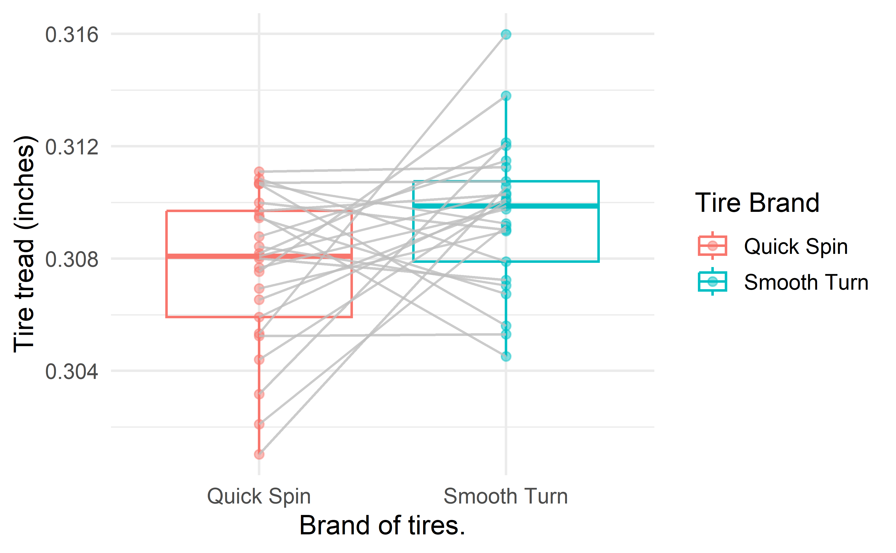
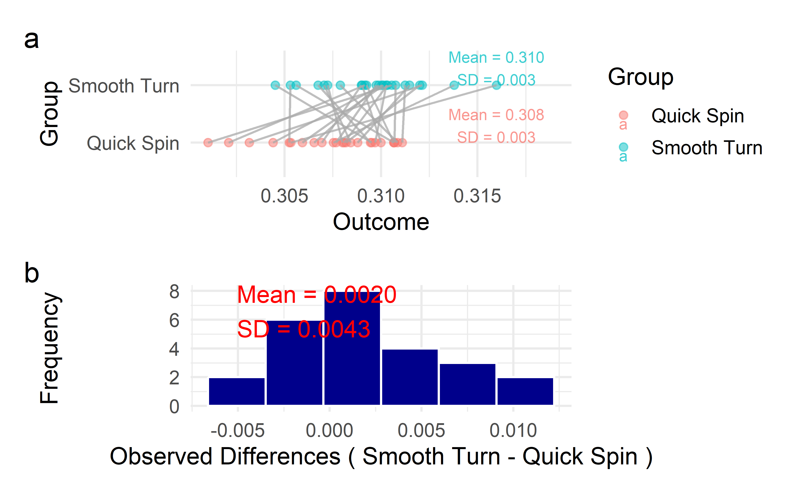
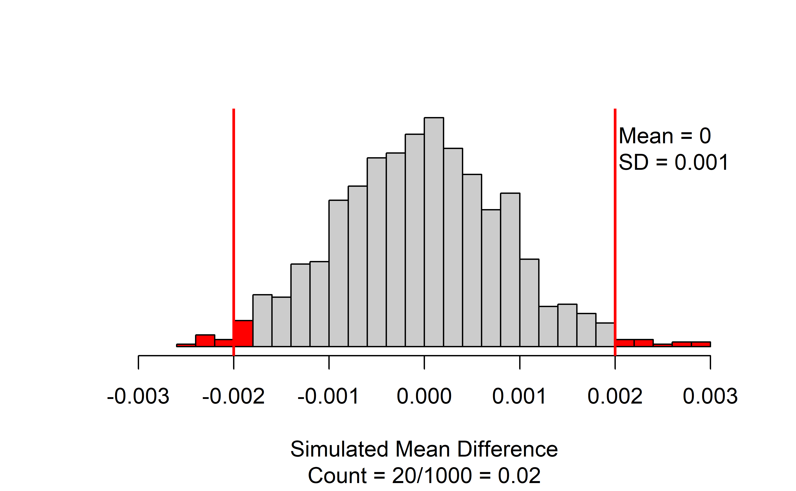
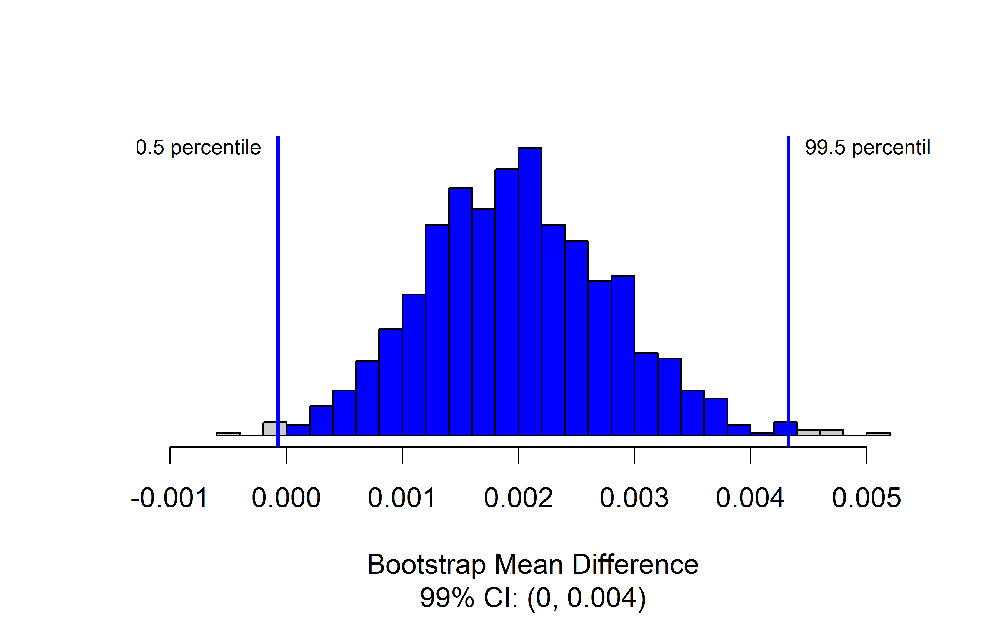
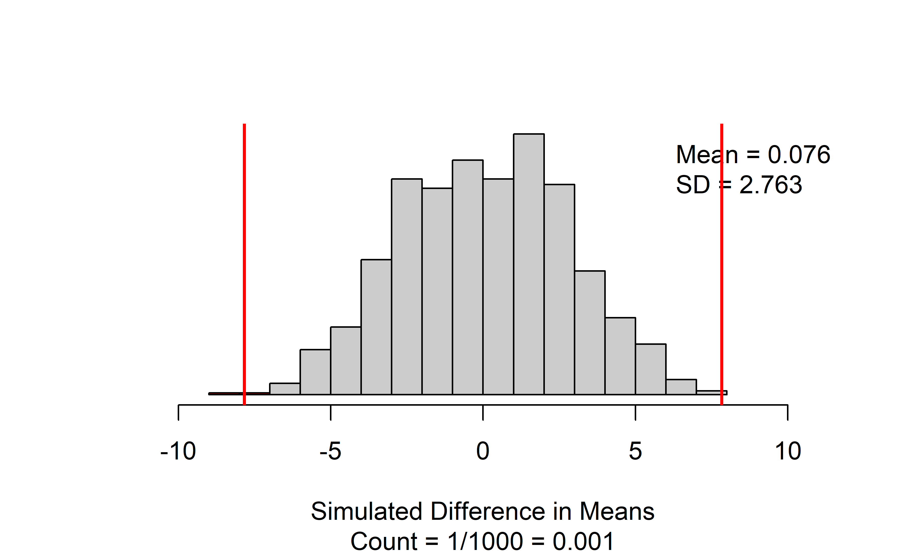
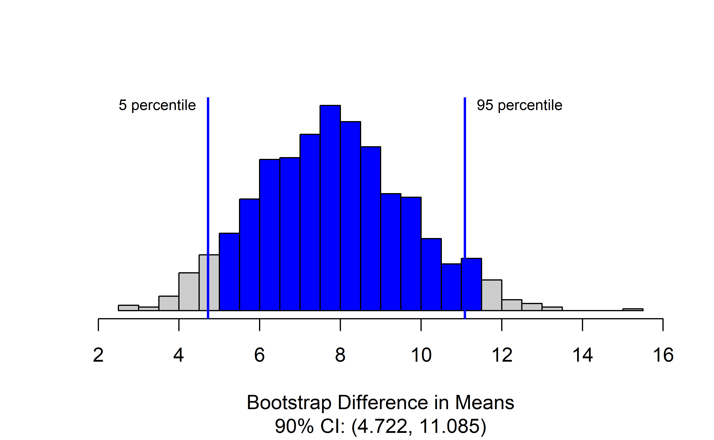

# Applications: Infer quantitative  {#inference-num-applications}


::: chapterintro
Coming soon!
:::


<!-- ::: {.underconstruction} -->
<!-- Old content - revise as needed -->
<!-- ::: -->

<!-- ```{block2, type="todo", echo=TRUE} -->
<!-- Section on doing inference for categorical data in R. -->

<!-- - Simulation functions in catstats -->
<!-- - `t.test` -->

<!-- ``` -->

## Inference for quantitative data using R and `catstats`

### Using the $t$-distribution {-} 

First, we'll review how to obtain probabilities and critical values for the $t$-distribution using R.  If you have a $t$-statistic and degrees of freedom, you can find the probability under the $t$-distribution corresponding to a one- or two-tailed hypothesis test using `pt()` (short for "probability from $t$-distribution").

The tricky part is making sure you get the correct area under the distribution.  For our example, assume we have 12 degrees of freedom.  If your $t$-statistic is positive, say $t = 1.33$:

``` r
#Area less than observed:
pt(1.33, df = 12)
#> [1] 0.896

#Area greater than observed:
1-pt(1.33, df = 12)
#> [1] 0.104

#Area at least as large as observed:
2*(1-pt(1.33, df = 12))
#> [1] 0.208
```

If your $t$-statistic is negative, say $t = -2.75$:

``` r
#Area less than observed:
pt(-2.75, df = 12)
#> [1] 0.0088

#Area greater than observed:
1-pt(-2.75, df = 12)
#> [1] 0.991

#Area at least as large as observed:
2*pt(-2.75, df = 12)
#> [1] 0.0176
```

The difference comes in when you want the area further than $t$ units from 0: if $t$ is positive, then "further" is greater than $t$ and less than negative $t$, or double the area greater than $t$, since the $t$-distribution is symmetric.  If $t$ is negative, then "further" is less than $t$ and greater than positive $t$, or double the area less than $t$.

To find $t^*_{df}$ using R, we use the `qt()` function (short for "quantile of $t$-distribution").  You will need the degrees of freedom and the confidence level for your confidence interval.  Suppose we have 27 degrees of freedom and want a 99\% confidence interval.  To get the middle 99\% of the $t$-distribution, we need to have the cutoff at 0.5\% and 99.5\%:

```
#> [1] -2.77
#> [1] 2.77
```


### Simulation-based inference for paired mean difference {-}

Simulation-based inference for quantitative data will use functions in the `catstats` package, as we did for categorical data.  


``` r
library(catstats)
```

The `catstats` functions for paired data assume that the values for the two groups are in separate columns in a data frame.  We'll work through an example using the tire wear data, which is currently stored in "long format", with one variable for brand and another for tread depth.  First, we'll convert it to "wide format", with a column for each brand. 




``` r
tiresWide <- tires %>% 
  select(brand, tread, car) %>%   #select only ID, group, and outcome vars
  pivot_wider(names_from = brand,   #name of variable for group
              values_from = tread)  #name of variable for outcome
tiresWide <- as.data.frame(tiresWide)
```

Once we have this format, all the paired data functions in `catstats` should be able to handle the data.  First, we can get a look at the pairs of observations that were in the second and third columns of the dataset:

``` r
paired_observed_plot(tiresWide %>% select(`Smooth Turn`, `Quick Spin`),
                     which_first = 1,
                     gg = T)
```



This gives us an idea of the distributions within groups and the differences within pairs. To perform the hypothesis test for a difference in tread depth after 1000 miles, we use the `paired_test()` function:

``` r
paired_test(
  data = tiresWide,  #data frame with observed values in groups
  shift = -0.002,  #amount to shift differences to bootstrap null distribution
  direction = "two-sided",  #Direction of hypothesis test
  as_extreme_as = 0.002, #Observed statistic
  number_repetitions = 1000,  #number of bootstrap draws for null distribution
  which_first = 1  #Which column is first in order of subtraction: 1 or 2?
)
```

Note that `data` could also be a vector of differences.  If this is all you have, you can do hypothesis testing and generate a confidence interval, but won't be able to use `paired_observed_plot()`.  Now let's take a look at the output of the function:


``` r
set.seed(1054)
paired_test(
  data = tiresWide,  #data frame with observed values in groups
  shift = -0.002,  #amount to shift differences to bootstrap null distribution
  direction = "two-sided",  #Direction of hypothesis test
  as_extreme_as = 0.002, #Observed statistic
  number_repetitions = 1000,  #number of bootstrap draws for null distribution
  which_first = 1  #Which column is first in order of subtraction: 1 or 2?
)
```



This figure displays the bootstrapped null distribution, with the mean and standard deviation of the draws in the upper right corner. We want to see that the mean is close to the null value (almost always zero).  If it isn't, check the value of the `shift` input, and/or increase the `number_repetitions` if the shift is correct.

The red lines give the cutoffs based on the observed statistic, and values as or more extreme are colored red.  If you are doing a one-sided test, there will only be one line.  The caption of the figure gives the number and proportion of bootstrapped mean differences that are as or more extreme than the observed statistic.  In this case, 20 out of 1000, for a p-value of 0.02.

Finally, we will want to generate a confidence interval for the true mean difference using the `paired_bootstrap_CI()` function.

``` r
set.seed(2374)
paired_bootstrap_CI(
  data = tiresWide,   #Wide-form data set or vector of differences
  number_repetitions = 1000,   #number of draws for bootstrap distribution
  confidence_level = 0.99,  #Confidence level as a proportion
  which_first = 1  #Order of subtraction: 1st or 2nd set of values come first?
)
```



Here we again have a bootstrap distribution, but now it is the bootstrap distribution of the mean difference itself, rather than a bootstrapped null distribution for the mean difference.  We've requested a 99% confidence interval, so the relevant percentiles of the bootstrap distribution are highlighted, and the interval itself is given in the caption.  In this case, we are 99% confident that the true mean difference in tire tread is between 0 and 0.004 inches greater for Smooth Turn.

### Theory-based inference for paired mean difference {-} 

To implement theory-based inference for a paired mean difference in R, we use the `t.test()` function.  As an example, we'll use the textbook cost data from Chapter \@ref(inference-paired-means).  There are two ways to put in paired data for a t-test using `t.test()`.  First, we could have the prices of the two groups in two separate variables (in this case, `bookstore_new` and `amazon_new`): 


``` r
t.test(x = ucla_textbooks_f18$bookstore_new, #Outcomes for one of each pair
       y = ucla_textbooks_f18$amazon_new,  #Outcomes for other of each pair
       paired = TRUE,  #Tell it to do a paired t-test!!
       alternative = "greater",  #Direction of alternative 
       conf.level = 0.95  #confidence level for interval as a proportion
)
```

Important things to note here:

* You must include `paired = TRUE` in your options, or it will do a two-sample t-test.
* As with categorical data in Chapters \@ref(inference-one-prop) and \@ref(inference-two-props), if you have a one-sided alternative, you will need to re-run the `t.test()` with a two-sided alternative to get the correct confidence interval

Now let's take a look at the output of the call:

``` r
t.test(x = ucla_textbooks_f18$bookstore_new, #Outcomes for first in order of subtraction
       y = ucla_textbooks_f18$amazon_new,  #Outcomes for second in order of subtraction
       paired = TRUE,  #Tell it to do a paired t-test!!
       alternative = "greater",  #Direction of alternative 
       conf.level = 0.95  #confidence level for interval as a proportion
)
#> 
#> 	Paired t-test
#> 
#> data:  ucla_textbooks_f18$bookstore_new and ucla_textbooks_f18$amazon_new
#> t = 2, df = 67, p-value = 0.02
#> alternative hypothesis: true mean difference is greater than 0
#> 95 percent confidence interval:
#>  0.868   Inf
#> sample estimates:
#> mean difference 
#>            3.58
```

The output tells you right on top that this is a paired test - if it doesn't, check that you have `paired = TRUE` in your function call.  The next line gives the t-statistic of 2.20, the degrees of freedom df = 67, and the p-value of 0.0156 (You can look back at Section \@ref(paired-mean-math) to see that these are the same values obtained in the example). The point estimate for the mean difference is the final entry: on average, new bookstore books cost $3.58 more than the same books new from Amazon.

The confidence interval given is a one-sided confidence interval, since we have a one-sided alternative.  We need to re-run with `alternative = "two.sided"` to get the correct interval for the true mean difference in price of \$0.33 to \$6.83 greater cost when buying from the UCLA Bookstore compared to buying from Amazon.  

```
#> 
#> 	Paired t-test
#> 
#> data:  ucla_textbooks_f18$bookstore_new and ucla_textbooks_f18$amazon_new
#> t = 2, df = 67, p-value = 0.03
#> alternative hypothesis: true mean difference is not equal to 0
#> 95 percent confidence interval:
#>  0.334 6.832
#> sample estimates:
#> mean difference 
#>            3.58
```

You might also have a single variable in your dataset that contains the differences within pairs: we will create this for the textbook data in a variable called `price_diff`.  This format is also usable with the `t.test()` function:

``` r
ucla_textbooks_f18 %>% 
  mutate(price_diff = bookstore_new-amazon_new)

t.test(x = ucla_textbooks_f18$price_diff,   #variable with differences
       alternative = "greater",  #direction of alternative hypothesis
       conf.level = 0.95)  #confidence level as a proportion
```

This requires two fewer arguments:

* No `y` input, since the differences are contained in a single variable
* No `paired = TRUE`, since we have already accounted for the pairing by taking the differences.

The output for this will look almost identical to the two-variable version above:

``` r
ucla_textbooks_f18 <- ucla_textbooks_f18 %>% 
  mutate(price_diff = bookstore_new-amazon_new)

t.test(x = ucla_textbooks_f18$price_diff,   #variable with differences
       alternative = "greater",  #direction of alternative hypothesis
       conf.level = 0.95)  #confidence level as a proportion
#> 
#> 	One Sample t-test
#> 
#> data:  ucla_textbooks_f18$price_diff
#> t = 2, df = 67, p-value = 0.02
#> alternative hypothesis: true mean is greater than 0
#> 95 percent confidence interval:
#>  0.868   Inf
#> sample estimates:
#> mean of x 
#>      3.58
```

Since we only input one variable, `t.test()` treats it as a one-sample t-test, but note that this works just fine: the t-statistic, df, p-value, confidence interval, and estimated mean are all the same as when we put in the two groups separately and indicated they were paired.

### Simulation-based inference for the difference of two means {-} 

We can perform simulation-based inference for a difference in means using the `two_mean_test()` and `two_mean_bootstrap_CI()` functions in the `catstats` package.  As a working example, let's look at the embryonic stem cell data from Section \@ref(rand2mean).

``` r
#load data from openintro package
data (stem_cell)

#Compute change in pumping capacity
stem_cell <- stem_cell %>%
  mutate(change = after - before)
```

To perform the simulation-based test for the difference in the mean change in heart pumping capacity, we will use the `two_mean_test()` function in the `catstats` package, which is very similar to the use of the `two_proportion_test()` function in Chapter \@ref(inference-categ-applications):

``` r
set.seed(4750)
two_mean_test(
  formula = change ~ trmt,  #Always use response ~ explanatory
  data = stem_cell,  # name of data set
  first_in_subtraction = "esc",  #value of group variable to be 1st in subtraction
  direction = "two-sided",  #direction of alternative
  as_extreme_as = 7.833,  #observed statistic
  number_repetitions = 1000  #number of simulations
)
```



The results give a side-by-side boxplot of the observed data with the observed difference and order of subtraction at the top.  Check that you had the right value for the observed difference!  Next to the box plot, we have the null distribution of simulated differences in means, with the observed statistic marked with a vertical red line, and all values as or more extreme than the observed statistic colored red.  The figure caption gives the approximate p-value: for this set of 1000 simulations, we have only 1/1000 = 0.001.

::: {.importantbox}
There are a couple of things to note when using the `two_mean_test` function:

* You need to identify which variable is your response and which your explanatory variable using the `formula` argument.
* Specify order of subtraction using `first_in_subtraction` by putting in EXACTLY the category of the explanatory variable that you want to be first, in quotes --- must match capitalization, spaces, etc. for text values!
:::

We use bootstrapping to find a confidence interval for the true difference in means with the `two_mean_bootstrap_CI()` function.  The arguments will be very similar to `two_mean_test()`, with the addition of the confidence level.


``` r
set.seed(450)
two_mean_bootstrap_CI(
  formula = change ~ trmt,  #Always use response ~ explanatory
  data = stem_cell,  # name of data set
  first_in_subtraction = "esc",  #value of group variable to be 1st in subtraction
  confidence_level = 0.9, #confidence level as a proportion
  number_repetitions = 1000  #number of bootstrap samples
)
```



The function produces the bootstrap distribution of the difference in means, with the upper and lower percentiles of the confidence range marked with vertical lines.  The figure caption gives the estimated confidence interval.  In this case, we are 90% confidence that ESCs increase the change in heart pumping capacity by between 4.72 and 11.09 percentage points on average. 

### Theory-based inference for the difference of two means {-} 

To demonstrate theory-based methods in R for a difference in means, we will continue use the embryonic stem cell data.  Something to keep in mind as we work through the example: are theory-based methods appropriate here?  Are the results different than the results from the simulation-based methods?

To perform theory-based inference, we will again use the `t.test()` function in R.  Remember that we sometimes need to change the reference category of the explanatory variable to have the correct order of subtraction - in this case, the default is `ctrl - esc`, since `ctrl` is first alphabetically.  We can get our preferred order of subtracation of `esc-ctrl` this way:

``` r
stem_cell$trmt <- relevel(stem_cell$trmt, ref = "esc")
```


``` r
t.test(stem_cell$change ~ stem_cell$trmt, #Always use response ~ explanatory
       alternative = "two.sided", # Direction of alternative
       conf.level = 0.9)  #confidence level as a proportion
#> 
#> 	Welch Two Sample t-test
#> 
#> data:  stem_cell$change by stem_cell$trmt
#> t = 4, df = 12, p-value = 0.002
#> alternative hypothesis: true difference in means between group esc and group ctrl is not equal to 0
#> 90 percent confidence interval:
#>   4.35 11.31
#> sample estimates:
#>  mean in group esc mean in group ctrl 
#>               3.50              -4.33
```

The results here should look familiar from the paired t-test above. We have the t-statistic, degrees of freedom, p-values, confidence interval, and group-specific means.  The degrees of freedom may look a little strange - remember that the correct formula is very complex! - here we obtain 12.225 df.  If you were computing the results by hand using `pt()` and `qt()` as we saw earlier in this section, you would use 8 df, since $n_1 -1 = n_2 -1 = 8$.  In the end, we conclude that there is strong evidence against the null hypothesis of no difference in the mean change in heart pumping capacity (p = 0.002).

Remember that if you have a one-sided alternative, you will need to run `t.test()` with a two-sided alternative to get the correct confidence interval!  Your reminder will be an `Inf` in the confidence interval results, which means R is computing a one-sided confidence interval.  Here, we have a two-sided alternative, so we can use the CI as reported: we are 90% confident that the true average improvement in heart pumping capacity due to ESCs is between 4.35 and 11.31 percentage points.


## `catstats` function summary

In the previous section, you were introduced to four new R 
functions in the `catstats` library. Here we provide a summary of 
these functions, plus a summary of the `paired_observed_plot` 
function that can be used to plot paired data. You can also access 
the help files for these functions using the `?` command. For 
example, type `?paired_test` into your R console to bring up the 
help file for the `paired_test` function.
<br>
    
1. `paired_observed_plot`: Produce plot of observed matched pairs data. (Note: Input must be observed value for each member of the pair, not differences.)

    * `data` = two-column data frame, with values for each group in the two columns

2. `paired_test`: Simulation-based hypothesis test for a paired mean difference.  

    * `data` = vector of observed differences; or two-column data frame, with values for each group in the two columns
    * `which_first` = name of group which should be first in order of subtraction (if data are two-column data frame)  
    * `shift` = amount to shift differences for bootstrapping of null distribution
    * `direction` = one of `"greater"`, `"less"`, or `"two-sided"` (quotations are important here!) to match the sign in $H_A$
    * `as_extreme_as` = value of observed statistic
    * `number_repetitions` = number of simulated samples to generate (should be at least 1000!)
<br>
    
3. `paired_bootstrap_CI`: Bootstrap confidence interval for a paired mean difference.  

    * `data` = vector of observed differences; or two-column data frame, with values for each group in the two columns
    * `which_first` = name of group which should be first in order of subtraction (if data are two-column data frame)  
    * `confidence_level` = confidence level as a decimal (e.g., 0.90, 0.95, etc)
    * `number_repetitions` = number of simulated samples to generate (should be at least 1000!)
<br>
    
4. `two_mean_test`: Simulation-based hypothesis test for a difference in two means.  

    * `formula` = `y ~ x` where `y` is the name of the quantitative response variable in the data set and `x` is the name of the binary explanatory variable
    * `data` = name of data set
    * `first_in_subtraction` = category of the explanatory variable which should be first in subtraction, written in quotations
    * `direction` = one of `"greater"`, `"less"`, or `"two-sided"` (quotations are important here!) to match the sign in $H_A$
    * `as_extreme_as` = value of observed difference in proportions
    * `number_repetitions` = number of simulated samples to generate (should be at least 1000!)
<br>
       
5. `two_mean_bootstrap_CI`: Bootstrap confidence interval for a difference in two means.  

   * `formula` = `y ~ x` where `y` is the name of the quantitative response variable in the data set and `x` is the name of the binary explanatory variable
    * `data` = name of data set
    * `first_in_subtraction` = category of the explanatory variable which should be first in subtraction, written in quotations
    * `confidence_level` = confidence level as a decimal (e.g., 0.90, 0.95, etc)
    * `number_repetitions` = number of simulated samples to generate (should be at least 1000!)

