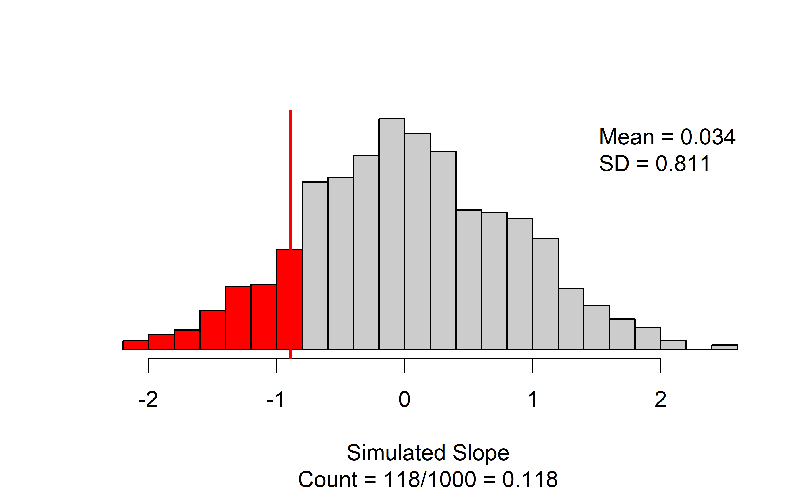
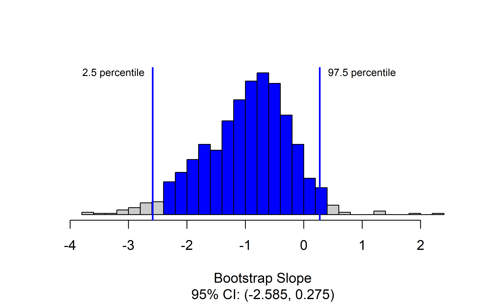

# Applications: Infer regression {#inference-reg-applications}


<!-- TODO: Add vocab words to this chapter. -->

::: {.chapterintro}
Coming soon!
:::

<!-- ::: {.underconstruction} -->
<!-- Old content - revise as needed -->
<!-- ::: -->

## Inference for regression using R and `catstats`

### Simulation-based inference for the regression slope {-} 

As a demonstration, we will apply the simulation-based inference functions for regression in the `catstats` package to our data on the change in House seats in the President's party at midterm elections as a function of national unemployment rate.  We need to drop the Great Depression years before we perform our simulations:

``` r
#load data
data(midterms_house)
#Drop Great Depression years
d <- midterms_house %>% 
  filter(!(year %in% c(1935, 1939)))
```

Now that we have the correct data, we can perform a randomization test of the slope in the simple linear regression.

``` r
library(catstats)
set.seed(621311)
regression_test(
  formula = house_change ~ unemp,  #Always use response ~ explanatory
  data = d,  #name of data set
  summary_measure = "slope", #Can also test correlation
  direction = "less", #Direction of alternative hypothesis
  as_extreme_as = -0.89, #Observed slope
  number_repetitions = 1000  #Number of simulations
)
```



The results give a scatterplot of the observed data with the regression line superimposed, and gives the observed slope (this should match what you put in for `as_extreme_as`).  Next to the scatterplot, we have the null distribution of the slope coefficient, with the observed slope indicated by a vertical line and all values more extreme highlighted in red.  The caption gives the number of simulations resulting in a slope more extreme than the observed: in this simulation we have 118/1000, for an approximate p-value of 0.118.

To obtain a confidence interval for the slope, we use `regression_bootstrap_CI()`, with the same core arguments as `regression_test()`.

``` r
set.seed(31143518)
regression_bootstrap_CI(
  formula = house_change ~ unemp,  #Always use response ~ explanatory
  data = d,  #name of data set
  summary_measure = "slope", #Can also test correlation
  confidence_level = 0.95, #confidence level as a proportion
  number_repetitions = 1000  #Number of simulations
)
```



Here we have the bootstrap distribution of the slope based on the observed data, with the upper and lower bounds of the confidence interval highlighted in red.  The confidence interval is also given in the caption of the figure.  Here, we are 95% confident that the true change in the number of seats in the House of Representatives for each additional percentage point in unemployment is between a decrease of 2.6 percent of seats and an increase of 0.3 percent of seats.

Notice that the bootstrap distribution is not symmetric for this example! Because of this, the bootstrap confidence interval is different from what we would obtain from theory-based methods: (-2.6, 0.8).  This is because the LINE technical conditions are not all satisfactorily met, though this is hard to see from the scatterplot for these data.

### Theory-based inference for the regression slope {-} 

To demonstrate theory-based inference in R, we will revisit the gift aid and income data.  We want to know whether there is evidence to suggest that the slope of gift aid as a function of family income is non-zero.  The function for linear regression in R is `lm()`. Unlike `prob.test()` and `t.test()`, just running `lm()` doesn't print all the information we need.  This will produce only the coefficient estimates.

```
#> 
#> Call:
#> lm(formula = gift_aid ~ family_income, data = elmhurst)
#> 
#> Coefficients:
#>   (Intercept)  family_income  
#>       24.3193        -0.0431
```

Instead, when doing linear regression, we want to save the regression results so we can get complete output using `summary()`:

``` r
gift_reg <- lm(gift_aid~family_income, #Always use reponse ~ explanatory
               data = elmhurst)  #Name of data set
summary(gift_reg)  #Obtain full results for regression
#> 
#> Call:
#> lm(formula = gift_aid ~ family_income, data = elmhurst)
#> 
#> Residuals:
#>     Min      1Q  Median      3Q     Max 
#> -10.113  -3.623  -0.216   3.159  11.571 
#> 
#> Coefficients:
#>               Estimate Std. Error t value Pr(>|t|)    
#> (Intercept)    24.3193     1.2915   18.83  < 2e-16 ***
#> family_income  -0.0431     0.0108   -3.98  0.00023 ***
#> ---
#> Signif. codes:  0 '***' 0.001 '**' 0.01 '*' 0.05 '.' 0.1 ' ' 1
#> 
#> Residual standard error: 4.78 on 48 degrees of freedom
#> Multiple R-squared:  0.249,	Adjusted R-squared:  0.233 
#> F-statistic: 15.9 on 1 and 48 DF,  p-value: 0.000229
```

This produces a lot of output; we will focus on the *Coefficients* section.  This gives us the estimated value for the slope, the standard error of the estimate, the t-statistic, and the p-value.  We want the row labeled with the name of our explanatory variable, `family_income`.  We estimate the slope to be -0.043 thousand dollars per additional thousand dollars in family income, and we have strong evidence against the null hypothesis that the slope is 0.

We can compute confidence intervals by hand using the reported estimate, standard error, and df.  We will need to compute a t-value as in Chapters \@ref(inference-one-mean), \@ref(inference-paired-means), and \@ref(inference-two-means):

``` r
#Get t-star for 90% confidence interval
qt(.95, df = 48)
#> [1] 1.68
```


``` r
#Lower confidence bound
-0.04307 - 1.677224*0.01081
#> [1] -0.0612

#Upper confidence bound
-0.04307 + 1.677224*0.01081
#> [1] -0.0249
```

We can also use the `confint()` function in R to compute confidence intervals for regression coefficients.

``` r
confint(gift_reg,   #name of regression results
        level = 0.9)  #confidence level as a proportion
#>                   5 %    95 %
#> (Intercept)   22.1533 26.4854
#> family_income -0.0612 -0.0249
```

In either case, we are 90% confident that gift aid will be \$24.90 to \$61.20 less per $1000 increase in family income.

## `catstats` function summary

In the previous section, you were introduced to two new R 
functions in the `catstats` library. Here we provide a summary of 
these functions. You can also access 
the help files for these functions using the `?` command. For 
example, type `?regression_test` into your R console to bring up the 
help file for the `regression_test` function.
<br>
    
1. `regression_test`: Simulation-based hypothesis test for a regression slope or correlation between two quantitative variables.  

    * `formula` = `y ~ x` where `y` is the name of the quantitative response variable in the data set and `x` is the name of the quantitative explanatory variable
    * `data` = data frame, with columns of each variable
    * `summary_measure` = one of `"slope"` or `"correlation"` (quotations are important here!) 
    * `direction` = one of `"greater"`, `"less"`, or `"two-sided"` (quotations are important here!) to match the sign in $H_A$
    * `as_extreme_as` = value of observed slope or correlation
    * `number_repetitions` = number of simulated samples to generate (should be at least 1000!)
<br>
    
2. `regression_bootstrap_CI`: Bootstrap confidence interval for a regression slope or correlation.  

    * `formula` = `y ~ x` where `y` is the name of the quantitative response variable in the data set and `x` is the name of the quantitative explanatory variable
    * `data` = data frame, with columns of each variable
    * `summary_measure` = one of `"slope"` or `"correlation"` (quotations are important here!) 
    * `confidence_level` = confidence level as a decimal (e.g., 0.90, 0.95, etc)
    * `number_repetitions` = number of simulated samples to generate (should be at least 1000!)
<br>
